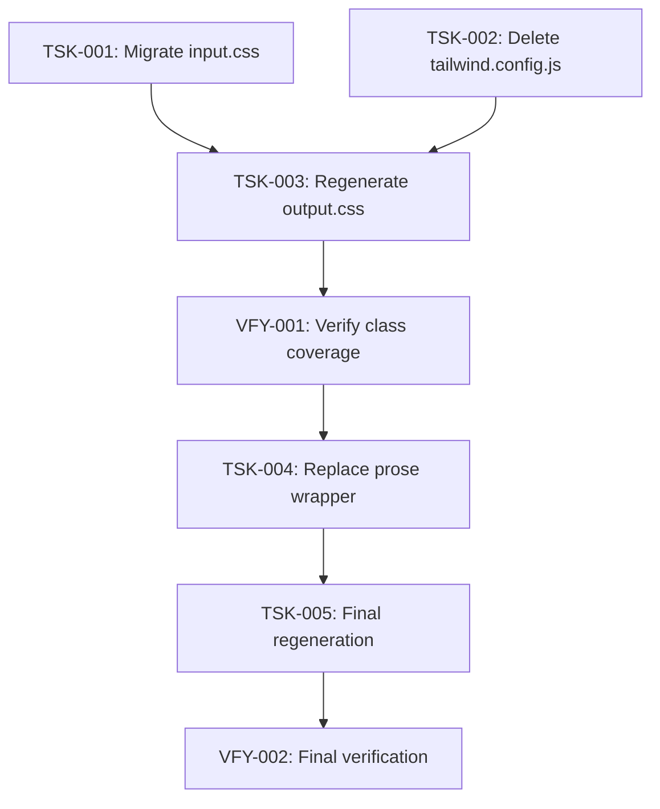

# Implementation Plan: Design System CSS Pipeline — Fix Stale Tailwind Build

**Plan ID:** `08_design-system-css-pipeline_plan`
**Source Spec:** `.ai/problems/07_design-system-css-pipeline_spec.md`
**Date:** 2026-08-06
**Status:** Implementation-ready

---

## Executive Summary

The site ships no usable styles because `input.css` uses Tailwind v3 directives (`@tailwind base/components/utilities`) while the project bundles the **v4.3.3 standalone CLI** (which ignores `@tailwind` directives and the `content` key in `tailwind.config.js`). The fix is a build-config migration from v3 syntax to v4-native syntax (`@import "tailwindcss"` + `@source` at-rules), followed by CSS regeneration and a single template change to remove the `@tailwindcss/typography`–only `prose` wrapper.

The build infrastructure (`docker/Dockerfile` line 66, `docker-compose.dev.override.yml` lines 8–9) already invokes the standalone CLI correctly with `-i`/`-o` paths and **no** `--config` flag. No Docker or Compose changes are needed — only the CSS input file and the dead `tailwind.config.js` must change.

> **Known discrepancy (flagged, not expanded):** The spec claims *"The `prose` class appears only in `ads/detail.html:54`."* A grep of `src/backend/templates/**/*.html` found `prose` **also** in `src/backend/templates/admin/moderation/review.html` (line 62). The spec scopes the `prose` replacement to `ads/detail.html` only (buyer-facing). TSK-004 respects that scope. The admin-template usage is noted as a follow-up risk (see Risk — Admin `review.html` residual `prose`).

---

## Execution DAG

```
Phase 1 — Build Config Migration (parallel, no inter-dependencies)
├── TSK-001: Migrate input.css to Tailwind v4-native syntax
└── TSK-002: Delete tailwind.config.js

Phase 2 — CSS Regeneration
└── TSK-003: Regenerate output.css via Docker               [depends on TSK-001, TSK-002]

Phase 3 — Verification Gate
└── VFY-001: Verify output.css class coverage               [depends on TSK-003]

Phase 4 — Template Edit
└── TSK-004: Replace prose wrapper in ads/detail.html      [depends on VFY-001]

Phase 5 — Safety Re-regeneration
└── TSK-005: Final regeneration of output.css               [depends on TSK-004]

Phase 6 — Final Verification
└── VFY-002: Verify final CSS pipeline state                [depends on TSK-005]
```

### Dependency graph (mermaid)



### Sequencing rationale

The spec's Risk table (§8) imposes a **strict ordering**:
1. Migrate `input.css` → 2. Regenerate `output.css` → 3. Template edits → 4. Regenerate again.

This means the regenerated stylesheet **must exist and pass coverage checks before any template edit**. A template edit that introduces a new utility class before regeneration would ship a missing class. TSK-004 only *removes* the non-Tailwind `prose` class and swaps `max-w-none mb-6` → `mb-6` (both already covered), so TSK-005's regeneration is technically a no-op — it is included for sequence-compliance and future-proofing.

---

## Task Specifications

---

### TSK-001: Migrate `input.css` to Tailwind v4-native syntax

<details>
<summary>Task details</summary>

**Priority:** high  
**Type:** implementation  
**Depends on:** none  
**Risk:** moderate — changes the CSS build input; a syntax error would break the Docker build.

**Affected files:**
- `src/theme/static/theme/css/input.css`

**Affected targets:** none (single CSS file, no classes/functions to target)

**Semantic insertion points:**
- Entire file content — replace the three v3 `@tailwind` directives with v4-native `@import "tailwindcss"` and an `@source` at-rule.

**Changes:**

Replace the entire content of `src/theme/static/theme/css/input.css`:

```css
/* Tailwind input stylesheet */
@import "tailwindcss";
@source "src/backend/templates/**/*.html";
```

The `@source` glob `src/backend/templates/**/*.html` is resolved by the standalone CLI relative to the project root (Docker `WORKDIR /app`), covering all 16 templates. No `--config` flag is used by either the Dockerfile (line 66) or the dev compose entrypoint (lines 8–9), so the v4 `@source` at-rule is the sole driver of class extraction.

**Acceptance criteria:**
- `input.css` contains `@import "tailwindcss"` (not `@tailwind base/components/utilities`)
- `input.css` contains `@source "src/backend/templates/**/*.html"`
- `input.css` does NOT contain any `@tailwind` directive
- File is syntactically valid CSS (no parse errors from the v4 CLI)

</details>

---

### TSK-002: Delete `tailwind.config.js`

<details>
<summary>Task details</summary>

**Priority:** high  
**Type:** implementation  
**Depends on:** none  
**Risk:** low — file is dead weight under the v4 standalone CLI. Verified: `django-tailwind` template tags are not used anywhere; templates load CSS via ``. The config is not read at runtime or by the CLI (`tailwind.config.js` is invoked without `--config`).

**Affected files:**
- `tailwind.config.js` — **delete**

**Affected targets:** none (deletion of a configuration file)

**Semantic insertion points:**
- File deletion (no in-body targets)

**Changes:**

Delete `tailwind.config.js` from the project root.

Rationale (PO decision Q1-A): No custom theme tokens from `docs/06-design-system/tokens.md` are wired into the build (`theme.extend` is empty). The `content` key is ignored by v4 standalone CLI. The `plugins` array is empty. The file serves no purpose and is a maintenance footgun.

**Acceptance criteria:**
- `tailwind.config.js` no longer exists at project root
- No build script or Dockerfile references `tailwind.config.js` by name (Dockerfile uses bare `tailwindcss` command, no `--config`)
- `docker compose build` succeeds without the file
- `django-tailwind` is not imported or configured in any template or Python code (grep-verified)

</details>

---

### TSK-003: Regenerate `output.css` via Docker

<details>
<summary>Task details</summary>

**Priority:** high  
**Type:** implementation  
**Depends on:** TSK-001, TSK-002  
**Risk:** moderate — replaces a committed 82-selector stylesheet with a 291-selector one. This affects all pages site-wide on the next deploy. The regeneration must be run through Docker (not the local `.venv/Scripts/tailwindcss.exe` stub, which is non-functional — PO decision Q2-B).

**Affected files:**
- `src/theme/static/theme/css/output.css` (committed artifact)

**Affected targets:** none (binary/regenerated file)

**Semantic insertion points:**
- File replacement — output.css is overwritten by the build command

**Changes:**

Run the Tailwind v4 standalone CLI via Docker to regenerate `output.css`:

```bash
docker compose exec web tailwindcss -i src/theme/static/theme/css/input.css -o src/theme/static/theme/css/output.css --minify
```

This is the same command documented in `README.md` (line 40) and `docker-compose.dev.override.yml` (lines 8–9). The Docker image already has `tailwindcss` binary at `/usr/local/bin/tailwindcss` (Dockerfile lines 42–44).

After regeneration, verify that `output.css`:
- Starts with `/*! tailwindcss v4.3.3` header
- Contains ~291 selectors (up from 82)
- Does NOT contain v3-specific base directives

**Acceptance criteria:**
- `output.css` is regenerated with non-zero exit code
- Selector count increases from 82 → 291 (as documented in spec research summary)
- `output.css` contains no `@tailwind base;` / `@tailwind components;` / `@tailwind utilities;` strings
- The file is committed to the repository (it is a tracked artifact, per spec constraint §7 #5)

</details>

---

### VFY-001: Verify `output.css` class coverage

<details>
<summary>Task details</summary>

**Priority:** high  
**Type:** verification  
**Depends on:** TSK-003  
**Verifies:** TSK-001, TSK-002, TSK-003

**Purpose:** Confirm that the regenerated `output.css` contains every utility class referenced by the 16 templates. This is the primary acceptance test (spec Appendix — class-coverage check).

**Files inspected (read-only):**
- `src/theme/static/theme/css/output.css`

**Verification steps:**

1. **Class-coverage grep** — for each of the 17 classes below, run a grep/count against `src/theme/static/theme/css/output.css` and confirm a non-zero result:

   `bg-blue-600`, `text-blue-600`, `hover:bg-blue-700`, `rounded-lg`, `shadow-sm`, `shadow`, `bg-gray-50`, `bg-white`, `border-gray-300`, `text-gray-700`, `text-gray-600`, `text-gray-800`, `object-cover`, `line-clamp-2`, `line-clamp-3`, `container`, `min-h-screen`, `divide-y`

2. **Selector count** — confirm the file contains approximately 291 selectors (spec research: v4-native build yields 291).

3. **No v3 artifacts** — confirm `output.css` does not contain `@tailwind base;` / `@tailwind components;` / `@tailwind utilities;`.

4. **File header** — confirm the file starts with the v4.3.3 standalone CLI banner.

**Pass criteria:**
- All 17 classes are present with non-zero count
- Selector count ≈ 291 (range: 280–300 acceptable)
- No v3 `@tailwind` directives remain
- File header confirms v4.3.3

**Failure action:** Return TSK-001, TSK-002, or TSK-003 to rework. Do not proceed to TSK-004 until coverage is confirmed.

</details>

---

### TSK-004: Replace `prose` wrapper in `ads/detail.html`

<details>
<summary>Task details</summary>

**Priority:** high  
**Type:** implementation  
**Depends on:** VFY-001  
**Risk:** low — the `<p class="text-gray-700 whitespace-pre-wrap">` is preserved; only the outer wrapper class changes from `prose max-w-none mb-6` to `mb-6`. The description is plain text (XSS-safe), so no typography plugin is needed.

**Affected files:**
- `src/backend/templates/ads/detail.html`

**Affected targets:**
- Template `ads/detail.html` — the `<div class="prose max-w-none mb-6">` wrapper (spec: line 54)

**Semantic insertion points:**
- The wrapper `<div>` on the description block — replace `class="prose max-w-none mb-6"` with `class="mb-6"`

**Changes:**

In `src/backend/templates/ads/detail.html`, locate the description wrapper:

```html
<div class="prose max-w-none mb-6">
    <p class="text-gray-700 whitespace-pre-wrap">{{ ad|get_description:LANGUAGE_CODE }}</p>
</div>
```

Replace with utility-only wrapper consistent with `docs/01-spec/design-system.md`:

```html
<div class="mb-6">
    <p class="text-gray-700 whitespace-pre-wrap">{{ ad|get_description:LANGUAGE_CODE }}</p>
</div>
```

The `mb-6` class is already present in the regenerated `output.css` (covered by VFY-001 class-coverage check). No new classes are introduced.

**Acceptance criteria:**
- `ads/detail.html` no longer contains the `prose` class
- The wrapper `<div>` uses `class="mb-6"` as the sole class
- The `<p class="text-gray-700 whitespace-pre-wrap">` paragraph is unchanged
- Description rendering for buyers is visually equivalent (same `text-gray-700` text color, same `whitespace-pre-wrap`, same bottom margin via `mb-6`)

**Scope note (not expanded):**
A second `prose` usage exists at `src/backend/templates/admin/moderation/review.html` (line 62). This is in an admin-only template and is outside the spec's scope (spec R5: only the `prose` removal in Task 4). The admin template's `prose` wrapper will remain unstyled in both the old and new builds — this is a pre-existing condition, not a regression.

</details>

---

### TSK-005: Final regeneration of `output.css` (safety re-run)

<details>
<summary>Task details</summary>

**Priority:** medium  
**Type:** implementation  
**Depends on:** TSK-004  
**Risk:** low — no build-config changes since TSK-003; this is a re-run of the same command. Included per spec §8 Risk table: *"SEQUENCE strictly: … (4) regenerate again."*

**Affected files:**
- `src/theme/static/theme/css/output.css`

**Changes:**

Re-run the Docker Tailwind CLI command (identical to TSK-003):

```bash
docker compose exec web tailwindcss -i src/theme/static/theme/css/input.css -o src/theme/static/theme/css/output.css --minify
```

Since TSK-004 only removes non-Tailwind classes (`prose`, `max-w-none`) and swaps in `mb-6` (already covered), the regenerated `output.css` should be byte-identical to the TSK-003 result. This step is a safety verification that no template class was inadvertently dropped.

**Acceptance criteria:**
- `output.css` regeneration succeeds (exit code 0)
- `output.css` selector count remains ~291 (no regression)
- The 17 acceptance classes from VFY-001 remain present
- File is committed if different from TSK-003 result (expected: no diff)

</details>

---

### VFY-002: Verify final CSS pipeline state

<details>
<summary>Task details</summary>

**Priority:** high  
**Type:** verification  
**Depends on:** TSK-005  
**Verifies:** TSK-004, TSK-005

**Purpose:** End-to-end validation that the entire fix is correct: config is migrated, CSS is regenerated, template is edited, and the final build produces a class-complete stylesheet.

**Files inspected (read-only):**
- `src/theme/static/theme/css/input.css`
- `src/theme/static/theme/css/output.css`
- `src/backend/templates/ads/detail.html`
- `tailwind.config.js` (must not exist)

**Verification steps:**

1. **Confirm config state:**
   - `input.css` contains `@import "tailwindcss"` and `@source "src/backend/templates/**/*.html"`
   - `input.css` does NOT contain `@tailwind base` / `@tailwind components` / `@tailwind utilities`
   - `tailwind.config.js` does NOT exist at project root

2. **Confirm template state:**
   - `ads/detail.html` does NOT contain `prose` class
   - `ads/detail.html` description wrapper `<div>` has `class="mb-6"`
   - `<p class="text-gray-700 whitespace-pre-wrap">` paragraph is preserved

3. **Confirm CSS coverage (same 17-class checklist as VFY-001):**
   - `bg-blue-600`, `text-blue-600`, `hover:bg-blue-700`, `rounded-lg`, `shadow-sm`, `shadow`, `bg-gray-50`, `bg-white`, `border-gray-300`, `text-gray-700`, `text-gray-600`, `text-gray-800`, `object-cover`, `line-clamp-2`, `line-clamp-3`, `container`, `min-h-screen`, `divide-y` — all non-zero in `output.css`

4. **Confirm no regression:**
   - `output.css` selector count ≈ 291
   - Re-run Docker build (`docker compose build`) to confirm prod image builds with the new files

**Pass criteria:**
- All config checks pass
- All template checks pass
- All 17 classes present in `output.css`
- Docker build succeeds
- Selector count unchanged from VFY-001

**Failure action:** Return the specific failed task (TSK-001 through TSK-005) to rework.

</details>

---

## Execution Order Summary

| Order | Phase | Task ID | Title | Parallel | Risk | Depends On |
|-------|-------|---------|-------|----------|------|------------|
| 1 | 1 | TSK-001 | Migrate `input.css` to v4-native syntax | yes | moderate | — |
| 1 | 1 | TSK-002 | Delete `tailwind.config.js` | yes | low | — |
| 2 | 2 | TSK-003 | Regenerate `output.css` via Docker | no | moderate | TSK-001, TSK-002 |
| 3 | 3 | VFY-001 | Verify `output.css` class coverage | no | low | TSK-003 |
| 4 | 4 | TSK-004 | Replace `prose` wrapper in `ads/detail.html` | no | low | VFY-001 |
| 5 | 5 | TSK-005 | Final regeneration of `output.css` (safety) | no | low | TSK-004 |
| 6 | 6 | VFY-002 | Verify final CSS pipeline state | no | low | TSK-005 |

---

## Risk Assessment

| Task | Risk | Reason | Mitigation |
|------|------|--------|------------|
| TSK-001 | moderate | Changes CSS build input; v4 syntax must be exact | Exact v4 syntax verified by spec research session `ses_02c3297ceffe2T7IJG6z9JKs6t`; VFY-001 confirms coverage |
| TSK-002 | low | Deleting a config file that is not read by CLI or Django at runtime | Grep-verified: no `django-tailwind` template tags; Dockerfile uses bare `tailwindcss` command (no `--config`) |
| TSK-003 | moderate | Replaces committed `output.css` (82→291 selectors) site-wide | Run only via Docker (PO decision Q2-B); verified command matches Dockerfile line 66 |
| VFY-001 | low | Read-only check; blocks downstream if failed | 17-class checklist from spec Appendix |
| TSK-004 | low | Removes non-Tailwind `prose` class; preserves text rendering | `text-gray-700 whitespace-pre-wrap` paragraph unchanged; `mb-6` already in build |
| TSK-005 | low | Re-run of same build command | No config changes since TSK-003; expected byte-identical output |
| VFY-002 | low | Read-only end-to-end check | Comprehensive config + template + CSS triple-check |

### Additional risk: Admin `review.html` residual `prose`

The spec states `prose` appears *only* in `ads/detail.html:54`, but a grep found it also in `src/backend/templates/admin/moderation/review.html` (line 62). This is an **admin-only** template outside the spec scope (R5: only the `prose` removal in `ads/detail.html`). Both files are covered by the `@source "src/backend/templates/**/*.html"` glob, so the regenerated `output.css` will include all utility classes used in either template. The `prose` class itself is not a Tailwind utility and will not appear in `output.css` in either case — this is a pre-existing condition, not a regression introduced by this plan. If typography styling for the admin template is ever needed, it should be addressed in a separate enhancement.

---

## Research Status

No additional research is required. The spec's research session (`ses_02c3297ceffe2T7IJG6z9JKs6t`) has:
- Experimentally verified the v3→v4 root cause (82 selectors → 291 selectors)
- Confirmed the exact v4-native syntax (`@import "tailwindcss"` + `@source`)
- Confirmed the `@source` glob covers all 16 templates
- Confirmed all PO decisions (Q1–Q3) are resolved
- Confirmed all constraints (no Node.js, no plugins, Docker-only regeneration)

No architectural options exist that require investigation. The fix is fully determined.

---

## Rollout Notes

1. **`output.css` is committed** (spec constraint §7 #5) — after TSK-003 and TSK-005, the regenerated file must be committed so it ships in the Docker image and is available for dev compose startup.

2. **Docker build path** — `docker/Dockerfile` line 66 already runs the correct `tailwindcss -i … -o … --minify` command. No Dockerfile changes needed. The builder stage will produce the correct `output.css` automatically.

3. **Dev compose path** — `docker-compose.dev.override.yml` lines 8–9 already run the same command on container start. No changes needed.

4. **No test infrastructure changes** — this plan touches only CSS, a config file, a committed artifact, and one template. No Python, no migrations, no test files. No test tasks are needed beyond the read-only verification gates (VFY-001, VFY-002).

5. **Rollback** — reverting TSK-001 + TSK-002 + TSK-003 + TSK-004 is trivial: `git checkout` the four files. No schema, migration, or deployment changes are involved.

---

## Notes

- **Parallel execution:** TSK-001 and TSK-002 are independent — the `input.css` migration and the `tailwind.config.js` deletion can be performed by separate agents simultaneously.
- **No new abstractions introduced** — this plan extends the existing build pipeline (which is already correctly configured in Dockerfile and Compose); it only fixes the input files.
- **The conceptual task list in the spec (Tasks 1–4)** is NOT mirrored by task ID. This plan reorganizes into 5 implementation tasks + 2 verification gates, driven by the spec's own sequencing constraint (§8 Risk table: migrate → regenerate → edit → regenerate).
- **TSK-005 (final regeneration)** produces a byte-identical `output.css` to TSK-003 (TSK-004 only removes non-Tailwind classes and swaps an already-covered utility). It is retained as a sequence-compliance safety measure.
