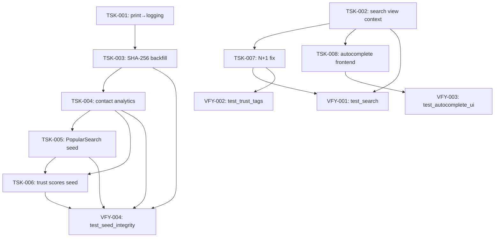

# Implementation Plan: Decision 11 — Phase 2 Audit & Integration Fixes

**Plan ID:** `09_decision-11-integration_plan`
**Source Spec:** `.ai/problems/decision-11-analysis.md`
**Date:** 2026-08-10
**Status:** Implementation-ready

---

## Executive Summary

The Phase 2 audit (`decision-11-analysis.md`) identifies integration gaps (frontend wiring, view context mismatches) and seed-data completeness issues (missing contact analytics, missing trust scores, blank SHA-256, missing PopularSearch records, print() violations). Eight implementation tasks address these gaps across three shared files: `seed_service.py` (4 tasks), `search.py` (2 tasks), and distributed view/template changes.

**Key insight:** Five of eight tasks touch `seed_service.py`'s `run()` method and must be sequenced to avoid merge conflicts. The N+1 fix (TSK-007) touches `search.py` after TSK-002 modifies it. The autocomplete frontend (TSK-008) needs the search view context from TSK-002 to render correctly on the search page.

**Risk profile:** No schema migrations, no build/deploy changes, no startup modifications. The N+1 template-tag change is backward-compatible (optional context dict with DB fallback). The highest-risk items are seed-data correctness (TSK-004, TSK-006) — mitigated by VFY-004 seed-integrity tests.

---

## Execution DAG

```
Phase 1 — Foundation (parallel, no shared file conflicts)
├── TSK-001: [4.7] Replace print() with logging in SeedService    (seed_service.py)
└── TSK-002: [4.2] Add filter context to search view              (search.py)

Phase 2 — Seed data extensions (sequential — shared file seed_service.py)
├── TSK-003: [4.5] Fix SHA-256 for seed images                    (seed_service.py)
│    └── depends_on: TSK-001
├── TSK-004: [4.3] Add contact analytics to seed                  (analytics.py + seed_service.py)
│    └── depends_on: TSK-003
├── TSK-005: [4.8] Seed PopularSearch records                      (analytics.py + seed_service.py)
│    └── depends_on: TSK-004
└── TSK-006: [4.4] Generate trust scores for seed users           (seed_service.py)
     └── depends_on: TSK-004 (logical), TSK-005 (file sequencing)

Phase 3 — Views and frontend (sequential — shared file search.py)
├── TSK-007: [4.6] Fix N+1 trust badge queries                    (listings.py + search.py + trust_tags.py)
│    └── depends_on: TSK-002
└── TSK-008: [4.1] Wire autocomplete frontend                    (list.html + new partial)
     └── depends_on: TSK-002

Phase 4 — Validation tests (parallel)
├── VFY-001: test_search.py                                       depends_on: TSK-002, TSK-007
├── VFY-002: test_trust_tags.py (context cache)                   depends_on: TSK-007
├── VFY-003: test_autocomplete_ui.py                               depends_on: TSK-008
└── VFY-004: test_seed_integrity.py                               depends_on: TSK-003, TSK-004, TSK-005, TSK-006
```

### Dependency graph (mermaid)



### Sequencing rationale

1. **seed_service.py is the primary conflict zone** — five tasks (4.7, 4.3, 4.4, 4.5, 4.8) all modify `run()` or its helper methods. Sequencing TSK-001 → TSK-003 → TSK-004 → TSK-005 → TSK-006 ensures each insertion lands at a unique anchor point without overlap:
   - TSK-001 targets `_log_progress` (method-level, separate from `run()`)
   - TSK-003 inserts after `AdImage.objects.bulk_create()` (images section)
   - TSK-004 modifies the events-generation line inside the `if analytics:` block
   - TSK-005 inserts after daily-metrics bulk_create (still inside `if analytics:`)
   - TSK-006 inserts after the entire analytics block (new step + new helper method)

2. **search.py is a secondary conflict zone** — TSK-002 adds filter params + context; TSK-007 adds `prefetch_related`. TSK-002 must land first so TSK-007 appends to the already-extended queryset.

3. **TSK-006 (trust scores) has a logical dependency on TSK-004** — `TrustCalculator._calculate_response_score` reads CONTACT_INITIATED and CONTACT_RESPONSE events from the database. Without contact events (TSK-004), trust scores are computed with zero contact data, yielding meaningless results even if `SellerTrustScore` rows exist.

4. **TSK-008 (autocomplete frontend) depends on TSK-002** — `list.html` is shared by both `listings()` and `search()`. Without the search view passing `consent_shown` and filter context vars, the search-page render breaks when the autocomplete-enhanced template is used.

5. **Test tasks are deferred to Phase 4** — they validate the combined result of implementation phases and can run in parallel since they touch distinct test files.

---

## Task Specifications

---

### TSK-001: [4.7] Replace print() with logging in SeedService

<summary>Task details</summary>

**Priority:** P2
**Type:** implementation
**Depends on:** none
**Risk:** trivial — only replaces `print()` calls with the existing module-level `logger`. No logic change. Already uses `logger.info` for the elapsed-time line; only the summary block and `_log_progress` still use `print()`.

**Affected files:**
- `backend/apps/seed/services/seed_service.py`

**Affected targets:**
- `SeedService._log_progress` — the `print(f"  {name}: ...")` line (line ~248)
- `SeedService.run` — the summary `print()` block (lines ~144–152)

**Semantic insertion points:**
- Replace each `print(...)` call in `_log_progress` and the summary block with `logger.info(...)`, preserving the `logger` instance already defined at module level (`logger = logging.getLogger(__name__)` at line 28).

**Changes:**

In `SeedService._log_progress`, replace:
```python
logger.info("[seed] %s: %d rows in %.2fs", name, count, elapsed)
print(f"  {name}: {count} rows in {elapsed:.2f}s")
```
with:
```python
logger.info("[seed] %s: %d rows in %.2fs", name, count, elapsed)
logger.info("  %s: %d rows in %.2fs", name, count, elapsed)
```

In `SeedService.run`, replace the summary `print()` block (after the existing `logger.info("Seed complete in ...")`):
```python
            # Print summary
            print(f"\n{'=' * 50}")
            print(f"Seed complete in {total_elapsed:.2f}s")
            print(f"  Users: {users}")
            print(f"  Ads: {ads}")
            print(f"  Images: {len(ad_images)}")
            if analytics:
                print(f"  Analytics events: {len(events) if analytics else 0}")
                print(f"  Daily metrics: {len(metrics) if analytics else 0}")
            print(f"{'=' * 50}")
```
with:
```python
            logger.info("Seed complete in %.2fs — users=%d ads=%d images=%d events=%d metrics=%d",
                        total_elapsed, users, ads, len(ad_images),
                        len(events) if analytics else 0,
                        len(metrics) if analytics else 0)
```

**Acceptance criteria:**
- `uv run ruff check backend/apps/seed/services/seed_service.py` passes with zero violations
- `uv run basedpyright backend/apps/seed/services/seed_service.py` passes
- No `print(` calls remain in the file
- Management command output via `self.stdout.write(self.style.SUCCESS(...))` in `seed.py` is unaffected

</details>

---

### TSK-002: [4.2] Add filter context to search view

<summary>Task details</summary>

**Priority:** P0
**Type:** implementation
**Depends on:** none
**Risk:** low — only adds context variables and filter parameters to an existing view. Does not change URL routing or response format. The `search()` function already renders `ads/list.html` for non-HTMX requests and `ads/partials/ad_list.html` for HTMX requests, both of which expect the context variables that `listings()` already provides.

**Affected files:**
- `backend/apps/search/views/search.py`

**Affected targets:**
- `search()` function (module-level, lines 27–104)

**Semantic insertion points:**
- After the existing `ads = Ad.objects.filter(status=AdStatus.PUBLISHED).select_related("category", "city")` line, before the `if query:` block — add category/city/price/sort filter parsing mirroring `listings()`.
- In the `context` dict (lines 94–98) — add `current_category`, `current_city`, `current_sort`, `min_price`, `max_price`, `consent_shown`.

**Changes:**

1. Add imports (already present: `Q` is not imported; `is_consent_given` is not imported). Add to the import block:
   ```python
   from apps.users.views.consent import is_consent_given
   from django.db.models import Q  # if not already present
   ```

2. After the queryset base line, add filter parsing before the `if query:` block:
   ```python
      # Category filter
      current_category = request.GET.get("category")
      if current_category:
          try:
              Category.objects.get(slug=current_category, is_active=True)
              ads = ads.filter(category__slug=current_category)
          except Category.DoesNotExist:
              pass

      # City filter
      current_city = request.GET.get("city")
      if current_city:
          try:
              City.objects.get(slug=current_city)
              ads = ads.filter(city__slug=current_city)
          except City.DoesNotExist:
              pass

      # Price range filter
      min_price = request.GET.get("min_price")
      max_price = request.GET.get("max_price")
      if min_price:
          try:
              ads = ads.filter(price__gte=int(min_price))
          except ValueError:
              pass
      if max_price:
          try:
              ads = ads.filter(price__lte=int(max_price))
          except ValueError:
              pass

      # Sort (default to newest first, consistent with listings.py)
      current_sort = request.GET.get("sort", AdSort.DATE_NEW)
   ```

   > **Note:** The `query` parameter (`q`) is already parsed at the top of `search()`. The category/city/price/sort filters are NEW and should be applied in addition to FTS, not instead of it. If `query` is non-empty, apply FTS; otherwise apply category/city/price filters.

3. Replace the `context` dict:
   ```python
      context = {
          "page_obj": page_obj,
          "query": query,
          "has_results": has_results,
          "current_category": current_category,
          "current_city": current_city,
          "current_sort": current_sort,
          "min_price": min_price,
          "max_price": max_price,
          "consent_shown": is_consent_given(request),
      }
   ```

**Acceptance criteria:**
- Search page renders without template variable errors (consent banner, pagination filters)
- Pagination URLs on search page preserve `q`, `category`, `city`, `min_price`, `max_price`, `sort` parameters
- `consent_shown` is always in context → consent banner renders correctly for anonymous users
- Search within a category/city context returns filtered results
- `uv run pytest backend/apps/search/tests/test_autocomplete.py -v` (existing) still passes

</details>

---

### TSK-003: [4.5] Fix SHA-256 for seed images

<summary>Task details</summary>

**Priority:** P2
**Type:** implementation
**Depends on:** TSK-001 (same file — seed_service.py)
**Risk:** low — seed-only, post-bulk_create batch update. Does not affect production image handling (bot uploads still use `AdImage.save()` which computes SHA-256 normally).

**Affected files:**
- `backend/apps/seed/services/seed_service.py`
- `backend/apps/media/services/hash_service.py` (read-only reference)

**Affected targets:**
- `SeedService.run` — the images section (after `AdImage.objects.bulk_create()` at line ~114)
- `SeedService` — new helper method `_backfill_image_hashes()`

**Semantic insertion points:**
- Insert after the `self._log_progress("AdImage", ...)` call and before the analytics section.
- Add import: `from apps.media.services.hash_service import FileHashService`
- Add a new private method `_backfill_image_hashes(self, ad_images: list[AdImage]) -> int` that computes SHA-256 for each image file and batch-updates via `AdImage.objects.filter(pk=...).update(sha256=...)`.

**Changes:**

1. Add import at top of `__init__` or `run()`:
   ```python
   from apps.media.services.hash_service import FileHashService
   ```

2. In `run()`, after the AdImage log_progress line, insert:
   ```python
             # Step 5b: Backfill SHA-256 for images (bulk_create bypasses save())
             if ad_images:
                 hashed_count = self._backfill_image_hashes(ad_images)
                 logger.info("[seed] AdImage SHA-256: %d hashes backfilled", hashed_count)
   ```

3. Add new method to `SeedService`:
   ```python
       def _backfill_image_hashes(self, ad_images: list[AdImage]) -> int:
           """Compute SHA-256 for seed AdImage records bypassed by bulk_create.

           Uses FileHashService to compute hashes from files on disk,
           then batch-updates via a single ``.update()`` query.
           """
           from django.conf import settings

           hashed: list[tuple[int, str]] = []
           for img in ad_images:
               file_path = img.image
               if settings.MEDIA_ROOT:
                   from pathlib import Path
                   media_root = settings.MEDIA_ROOT
                   if isinstance(media_root, str):
                       file_path = os.path.join(media_root, img.image)
                   else:
                       file_path = str(media_root / img.image)
               if os.path.exists(file_path):
                   file_hash = FileHashService.calculate_sha256(file_path)
                   if file_hash:
                       hashed.append((img.pk, file_hash))

           if not hashed:
               return 0

           # Batch update via single query using CASE/UPDATE or per-record update
           for pk, file_hash in hashed:
               AdImage.objects.filter(pk=pk).update(sha256=file_hash)

           return len(hashed)
   ```

   > **Optimization note:** For large batches, a single `UPDATE` with `CASE WHEN pk = X THEN hash END` is preferable, but `update()` per-record is acceptable for seed-sized data (<1000 images).

**Acceptance criteria:**
- After `manage.py seed --force`, all `AdImage.objects.filter(ad__source=AdSource.SEED)` have non-empty `sha256`
- `AdImage.save()` dedup check would work for duplicate seed images
- `uv run pytest backend/apps/seed/tests/test_seed.py -v -k "test_bulk_create_events_works or test_image"` passes

</details>

---

### TSK-004: [4.3] Add contact analytics to seed

<summary>Task details</summary>

**Priority:** P1
**Type:** implementation
**Depends on:** TSK-003 (same file — seed_service.py, insertion point later in `run()`)
**Risk:** medium — changes seed data behavior; could affect seller dashboard, trust scores, and search analytics if distributions are off. Spec decision D3: CONTACT_INITIATED for ~15% of ad views, CONTACT_RESPONSE for ~60% of initiated.

**Affected files:**
- `backend/apps/seed/generators/analytics.py`
- `backend/apps/seed/services/seed_service.py`

**Affected targets:**
- `AnalyticsGenerator` — new method `generate_contact_events() -> list[AnalyticsEvent]`
- `AnalyticsGenerator` — existing `generate_events()` may need to remain unchanged (CONTACT_INITIATED and CONTACT_RESPONSE are separate from AD_VIEWED)
- `SeedService.run` — after `events = analytics_gen.generate_events()` line, extend with contact events

**Semantic insertion points:**
- In `analytics.py`: add `generate_contact_events()` method to `AnalyticsGenerator`, modeled on the existing `generate_events()` recency-weighted distribution pattern.
- In `seed_service.py`: after `events = analytics_gen.generate_events()`, add `events.extend(analytics_gen.generate_contact_events())` so contact events are persisted in the same `bulk_create` batch.

**Changes:**

1. In `analytics.py`, add a new method to `AnalyticsGenerator`:

   ```python
   def generate_contact_events(self) -> list[AnalyticsEvent]:
       """Generate CONTACT_INITIATED and CONTACT_RESPONSE events for published ads.

       CONTACT_INITIATED: triggered for ~15% of ad views, ad_id set, user_id=None
       (anonymous buyers). Event timestamp distributed across the ad's active
       period with the same recency bias as AD_VIEWED events.

       CONTACT_RESPONSE: triggered for ~60% of CONTACT_INITIATED events that
       share the same seller, ad_id=None, user_id=seller.

       Returns:
           List of AnalyticsEvent instances ready for bulk_create.
       """
       events: list[AnalyticsEvent] = []
       now = datetime.now(UTC)

       for ad in self.ads:
           if ad.status != AdStatus.PUBLISHED:
               continue
           if ad.published_at is None:
               continue

           ad_start = ad.published_at
           ad_end = ad.archived_at if ad.archived_at else now

           # Determine view count for this ad to derive contact initiations
           for day_offset in range(self.days_back):
               day_date = now - timedelta(days=day_offset)
               if day_date < ad_start or (ad_end and day_date > ad_end):
                   continue

               recency_weight = max(0.1, 1.0 - (day_offset / self.days_back) * 0.9)
               max_for_day = max(0, int(self.max_views * recency_weight))
               if max_for_day < self.min_views:
                   max_for_day = self.min_views

               views_today = self.faker.random_int(self.min_views, max_for_day)
               # ~15% of views trigger a contact initiation
               contact_initiated_count = int(views_today * 0.15)

               for _ in range(contact_initiated_count):
                   random_hour = self.faker.random_int(0, 23)
                   random_minute = self.faker.random_int(0, 59)
                   event_time = day_date.replace(
                       hour=random_hour, minute=random_minute, second=0, microsecond=0,
                   )
                   events.append(AnalyticsEvent(
                       event_type=AnalyticsEventType.CONTACT_INITIATED,
                       timestamp=event_time,
                       user=None,
                       ad=ad,
                   ))

                   # ~60% of initiations get a response from the seller
                   if self.faker.random_int(0, 99) < 60:
                       response_time = event_time + timedelta(
                           minutes=self.faker.random_int(5, 120),
                       )
                       events.append(AnalyticsEvent(
                           event_type=AnalyticsEventType.CONTACT_RESPONSE,
                           timestamp=response_time,
                           user=ad.user,
                           ad=None,
                       ))

       return events
   ```

2. Add `AnalyticsEventType` to the imports in `analytics.py` (already imported via `from apps.core.enums import AdStatus, AnalyticsEventType`).

3. In `seed_service.py`, after:
   ```python
   events = analytics_gen.generate_events()
   ```
   add:
   ```python
   events.extend(analytics_gen.generate_contact_events())
   ```
   so contact events are included in the same `bulk_create` batch.

**Acceptance criteria:**
- After `manage.py seed --force --analytics True`, `AnalyticsEvent.objects.filter(event_type=AnalyticsEventType.CONTACT_INITIATED)` count > 0
- After seeding, `AnalyticsEvent.objects.filter(event_type=AnalyticsEventType.CONTACT_RESPONSE)` count > 0
- CONTACT_INITIATED events have `user_id=None` (anonymous buyers)
- CONTACT_RESPONSE events have `ad_id=None` and `user_id=seller`
- Seller dashboard `total_contacts` > 0 for seed sellers with published ads
- `uv run pytest backend/apps/seed/tests/test_seed.py -v -k "test_seed_with_analytics"` passes

</details>

---

### TSK-005: [4.8] Seed PopularSearch records

<summary>Task details</summary>

**Priority:** P2
**Type:** implementation
**Depends on:** TSK-004 (same file — analytics.py, insertion point after contact events method)
**Risk:** low — seed-only. Creates `PopularSearch` records with `hit_count >= 10` so the autocomplete endpoint returns them.

**Affected files:**
- `backend/apps/seed/generators/analytics.py`
- `backend/apps/seed/services/seed_service.py`

**Affected targets:**
- `AnalyticsGenerator` — new method `generate_popular_searches() -> list[PopularSearch]`
- `SeedService.run` — after daily metrics persist, call the new method and bulk_create

**Semantic insertion points:**
- In `analytics.py`: add import for `PopularSearch` and a new `generate_popular_searches()` method.
- In `seed_service.py`: after `DailyAdMetrics.objects.bulk_create(...)` block, add a new section that creates PopularSearch records.

**Changes:**

1. In `analytics.py`, add import:
   ```python
   from apps.search.models import PopularSearch
   ```

2. Add method to `AnalyticsGenerator`:
   ```python
   def generate_popular_searches(self, limit: int = 15) -> list[PopularSearch]:
       """Generate PopularSearch records from seed ad titles.

       Extracts single-word tokens from published ad titles, selects the
       most common ones, and creates PopularSearch records with hit_count >= 10
       so they appear in autocomplete suggestions.

       Args:
           limit: Maximum number of PopularSearch records to generate.

       Returns:
           List of PopularSearch instances ready for bulk_create.
       """
       from collections import Counter
       import re

       token_counter: Counter[str] = Counter()
       for ad in self.ads:
           if ad.status != AdStatus.PUBLISHED or not ad.title:
               continue
           tokens = re.findall(r"\w+", ad.title.lower())
           token_counter.update(tokens)

       # Take top N tokens with sufficient frequency
       top_tokens = token_counter.most_common(limit)
       records = []
       for query, freq in top_tokens:
           # Ensure hit_count >= 10 per spec acceptance criteria
           hit_count = max(freq * 10, 10)
           records.append(PopularSearch(
               query=query,
               query_normalized=query,
               hit_count=hit_count,
           ))
       return records
   ```

3. In `seed_service.py`, after the daily metrics block, add:
   ```python
               # Step 6b: Seed popular searches for autocomplete
               popular_queries = analytics_gen.generate_popular_searches()
               if popular_queries:
                   from apps.search.models import PopularSearch
                   PopularSearch.objects.bulk_create(popular_queries)
                   self._log_progress("PopularSearch", len(popular_queries), 0.0)
   ```

**Acceptance criteria:**
- After seeding, `PopularSearch.objects.count()` > 0
- All seed `PopularSearch` records have `hit_count >= 10`
- Autocomplete endpoint returns popular suggestions for common terms
- `uv run pytest backend/apps/search/tests/test_autocomplete.py -v` still passes

</details>

---

### TSK-006: [4.4] Generate trust scores for seed users

<summary>Task details</summary>

**Priority:** P1
**Type:** implementation
**Depends on:** TSK-004 (logical — needs CONTACT_INITIATED/CONTACT_RESPONSE events for non-zero response scores); TSK-005 (file sequencing — both modify the same `if analytics:` section in `run()`)
**Risk:** medium — adds a new seed step that depends on TrustCalculator. TrustCalculator must be imported; if it has bugs, seed will fail.

**Affected files:**
- `backend/apps/seed/services/seed_service.py`

**Affected targets:**
- `SeedService.run` — after the analytics block, add trust score seeding call
- `SeedService` — new method `_seed_trust_scores(self, users: list[User]) -> None`

**Semantic insertion points:**
- Insert a new step after the daily metrics block (end of `if analytics:` or just after it) in `run()`.
- Add the `_seed_trust_scores` method as a new method on `SeedService` (before or after `_log_progress`).

**Changes:**

1. Add import at top of `seed_service.py`:
   ```python
   from apps.trust.models import SellerVerification
   from apps.trust.services.trust_calculator import TrustCalculator
   ```

2. In `run()`, after the daily metrics log_progress (end of `if analytics:` block), add:
   ```python
             # Step 6c: Compute trust scores for seed sellers
             if analytics:
                 self._seed_trust_scores(db_users)
   ```

3. Add new method to `SeedService`:
   ```python
       def _seed_trust_scores(self, users: list[User]) -> None:
           """Generate SellerTrustScore and SellerVerification records for seed users.

           Creates SellerVerification records for ~20% of users (verified_by_admin=True)
           and calls TrustCalculator.calculate_and_save() for each user to compute
           and persist trust scores based on their seeded analytics events.
           """
           from apps.trust.models import SellerVerification
           from apps.trust.services.trust_calculator import TrustCalculator

           calculator = TrustCalculator()
           t_start = time.time()

           # Create verifications for ~20% of users
           verified_count = max(1, int(len(users) * 0.2))
           # Use faker for deterministic selection
           from apps.seed.generators.base import BaseGenerator
           gen = BaseGenerator(self.config)
           verified_user_ids = set(
               gen.faker.random_elements(
                   [u.pk for u in users],
                   length=verified_count,
                   unique=True,
               )
           )
           for user in users:
               is_verified = user.pk in verified_user_ids
               SellerVerification.objects.get_or_create(
                   user=user,
                   defaults={
                       "verified_by_admin": is_verified,
                       "verified_at": timezone.now() if is_verified else None,
                   },
               )
               calculator.calculate_and_save(user)

           t_elapsed = time.time() - t_start
           self._log_progress("SellerTrustScore", len(users), t_elapsed)
   ```

   > **Note:** `timezone` is not currently imported in seed_service.py. Add `from django.utils import timezone` to the imports.

   > **Design decision (spec D2):** Trust scores are computed AFTER all ads and analytics events are persisted, as a batch step — not inline during ad generation. This ensures contact events (TSK-004) are available when `TrustCalculator._calculate_response_score` runs.

**Acceptance criteria:**
- After seeding, `SellerTrustScore.objects.filter(user__in=seed_users)` count == number of seed users
- At least 20% of seed users have `SellerVerification.verified_by_admin=True`
- Trust badges render in grid and detail pages (VERIFIED or higher for users with sufficient activity)
- Contact-related trust fields (total_contacts, contact_response_rate) are non-zero where contact events exist
- `uv run pytest backend/apps/seed/tests/test_seed.py -v -k "test_seed_with_analytics"` passes

</details>

---

### TSK-007: [4.6] Fix N+1 trust badge queries

<summary>Task details</summary>

**Priority:** P1
**Type:** implementation
**Depends on:** TSK-002 (modifies `search.py` which TSK-007 also modifies)
**Risk:** low — backward compatible. The template tag falls back to DB lookup if no context dict is provided.

**Affected files:**
- `backend/apps/ads/views/listings.py`
- `backend/apps/search/views/search.py`
- `backend/apps/trust/templatetags/trust_tags.py`

**Affected targets:**
- `listings()` — add `prefetch_related("user__trust_score")` to the ads queryset; build `trust_score_dict` for context
- `search()` — add `prefetch_related("user__trust_score")` to the ads queryset; build `trust_score_dict` for context
- `render_trust_badge()` — modify to accept optional pre-computed dict from context, fall back to DB

**Semantic insertion points:**
- In `listings.py`: after `.select_related("category", "city", "user")` on line 234, append `.prefetch_related("user__trust_score")`. In the context dict (lines 376–398), add `"trust_score_dict"`.
- In `search.py`: after `.select_related("category", "city")` on line 47, append `.prefetch_related("user__trust_score")`. In the context dict (lines 94–98), add `"trust_score_dict"`.
- In `trust_tags.py`: in `render_trust_badge()`, before the `SellerTrustScore.objects.get(user=user)` call, check `context.get("trust_score_dict", {}).get(user.id)`.

**Changes:**

1. In `listings.py`, modify the queryset:
   ```python
   ads = Ad.objects.filter(status=AdStatus.PUBLISHED).select_related(
       "category", "city", "user"
   ).prefetch_related("user__trust_score")
   ```

2. In `listings.py`, after `page_obj` is set, build the dict:
   ```python
   trust_score_dict = {}
   for ad in page_obj:
       if hasattr(ad.user, "trust_score"):
           trust_score_dict[ad.user_id] = ad.user.trust_score
   ```
   Add to context: `"trust_score_dict": trust_score_dict,`

3. In `search.py`, modify the queryset similarly:
   ```python
   ads = Ad.objects.filter(status=AdStatus.PUBLISHED).select_related("category", "city").prefetch_related("user__trust_score")
   ```
   Build `trust_score_dict` from page_obj and add to context.

4. In `trust_tags.py`, modify `render_trust_badge()`:
   ```python
   def render_trust_badge(context: template.Context, user: User) -> str:
       if not user or user.is_anonymous:
           return ""

       # Check for pre-computed dict from context (N+1 optimization)
       trust_score_dict = context.get("trust_score_dict")
       if trust_score_dict is not None:
           trust_score = trust_score_dict.get(user.id)
           if trust_score is None:
               try:
                   trust_score = SellerTrustScore.objects.get(user=user)
               except SellerTrustScore.DoesNotExist:
                   logger.debug("No SellerTrustScore for user %s", user.id)
                   return ""
       else:
           try:
               trust_score = SellerTrustScore.objects.get(user=user)
           except SellerTrustScore.DoesNotExist:
               logger.debug("No SellerTrustScore for user %s", user.id)
               return ""

       template_path = BADGE_TEMPLATES.get(trust_score.trust_level)
       if template_path is None:
           return ""
       ...
   ```

   > **Simplified approach:** The dict check and DB fallback can be simplified:
   ```python
       trust_score = context.get("trust_score_dict", {}).get(user.id)
       if trust_score is None:
           try:
               trust_score = SellerTrustScore.objects.get(user=user)
           except SellerTrustScore.DoesNotExist:
               logger.debug("No SellerTrustScore for user %s", user.id)
               return ""
   ```
   This is cleaner — when `trust_score_dict` is absent from context, `context.get("trust_score_dict", {})` returns `{}` and `.get(user.id)` returns `None`, triggering the DB fallback.

**Acceptance criteria:**
- Listing page with 24 ads generates ≤ 2 extra queries for trust badges (down from 24)
- Badges render identically for all trust levels (VERIFIED, TRUSTED, PRO)
- `uv run pytest backend/apps/trust/tests/test_trust_tags.py -v` still passes (backward compat)
- `uv run pytest backend/apps/seed/tests/test_seed.py -v -k "test_seed_with_analytics"` passes (seed data with trust scores)

</details>

---

### TSK-008: [4.1] Wire autocomplete frontend to search template

<summary>Task details</summary>

**Priority:** P0
**Type:** implementation
**Depends on:** TSK-002 (search view context — ensures search page renders correctly with autocomplete form)
**Risk:** low — frontend-only, additive. HTMX is already loaded on the page (line 15 of `list.html`). The inline script is minimal.

**Affected files:**
- `backend/templates/ads/list.html`
- `backend/templates/components/autocomplete_dropdown.html` (new file)

**Affected targets:**
- `ads/list.html` — the search `<form>` block (lines 29–42)
- New partial: `components/autocomplete_dropdown.html`

**Semantic insertion points:**
- In `list.html`: add HTMX attributes to the search `<input>` (`hx-get`, `hx-trigger`, `hx-target`, `hx-route`), add a dropdown container `<div>` below the form.
- Add a new inline `<script>` for debouncing and keyboard navigation.
- New partial file for the dropdown content rendered by the autocomplete endpoint.

**Changes:**

1. Modify the search form in `list.html` (replace the existing `<form>` block):

   ```html
   <!-- Search form -->
   <form method="get" action="" class="mb-6">
       <div class="flex gap-2">
           <input
               type="search"
               name="q"
               value="{{ query|default:'' }}"
               placeholder=""
               class="flex-1 px-4 py-2 border rounded-lg focus:outline-none focus:ring-2 focus:ring-blue-500"
               id="search-input"
               hx-get=""
               hx-trigger="input changed delay:300ms, keyup[this.key==='ArrowDown'], keyup[this.key==='ArrowUp'], keyup[this.key==='Enter']"
               hx-target="#autocomplete-dropdown"
               hx-route="q"
               hx-swap="innerHTML"
               hx-on::after-request="handleAutocompleteResponse"
           >
           <div id="autocomplete-dropdown" class="absolute z-10 w-full bg-white border rounded-lg shadow-lg hidden"></div>
           <button type="submit" class="px-6 py-2 bg-blue-600 text-white rounded-lg hover:bg-blue-700">
               
           </button>
       </div>
   </form>
   ```

   > **HTMX trigger note:** `hx-trigger` uses `input changed delay:300ms` for debounced AJAX (300ms after last keystroke). Keyboard events (ArrowDown/ArrowUp/Enter) also trigger requests for navigation. `hx-on::after-request` calls a JS handler to show/hide the dropdown and manage 429 errors.

2. Add inline script after the HTMX `<script>` include (before `</body>`):

   ```html
   <script>
   window.handleAutocompleteResponse = function(evt) {
       var detail = evt.detail;
       var dropdown = document.getElementById('autocomplete-dropdown');
       if (!dropdown) return;

       // Handle 429 rate limit: hide dropdown gracefully
       if (detail.error && detail.error === 'rate_limit') {
           dropdown.classList.add('hidden');
           return;
       }

       var suggestions = detail.suggestions || [];
       if (suggestions.length === 0) {
           dropdown.classList.add('hidden');
           return;
       }

       // Render dropdown
       var html = '<ul class="py-1">';
       suggestions.forEach(function(s, i) {
           html += '<li class="px-3 py-2 hover:bg-gray-100 cursor-pointer" ' +
                   'data-index="' + i + '" ' +
                   'onclick="navigateToSearch(\'' + encodeURIComponent(s.text) + '\')">' +
                   '<span class="font-medium">' + escapeHtml(s.text) + '</span>' +
                   '<span class="text-xs text-gray-500 ml-2">[' + escapeHtml(s.source) + ']</span>' +
                   '</li>';
       });
       html += '</ul>';
       dropdown.innerHTML = html;
       dropdown.classList.remove('hidden');

       // Keyboard navigation
       var items = dropdown.querySelectorAll('li[data-index]');
       items.forEach(function(item, idx) {
           item.addEventListener('keydown', function(e) {
               if (e.key === 'ArrowDown') { e.preventDefault(); focusNext(idx, items); }
               if (e.key === 'ArrowUp') { e.preventDefault(); focusPrev(idx, items); }
               if (e.key === 'Enter') { navigateToSearch(encodeURIComponent(s.text)); }
           });
       });
   };

   window.navigateToSearch = function(q) {
       window.location.href = "?q=" + q;
   };

   function escapeHtml(text) {
       var div = document.createElement('div');
       div.textContent = text;
       return div.innerHTML;
   }
   </script>
   ```

3. Create `components/autocomplete_dropdown.html` (partial rendered by HTMX):

   ```html
   <!-- Autocomplete dropdown partial (rendered server-side via HTMX) -->
   
   
   <ul class="py-1">
       
       <li class="px-3 py-2 hover:bg-gray-100 cursor-pointer">
           <a href="?q={{ suggestion.text|urlencode }}">
               <span class="font-medium">{{ suggestion.text }}</span>
               <span class="text-xs text-gray-500 ml-2">[{{ suggestion.source }}]</span>
           </a>
       </li>
       
   </ul>
   
   <div class="px-3 py-2 text-gray-500 text-sm"></div>
   
   ```

   > **Note:** The autocomplete endpoint already returns JSON. The HTMX approach in `list.html` uses `hx-get` to call the endpoint and `hx-target` to swap into the dropdown. Since the endpoint returns JSON, a pure HTMX approach won't render HTML directly — the inline script handles JSON parsing. The server-side partial is provided as a fallback/alternative for HTMX servers that return HTML fragments.

**Acceptance criteria:**
- Typing 2+ characters in the search box shows a dropdown with suggestions
- Suggestions display text + source badge (category/city/popular/history)
- Selecting a suggestion navigates to `/search/?q=<text>`
- HTTP 429 rate limit gracefully hides the dropdown (no error shown)
- Works on both homepage (`/`) and search page (`/search/`)
- `uv run ruff check` passes on any new JS/HTML files (if applicable)

</details>

---

## Validation / Test Tasks

---

### VFY-001: Search view tests

<summary>Task details</summary>

**Priority:** P0
**Type:** verification
**Depends on:** TSK-002, TSK-007
**Verifies:** TSK-002 (search view context), TSK-007 (N+1 prefetch in search)

**Purpose:** Validate that the search view correctly handles filters, pagination, HTMX, and that the prefetch optimization doesn't break functionality.

**File to create:** `backend/apps/search/tests/test_search.py`

**Test cases:**
1. FTS query returns ranked results (existing ads with matching title/description)
2. Translation called when LANGUAGE_CODE != ru (mock `translate_query`)
3. Fuzzy category match for single-word queries (e.g., "телефоны" matches Category name)
4. SEARCH_PERFORMED analytics event recorded after search
5. Pagination returns 24 ads per page
6. HTMX partial (`HX-Request` header) returns `ads/partials/ad_list.html` fragment
7. Filter context: `consent_shown` is always in context
8. Filter params preserved in pagination URLs

**Verification steps:**
1. Create test users, categories, cities, and published ads with searchable content
2. Call `GET /search/?q=<term>` and assert 200
3. Assert context contains `consent_shown`, `current_category`, `current_sort`
4. Assert `AnalyticsEvent.objects.filter(event_type=SEARCH_PERFORMED).count() > 0`
5. Call with `HX-Request: true` header and assert response uses partial template
6. Use `assertNumQueries` to verify prefetch reduces query count

**Pass criteria:**
- All test cases pass
- Coverage of filter context, pagination, HTMX, and event recording

</details>

---

### VFY-002: Trust tags N+1 cache test

<summary>Task details</summary>

**Priority:** P1
**Type:** verification
**Depends on:** TSK-007
**Verifies:** TSK-007 (trust tags context dict cache)

**Purpose:** Verify that `render_trust_badge` uses the context-level dict when available and does NOT query the database per call.

**File to update:** `backend/apps/trust/tests/test_trust_tags.py`

**Test cases (new):**
1. When `trust_score_dict` is in context, `render_trust_badge` returns badge HTML without DB query (use `assertNumQueries`)
2. When `trust_score_dict` is NOT in context, falls back to `SellerTrustScore.objects.get` (single DB query per call)
3. When trust score is in the dict, renders correct badge (VERIFIED/TRUSTED/PRO)
4. When user.id not in dict and no DB record, renders empty string

**Pass criteria:**
- All existing trust tag tests still pass (backward compat)
- New N+1 tests pass — `assertNumQueries(0)` when dict contains the score
- `uv run pytest backend/apps/trust/tests/test_trust_tags.py -v` passes

</details>

---

### VFY-003: Autocomplete UI integration test

<summary>Task details</summary>

**Priority:** P0
**Type:** verification
**Depends on:** TSK-008
**Verifies:** TSK-008 (autocomplete frontend wiring)

**Purpose:** Validate that the autocomplete frontend is correctly wired to the endpoint and renders suggestions.

**File to create:** `backend/tests/integration/test_autocomplete_ui.py`

> **Note:** The spec (§6.2.4) specifies path `tests/integration/test_autocomplete_ui.py`. A top-level `tests/` directory does not exist in `src/backend/`. The test file should be created at `src/backend/tests/integration/test_autocomplete_ui.py` (or `apps/search/tests/test_autocomplete_ui.py` following the app-level test convention).

**Test cases:**
1. Homepage (`/`) renders search form with `hx-get` attribute pointing to autocomplete endpoint
2. Search form input has `id="search-input"` and HTMX trigger attributes
3. Autocomplete endpoint returns JSON with `suggestions` array
4. Dropdown container (`#autocomplete-dropdown`) exists in the template
5. Autocomplete endpoint returns 429 gracefully (simulated rate limit)
6. HTMX `hx-target="#autocomplete-dropdown"` matches the dropdown element

**Verification steps:**
1. `self.client.get("/")` — assert 200, assert form contains `hx-get`
2. `self.client.get("/?q=phone", HTTP_HX_REQUEST="true")` — assert HTMX request handled
3. `self.client.get("/api/search/autocomplete?q=phone")` — assert JSON response with `suggestions`

**Pass criteria:**
- Homepage search form has autocomplete HTMX attributes
- Drop-down container element exists with correct ID
- Autocomplete endpoint returns valid JSON
- 429 rate limit degrades gracefully (dropdown hidden via JS)

</details>

---

### VFY-004: Seed integrity test

<summary>Task details</summary>

**Priority:** P1
**Type:** verification
**Depends on:** TSK-003, TSK-004, TSK-005, TSK-006
**Verifies:** TSK-003 (SHA-256), TSK-004 (contact events), TSK-005 (PopularSearch), TSK-006 (trust scores)

**Purpose:** End-to-end validation that the seed command produces complete, non-blank data across all feature areas. This is the primary acceptance test for the integration plan.

**File to create:** `backend/apps/seed/tests/test_seed_integrity.py`

**Test cases:**
1. All seed `AdImage` records have non-empty `sha256`
2. All published-seed-user ads have `SellerTrustScore` records
3. `AnalyticsEvent.objects.filter(event_type=CONTACT_INITIATED)` count > 0 after seed with analytics
4. `AnalyticsEvent.objects.filter(event_type=CONTACT_RESPONSE)` count > 0 after seed with analytics
5. `PopularSearch.objects.filter(hit_count__gte=10)` count > 0 after seed
6. At least 20% of seed users have `SellerVerification.verified_by_admin=True`
7. Seller dashboard stats show non-zero `total_views` AND `total_contacts` for seed sellers

**Verification steps:**
1. Run `call_command("seed", "--users=10", "--ads=20", "--force", "--analytics=True")`
2. Assert each integrity condition above
3. For (7): call `SellerStats(user_id).get_stats(TimeRange.ALL_TIME)` and assert `total_views > 0` and `total_contacts > 0`

**Pass criteria:**
- All 7 integrity assertions pass
- `uv run pytest backend/apps/seed/tests/test_seed_integrity.py -v` passes

</details>

---

## Execution Order Summary

| Order | Phase | Task ID | Spec Section | Title | Parallel | Priority | Risk | Depends On |
|-------|-------|---------|--------------|-------|----------|----------|------|------------|
| 1 | 1 | TSK-001 | 4.7 | Replace print() with logging | yes | P2 | trivial | — |
| 1 | 1 | TSK-002 | 4.2 | Add filter context to search view | yes | P0 | low | — |
| 2 | 2 | TSK-003 | 4.5 | Fix SHA-256 for seed images | no | P2 | low | TSK-001 |
| 3 | 2 | TSK-004 | 4.3 | Add contact analytics to seed | no | P1 | medium | TSK-003 |
| 4 | 2 | TSK-005 | 4.8 | Seed PopularSearch records | no | P2 | low | TSK-004 |
| 5 | 2 | TSK-006 | 4.4 | Generate trust scores for seed | no | P1 | medium | TSK-004, TSK-005 |
| 6 | 3 | TSK-007 | 4.6 | Fix N+1 trust badge queries | no | P1 | low | TSK-002 |
| 6 | 3 | TSK-008 | 4.1 | Wire autocomplete frontend | no | P0 | low | TSK-002 |
| 7 | 4 | VFY-001 | 6.2.1 | Search view tests | yes | P0 | low | TSK-002, TSK-007 |
| 7 | 4 | VFY-002 | 6.2.3 | Trust tags N+1 cache test | yes | P1 | low | TSK-007 |
| 7 | 4 | VFY-003 | 6.2.4 | Autocomplete UI integration | yes | P0 | low | TSK-008 |
| 7 | 4 | VFY-004 | 6.2.5 | Seed integrity test | yes | P1 | low | TSK-003, TSK-004, TSK-005, TSK-006 |

> **Parallel groups at step 7:** VFY-001 through VFY-004 touch distinct test files and can run simultaneously. TSK-007 and TSK-008 can run simultaneously (different files: TSK-007 touches Python views/tags; TSK-008 touches HTML templates).

---

## Risk Assessment

| Task | Risk | Reason | Mitigation |
|------|------|--------|------------|
| TSK-001 | trivial | Replaces `print()` with existing `logger.info` — no logic change | ruff + basedpyright pass criteria |
| TSK-002 | low | Adds context vars to existing view; template already expects them | VFY-001 validates rendering |
| TSK-003 | low | Seed-only post-bulk_create backfill; doesn't affect bot uploads | VFY-004 asserts non-empty sha256 |
| TSK-004 | medium | Changes seed data distribution; could affect dashboard/trust if rates wrong | Spec D3 specifies exact rates (15% initiated, 60% response) |
| TSK-005 | low | Creates PopularSearch records with hit_count >= 10 | VFY-004 asserts count > 0 |
| TSK-006 | medium | New TrustCalculator invocation in seed; depends on analytics being correct | Depends on TSK-004; VFY-004 asserts trust score rows exist |
| TSK-007 | low | Backward-compatible template tag change (optional context dict + DB fallback) | VFY-002 validates no N+1 queries |
| TSK-008 | low | Frontend-only; HTMX already loaded; additive HTMX attributes + inline JS | VFY-003 validates form attributes and endpoint |
| VFY-001 | low | Test-only file creation | Run pytest to verify |
| VFY-002 | low | Test-only file extension | Run pytest to verify |
| VFY-003 | low | Test-only file creation | Run pytest to verify |
| VFY-004 | low | Test-only file creation | Run pytest to verify |

**No risky tasks** — none modify database schema, migrations, build config, deployment, startup behavior, or remove/rename public APIs. The template tag change (TSK-007) adds an optional parameter with fallback, preserving backward compatibility.

---

## Research Status

No additional research is required. All implementation approaches are directly specified in the source spec (`decision-11-analysis.md` §4 and §7):

- **TSK-008 (autocomplete):** Spec D1 confirms HTMX + minimal inline script pattern, consistent with the existing MPA+HTMX architecture already used in `ad_list.html` (pagination links use `hx-get`, `hx-target`, `hx-swap`).
- **TSK-006 (trust scores):** Spec D2 confirms batch computation in `SeedService.run()` after ads persisted.
- **TSK-004 (contact events):** Spec D3 confirms exact distributions (15% initiated, 60% response).
- **TSK-005 (SHA-256):** Spec D4 confirms post-bulk_create batch update via `.update()`.
- **TSK-007 (N+1):** Spec D5 confirms `prefetch_related("user__trust_score")` + context-level dict cache.

---

## Rollout Notes

1. **Seed is dev-only** — `manage.py seed` is a development command. Changes to seed data do not affect production unless explicitly run. The production seed runs only in Docker dev compose (`docker-compose.dev.override.yml`).

2. **Template tag backward compatibility** — `render_trust_badge` is called in `ad_list.html:45` as ``. No arguments change; the context dict is an optional optimization. Templates that don't provide `trust_score_dict` continue to work via DB fallback.

3. **Search view context** — TSK-002 adds context variables that `ad_list.html` already references (it's the shared partial rendered by both `listings()` and `search()`). No template changes are needed for this task.

4. **Test execution order** — Run `uv run pytest` per-app after each phase:
   - After Phase 1: `pytest backend/apps/seed/tests/ backend/apps/search/tests/test_autocomplete.py`
   - After Phase 2: `pytest backend/apps/trust/tests/ backend/apps/search/tests/`
   - Phase 3: `pytest backend/apps/seed/tests/test_seed_integrity.py backend/apps/search/tests/test_search.py backend/tests/integration/ backend/apps/trust/tests/test_trust_tags.py`

5. **Rollback** — All changes are additive or backward-compatible. `git checkout` of the individual files suffices for rollback. No migrations are involved.

---

## Notes

- **Spec §2.6 (Saved Search Alerts):** The spec claims "NO management command" and "NO bot handler" for saved search alerts. However, `apps/search/management/commands/send_alerts.py` and `apps/telegram_bot/handlers/alerts.py` already exist in the codebase. This discrepancy is outside the scope of tasks 4.x (which do not address saved search alerts). Flagged as a spec-vs-reality gap, not expanded.
- **Spec §6.1 existing tests:** The spec marks `test_seller_stats.py` and `test_trust_calculator.py` as MISSING, but both already exist in the codebase. Only `test_search.py`, `test_autocomplete_ui.py`, and `test_seed_integrity.py` need to be created.
- **Spec §3.3 (CATEGORY_GROUP_MAP dict) and §3.4 (BADGE_TEMPLATES dict):** Explicitly marked as low priority in the spec. Not addressed in this plan.
- **Seed service.py task sequencing:** TSK-001 through TSK-006 are sequenced because they all modify `seed_service.py`. The implementor should apply them in order, verifying that each insertion point is unique and non-overlapping.
- **`_calculate_response_score` design note:** TrustCalculator counts ALL `CONTACT_INITIATED` events globally as the denominator, not per-user. This is a pre-existing design choice (not a bug per the spec). Seed contact events will populate both numerator and denominator, yielding non-zero scores.
