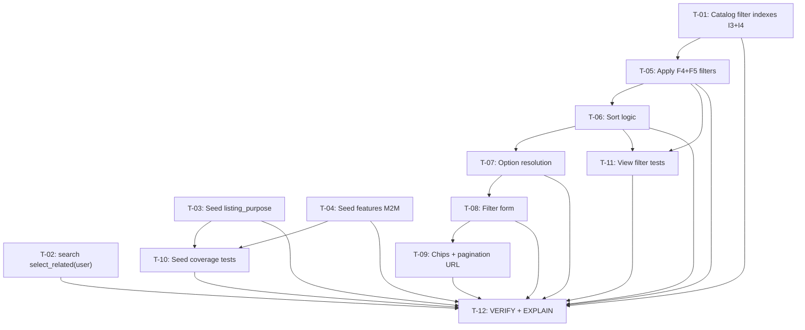

# Plan 26 — Catalog Filters & Sorting

Transformation of **Spec_026** (`.ai/problems/26_catalog-filters-sorting_spec.md`, APPROVED) into a
dependency-aware implementation DAG. The spec adds two new MVP buyer-filter dimensions —
`listing_purpose` (single-select, F4) and `features` (multi-select, F5) — plus sort-logic
improvements, the two remaining support indexes (I3/I4), seed-data coverage, and the associated
UI (filter controls and active-filter chips).

> **Currency-plan note:** The multi-currency price model
> (`price_amount`/`price_currency`/`price_normalized_eur`) **is already implemented** by
> `.ai/plans/25_currency-normalization_plan.md` (T-01..T-10, migration `0010_ad_currency_price_fields.py`).
> Both views already filter and sort on `price_normalized_eur`, the `IX_ads_price_normalized_eur`
> index is deployed, and the seed generator emits EUR prices. **The bare `Ad.price` column no
> longer exists.** This plan therefore contains **no price-index, price-sort-repoint, or EUR-seed
> work** — those are complete. Only `listing_purpose`, `features`, the I3/I4 indexes, sort
> tiebreaker/NULLS-LAST, UI, seed updates, and tests remain.

**Spec-stated conflict surfaced (see D-P7):** the updated spec's assumption §8.7 / §10 / §11
claims `search.py` already has `select_related("user")`. Researcher verification shows it does
**not** (still `.select_related("category", "city")`). This plan **retains T-02** (the 1-line N+1
fix) because the gap is real and independently supported by
`.ai/research/26_postgresql-filter-performance.md` §7/§8 P0.

Spec_026's conceptual tasks T1–T12 are reorganized below into implementation-sequenced,
parallelizable tasks. Key reorganizations:

- **T1/T2 (I3, I4 indexes) → one migration task (T-01).** Both remaining indexes live in the
  same `ads` app and belong in a single cohesive "catalog filter indexes" migration, matching the
  bundled-op pattern of migration `0006`. (The price index is already deployed — not re-added.)
- **T3/T4 (listing_purpose + features application) → one view task (T-05).** In `listings()` and
  `search()` the two new filter clauses occupy adjacent slots in the same filter-pipeline block
  (spec §6.1 steps 5–6); splitting them would fracture one contiguous insertion region, and the
  semantics are inseparable (step 6's AND chain continues step 5).
- **T10/T11 (seed generation) → two tasks (T-03, T-04).** These touch two different files
  (`generators/ads.py` vs `services/seed_service.py`) and two separate concerns (the unsaved
  `Ad.listing_purpose` FK at generation time vs. the post-`bulk_create` M2M feature population) →
  independently executable in parallel.
- **T7/T8/T9 (templates) → two sequenced tasks (T-08, T-09).** Both edit the same template
  partial; chips and pagination-URL preservation build on the filter-form context from T-08, so
  they are sequenced within the same files.
- **T6 (sort) → T-06, T5 (options) → T-07.** These occupy different code regions of the two views
  than the filter application (T-05), so they are separate tasks, sequenced against the same two
  files to avoid overlapping edits.

---

## 1. Statement of Scope

Seven implementation tasks, two test tasks, one verification task. Touches: the `ads` app
(`AdFeature.Meta` + `Ad.Meta.indexes` + one new migration), two view modules
(`apps/ads/views/listings.py`, `apps/search/views/search.py`), two seed modules
(`apps/seed/generators/ads.py`, `apps/seed/services/seed_service.py`), the templates
(`templates/ads/list.html`, `templates/ads/partials/ad_list.html` or a new filter partial), and
test modules (`apps/seed/tests/test_seed.py` + a new filter-behavior test module).

**Changes:**
1. **Migration (T-01)** — add `IX_ad_features_feature_id` and `IX_ads_pub_purpose` (I3, I4).
2. **`search.py` N+1 fix (T-02)** — add `"user"` to `select_related` (kept despite spec over-claim).
3. **Seed generator (T-03)** — set `Ad.listing_purpose` via `CategoryLookupResolver`.
4. **Seed service (T-04)** — populate `Ad.features` M2M after `bulk_create`.
5. **View pipeline (T-05)** — apply F4 (`listing_purpose`) + F5 (`features`, AND-chain) filters
   in both views.
6. **Sort logic (T-06)** — relevance tiebreaker (`-rank, -published_at, -id`) + `NULLS LAST` on
   `price_normalized_eur` sorts.
7. **Filter option resolution (T-07)** — category-constrained purpose/feature options into view
   context.
8. **Filter form (T-08)** — purpose dropdown + features checkboxes (category-constrained).
9. **Filter chips + pagination URLs (T-09)** — chips, clear-all, and new params in URLs.
10. **Tests (T-10, T-11)** — seed coverage + view filter/sort behavior.
11. **Verification (T-12)** — full suite + lint + typecheck + EXPLAIN query-plan gate + AC walkthrough.

**In scope (files):**
- `src/backend/apps/ads/models.py`
- `src/backend/apps/ads/migrations/0011_catalog_filter_indexes.py` (new)
- `src/backend/apps/ads/views/listings.py`
- `src/backend/apps/search/views/search.py`
- `src/backend/apps/seed/generators/ads.py`
- `src/backend/apps/seed/services/seed_service.py`
- `src/backend/templates/ads/list.html`
- `src/backend/templates/ads/partials/ad_list.html`
- `src/backend/apps/seed/tests/test_seed.py`
- `src/backend/apps/ads/tests/test_catalog_filters.py` (new)

**Out of scope (deferred per spec §3.2 / §12):** numeric attribute filters (area, rooms, year,
mileage, brand), keyset pagination, faceted counts, dynamic dependent filters, any further
currency work (already done), the legacy `IX_ads_search_gin` drop (Phase 3), `pg_trgm`, and any
`Ad`-model column additions. The default-sort and FTS-override behavior for `q` that already
exists in `search()` is preserved.

---

## 2. Current-State vs. Gaps (verified)

| Concern | State | Evidence |
|---|---|---|
| `listing_purpose` filter (F4) | **Gap** — not applied | Neither `listings()` nor `search()` calls `.filter(listing_purpose__...)`; `Ad.listing_purpose` FK exists |
| `features` filter (F5) | **Gap** — not applied | Neither view calls `.filter(features__...)`; `Ad.features` M2M → `AdFeature` exists |
| Category-constrained filter options | **Gap** — not exposed | `CategoryLookupResolver.get_resolved_purposes/features` (consumed by bot only); views do not query it |
| Sort relevance tiebreaker | **Gap** — partial | `search()` FTS branch does `order_by("-rank")` only; no `-published_at, -id` tiebreaker (spec §4.2) |
| Price `NULLS LAST` on `price_normalized_eur` | **Gap** | Both views `order_by("price_normalized_eur")`/`order_by("-price_normalized_eur")` with no `NULLS LAST` (spec §4.4) |
| `IX_ad_features_feature_id` (I3) | **Gap** | `AdFeature.Meta` has only `unique_together = [("ad", "feature")]`; no standalone `feature_id` index |
| `IX_ads_pub_purpose` (I4) | **Gap** | `Ad.Meta.indexes` has no `listing_purpose_id` index |
| `search()` `select_related("user")` | **Gap** (spec over-claims done) | `search.py` uses `.select_related("category", "city")` — missing `"user"` (N+1, §7/§8 of performance research) |
| Seed `listing_purpose` | **Gap** | `AdGenerator.generate()` sets `price_amount/price_currency/price_normalized_eur/category/city/status/source` but not `listing_purpose` (spec §11.1) |
| Seed `features` M2M | **Gap** | `SeedService.run()` `bulk_create`s ads but never populates `features` (spec §11.1) |
| Filter form UI | **Gap** | `list.html` renders grid + pagination only — no `listing_purpose`/`features` controls (spec §7) |
| Filter chips | **Gap** | No purpose/feature chips (spec §7.3) |
| Pagination URL preservation | **Partial** | `ad_list.html` preserves `query/category/city/sort/min_price/max_price`; **not** `listing_purpose`/`features` (spec §6.5, §5.3) |
| Currency model | **Existing** | `price_amount`/`price_currency`/`price_normalized_eur` on `Ad`; migration `0010`; `IX_ads_price_normalized_eur` deployed; both views filter/sort on `price_normalized_eur` |
| `AdSort` enum | **Existing** | Already has `date_desc/date_asc/price_asc/price_desc` (spec §4.1) — no change needed |

---

## 3. Planning Decisions (resolved)

- **D-P1 — No research gate required.** Spec_026 is APPROVED and cites completed research
  (`.ai/research/26_postgresql-filter-performance.md` §8, `.ai/research/26_codebase-audit-filters.md`).
  The index design (§6.2), filter semantics (§6.1), and NULL handling (§4.4) are all specified
  with HIGH confidence. No architectural fork, external library, or shared-config/startup
  ambiguity remains. A fresh Researcher verification pass was run for this plan-revision (see
  D-P7/D-P8); it confirmed the codebase state and surfaced the one spec over-claim below.

- **D-P2 — One migration for I3/I4, numbered `0011`.** Only two indexes remain to create:
  `IX_ad_features_feature_id` (plain B-tree on `AdFeature.feature`, scalar FK) and
  `IX_ads_pub_purpose` (partial B-tree on `ads.listing_purpose_id` `WHERE status='PUBLISHED'`).
  Both are `AddIndex` operations in a single new `ads` migration
  `0011_catalog_filter_indexes.py`. **Migration 0010 is already taken** by the currency migration
  (`0010_ad_currency_price_fields.py`); the price index `IX_ads_price_normalized_eur` was created
  there and must **not** be re-added.

- **D-P3 — Feature filter uses AND (chained `.filter`), not OR.** Per spec §3.1 (F5) and §6.1
  (step 6): an ad must have **all** selected features. Implemented as one `.filter(features__id=fid)`
  per selected feature (each an `EXISTS` subquery — not N+1). Documented in the view docstring; no
  `features_match=all|any` param (spec defers OR semantics).

- **D-P4 — Sort default preserved; `NULLS LAST` only for price sorts.** `date_desc` remains the
  default when no `q` and no `sort`. `NULLS LAST` is applied only to `price_asc`/`price_desc` on
  `price_normalized_eur` (spec §4.4). The FTS branch in `search()` keeps `-rank` and gains the
  `-published_at, -id` tiebreaker. `sort` stays preserved in pagination URLs even while FTS is
  active (already via `current_sort`; T-09 extends the same pattern to `listing_purpose`/`features`).

- **D-P5 — Option resolution reads current category only.** When a category is active, the purpose
  dropdown and feature checkbox lists are constrained to the resolved overrides via the existing
  `CategoryLookupResolver` (static methods, cached). When no category is selected, the full active
  lookup-item sets for each group are shown. No hardcoded per-category lists (spec §3.3).

- **D-P6 — Filter option resolution is a view-context concern, not a template-only concern.**
  The resolved option lists are computed in the view and passed into the context (semantic anchors:
  `resolved_purposes` / `resolved_features`), following the existing `CategoryLookupResolver`
  pattern and keeping the template declarative. This keeps T-07 (Python) and T-08 (template)
  cleanly separable.

- **D-P7 — `select_related("user")` in `search.py` is KEPT despite the spec claiming it is done.**
  Researcher verification found `search.py` line 51 still `.select_related("category", "city")`
  (no `"user"`), while the spec's assumption §8.7 / §10 / §11 claim it is fixed. The N+1 gap is
  real (24 extra queries/page), low-risk, one line, and independently recommended by the
  performance research. Per conflict-resolution rules (production correctness over spec claims),
  T-02 is retained and the discrepancy is surfaced here. It sits at Level 1, parallel, and touches
  no other task.

- **D-P8 — No price-index/price-sort/EUR-seed work in this plan.** Confirmed by researcher: the
  currency model and `IX_ads_price_normalized_eur` are live (migration 0010), both views already
  use `price_normalized_eur`, and the seed generator already emits EUR prices. Any references to a
  bare `Ad.price` field in the pre-currency plan are removed.

---

## 4. Risk Assessment & Gates

| Task | Risk trigger | Severity | Gate |
|---|---|---|---|
| **T-01** | Adds DB indexes (schema + migration) | **High** | Well-specified by spec §6.2 from completed research; two `AddIndex` ops only, no data backfill. Verification = EXPLAIN gate in T-12. |
| **T-02** | 1-line `select_related` change in `search.py` | Low | No schema/behavior change; adds a JOIN only. Not blocked by the spec's false "already done" claim (D-P7). |
| **T-03** | Modifies seed generator (test-data infra) | Medium | Guarded by `if resolved_purposes:` — empty lookup resolution on flat test categories is a no-op, so existing seed tests stay green. |
| **T-04** | Modifies `SeedService.run()` (test-data infra) | Medium | Guarded by `if resolved_features:`; M2M set in a post-`bulk_create` step using a seeded RNG. Idempotent across re-seed. |
| **T-05** | Edits both views' filter chains (shared buyer path) | Medium | Additive filter clauses only; existing filters/sort/URLs unchanged. Verified by T-11 + T-12. |
| **T-06** | Edits sort branches in both views | Medium | `NULLS LAST` (on `price_normalized_eur`) + tiebreaker only; existing `AdSort` values and default preserved. |
| **T-07** | Adds context resolution to both views | Medium | Uses existing `CategoryLookupResolver` (no new abstraction); reads current category only. |
| **T-08** | Template form markup (buyer-facing UI) | Medium | Additive controls; existing grid/pagination preserved. |
| **T-09** | Template chips + pagination URL params | Low | Extends existing repetitive URL pattern; ensures fully reproducible URLs (spec §5.3). |
| **T-10** | Extends `test_seed.py` | Medium | `pytest.mark.django_db, slow, integration` consistent with existing seed tests. |
| **T-11** | New filter-behavior test module | Medium | Real Django test client; uses `create_test_ad`. |
| **T-12** | Cross-cutting verification + EXPLAIN | — | Final gate confirming `Index Scan` and full regression. |

**Risky task handling:** T-01 is the single schema-change task. It is **not blocked** by a
prerequisite research task because the research is already complete and incorporated into the
approved spec (D-P1); a fresh researcher verification (D-P7/D-P8) confirmed the state. Its EXPLAIN
verification is folded into T-12 as an explicit pre-deployment gate.

---

## 5. Execution DAG

```
Level 1  (parallel — disjoint files)
  ├─ T-01  — Add catalog filter indexes (I3, I4)        [ads/models.py + migration 0011]
  ├─ T-02  — search.py select_related("user")            [apps/search/views/search.py]
  ├─ T-03  — Seed: listing_purpose                       [apps/seed/generators/ads.py]
  └─ T-04  — Seed: features M2M                          [apps/seed/services/seed_service.py]

Level 2  (view pipeline — sequential, same two files listings.py + search.py)
  └─ T-05  — Apply F4 + F5 filters in both views         [listings.py, search.py]
            depends_on: T-01
  └─ T-06  — Sort logic (tiebreaker + NULLS LAST)        [listings.py, search.py]
            depends_on: T-05
  └─ T-07  — Filter option resolution into context       [listings.py, search.py]
            depends_on: T-06

Level 3  (templates — sequential, same templates)
  └─ T-08  — Filter form (purpose + features)            [templates/ads/list.html, ad_list.html]
            depends_on: T-07
  └─ T-09  — Filter chips + pagination URL params        [templates/ads/partials/ad_list.html]
            depends_on: T-08

Level 4  (tests — parallel, disjoint files)
  ├─ T-10  — Seed coverage tests (F4/F5)                 [apps/seed/tests/test_seed.py]
  │         depends_on: T-03, T-04
  └─ T-11  — View filter + sort behavior tests           [apps/ads/tests/test_catalog_filters.py]
            depends_on: T-05, T-06

Level 5  (verification — no production code)
  └─ T-12  — VERIFY: regression + EXPLAIN gate + AC      [all]
            depends_on: T-01..T-11
```



**Dependency rationale:**
- **T-01, T-02, T-03, T-04 touch disjoint files** (models+migration; search.py; generators/ads.py;
  seed_service.py) → parallel execution at Level 1.
- **T-05 depends on T-01**: the I3/I4 index migration must land before the new filter paths that
  can hit scale, satisfying the spec's "indexes required before launch" guarantee and allowing the
  T-12 EXPLAIN gate to confirm `Index Scan`.
- **T-05 → T-06 → T-07** are **sequenced** because all three edit the same two view files
  (`listings.py`, `search.py`); parallelizing risks overlapping edits. Order chosen so the filter
  chain (T-05) is in place before the sort branch (T-06) and option context (T-07).
- **T-08 → T-09** are **sequenced** (same templates); T-09's chips and URL params depend on the
  filter-form context and current-selection values surfaced by T-08.
- **T-10 depends on T-03 + T-04** (seed data must carry `listing_purpose` and `features` for the
  coverage assertions); **T-11 depends on T-05 + T-06** (view filters + sort). Disjoint files →
  parallel.
- **T-12** is gated on all implementation and test tasks.

---

## 6. Task Specifications

---

### T-01 — Add catalog filter indexes (I3 `IX_ad_features_feature_id`, I4 `IX_ads_pub_purpose`)

**Priority:** P0
**Type:** implementation (migration)
**Depends on:** — (Level 1, parallel with T-02, T-03, T-04)
**Risk:** high (schema)

**Affected files:**
- `src/backend/apps/ads/models.py`
- `src/backend/apps/ads/migrations/0011_catalog_filter_indexes.py` (new)

**Semantic targets:**
- Class `Ad`, `Meta.indexes` — add `IX_ads_pub_purpose`
- Class `AdFeature`, `Meta` — add `IX_ad_features_feature_id`

**Changes:**

1. In `Ad.Meta.indexes`, append one partial B-tree index (spec §6.2 I4):
   ```python
   models.Index(
       name="IX_ads_pub_purpose",
       fields=["listing_purpose_id"],
       condition=Q(status=AdStatus.PUBLISHED),
   ),
   ```
   Place it adjacent to the existing `IX_ads_pub_listing` entry in the `indexes` list.

2. In `AdFeature.Meta`, add a standalone reverse-lookup B-tree index (spec §6.2 I3):
   ```python
   indexes = [
       models.Index(
           name="IX_ad_features_feature_id",
           fields=["feature"],
       ),
   ]
   ```
   Keep the existing `unique_together = [("ad", "feature")]` unchanged.

3. Run `./manage.py makemigrations ads --name catalog_filter_indexes` to produce
   `0011_catalog_filter_indexes.py` (two `AddIndex` operations). **The next free migration number
   is `0011`** — `0010` is taken by `0010_ad_currency_price_fields.py` (commit this plan's other
   edits, then `makemigrations` auto-numbers correctly). Review the generated migration; do not
   hand-write the file.

**Do not** re-add `IX_ads_price_normalized_eur` — it already exists (migration `0010`,
`Ad.Meta.indexes`), and there is no bare `Ad.price` column to index.

**Semantic anchors / insertion points:**
- Insert `IX_ads_pub_purpose` after the `IX_ads_pub_listing` `models.Index(...)` entry in
  `Ad.Meta.indexes`.
- Add the `AdFeature.Meta.indexes = [...]` list (the class currently has no `indexes` attribute).

**Acceptance criteria:**
- `Ad.Meta.indexes` contains `IX_ads_pub_purpose` (partial, `WHERE status='PUBLISHED'`)
- `AdFeature` has `Meta.indexes` containing `IX_ad_features_feature_id`
- New migration `0011_catalog_filter_indexes.py` exists with exactly two `AddIndex` operations
- `unique_together = [("ad", "feature")]` on `AdFeature` preserved
- `IX_ads_price_normalized_eur` NOT duplicated; no reference to a bare `price` field
- `./manage.py makemigrations --check` reports no pending migrations; `./manage.py migrate` applies cleanly
- Existing `IX_ads_pub_listing` / GIN / `IX_ads_price_normalized_eur` indexes unchanged

---

### T-02 — Add `"user"` to `select_related` in `search()`

**Priority:** P1
**Type:** implementation
**Depends on:** — (Level 1, parallel with T-01, T-03, T-04)
**Risk:** low

> **Spec over-claim surfaced:** Spec §8.7/§10/§11 state this is already done, but the researcher
> verified `search.py` line 51 is still `.select_related("category", "city")`. This task is
> **retained** because the N+1 gap is real (D-P7).

**Affected file:**
- `src/backend/apps/search/views/search.py`

**Semantic targets:**
- Function `search` — the base queryset declaration

**Changes:**

In `search()`, change the base queryset from:
```python
ads = Ad.objects.filter(status=AdStatus.PUBLISHED).select_related("category", "city")
```
to:
```python
ads = Ad.objects.filter(status=AdStatus.PUBLISHED).select_related("category", "city", "user")
```
(closes the per-card N+1 gap recommended by §7/§8 of
`.ai/research/26_postgresql-filter-performance.md`).

**Semantic anchors / insertion points:**
- The `.select_related("category", "city")` call at the top of `search()`, immediately after the
  `Ad.objects.filter(status=AdStatus.PUBLISHED)` base query.

**Acceptance criteria:**
- `.select_related("category", "city", "user")` present in `search()`
- `listings()` unaffected (already has `"user"`, verified line 254)
- Lint + typecheck pass on `search.py`

---

### T-03 — Populate `listing_purpose` in `AdGenerator.generate()`

**Priority:** P0
**Type:** implementation (seed)
**Depends on:** — (Level 1, parallel with T-01, T-02, T-04)
**Risk:** medium (test-data infra)

**Affected file:**
- `src/backend/apps/seed/generators/ads.py`

**Semantic targets:**
- Class `AdGenerator`, method `generate` — the per-ad `Ad(...)` construction

**Changes:**

Inside `generate()`, after the `category` is selected for the current ad and before the `Ad(...)`
constructor, resolve the category-constrained listing purposes and assign one to the ad
(spec §11.1 / T10 approach; static-method resolver):
```python
from apps.categories.services.lookup_resolution import CategoryLookupResolver

# In generate(), after category is selected:
resolved_purposes = CategoryLookupResolver.get_resolved_purposes(category)
if resolved_purposes:
    purpose = self._rng.choice(resolved_purposes)
else:
    purpose = None
```
Pass `listing_purpose=purpose` into the `Ad(...)` constructor. (Note the seed generator already
sets `price_amount`/`price_currency`/`price_normalized_eur` = EUR; `listing_purpose` is the only
new field here.)

**Import placement:** add `CategoryLookupResolver` to the module-level imports (grouped with the
other `apps.*` imports). The resolver's static methods cache via the Django cache (300s TTL), so
repeated calls are cheap.

**Semantic anchors / insertion points:**
- Module-level imports block of `generators/ads.py`
- Inside `generate()`, immediately after `category = self._rng.choice(self.categories)` / before
  the `Ad(...)` constructor, so `purpose` is available to pass as `listing_purpose=`.

**Acceptance criteria:**
- `generate()` returns `Ad` instances with `listing_purpose` set from the category's resolved
  purposes when any exist (seeded categories via `load_catalog`)
- For flat test categories (no `CategoryListingPurpose` bindings), `listing_purpose` is `None` —
  existing unit tests (`TestAdGenerator`, `TestAdGeneratorMultiLang`,
  `TestSeedCategoryIntegration`) remain green
- `listing_purpose` is always a `LookupItem` belonging to group `listing_purpose`

---

### T-04 — Populate `features` M2M in `SeedService.run()`

**Priority:** P0
**Type:** implementation (seed)
**Depends on:** — (Level 1, parallel with T-01, T-02, T-03)
**Risk:** medium (test-data infra)

**Affected file:**
- `src/backend/apps/seed/services/seed_service.py`

**Semantic targets:**
- Class `SeedService`, method `run` — insert a post-`bulk_create` M2M step after the ads are
  fetched (`db_ads`)

**Changes:**

After `db_ads = list(Ad.objects.filter(source=AdSource.SEED))`, add a step that populates each
seeded ad's `features` M2M using the category-resolved feature set (spec §11.1 / T11 approach;
static-method resolver; seeded RNG):
```python
from apps.categories.services.lookup_resolution import CategoryLookupResolver

# In run(), after db_ads is fetched:
rng = random.Random(self.config.get("faker_seed", 42))
for ad in db_ads:
    resolved_features = CategoryLookupResolver.get_resolved_features(ad.category)
    if resolved_features:
        sample = rng.sample(
            resolved_features,
            k=rng.randint(1, min(3, len(resolved_features))),
        )
        ad.features.set(sample)
```
**RNG note (spec §11.1):** `SeedService` has no `_rng` (that lives on `AdGenerator`/`BaseGenerator`).
Use a module-level `random.Random` seeded from `self.config.get("faker_seed", 42)` for deterministic
re-seeds. Log the step via the existing `_log_progress("AdFeature", ...)` pattern. Skip safely if
`ad.category` is unexpectedly `None`.

**Import placement:** add `CategoryLookupResolver` to `seed_service.py` (module already imports
`random`).

**Semantic anchors / insertion points:**
- Module-level imports of `seed_service.py`
- Inside `run()`, immediately after the `db_ads = list(...)` fetch and before/alongside the
  Step 5 image generation, so `db_ads` carries live PKs.

**Acceptance criteria:**
- After `SeedService.run()`, at least one seeded ad has one or more `features`
- `Ad.features` is set only for ads whose category resolves features (e.g. `charity` with
  `listing_feature_override: []` gets none)
- Uses the same deterministic `faker_seed` for reproducibility across re-seeds
- Existing seed tests (`TestSeedCommand`, `TestSeedCategoryIntegration`,
  `TestLeafCategoryFiltering`, `TestAdGeneratorLeafOnly`) remain green
- `seed --ads 0` still produces no ads (loop over empty `db_ads` → no-op)

---

### T-05 — Apply `listing_purpose` (F4) and `features` (F5) filters in both views

**Priority:** P0
**Type:** implementation
**Depends on:** T-01
**Risk:** medium

**Affected files:**
- `src/backend/apps/ads/views/listings.py`
- `src/backend/apps/search/views/search.py`

**Semantic targets:**
- Function `listings` (in `listings.py`) — the filter-pipeline block
- Function `search` (in `search.py`) — the filter-pipeline block

**Changes:**

In **both** `listings()` and `search()`, after the existing price-range filter block (which
already uses `price_normalized_eur`) and before the sort block (spec §6.1 steps 5–6), add:

1. **`listing_purpose` (F4)** — single-select exact slug match (spec §3.1, §5.3):
   ```python
   listing_purpose_slug = request.GET.get("listing_purpose")
   if listing_purpose_slug:
       ads = ads.filter(listing_purpose__slug=listing_purpose_slug)
   ```
   An unrecognized slug matches nothing via the ORM relation filter (mirrors the existing
   category/city "unrecognized → no-op/suggestion" intent without a suggestion pool).

2. **`features` (F5)** — multi-select AND semantics via chained `.filter` (spec §3.1, §6.1 step 6):
   ```python
   feature_slugs = request.GET.getlist("features")
   if feature_slugs:
       for fslug in feature_slugs:
           ads = ads.filter(features__slug=fslug)
   ```
   Each chained `.filter(features__slug=...)` adds an `EXISTS` subquery (not N+1). An ad must have
   **all** selected features. Repeated `?features=` params are read via `getlist("features")`
   (spec §5.3 — HTML form convention, no comma-joining in the view).

3. **Add selections to the view context** for chips and retained control state:
   - `"current_listing_purpose": listing_purpose_slug`
   - `"current_features": feature_slugs`
   Keep naming consistent with the existing `current_*` context keys.

**Semantic anchors / insertion points:**
- `listings()`: insert after the `max_price` filter block and before the `# Sorting` section.
- `search()`: insert after the `max_price` filter block and before the
  `# Resolve the current city/category filters ...` section, matching the same pipeline position
  as `listings`.

**Acceptance criteria:**
- `?listing_purpose=<slug>` narrows both views to ads with that listing purpose
- `?features=new&features=delivery` returns only ads possessing **both** `new` and `delivery`
- Filters combine with existing category/city/price (on `price_normalized_eur`)/search filters via AND
- Existing default behavior (no params) unchanged
- Lint + typecheck pass on both view files

---

### T-06 — Sort logic: relevance tiebreaker + `NULLS LAST` on `price_normalized_eur`

**Priority:** P1
**Type:** implementation
**Depends on:** T-05
**Risk:** medium

**Affected files:**
- `src/backend/apps/ads/views/listings.py`
- `src/backend/apps/search/views/search.py`

**Semantic targets:**
- Function `search` — the FTS sort branch (`order_by("-rank")`)
- Function `search` — the no-query sort branch (AdSort mapping)
- Function `listings` — the AdSort mapping branch

**Changes:**

1. **Relevance tiebreaker (spec §4.2):** in `search()`, the FTS branch currently does
   `order_by("-rank")`. Change to add a deterministic secondary sort:
   ```python
   ads = ads.filter(**{vector_field: search_query}).order_by("-rank", "-published_at", "-id")
   ```

2. **`NULLS LAST` on price sorts (spec §4.4):** in both `listings()` and `search()`, the
   `AdSort.PRICE_LOW` / `AdSort.PRICE_HIGH` branches (which already target `price_normalized_eur`)
   should place NULL-price ads last:
   ```python
   elif sort == AdSort.PRICE_LOW:
       ads = ads.order_by(models.F("price_normalized_eur").asc(nulls_last=True))
   elif sort == AdSort.PRICE_HIGH:
       ads = ads.order_by(models.F("price_normalized_eur").desc(nulls_last=True))
   ```
   Import `F` from `django.db.models` where not already imported (already present in `search.py`;
   add to `listings.py`).

   > Note: `NULLS LAST` on a plain `price_normalized_eur` B-tree breaks its index ordering
   > (performance research §3). `IX_ads_price_normalized_eur` from migration 0010 still accelerates
   > the **range filter** (`min_price`/`max_price`); price-sort remains a Sort node. Accepted
   > trade-off; no `NULLS LAST`-modified index is scoped by this plan.

3. Preserve: `date_desc` default (unchanged), `date_asc` (unchanged), and the `search()` FTS
   override of any `sort` param (unchanged — `current_sort` still parsed for URL preservation).

**Semantic anchors / insertion points:**
- `search()` FTS block: replace the `order_by("-rank")` call inside the `if query:` branch.
- `search()` no-query branch: replace the `AdSort.PRICE_LOW` / `AdSort.PRICE_HIGH` `order_by` calls.
- `listings()`: replace the `AdSort.PRICE_LOW` / `AdSort.PRICE_HIGH` `order_by` calls in the sort
  chain.

**Acceptance criteria:**
- FTS search orders by `-rank, -published_at, -id`
- `price_asc`/`price_desc` place NULL-`price_normalized_eur` ads last in both views
- Default `date_desc` and `date_asc` unchanged
- `sort` param still preserved/passed through when `q` is active
- Existing `test_listings_sort.py` (DATE_OLD / DATE_NEW) remains green

---

### T-07 — Category-constrained filter option resolution into view context

**Priority:** P1
**Type:** implementation
**Depends on:** T-06
**Risk:** medium

**Affected files:**
- `src/backend/apps/ads/views/listings.py`
- `src/backend/apps/search/views/search.py`

**Semantic targets:**
- Function `listings` — context construction
- Function `search` — context construction
- (Reuses) Class `CategoryLookupResolver` in `apps/categories/services/lookup_resolution.py`

**Changes:**

In both views, resolve the purpose and feature options constrained to the currently selected
category (spec §6.3, §3.3). When no category is selected, fall back to the full active lookup sets
for each group.

1. Determine the active category object (reuse the already-resolved `category` variable in each
   view — `breadcrumb_category` in `listings`, `category` in `search`).
2. If a category is active, use the existing resolver (static methods, cached):
   ```python
   from apps.categories.services.lookup_resolution import CategoryLookupResolver
   resolved_purposes = CategoryLookupResolver.get_resolved_purposes(active_category)
   resolved_features = CategoryLookupResolver.get_resolved_features(active_category)
   ```
   Else (no category selected), query the full active sets:
   ```python
   from apps.lookups.models import LookupItem
   from apps.lookups.enums import LookupGroupCode
   resolved_purposes = LookupItem.objects.filter(
       group__code=LookupGroupCode.LISTING_PURPOSE, is_active=True
   ).order_by("sort_order")
   resolved_features = LookupItem.objects.filter(
       group__code=LookupGroupCode.LISTING_FEATURE, is_active=True
   ).order_by("sort_order")
   ```
3. Add `"resolved_purposes"` and `"resolved_features"` to both view contexts.

**Semantic anchors / insertion points:**
- In each view, resolve options early (after category is resolved) and add the two keys to the
  `context` dict passed to `render`.

**Acceptance criteria:**
- `?category=<slug>` constrains the purpose/feature option lists to the category's resolved
  overrides (e.g. a `charity` category yields no features)
- No category selected → full active `listing_purpose` / `listing_feature` sets
- Uses existing static `CategoryLookupResolver` methods (no new abstraction, no instantiation)
- Lint + typecheck pass

---

### T-08 — Filter form: `listing_purpose` dropdown + `features` checkboxes

**Priority:** P0
**Type:** implementation (template)
**Depends on:** T-07
**Risk:** medium

**Affected files:**
- `src/backend/templates/ads/list.html`
- `src/backend/templates/ads/partials/ad_list.html` (or a new
  `templates/ads/partials/filter_form.html` included by `list.html`)

**Semantic targets:**
- The existing results container (`#ad-list` / `#ad-results`) and the surrounding page layout in
  `list.html`

**Changes:**

1. **Add a filter form** (HTMX, spec §5.5) that targets the results container:
   - A `listing_purpose` single-select `<select name="listing_purpose">` populated from
     `resolved_purposes` (context from T-07). Options render each `LookupItem`'s localized name
     with `/slug/` value; the currently selected purpose is marked `selected`.
   - A `features` multi-checkbox set, one `<input type="checkbox" name="features" value="{{ f.slug }}">`
     per item in `resolved_features` (multiple same-name inputs → repeated `?features=` params, per
     spec §5.3).
   - Preserve the existing category/city/price controls where present and the `q` search box; the
     price inputs are **EUR-equivalent** (spec §1.2 PO-04) since filtering uses
     `price_normalized_eur`.
   - Add a `sort` `<select name="sort">` with the four `AdSort` options (spec §7.4), hidden when a
     `q` query is active (relevance implied) but with the `sort` value preserved in the action URL.
   - `hx-get` on the filter form targeting the results container with `hx-push-url="true"` (spec
     §5.5) so the URL stays synchronized.
2. **Wire `current_listing_purpose` / `current_features` / `resolved_purposes` /
   `resolved_features`** (context from T-05/T-07) for control state and labels.
3. Use the existing Tailwind utility-class styling conventions in `list.html` and `ad_list.html`
   (no new CSS files). Follow `docs/01-spec/filter-ui.md` for desktop-sidebar / mobile-drawer
   layout structure if a sidebar is rendered.

**Semantic anchors / insertion points:**
- Insert the filter form in `list.html` (the full-page frame) so it wraps/positions the
  `` results container as the HTMX target.
- If a new partial is introduced, include it from `list.html` in place of the current results
  wrapper.

**Acceptance criteria:**
- Filter form submits via `hx-get` to the results container and updates the URL (`hx-push-url`)
- `listing_purpose` options reflect `resolved_purposes`; `features` checkboxes reflect
  `resolved_features`
- When `q` is present, the `sort` selector is hidden (spec §7.4)
- Price inputs labeled/interpreted as EUR-equivalent (BAM references removed)
- Existing grid + pagination + save-search UI preserved
- No new CSS files; Tailwind utility classes only

---

### T-09 — Active-filter chips, clear-all, and pagination URL param preservation

**Priority:** P1
**Type:** implementation (template)
**Depends on:** T-08
**Risk:** low

**Affected files:**
- `src/backend/templates/ads/partials/ad_list.html`

**Semantic targets:**
- The results container's chip region (above the ad grid)
- The pagination `<nav>` block

**Changes:**

1. **Filter chips (spec §7.3)** for the new dimensions, matching the existing styling in
   `docs/01-spec/filter-ui.md`:
   - `listing_purpose`: one chip "Purpose: <name>", removable by dropping `listing_purpose=`.
   - `features`: one chip per selected feature "Feature: <name>", each removable individually
     (remove its `features=` value while keeping the others).
   - Keep the existing category/city/price/search chips. The price chip label is
     "Price: <min>–<max> **EUR**" (spec §7.3 — updated from BAM).
2. **Clear-all** link (spec §7.3) that resets all active filters and returns to page 1, built on
   the existing pattern.
3. **Pagination URL preservation (spec §6.5, §5.3)**: extend every pagination link in the
   `ad_list.html` `<nav>` so it additionally carries `listing_purpose` (when set) and each
   `features` value (repeated params), alongside the already-preserved `q`, `category`, `city`,
   `sort`, `min_price`, `max_price`, `page`. This keeps the URL fully reproducible and preserves
   the `sort` param even while FTS is active (spec §6.5).

**Semantic anchors / insertion points:**
- Chip region: above the `` grid block, alongside any existing chip/suggestion
  markup.
- Pagination links: every `<a href="?...">` inside the `<nav ... aria-label="Page navigation">`
  block — append the two new param groups to the existing query-string fragments (first, previous,
  page numbers, next, last).

**Acceptance criteria:**
- A chip renders for the active `listing_purpose` and one chip per active `features` value
- Each may be removed independently; "Clear all" resets all filters and returns to page 1
- Every pagination URL preserves `listing_purpose` and all `features` values
- The `sort` param is preserved in pagination URLs even when FTS is active (existing behavior
  confirmed and retained)
- Price chip label uses "EUR"; no stale "BAM" references in the new/touched markup
- Existing chip/pagination markup and classes preserved

---

### T-10 — Seed data coverage tests for F4/F5

**Priority:** P1
**Type:** test
**Depends on:** T-03, T-04
**Risk:** medium

**Affected file:**
- `src/backend/apps/seed/tests/test_seed.py`

**Semantic targets:**
- Class `TestSeedCategoryIntegration` (or a new `TestSeedFilterCoverage` class) — append methods

**Changes** (spec §11.1 / T12 approach — validate so the new filters are testable on seed data):

Add test methods (all `pytest.mark.seed`, `pytest.mark.django_db, slow, integration`, consistent
with the existing seed tests):

1. `test_seed_populates_listing_purpose` — after a full `seed` command (leaf categories via
   `load_catalog`), assert at least one seeded `Ad.source=SEED` has `listing_purpose_id` set.
2. `test_seed_populates_features` — assert at least one seeded `Ad` has `features.count() > 0`.
3. `test_seed_filter_by_purpose_returns_results` — seed, request
   `/search/?listing_purpose=<a purpose present in seed data>`, assert `page_obj` is non-empty.
4. `test_seed_filter_by_feature_returns_results` — seed, request
   `/search/?features=<a feature present in seed data>`, assert `page_obj` non-empty.
5. `test_seed_charity_has_no_features` — a `charity`-category seeded ad has `features.count() == 0`
   (validates the `listing_feature_override: []` path).

Use `call_command("seed", ...)` with `--force --analytics=False`, mirroring existing tests, or
invoke `SeedService` directly if a smaller subset is preferred. Keep runtime bounded (small ad
counts).

**Semantic anchors / insertion points:**
- Append methods to the `@pytest.mark.seed` seed integration test class, or add a new
  `TestSeedFilterCoverage` class after `TestAdGeneratorLeafOnly`.

**Acceptance criteria:**
- All new seed-coverage tests pass on a seeded DB
- Existing seed tests (`TestSeedCommand`, `TestSeedCategoryIntegration`,
  `TestLeafCategoryFiltering`, `TestAdGeneratorLeafOnly`, etc.) remain green

---

### T-11 — View filter + sort behavior tests

**Priority:** P1
**Type:** test
**Depends on:** T-05, T-06
**Risk:** medium

**Affected file:**
- `src/backend/apps/ads/tests/test_catalog_filters.py` (new)

**Semantic targets:**
- (New module) test classes exercising `listings()` and `search()` via the real Django test client

**Changes:**

Create a new integration test module (mirroring `test_listings_sort.py` and `test_search_view.py`,
using `create_test_ad` from `conftest` and the `seller`/`category`/`city` fixtures). Note the price
field used in tests is `price_normalized_eur` (EUR). Add:

1. **Category helper fixtures** for purpose/feature lookups: create a `LookupGroup` + `LookupItem`s
   for `listing_purpose` (`sell`, `rent`) and `listing_feature` (`new`, `delivery`), and
   through-model bindings on the test category if category-constrained option tests are needed.
2. `TestListingPurposeFilter` — `?listing_purpose=sell` returns only ads with that purpose, in
   both `/` (`listings`) and `/search/` (spec §5.1).
3. `TestFeaturesFilter` — `?features=new&features=delivery` returns only ads with **both**; a
   single `?features=new` returns ads with at least `new` (AND semantics per spec §3.1 F5).
4. `TestFilterAndSearchCombine` — `q` + `listing_purpose` + `features` combine via AND and the
   sort is overridden to relevance (assert `page_obj` ordering / relevance branch).
5. `TestPriceNullSort` — ads with `price_normalized_eur=None` sort last for `?sort=price_asc` and
   `?sort=price_desc` (spec §4.4).
6. `TestRelevanceTiebreaker` — FTS results order by `-rank, -published_at, -id` (assert the two
   seeded ties resolve deterministically).

**Semantic anchors / insertion points:**
- New module `src/backend/apps/ads/tests/test_catalog_filters.py`; classes grouped by concern.

**Acceptance criteria:**
- All new test classes pass
- Reuses existing fixtures/helpers (no production-code distortion — rule: production code is king)
- Uses `price_normalized_eur` (not a bare `price`) in any price-related setup
- `test_listings_sort.py`, `test_search_view.py`, and existing suite remain green

---

### T-12 — VERIFY — Regression, EXPLAIN query-plan gate, and AC walkthrough

**Priority:** P0
**Type:** verification
**Depends on:** T-01..T-11

**Pre-flight check:**
```bash
docker ps --filter "name=mko-bazuna-test-db-" --filter "status=running"
```
If not running:
```bash
docker compose --project-name mko-bazuna-test -f docker-compose.yml -f docker-compose.test.yml up -d db
```

**Verification steps:**

1. **Lint (Python):**
   ```bash
   uv run ruff check src/backend/apps/ads src/backend/apps/search src/backend/apps/seed
   ```
2. **Type check (Python):**
   ```bash
   uv run basedpyright src/backend/apps/ads src/backend/apps/search src/backend/apps/seed
   ```
3. **Migrations clean:**
   ```bash
   uv run python src/backend/manage.py makemigrations --check
   ```
4. **Targeted tests (filter + sort + seed):**
   ```bash
   docker compose --project-name mko-bazuna-test -f docker-compose.yml -f docker-compose.test.yml run --rm test \
     -e PYTEST_OPTS="src/backend/apps/ads/tests/test_catalog_filters.py src/backend/apps/ads/tests/test_listings_sort.py src/backend/apps/search/tests/test_search_view.py src/backend/apps/seed/tests/test_seed.py -v"
   ```
5. **Full test suite (regression):**
   ```bash
   docker compose --project-name mko-bazuna-test -f docker-compose.yml -f docker-compose.test.yml run --rm test
   ```
6. **EXPLAIN query-plan gate (spec §6.2, §8, §9):** on a seeded (or enlarged) test DB, run
   `qs.explain(analyze=True, buffers=True)` (Django 5.2) for each of the new filter paths and
   confirm the planner uses `Index Scan`/`Bitmap Index Scan` (not `Seq Scan`) for:
   - `listing_purpose` filter → `IX_ads_pub_purpose` (T-01)
   - `features` filter → `IX_ad_features_feature_id` via the join (T-01)
   Confirm the canonical browse query still uses `IX_ads_pub_listing`, and the price-range filter
   still uses the existing `IX_ads_price_normalized_eur` (no regression).

**AC walkthrough:**
- AC-01: `listing_purpose` filter works in `listings()` and `search()` (T-05)
- AC-02: `features` multi-select AND semantics works (T-05)
- AC-03: relevance sort includes `-published_at, -id` tiebreaker (T-06)
- AC-04: `price_asc`/`price_desc` place NULLs last (T-06)
- AC-05: category-constrained purpose/feature options (T-07)
- AC-06: filter form renders purpose dropdown + feature checkboxes (T-08)
- AC-07: chips + clear-all + pagination preserve `listing_purpose`/`features` and `sort` (T-09)
- AC-08: seed data carries `listing_purpose` + `features`; coverage tests pass (T-03, T-04, T-10)
- AC-09: view filter/sort tests pass (T-11)
- AC-10: EXPLAIN confirms `Index Scan` (not `Seq Scan`) for `listing_purpose` and `features` (T-12)
- AC-11: `search.py` `select_related` includes `"user"` (T-02)

**Pass criteria:**
- Lint: no errors; Typecheck: no new issues
- `makemigrations --check` clean
- Targeted tests: all green; Full suite: exits 0
- EXPLAIN gate: both new filter paths use an index scan
- AC-01 through AC-11 satisfied

---

## 7. Acceptance Criteria Mapping

| AC | Requirement | Task(s) |
|---|---|---|
| AC-01 | `listing_purpose` filter in both views | T-05 |
| AC-02 | `features` multi-select AND filter | T-05 |
| AC-03 | Relevance sort tiebreaker (`-rank, -published_at, -id`) | T-06 |
| AC-04 | `NULLS LAST` on `price_normalized_eur` sorts | T-06 |
| AC-05 | Category-constrained purpose/feature options | T-07 |
| AC-06 | Filter form (purpose dropdown + feature checkboxes) | T-08 |
| AC-07 | Chips, clear-all, pagination URL preservation | T-09 |
| AC-08 | Seed data covers `listing_purpose` + `features` | T-03, T-04, T-10 |
| AC-09 | View filter/sort behavior verified by tests | T-11 |
| AC-10 | EXPLAIN confirms index scans at scale | T-12 |
| AC-11 | `search.py` `select_related("user")` present | T-02 |

---

## 8. Constraints Preserved

- **No `Ad`-model column additions** — `listing_purpose` and `features` already exist on `Ad`
  (spec §2.1); all changes are view/seed/index/template-layer.
- **Currency model untouched** — `price_amount`/`price_currency`/`price_normalized_eur` remain
  as-is; no bare `Ad.price` references may be re-introduced (it no longer exists).
- **`AdSort` four values unchanged** (`date_desc/date_asc/price_asc/price_desc`); `date_desc`
  remains the default (spec §4.2). No new sort enum members. Price sorts operate on
  `price_normalized_eur`.
- **FTS sort override preserved** — when `q` is active, sort is always relevance, and the `sort`
  param is preserved in URLs (spec §4.3, §6.5).
- **Features = AND (all selected)** semantics (spec §3.1 F5, §6.1). Repeated `?features=` params,
  no comma-joining in the view (spec §5.3).
- **Existing filters/sort/URLs and the `AdImage`/`AdFeature` M2M structure unchanged.** Do not
  flatten `features` to an array column (performance research §5 — rejected).
- **`CategoryLookupResolver` reused via static methods** (no new abstraction, no instantiation)
  per spec §6.3 and project §7.
- **No `print()`** — use `logger = logging.getLogger(__name__)`.
- **English-only** comments/logs/docstrings/error messages.
- **Seed reproducibility** — deterministic `faker_seed`-driven sampling (T-04 uses a seeded RNG).
- **Migrations for all schema changes** — index migration is versioned (`0011_catalog_filter_indexes.py`).
- **No migration merging into existing files**; new migration appended to the `ads` chain after `0010`.

---

## 9. Rollback Plan

- **T-01:** `./manage.py migrate ads 0010` — reverts `0011_catalog_filter_indexes.py` (drops I3/I4); revert the `Ad.Meta.indexes` `IX_ads_pub_purpose` entry and the `AdFeature.Meta.indexes` list.
- **T-02:** revert `.select_related("category", "city", "user")` → `.select_related("category", "city")`.
- **T-03:** revert `generate()` to not set `listing_purpose`; remove the `CategoryLookupResolver` import.
- **T-04:** remove the M2M population step and its import from `SeedService.run()`.
- **T-05:** remove the `listing_purpose`/`features` filter clauses and their context keys from both views.
- **T-06:** restore `order_by("-rank")` and plain `order_by("price_normalized_eur")`/`order_by("-price_normalized_eur")`.
- **T-07:** remove `resolved_purposes`/`resolved_features` resolution and context keys.
- **T-08:** remove the filter form additions from the templates.
- **T-09:** remove chips + added pagination URL params.
- **T-10 / T-11:** delete the new test methods/module.
- **T-12:** N/A (verification only).

Each step is independently revertible. Revert in reverse order: T-12 → T-11 → T-10 → T-09 → T-08
→ T-07 → T-06 → T-05 → T-04 → T-03 → T-02 → T-01. T-01's migration revert must be applied first
among the DB-affecting steps (before any code paths that depend on the indexes at scale).

---

## 10. Spec-to-Plan Task Mapping (updated spec, T1–T12)

Spec_026's revised conceptual tasks (T1–T12) are reorganized into 11 implementation/test tasks + 1
verification task. All current spec requirements (§1–§9) and §11/§11.2 deliverable criteria are
preserved.

| Spec Task | Mapped To | Rationale |
|---|---|---|
| T1 (`IX_ad_features_feature_id`) | T-01 | Merged with T2 — same app, one cohesive migration |
| T2 (`IX_ads_pub_purpose`) | T-01 | Same app/migration as T1 |
| T3 (`listing_purpose` filter) | T-05 | Merged with T4 — adjacent slots in the same filter-pipeline block of both views |
| T4 (`features` filter) | T-05 | Merged with T3 — same contiguous insertion region |
| T5 (category-constrained options) | T-07 | Separate concern (context resolution), sequenced after T-05/T-06 in the same files |
| T6 (sort logic: relevance-first) | T-06 | Distinct sort-branch code region; sequenced against the same files |
| T7 (purpose dropdown + feature checkboxes) | T-08 | Filter-form UI; depends on option context from T-07 |
| T8 (purpose + feature chips) | T-09 | Chips UI; split from form, sequenced in same templates |
| T9 (preserve `sort` in pagination URLs) | T-09 | Folded into pagination-URL preservation + chips task |
| T10 (seed generator: `listing_purpose`) | T-03 | Independent seed generator change (parallel with T-04) |
| T11 (seed service: `features` M2M) | T-04 | Independent seed service change (parallel with T-03) |
| T12 (test assertions on seed data) | T-10 | Seed coverage tests; depends on T-03/T-04 |

**Work retained beyond the spec's task list, with rationale:**
- **T-02 (`select_related("user")` in `search.py`)** — the updated spec marks this "already done"
  (§8.7/§10/§11), but researcher verification found it is **not**. Retained as a real, low-risk,
  independent Level-1 fix (D-P7; see §2 gap and §8.7-flagged discrepancy).
- **T-11 (view-level filter + sort behavior tests)** — added because the filter pipeline
  (T-05/T-06) is the highest-risk, non-trivial core of this plan and warrants its own regression
  suite beyond the seed-coverage assertions (T-10).

**Removed vs. the previous plan revision (currency plan applied):**
- `IX_ads_pub_price` on a bare `price` column — **removed** (no such column; `IX_ads_price_normalized_eur`
  already exists in migration 0010).
- The price sort/`NULLS LAST` description — **re-scoped** to `price_normalized_eur` (already the
  filter/sort column).
- The seed EUR-price generation — already present (no change needed).
