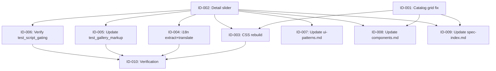

# Plan 34 — Image Display: Fix Catalog Grid Crop/Stretch + Add Detail Page Thumbnail-Strip Slider

## Statement of Scope

Two image-display defects across two user-facing surfaces, both resolved with
**CSS utility changes + template restructuring + minimal inline JavaScript**.
No database schema changes, no new dependencies, no Python production code changes.

| Spec | What changes | Files touched |
|------|-------------|---------------|
| **ID-001** | Catalog grid: `object-cover` → `object-contain` + `bg-white` | `ads/partials/ad_list.html` |
| **ID-002** | Detail page: static grid → main-image + thumbnail strip slider | `ads/detail.html` |
| **ID-003** | Rebuild Tailwind CSS (new `object-contain` utility) | `src/theme/static/theme/css/output.css` |
| **ID-004** | Extract + translate new `` strings | `src/backend/locale/{ru,bs,en}/LC_MESSAGES/django.po` + `.mo` |
| **ID-005** | Update `test_gallery_markup.py` for new slider markup | `apps/ads/tests/test_gallery_markup.py` |
| **ID-006** | Verify `test_script_gating.py` unchanged | `apps/ads/tests/test_script_gating.py` |
| **ID-007** | Update `ui-patterns.md` gallery section | `docs/01-spec/ui-patterns.md` |
| **ID-008** | Update `components.md` detail-view section | `docs/06-design-system/components.md` |
| **ID-009** | Update `spec-index.md` Known Problems status | `docs/01-spec/spec-index.md` |
| **ID-010** | Final verification (tests + lint + typecheck + i18n) | — |

### Explicitly out of scope

- No changes to `ThumbnailService` or image generation (CSS-only catalog fix per PO decision §7.1)
- No new JavaScript libraries (no Splide, PhotoSwipe, Alpine.js — researcher decision §4)
- No database migrations (no schema changes)
- No bot-side photo handling changes
- No model changes to `AdImage` (no `width`/`height` fields)

---

## Confirmed Decisions (PO §7)

All 8 PO decisions and the researcher recommendation are recorded in the spec.
Key decisions that shape task boundaries:

1. **Catalog fix approach:** CSS-only `object-contain` + `bg-white` on the image element (not `ThumbnailService`)
2. **Detail slider approach:** Vanilla JS + Tailwind CSS, no new libraries
3. **Interaction model:** Minimal inline Vanilla JS (≤10 lines), `data-*` attributes on thumbnail buttons
4. **Main image on detail:** `object-contain` with `bg-gray-100`; thumbnails use `object-cover`
5. **GLightbox CDN:** Keep v3.3.1 on unpkg unchanged
6. **i18n:** Wrap all new strings in ``; run `makemessages` + `compilemessages`
7. **Tests:** Update existing `test_gallery_markup.py`; no new test file needed
8. **Consent gating:** GLightbox script block stays in ``

---

## Critical Implementation Decision (Flagged for Implementor)

The spec's proposed template (§6 Task 2) renders **only one** `.glightbox`
anchor — on the main image — while thumbnails are `<button>` elements (not
anchors). However, GLightbox v3.3.1 groups gallery members by `data-gallery`
attribute on `.glightbox` elements (research §2.4). With a single anchor, the
overlay's prev/next arrows would only cycle a one-slide gallery, **breaking
REQ-10.7** ("preserving existing zoom/swipe/arrow behavior").

**Implementor must resolve one of:**

- **(A)** Add hidden `.glightbox` anchors for every image in the gallery group
  (visible thumbnail `<button>`s remain for in-page selection; hidden anchors
  satisfy GLightbox's grouping). The active anchor's `href` is updated by the
  inline JS so GLightbox opens at the correct image.
- **(B)** Use GLightbox's programmatic API: keep the single visible anchor but
  initialize the GLightbox instance with all image URLs and call
  `instance.openAt(index)` from the inline JS when a thumbnail or arrow is
  clicked.
- **(C)** Restructure so every gallery image is a visible `.glightbox` anchor
  (closer to the current design but with the thumbnail-strip overlay on top).

> This is an implementation-mechanism question within the approved "enhance
> GLightbox in place" approach — not an architecture redesign. ID-005 (test
> update) includes a verification criterion that at least one approach is
> exercised so the gallery group contains all images.

---

## Execution DAG

```
Phase 1 — Independent template edits (parallel, distinct files)
├── ID-001: Catalog grid object-contain fix    (ad_list.html)
└── ID-002: Detail page slider gallery          (detail.html)

Phase 2 — Parallel follow-ons (after Phase 1)
├── ID-003: Rebuild Tailwind CSS                [depends ⤵ ID-001, ID-002]
├── ID-004: i18n extraction + translation       [depends ⤵ ID-002]
├── ID-005: Update test_gallery_markup.py        [depends ⤵ ID-002]
├── ID-006: Verify test_script_gating.py          [depends ⤵ ID-002]
├── ID-007: Update ui-patterns.md                [depends ⤵ ID-002]
├── ID-008: Update components.md                  [depends ⤵ ID-001, ID-002]
└── ID-009: Update spec-index.md                   [depends ⤵ ID-001, ID-002]

Phase 3 — Verification
└── ID-010: Run test suite + lint + typecheck     [depends ⤵ ID-003, ID-004, ID-005, ID-006]
```

### Dependency graph (mermaid)



### Sequencing rationale

1. **ID-001 and ID-002 are independent** — they edit different template files
   (`ad_list.html` vs `detail.html`) and have no code dependency. Running them in
   parallel maximizes throughput with zero merge risk.

2. **ID-003 (CSS rebuild) is deferred until both template edits land** —
   Tailwind v4's `@source "src/backend/templates/**/*.html"` scans all
   templates at build time. Both templates introduce the `object-contain`
   utility (and possibly other new utilities like `flex-shrink-0`,
   `overflow-x-auto`). Batching the rebuild after both edits compiles all new
   utilities in a single pass instead of requiring two rebuilds. The CSS
   rebuild is a committed-artifact + dev-environment concern — the Docker image
   (Dockerfile line 76) regenerates CSS at build time, and the dev override
   (`docker-compose.dev.override.yml` line 8) regenerates on startup — but the
   committed `output.css` must be updated for local dev and seed consistency.

3. **ID-004 (i18n) depends only on ID-002** — the catalog grid fix introduces
   no new `` strings (the existing "No image" string is already
   extracted). The detail slider introduces new strings: `"Previous image"`,
   `"Next image"`, `"Select image"`, and `"of"` (replacing `"for"` in alt
   text). The `test_i18n_completeness.py` unit test (runs in the fast gate via
   `make test`) asserts all msgids exist in all `.po` files and `ru`/`bs`
   have non-empty `msgstr`. If i18n is not completed, the fast gate fails.

4. **ID-005 and ID-006 depend on ID-002** — the existing gallery tests assert
   the old grid-based markup. They must be updated to assert the new
   slider structure. `test_script_gating.py` should remain unchanged (GLightbox
   CDN URL and `` block location are preserved per
   PO decision §7.5 / spec §6 Task 2 point 3).

5. **ID-007, ID-008, ID-009 (documentation) depend on the implementations**
   — docs describe the final implemented state, not the spec's proposal.

6. **ID-010 (verification) is the final gate** — depends on all
   implementation, i18n, and test-update tasks. It runs the fast-gate test
   suite (`make test`), lint (`uv run ruff check`), and typecheck
   (`uv run basedpyright`) in Docker.

---

## Task Specifications

---

### ID-001: Fix catalog grid image display — `object-cover` → `object-contain` + `bg-white`

<details>
<summary>Task details</summary>

**Priority:** P0
**Type:** implementation (frontend, single file)
**Depends on:** none
**Risk:** low — single-class change in one template; no Python code, no schema, no test changes required (no existing test asserts `object-cover` on the catalog grid).

**Affected file:**
- `src/backend/templates/ads/partials/ad_list.html`

**Affected target / semantic anchor:**
- The `` element inside the `` block of the ad card (currently `class="w-full h-48 object-cover rounded-t-lg"`).

**Changes:**

Replace the image class in the catalog card:

```django
{# Before #}
class="w-full h-48 object-cover rounded-t-lg"

{# After #}
class="w-full h-48 object-contain bg-white rounded-t-lg"
```

- `object-contain` preserves aspect ratio and shows the full thumbnail (letterboxed where aspect ratio differs from 4:3).
- `bg-white` fills the letterbox area with white per PO decision §7.1 (REQ-10.2: CSS-only white-fill, not Pillow letterboxing).

No other changes to `ad_list.html` — the `ThumbnailService` crop behavior is unchanged (out of scope per spec §6 Task 1 point 2 and PO decision §7.1).

**Acceptance criteria:**
- The catalog grid `` element uses `object-contain` (not `object-cover`).
- The image element has `bg-white` for white-fill of letterboxed areas.
- `object-cover` no longer appears on the catalog grid image element.
- The "No image" fallback (`bg-gray-200` placeholder) is unchanged.
- `test_i18n_completeness.py` still passes (no new trans strings introduced).
- `uv run ruff check` / `uv run basedpyright` pass (template-only change — no Python files affected).

</details>

---

### ID-002: Replace detail page gallery with main-image + thumbnail-strip slider

<details>
<summary>Task details</summary>

**Priority:** P0
**Type:** implementation (frontend, single file)
**Depends on:** none
**Risk:** medium — replaces the gallery block in `detail.html` with a new structure; introduces inline Vanilla JS; must preserve GLightbox integration and consent gating. No production Python changes.

**Affected file:**
- `src/backend/templates/ads/detail.html`

**Affected targets / semantic anchors:**
- The photo gallery block (`<!-- Photo gallery -->` through `` after the `</div>` that closes the grid — currently `class="grid grid-cols-1 ..."` container).
- The `</body>` section containing the `` GLightbox script block.

**Changes:**

1. **Replace the gallery block** (currently lines 29–44 of `detail.html`) with:
   - A `data-detail-gallery` container.
   - A main-image preview (``) inside a
     `glightbox` anchor (`#detail-main-link` with `data-gallery="ad-gallery"`).
   - Prev/next arrow buttons (`<button id="detail-prev">`, `<button id="detail-next">`)
     with inline SVG chevrons and `` aria-labels.
   - A horizontal thumbnail strip (`<div id="detail-thumbs" data-detail-thumbs>`)
     of `<button>` elements, each carrying `data-index`, `data-full-url`,
     `data-thumb-url` attributes and a small `` with `object-cover`.
   - Main image uses `object-contain bg-gray-100` (PO decision §7.4); thumbnails
     use `object-cover` (PO decision §7.4).

2. **Add minimal inline JavaScript** (≤10 lines, following the codebase's
   vanilla-JS conventions from `header_catalog.html` — IIFE, `data-*` selection,
   `classList`) that:
   - Maintains `activeIndex` (0-based, starting at the first image).
   - `updateMainImage(index)` updates:
     - `detail-main-image.src` → the thumbnail's `data-thumb-url`
     - `detail-main-image.alt` → translated alt text
     - `detail-main-link.href` → the thumbnail's `data-full-url` (synchronizes
       GLightbox href — REQ-10.14, R8)
   - Thumbnail buttons and prev/next buttons call `updateMainImage(index)`
     with bounds clamping.
   - On single-image ads, prev/next are hidden or no-ops (existing branch preserved).

3. **Preserve GLightbox integration:**
   - The main image remains wrapped in `<a class="glightbox" data-gallery="ad-gallery">`.
   - GLightbox init stays in the same `` block before `</body>`.
   - GLightbox CSS `<link>` stays in `<head>` (ungated).
   - Non-consenting users: the main image anchor still navigates to the full
     image URL as a plain link (progressive enhancement — REQ-10.9).

4. **New `` strings to add:**
   - `"Previous image"` — prev button aria-label
   - `"Next image"` — next button aria-label
   - `"Select image"` — thumbnail button aria-label
   - `"of"` — alt text (replacing `"for"` per spec §6 Task 2 proposed template)

   > Note: `"Open image"`, `"Photo"`, and `"for"` already exist in the `.po` files.
   > `"of"` is new; `"Previous image"`, `"Next image"`, `"Select image"` are new.

**Critical implementation note (see plan §Critical Implementation Decision):**
The spec's proposed template has only one `.glightbox` anchor. GLightbox v3
groups gallery members by `data-gallery` on `.glightbox` elements — with a
single anchor, overlay prev/next won't navigate between images (violates
REQ-10.7). The implementor must use approach (A), (B), or (C) from the plan's
"Critical Implementation Decision" section. This decision must be resolved
before T-010 verification.

**Acceptance criteria:**
- `data-detail-gallery` container present when `ad.images.all` is truthy.
- Main image `` uses `object-contain bg-gray-100`.
- GLightbox anchor `#detail-main-link.glightbox[data-gallery="ad-gallery"]` wraps the main image.
- `#detail-prev` and `#detail-next` buttons present with inline SVG chevrons.
- Thumbnail strip `#detail-thumbs[data-detail-thumbs]` renders `<button>` elements with `data-index`, `data-full-url`, `data-thumb-url` attributes.
- Thumbnails use `object-cover`; main image uses `object-contain`.
- Images render in `AdImage.position` order (model `Meta.ordering = ["position"]`).
- Single-image and no-image branches preserved (existing `` logic adapted).
- No-JS fallback: main `` renders with valid `src` even without JS.
- GLightbox CSS `<link>` remains in `<head>` (ungated).
- GLightbox JS `<script>` and inline init remain in `` before `</body>`.
- GLightbox init options preserved: `selector: '.glightbox'`, `touchNavigation: true`, `loop: true`, `zoomable: true`, `closeOnOutsideClick: true`, `navigation: { next: true, prev: true }`.
- All new user-visible strings wrapped in ``.

</details>

---

### ID-003: Rebuild Tailwind CSS `output.css`

<details>
<summary>Task details</summary>

**Priority:** P0
**Type:** build (CSS artifact regeneration)
**Depends on:** ID-001, ID-002
**Risk:** low — regenerates a committed artifact; no source code change. The Docker image (Dockerfile line 76) and dev override already run this command; this task updates the committed `output.css`.

**Affected file:**
- `src/theme/static/theme/css/output.css`

**Semantic anchor:**
- The `@source "src/backend/templates/**/*.html"` directive in
  `src/theme/static/theme/css/input.css` — Tailwind v4 scans all template
  utilities at build time and purges unused ones.

**Changes:**

Run the Tailwind standalone CLI (already in the Docker image at
`/usr/local/bin/tailwindcss`, also available as a standalone binary via
`npx tailwindcss`):

```bash
# Via Docker compose (dev environment running):
docker compose --project-name mko-bazuna-dev exec web \
  tailwindcss -i src/theme/static/theme/css/input.css \
  -o src/theme/static/theme/css/output.css --minify

# Directly (if tailwindcss binary on PATH):
tailwindcss -i src/theme/static/theme/css/input.css \
  -o src/theme/static/theme/css/output.css --minify

# Via Docker image build (automatic — no action needed):
# Dockerfile line 76 already runs this during docker build
# Dev override (docker-compose.dev.override.yml line 8) also runs it on startup
```

This compiles the new `object-contain` utility and any other new utilities
introduced by ID-001 and ID-002 (e.g. `flex-shrink-0`, `overflow-x-auto`,
`scroll-px-2`, `bg-white/80`, `focus:ring-2`, `focus:ring-blue-500`) into
`output.css`. The committed `output.css` should be updated in the PR for
local-dev rendering; production Docker builds regenerate it automatically.

**Acceptance criteria:**
- `output.css` contains the `object-contain` utility class.
- `output.css` contains all new utilities used in the updated templates.
- `output.css` retains all previously-compiled utilities (no regression).
- Command succeeds with exit code 0.

</details>

---

### ID-004: Extract + translate new i18n strings

<details>
<summary>Task details</summary>

**Priority:** P0
**Type:** i18n (extraction + translation + compilation)
**Depends on:** ID-002 (source of new `` strings)
**Risk:** medium — if new msgids are not translated in `ru`/`bs`, the
`test_i18n_completeness.py` unit tests (which run in the fast gate) will fail:
`test_extraction_completeness` (msgid missing from some `.po`) and
`test_no_empty_msgstr` (empty msgstr in `ru`/`bs`).

**Affected files:**
- `src/backend/locale/ru/LC_MESSAGES/django.po` (add new msgids + Russian translations)
- `src/backend/locale/ru/LC_MESSAGES/django.po` → `.mo` (compiled)
- `src/backend/locale/bs/LC_MESSAGES/django.po` (add new msgids + Bosnian translations)
- `src/backend/locale/bs/LC_MESSAGES/django.po` → `.mo` (compiled)
- `src/backend/locale/en/LC_MESSAGES/django.po` (add new msgids; empty msgstr per convention)
- `src/backend/locale/en/LC_MESSAGES/django.po` → `.mo` (compiled)

**Steps:**

1. **Extract** new strings from templates:
   ```bash
   make makemessages
   ```
   This runs `manage.py makemessages -l ru -l bs -l en --no-location` via Docker
   (dev compose, project `mko-bazuna-dev`). It appends new msgids to all three
   `.po` files with empty `msgstr`.

2. **Fill translations** for the new msgids in `ru` and `bs` `.po` files
   (en msgstr left empty — msgid is English per project convention):

   | msgid | ru translation | bs translation |
   |-------|---------------|---------------|
   | `Previous image` | `Предыдущее изображение` | `Prethodna slika` |
   | `Next image` | `Следующее изображение` | `Slijedeća slika` |
   | `Select image` | `Выбрать изображение` | `Odaberi sliku` |
   | `of` | `из` | `od` |

3. **Compile** `.mo` files:
   ```bash
   make compilemessages
   ```
   This runs `manage.py compilemessages` via Docker, producing `.mo` files
   alongside each `.po`.

**Acceptance criteria:**
- All four new msgids present in all three `.po` files (`ru`, `bs`, `en`).
- `ru` and `bs` `.po` files have non-empty `msgstr` for all new msgids.
- `en` `.po` file has the new msgids (empty `msgstr` is acceptable).
- All `.mo` files compiled and exist alongside `.po` files.
- `test_i18n_completeness.py` passes (fast gate): `test_extraction_completeness`,
  `test_no_empty_msgstr`, `test_mo_compiled`, and
  `test_no_hardcoded_visible_text` on `detail.html`.

</details>

---

### ID-005: Update test_gallery_markup.py for new slider markup

<details>
<summary>Task details</summary>

**Priority:** P0
**Type:** test authoring (update existing)
**Depends on:** ID-002
**Risk:** low — test-only file; existing tests are `slow, integration` markers
(skipped in fast gate, so a failure here doesn't break the fast gate, but must
pass for full suite / manual verification).

**Affected file:**
- `src/backend/apps/ads/tests/test_gallery_markup.py`

**Semantic anchors (functions/methods to update):**
- `TestGalleryMarkup.test_detail_contains_glightbox_assets` — keep asserting
  GLightbox CSS/JS/init presence; also assert the inline gallery JS is present.
- `TestGalleryMarkup.test_each_image_is_glightbox_anchor` — **replace** with
  assertions for the new structure: main `glightbox` anchor on `#detail-main-link`
  with `data-gallery="ad-gallery"`, thumbnail `#detail-thumbs` buttons with
  `data-index`/`data-full-url`/`data-thumb-url` attributes, main image `#detail-main-image`.
- `TestGalleryMarkup.test_glightbox_init_options_present` — update if init options
  change (they should not — GLightbox init is preserved).
- `TestGalleryMarkup.test_images_render_in_position_order` — update to assert
  thumbnail buttons render in `AdImage.position` order.
- `TestGalleryMarkup.test_single_image_single_anchor` — update: single image →
  one `glightbox` anchor + one thumbnail button.
- `TestGalleryMarkup.test_no_images_no_gallery_block` — keep: no images → no
  `data-detail-gallery` container, no `glightbox` class.
- `TestGalleryMarkup.test_static_grid_renders_without_js` — update to assert
  main `` has valid `src` (no-JS fallback).

**New test methods to add:**
- `test_detail_gallery_has_slider_structure` — assert `data-detail-gallery`,
  `#detail-main-image`, `#detail-main-link.glightbox`, `#detail-prev`,
  `#detail-next`, `#detail-thumbs` are all present.
- `test_detail_main_image_uses_object_contain` — assert the main image class
  contains `object-contain` (not `object-cover`).
- `test_detail_thumbnails_use_object_cover` — assert thumbnail `` elements
  use `object-cover`.
- `test_detail_glightbox_href_sync` — assert the GLightbox anchor `#detail-main-link`
  has a `href` matching the first image's `image_url` (href synchronization — REQ-10.14, R8).
- `test_detail_prev_next_buttons_present` — assert `#detail-prev` and `#detail-next`
  exist with appropriate `aria-label`.

**Acceptance criteria:**
- All existing test method names preserved (update internals, don't rename).
- New slider structure assertions added for `data-detail-gallery`,
  `#detail-main-image`, `#detail-main-link`, `#detail-prev`, `#detail-next`,
  `#detail-thumbs`.
- `object-contain` asserted on main image; `object-cover` on thumbnails.
- `glightbox` + `data-gallery="ad-gallery"` still asserted on the main image anchor.
- Image order verified against `AdImage.position`.
- Single-image and no-image branches preserved.
- No-JS fallback: main `` has valid `src`.
- `test_script_gating.py` remains unchanged and green (ID-006 verifies).
- Full test file passes: `pytest apps/ads/tests/test_gallery_markup.py -v`.

</details>

---

### ID-006: Verify test_script_gating.py requires no changes

<details>
<summary>Task details</summary>

**Priority:** P1
**Type:** verification (no code change expected)
**Depends on:** ID-002
**Risk:** trivial — confirms that the GLightbox script-gating structure is
preserved. Per spec §6 Task 2 point 3 and PO decision §7.5, the `<script>`/`<link>`
tags stay in the same `` block at the same location
(before `</body>`).

**Affected file:**
- `src/backend/apps/ads/tests/test_script_gating.py`

**Decision points to verify:**
- Does `test_scripts_absent_before_consent` still pass? — Yes, GLightbox JS
  is still behind ``.
- Does `test_scripts_present_after_consent` still pass? — Yes, GLightbox CDN
  URL (`unpkg.com/glightbox@3.3.1`) is unchanged (PO decision §7.5, F8).

**Acceptance criteria:**
- `test_script_gating.py` is reviewed and confirmed unchanged.
- `TestConsentCookieFormat.test_consent_given_uses_accepted` passes.
- `TestScriptGating.test_scripts_absent_before_consent` passes.
- `TestScriptGating.test_scripts_present_after_consent` passes.
- No modifications to `test_script_gating.py` required.

</details>

---

### ID-007: Update ui-patterns.md — Image Gallery section

<details>
<summary>Task details</summary>

**Priority:** P1
**Type:** documentation
**Depends on:** ID-002
**Risk:** low — docs only; follows `docs/00-overview/doc-maintenance-rules.md`.

**Affected file:**
- `docs/01-spec/ui-patterns.md`

**Semantic anchor:**
- `## Image Gallery for Ad Detail Page` section (currently lines 149–207) —
  describes the old static grid pattern.

**Changes:**
Replace the current gallery `### Implementation` and `### Behavior` blocks with
documentation of the new slider pattern:
- Main image preview (`#detail-main-image`) with `object-contain`, `bg-gray-100`, `max-h-96`.
- Horizontal thumbnail strip (`#detail-thumbs`) with `overflow-x-auto`,
  `-webkit-overflow-scrolling: touch` for iOS.
- Prev/next arrow buttons (`#detail-prev`, `#detail-next`) with inline SVG chevrons.
- GLightbox anchor preserved on the main image (`#detail-main-link.glightbox`)
  with `data-gallery="ad-gallery"`.
- Minimal inline Vanilla JS (`data-index`, `data-full-url`, `data-thumb-url`
  attributes on thumbnail buttons, `updateMainImage` function).
- Progressive enhancement: static `` renders valid `src` without JS.
- Consent gating: GLightbox JS still behind ``.

**Acceptance criteria:**
- `ui-patterns.md` "Image Gallery for Ad Detail Page" section describes the new
  slider pattern (main image + thumbnail strip + arrow nav + GLightbox click-to-zoom).
- Old "static grid only" description is updated/superseded.
- English-only, valid frontmatter, valid relative cross-links.
- No code changes.

</details>

---

### ID-008: Update components.md — Ad Card (Detail View) section

<details>
<summary>Task details</summary>

**Priority:** P1
**Type:** documentation
**Depends on:** ID-001, ID-002
**Risk:** low — docs only; follows `docs/00-overview/doc-maintenance-rules.md`.

**Affected file:**
- `docs/06-design-system/components.md`

**Semantic anchor:**
- `### Ad Card (Detail View)` section (currently lines 417–496).

**Changes:**
1. Update the gallery HTML snippet to reflect the new slider structure:
   `object-contain` on the main image (not `object-cover`), `data-detail-gallery`
   container, thumbnail strip with `object-cover` thumbnails.
2. Update the `Ad Card (List View)` section's image class from `object-cover` to
   `object-contain` + `bg-white` (matching ID-001).
3. Update the "Property" table for the gallery to note: gallery = main image +
   thumbnail strip + GLightbox overlay; thumbnail `object-cover`; main image
   `object-contain`.

**Acceptance criteria:**
- `components.md` "Ad Card (Detail View)" reflects the new slider pattern.
- `components.md` "Ad Card (List View)" reflects `object-contain` + `bg-white`.
- `object-cover` is still documented for thumbnail strip images and other contexts
  where cropping is intentional.
- English-only, valid frontmatter, valid relative cross-links.

</details>

---

### ID-009: Update spec-index.md — Known Problems status

<details>
<summary>Task details</summary>

**Priority:** P1
**Type:** documentation
**Depends on:** ID-001, ID-002
**Risk:** trivial — change a status label in a table.

**Affected file:**
- `docs/01-spec/spec-index.md`

**Semantic anchor:**
- The Known Problems table row for `**10**` (currently shows `[Draft]` link).

**Changes:**
The row already exists at line 185. Update the status from `[Draft]` to
`[Approved]` (the spec's header reads "Status: Approved (PO decisions
collected)"):

```markdown
| **10** | Image display: catalog grid images cropped/stretched via `object-cover`; detail page missing slider/thumbnail-strip gallery | [Approved](.ai/problems/10_image-display_spec.md) |
```

**Acceptance criteria:**
- The `**`10`**` row in the Known Problems table links to the spec with `[Approved]` status.
- No other rows in the table are modified.

</details>

---

### ID-010: Final verification — test suite + lint + typecheck

<details>
<summary>Task details</summary>

**Priority:** P0
**Type:** verification
**Depends on:** ID-003 (CSS rebuild), ID-004 (i18n), ID-005 (test update), ID-006 (script gating verify)
**Risk:** low — runs existing verification tooling.

**Verification steps:**

1. **i18n completeness (fast gate — unit markers):**
   ```bash
   docker compose --project-name mko-bazuna-test -f docker-compose.yml -f docker-compose.test.yml run --rm \
     -e PYTEST_OPTS="apps/ads/tests/test_i18n_completeness.py -v" test
   ```
   All four tests must pass: `test_no_hardcoded_visible_text`,
   `test_extraction_completeness`, `test_no_empty_msgstr`, `test_mo_compiled`.

2. **Gallery markup tests (integration — not in fast gate):**
   ```bash
   docker compose --project-name mko-bazuna-test -f docker-compose.yml -f docker-compose.test.yml run --rm \
     -e PYTEST_OPTS="apps/ads/tests/test_gallery_markup.py apps/ads/tests/test_script_gating.py -v" test
   ```

3. **Full fast gate:**
   ```powershell
   make test
   ```
   Must pass (skips `seed` marker tests per the entrypoint's
   `PYTEST_SKIP_MARKERS=seed` handling).

4. **Lint:**
   ```bash
   uv run ruff check src/backend/apps/ads/tests/
   ```

5. **Typecheck:**
   ```bash
   uv run basedpyright src/backend/apps/ads/tests/
   ```

**Acceptance criteria:**
- `test_i18n_completeness.py` — all 4 tests pass.
- `test_gallery_markup.py` — all updated tests pass.
- `test_script_gating.py` — all 2 tests pass unchanged.
- `make test` (fast gate) is green.
- `uv run ruff check` — 0 errors.
- `uv run basedpyright` — 0 errors.
- `output.css` contains `object-contain` utility.
- New `.po`/`.mo` files compiled and consistent.

</details>

---

## Task Index

| ID | Title | Phase | Parallel | Priority | Risk | Depends On |
|----|-------|-------|----------|----------|------|------------|
| ID-001 | Catalog grid `object-contain` fix | 1 | yes | P0 | low | — |
| ID-002 | Detail page slider gallery | 1 | yes | P0 | medium | — |
| ID-003 | Rebuild Tailwind CSS | 2 | yes | P0 | low | ID-001, ID-002 |
| ID-004 | i18n extract + translate + compile | 2 | yes | P0 | medium | ID-002 |
| ID-005 | Update test_gallery_markup.py | 2 | yes | P0 | low | ID-002 |
| ID-006 | Verify test_script_gating.py | 2 | yes | P1 | trivial | ID-002 |
| ID-007 | Update ui-patterns.md | 2 | yes | P1 | low | ID-002 |
| ID-008 | Update components.md | 2 | yes | P1 | low | ID-001, ID-002 |
| ID-009 | Update spec-index.md | 2 | yes | P1 | trivial | ID-001, ID-002 |
| ID-010 | Final verification | 3 | no | P0 | low | ID-003, ID-004, ID-005, ID-006 |

**Parallel groups:**
- Phase 1: ID-001 + ID-002 — fully parallel (distinct template files)
- Phase 2: ID-003 through ID-009 — fully parallel (distinct files/concerns); CSS rebuild needs both template edits; i18n needs detail slider; tests need detail slider; docs need implementations
- Phase 3: ID-010 — verification only after all implementation + i18n + CSS tasks complete

---

## Risk Assessment

| Task | Risk | Reason | Mitigation |
|------|------|--------|------------|
| ID-001 | low | Single CSS class swap in one template; no Python, no schema, no test asserts `object-cover` on catalog grid | Verify no test references `object-cover` in `ad_list.html` context (confirmed via grep — none found) |
| ID-002 | medium | Replaces gallery block; adds inline JS; changes test assertions; GLightbox gallery navigation gap (single anchor) | Flagged as Critical Implementation Decision; ID-005 tests the new structure; progressive enhancement preserves no-JS link |
| ID-003 | low | Regenerates committed CSS artifact; Docker build/test auto-regenerates CSS | Run via `docker compose exec web tailwindcss`; verify `object-contain` present in output |
| ID-004 | medium | New `` strings must be in all `.po` files with non-empty `msgstr` for `ru`/`bs`, or `test_i18n_completeness.py` (unit, fast-gate) fails | Extract via `makemessages`; fill translations per the table in ID-004; compile via `compilemessages`; verify with `test_i18n_completeness.py` |
| ID-005 | low | Test-only file; existing tests are `integration` marker (not in fast gate) | Update assertions to match new markup; run with `-v` for confirmation |
| ID-006 | trivial | Verification only; spec says no changes needed | Read-only review; run tests to confirm |
| ID-007 | low | Docs only | Follow `docs/00-overview/doc-maintenance-rules.md`; cross-link verified |
| ID-008 | low | Docs only | Same as ID-007 |
| ID-009 | trivial | Single table cell update | Change `[Draft]` → `[Approved]` |
| ID-010 | low | Runs existing tooling; failures point to specific upstream tasks | Run in specified order; each step is independently verifiable |

### Cross-cutting risks (from spec §10)

| Risk | Mitigation in plan |
|------|--------------------|
| **R1** GLightbox gallery may not navigate across images (single anchor) | Flagged as Critical Implementation Decision; implementor must choose approach (A/B/C) before ID-002 is complete; ID-005 adds `test_detail_glightbox_href_sync` |
| **R2** Inline JS may be flagged by linting/CSP | CSP is report-only (research §2.6, confirmed in `apps/core/views.py`); inline JS follows `header_catalog.html` IIFE convention; scoped to `data-detail-gallery` |
| **R3** `test_gallery_markup.py` breakage | ID-005 updates all affected assertions; preserves method names |
| **R4** `test_script_gating.py` breakage if script location changes | ID-006 verifies no changes needed; GLightbox `<script>` stays in same `` block |
| **R5** Thumbnail strip scroll on mobile | `-webkit-overflow-scrolling: touch` via inline style on `#detail-thumbs` (not a Tailwind utility — no CSS rebuild needed) |
| **R6** No-JS fallback | Main `` always renders with valid `src`; GLightbox `<a>` remains a plain link without JS; ID-005 asserts no-JS fallback |
| **R7** Accessibility — new buttons need `aria-label`s | All new buttons have `aria-label` with ``; `<button>` elements are natively keyboard-focusable |
| **R8** GLightbox href synchronization | Inline JS updates `detail-main-link.href` atomically with `detail-main-image.src` in `updateMainImage()`; ID-005 asserts href matches first image |

---

## Verification Approach

### Automated tests (Docker-based)

All tests run via the test Compose service (never `uv run pytest` locally — PostgreSQL 18 is required on port 5433):

```powershell
# i18n completeness (fast gate — unit markers):
docker compose --project-name mko-bazuna-test -f docker-compose.yml -f docker-compose.test.yml run --rm `
  -e PYTEST_OPTS="apps/ads/tests/test_i18n_completeness.py -v" test

# Gallery markup + script gating:
docker compose --project-name mko-bazuna-test -f docker-compose.yml -f docker-compose.test.yml run --rm `
  -e PYTEST_OPTS="apps/ads/tests/test_gallery_markup.py apps/ads/tests/test_script_gating.py -v" test

# Full fast gate:
make test
```

### Manual browser checks (spec §10 DoD requirements)

After deployment to dev:
- **Desktop:** main image renders with `object-contain`; thumbnail strip scrolls horizontally; clicking thumbnail updates main image + GLightbox href; prev/next arrows switch images; clicking main image opens GLightbox overlay with correct image; overlay prev/next navigates all gallery images.
- **Mobile:** thumbnail strip scrolls with momentum; GLightbox swipe/zoom work; touch targets ≥ 44px.
- **No-JS:** main image renders with valid `src`; clicking opens full image via plain `<a>` link.
- **No consent:** no GLightbox JS loaded (CSS is fine); gallery images still visible as static thumbnails; main image anchor works as plain link.
- **i18n:** all new strings ("Previous image", "Next image", "Select image") appear translated in `ru`/`bs`.

### Linting / typechecking

```powershell
uv run ruff check src/backend/apps/ads/tests/
uv run basedpyright src/backend/apps/ads/tests/
```

### CSS verification

```powershell
# Verify output.css contains the new utility
select-string -Path src/theme/static/theme/css/output.css -Pattern "object-contain"
```

---

## Rollout Notes

1. **No migrations.** All changes are template/CSS/i18n/test/doc — no database
   schema changes (spec §11). `manage.py makemigrations --check --dry-run`
   should report no changes (verifiable in ID-010).

2. **CSS rebuild is a committed-artifact update.** The Docker image (Dockerfile
   line 76) regenerates `output.css` at build time, so production is safe
   regardless. The committed `output.css` must be updated for local dev and
   the seed pipeline (seed runs in dev with bind-mounted repo).

3. **GLightbox gallery navigation decision (R1).** The implementor must resolve
   the single-anchor gallery grouping issue before ID-010 verification. See the
   "Critical Implementation Decision" section above.

4. **Template file serialization.** ID-001 edits `ad_list.html`; ID-002 edits
   `detail.html` — no file conflicts, safe to implement in parallel.

5. **i18n is a fast-gate blocker.** `test_i18n_completeness.py` is marked
   `unit` and runs in `make test`. If ID-004 (extract + translate + compile)
   is incomplete, the fast gate fails. This is why i18n is sequenced before
   ID-010.

6. **No rollback file needed.** All changes are additive/reversible via
   `git checkout` of the individual files. No data migrations to roll back.

---

## Research Status

Research is complete and decision-recorded in the spec (§4) and the research
file (`.ai/research/image-display-gallery-research.md`). Key findings:

- **Catalog grid:** `object-contain` + `bg-white` is the recommended approach
  (research §5.1, MDN/DigitalOcean verified). CSS rebuild required —
  `object-contain` is not in the compiled `output.css` (research §1.3,
  verified by scanning `output.css`).
- **Detail gallery:** GLightbox v3.3.1 API documented (research §2.4).
  Consent gating verified (CSS ungated, JS gated behind `consent_analytics`
  — research §2.3). Vanilla JS conventions documented (research §2.7).
- **Library choice:** Splide + PhotoSwipe rejected (spec §4: 2.1× heavier,
  requires dimension fields, ESM friction, test rewrite). GLightbox enhanced
  in place (spec §4 recommendation, PO decision §7.2, §7.8).

No additional research is needed. The GLightbox single-anchor navigation gap
(see Critical Implementation Decision) is a within-spec implementation mechanism
that the implementor resolves using the documented GLightbox v3 API.
