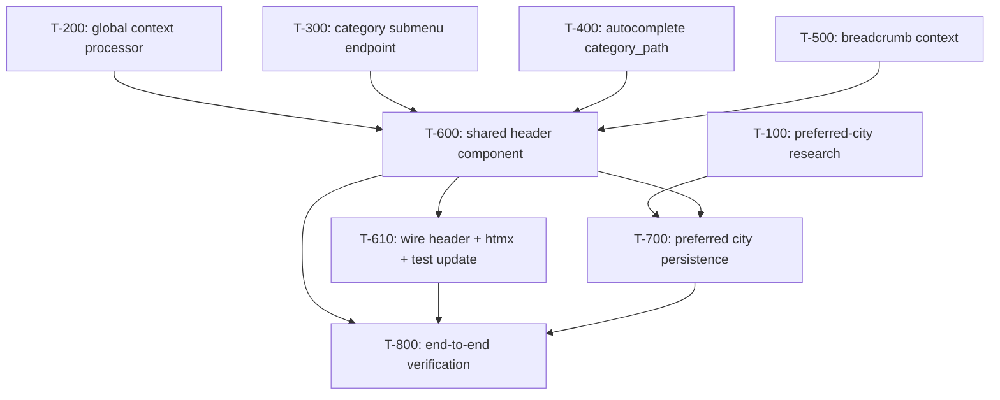

# Implementation Plan: Catalog Page UI Redesign (Avito-style Header)

**Plan ID:** `15_catalog-ui-avito_plan`
**Source Spec:** `.ai/problems/14_catalog-ui-avito_spec.md`
**Date:** 2026-08-18
**Status:** Implementation-ready (one task gated on research)

---

## Executive Summary

Spec_014 redesigns the catalog header to match Avito's pattern: a unified **shared
header** (`components/header_catalog.html`) rendered on every public page (catalog, search
results, ad detail) that hosts:

1. **Search suggestions dropdown** (contextually grouped City → Category → Popular → History),
2. **"All Categories" dropdown** (full 4-level MPTT tree, one branch open),
3. **Breadcrumbs** below the search bar,
4. **"+ Подать объявление"** Telegram deep-link button,
5. **Responsive behavior** (desktop dropdown panels; mobile off-canvas accordion).

Backend enablers are required before the template work: a **global context processor**
(`bot_username`, `root_categories`), a **category submenu endpoint** (HTMX lazy-load,
Redis-fragment-cached), an **autocomplete API extension** (`category_path`), and
**breadcrumb context** in the listings/search views.

### Key implementation decisions surfaced (required by the spec, not stated as discrete tasks)

1. **`UserProfile` does not exist.** The spec (R-01d, §8.3) assumes
   `UserProfile.preferred_city` FK → `City` for registered-user persistence. No profile
   model exists in `apps/users`. This is the **only true architectural gap** and is a
   schema + unknown-consumer change → it is gated on a **research task (T-100)**. The
   guest path (cookie) needs no schema but is implemented in the same feature task once
   the decision lands.
2. **Search markup moves out of `list.html` → test coupling.** `test_autocomplete_template.py`
   reads `ads/list.html` *directly* and asserts the search input, dropdown `<ul>`,
   `hx-*` wiring, and inline autocomplete `<script>` are present. After R-05a moves that
   markup into the shared include, `list.html` no longer holds it. The header-wiring task
   **must update that test in the same atomic change** (assert against
   `components/header_catalog.html`), not as a separate cleanup. This is why T-610 is a
   single task that couples the template wiring with the test update.
3. **Consent banner stays in leaf templates.** Relocating it into the shared header would
   invalidate `test_templates.py`'s line-relative guard assertion across five templates
   (list, detail, dashboards) with no user value. The banner remains a leaf-template
   include (guard intact) — eliminating that entire risk vector. (Consistent with the
   prior plan's decision and spec R-05d.)
4. **`categories/urls.py` is empty.** The category listing route is
   `/category/<slug>/` (ads app → `listings_category`). The new submenu endpoint
   `/categories/<slug>/submenu/` (plural + `/submenu/`) is distinct — no route conflict.
5. **HTMX 1.9.12 constraint.** `hx-on` is unavailable; outside-click / Escape / expand-one-branch
   accordion behavior use **vanilla JS** `data-*` attributes + event listeners, matching
   the existing `language_switcher.html` toggle pattern. Hover+click compound triggers use
   `hx-trigger="click hover delay:300ms"`.
6. **No `` / `base.html` migration.** Introduced only `` fragments
   (consistent with the existing `consent_banner.html` / `language_switcher.html` includes)
   to keep line-relative template tests intact.

**Risk profile:** one additive shared-config change (`TEMPLATES` context_processors), one
new public endpoint with caching, two view-context changes, one **schema-changing** feature
(preferred city — gated on research), and the template/test-coupling work (T-600/T-610).
No build or deployment changes.

---

## Execution DAG

```
Phase 1 — Research gate (blocks the schema-changing feature)
└── T-100: Preferred-city persistence decision        (.ai/problems/Decision_0XX.md? or documented decision)

Phase 2 — Backend enablers (parallel, no shared files)
├── T-200: Global header context processor            (apps/core/context_processors.py + config/settings/base.py)
├── T-300: Category submenu endpoint + cache          (apps/categories/views*, urls.py, partial)
├── T-400: Autocomplete category_path extension        (apps/search/services/entity_suggestions.py)
└── T-500: Breadcrumb context in listings + search     (apps/ads/views/listings.py, apps/search/views/search.py)

Phase 3 — Shared header component (single new-file unit)
└── T-600: Build components/header_catalog.html        (components/header_catalog.html NEW + breadcrumb include + JS)
     └── depends_on: T-200, T-300, T-400, T-500

Phase 4 — Header wiring + test coupling (single atomic unit)
└── T-610: Wire header into list.html + detail.html + htmx script on detail + update test_autocomplete_template.py
     └── depends_on: T-600

Phase 5 — Schema-dependent feature (BLOCKED on T-100)
└── T-700: Preferred city persistence + city-suggestion filter
     └── depends_on: T-100 (research), T-600

Phase 6 — End-to-end verification (multi-stage, high-risk)
└── T-800: Verify AC-01..AC-08 across catalog / search / detail / mobile
     └── depends_on: T-600, T-610, T-700
```

### Dependency graph (mermaid)



### Sequencing rationale

1. **Research first (T-100).** The only schema-changing piece (registered `preferred_city`)
   has an undefined storage target (`UserProfile` is absent). Everything else in the plan is
   additive to existing, well-established patterns (context processors, Django cache
   framework, `` fragments, HTMX). T-100 is the single gate.

2. **Backend enablers run in parallel** in Phase 2 — they touch disjoint modules
   (`core/context_processors.py`, `categories/*`, `search/services/entity_suggestions.py`,
   `ads/views/listings.py` + `search/views/search.py`). T-200/T-400/T-500 are independently
   reviewable; all feed the single header component (T-600).

3. **The shared header (T-600) is one atomic new-file unit** rather than four separate
   element tasks. All four elements (search dropdown, category dropdown, breadcrumbs,
   place-ad) render inside one `header_catalog.html` and share one script block, context,
   and responsive layout. Splitting them would force repeated, conflicting edits to the same
   brand-new file and split a single reviewable concern. Its behavior dependencies
   (submenu URL, `category_path`, breadcrumb context, `bot_username`/`root_categories`) are
   all delivered by Phase 2 before it starts.

4. **Header wiring + the autocomplete template test update are the same atomic task
   (T-610).** Moving the search markup out of `list.html` into the include breaks
   `test_autocomplete_template.py` simultaneously; splitting the test update into a later
   "test" task would leave the suite red between commits. The task keeps the coupling
   explicit and reviewable.

5. **Preferred city (T-700) is deferred behind research and the header**, since the
   city-suggestion click handler lives in the shared header's script and the registered-user
   path needs the T-100 schema decision.

6. **End-to-end verification (T-800)** is a dedicated multi-stage task because the change is
   high-risk and spans multiple shared templates, three pages, HTMX behavior, and responsive
   layout — proportional to the surface area.

---

## Task Specifications

---

### T-100: Research — preferred-city persistence strategy

<details>
<summary>Task details</summary>

**Priority:** P0 (gate)
**Type:** research
**Depends on:** none
**Risk:** n/a — read-only investigation. Resolution **blocks** T-700.

**Affected files (read-only):**
- `src/backend/apps/users/models.py` (verify no profile model)
- `src/backend/apps/locations/models.py` (`City`)
- `src/backend/apps/ads/views/listings.py`, `src/backend/apps/search/views/search.py` (city-filter contract)
- `docs/02-database/db-schema.md`, `docs/99-agent/*` (schema/architecture conventions)

**Affected targets (read-only):**
- `User` model (single user model, `AUTH_USER_MODEL = "users.User"`)
- `City` model
- Existing FK pattern usage in the `users` app

**Goal:** Produce a concrete recommendation (and any needed `docs/` note) for how a
registered user's `preferred_city` is stored, with the **only acceptable outcomes** `Go` or
`Go with changes`.

**Changes:** None (research only). Recommend the decision and, if a schema change is chosen,
specify the exact model + migration approach followed by T-700's implementation.

**Acceptance criteria:**
- Explicit recommendation: (a) create a new `UserProfile` model with
  `preferred_city = FK("locations.City", null=True, blank=True)`, or (b) add the FK directly
  to the existing `User` model, or (c) defer registered persistence to a cookie-only MVP.
  Each option evaluated against project rules (#10 StrEnum constants, #13 migrations,
  strict separation of concerns) and existing migration conventions.
- Verify no existing consumers reference a non-existent `UserProfile` (grep confirms absence).
- Document the migration implications (new table vs added column) and any index/cascade
  considerations for the `City` FK.
- Output a clear `Go` / `Go with changes` verdict for T-700.
</details>

---

### T-200: Global header context processor (`bot_username` + `root_categories`)

<details>
<summary>Task details</summary>

**Priority:** P1
**Type:** implementation
**Depends on:** none
**Risk:** medium — additive change to shared configuration (`TEMPLATES` context_processors).
No schema. Mitigation: extend the existing `apps/core/context_processors.py` module rather
than introducing a new abstraction; registration is purely additive.

**Affected files:**
- `src/backend/apps/core/context_processors.py`
- `src/backend/config/settings/base.py` (`TEMPLATES[0]["OPTIONS"]["context_processors"]`)

**Affected targets:**
- New function `header_context(request)` (or equivalent) in `apps/core/context_processors.py`
- `config/settings/base.py` → `TEMPLATES` → `context_processors` list (append registration)

**Semantic insertion points:**
- Add the new context-processor function as a sibling of `plausible_host` / `language` in
  `apps/core/context_processors.py`.
- Append `"apps.core.context_processors.header_context"` to the `context_processors` list in
  `config/settings/base.py`.

**Changes:**

1. Implement a context processor returning a dict with exactly two keys:
   - `bot_username` ← `settings.BOT_USERNAME` (note: rule #5 — never reference
     `settings.BOT_USERNAME` directly from a template; it must arrive via this context var).
   - `root_categories` ← the ordered list of top-level active `Category` nodes via
     `Category.objects.root_nodes().filter(is_active=True)` (use `django-mptt`
     `root_nodes()`; follow the project's cache-framework pattern only if profiling shows a
     per-request cost — a single indexed query is acceptable for MVP).

2. Register the processor in `config/settings/base.py`.

**Acceptance criteria:**
- `{{ bot_username }}` and `{{ root_categories }}` resolve on every template without the
  view passing them explicitly.
- No `settings.BOT_USERNAME` reference appears in any template.
- `test_autocomplete_template.py`'s `test_no_settings_dot_access_in_template` still passes.
</details>

---

### T-300: Category submenu endpoint (`/categories/<slug>/submenu/`) with fragment cache

<details>
<summary>Task details</summary>

**Priority:** P1
**Type:** implementation
**Depends on:** none
**Risk:** medium — new public endpoint + caching in a currently empty `categories/urls.py`.
Mitigation: match the existing Django cache-framework usage (`django.core.cache`) and the
`lookup_resolution.py` cache-invalidation signal pattern.

**Affected files:**
- `src/backend/apps/categories/urls.py`
- `src/backend/apps/categories/views.py` (NEW view module; or
  `apps/categories/views/__init__.py` if splitting — follow `apps/ads/views/` layout)
- `src/backend/templates/categories/partials/mega_submenu.html` (NEW partial)
- `src/backend/apps/categories/signals.py` (cache invalidation on `Category` MPTT moves)

**Affected targets:**
- New function `category_submenu(request, slug)` (view)
- `apps/categories/urls.py` → `urlpatterns` (register
  `path("categories/<slug:slug>/submenu/", category_submenu, name="category_submenu")`)
- New template include `categories/partials/mega_submenu.html`
- `invalidate_category_submenu_cache` receiver in `apps/categories/signals.py`

**Semantic insertion points:**
- Add the view to a new `apps/categories/views.py` (sibling of `signals.py`,
  `services/`).
- Populate `urlpatterns` in `apps/categories/urls.py` (currently empty,
  `# Views added in Task 3`).
- Create `templates/categories/partials/mega_submenu.html` (reflect the existing
  `ads/partials/` partial convention).
- Extend `apps/categories/signals.py` with a `post_save`/`post_delete`-based cache clear for
  the `Category`/`CategoryPath` = MPTT move events.

**Changes:**

1. **View `category_submenu`**: resolve the `Category` by `slug`+`is_active=True` (404 on
   miss); render `mega_submenu.html` with the category's `get_children()` (and optionally
   grandchildren per spec §8.2 "children + grandchildren"). Return the partial HTML.
2. **Fragment cache**: wrap the children/grandchildren rendering with the Django cache
   framework (`django.core.cache.cache`) keyed by `category_slug:tree_version` per spec §8.2;
   use `LocMemCache` in dev/test (already configured) and Redis in prod. A simple
   `tree_version` that increments on structural `Category`/`CategoryPath` save/delete keeps
   invalidations correct.
3. **Partial template**: render child categories as expandable `<li>` elements carrying the
   `data-category-*` hook and `hx-get`/`hx-trigger` attributes for the second-level
   lazy-load (wired client-side by T-600).
4. **URL**: register `/categories/<slug:slug>/submenu/` (distinct from the existing
   `/category/<slug>/` ads listing route).

**Acceptance criteria:**
- `GET /categories/<slug>/submenu/` returns `200` with the partial `<ul>` for a valid active
  category; `404` for unknown/inactive.
- Partial is cache-friendly; cache invalidates on category-tree structural changes.
- URL is reachable through `config/urls.py` (the categories app is already included at root).
</details>

---

### T-400: Autocomplete `category_path` extension

<details>
<summary>Task details</summary>

**Priority:** P2
**Type:** implementation
**Depends on:** none
**Risk:** low — additive change to an existing service; extends an existing JSON response
with one optional field. No schema.

**Affected files:**
- `src/backend/apps/search/services/entity_suggestions.py`
- `src/backend/apps/search/tests/test_autocomplete.py` (extend assertions)

**Affected targets:**
- Function `get_entity_suggestions` in `apps/search/services/entity_suggestions.py`

**Semantic insertion points:**
- Inside the `for cat in categories` comprehension in `get_entity_suggestions`, attach a
  `category_path` key alongside `text`, `source`, `type`.

**Changes:**

1. For each category suggestion, build `category_path` as the ancestor chain in root→leaf
   order (per spec §8.1 example: "Товары > Транспорт") using
   `cat.get_ancestors()` and the current category name, joined by `" > "`. Account for
   i18n naming via `Category.get_name(locale)` consistency with the detail display.

**Acceptance criteria:**
- Category suggestions in `GET /api/search/autocomplete?q=...` include a `category_path`
  string; city/popular/history suggestions are unchanged.
- `test_autocomplete.py` extended to assert the new key (and that non-category sources
  omit it).
- Total suggestion cap (`_MAX_SUGGESTIONS = 10`) and merge order (city → category →
  popular → history) preserved.
</details>

---

### T-500: Breadcrumb context in listings + search views

<details>
<summary>Task details</summary>

**Priority:** P2
**Type:** implementation
**Depends on:** none
**Risk:** low/medium — additive view-context change to two established views. Mitigation:
preserve all existing context keys (tests assert on `current_category` slug string).

**Affected files:**
- `src/backend/apps/ads/views/listings.py` (function `listings`)
- `src/backend/apps/search/views/search.py` (function `search`)
- `src/backend/apps/ads/tests/test_listings_context.py`,
  `src/backend/apps/search/tests/test_autocomplete.py`

**Affected targets:**
- `listings` context dict in `apps/ads/views/listings.py`
- `search` context dict in `apps/search/views/search.py`

**Semantic insertion points:**
- In `listings()`: after resolving `category` (inside the `if category_slug:` branch) add a
  breadcrumb-ready key exposing the resolved `Category` object (or `None`), e.g.
  `breadcrumb_category`.
- In `search()`: after resolving `current_category` add the same `breadcrumb_category` key
  from the resolved `Category`.
- In `ad_detail()`: the resolved `ad.category` is already available; breadcrumbs derive from
  `ad.category.get_ancestors(include_self=True)` client/template-side (no additional key
  strictly required, but add a normalized `breadcrumb_category` if preferred for consistency).

**Changes:**

1. Add `breadcrumb_category` (resolved `Category` or `None`) to the `listings` and `search`
   context dicts so the header can build `get_ancestors(include_self=True)` breadcrumbs.
2. Keep `current_category` (string slug) untouched for backward compatibility with existing
   tests and filters.

**Acceptance criteria:**
- Breadcrumb-ready context available on category-listing and search pages without breaking
  `current_category`/`current_city` contracts.
- Existing listings/search context tests remain green.
</details>

---

### T-600: Build shared header component `components/header_catalog.html`

<details>
<summary>Task details</summary>

**Priority:** P0
**Type:** implementation
**Depends on:** T-200, T-300, T-400, T-500
**Risk:** high — single new file consolidating four interactive elements + inline JS. No
existing-file edits (brand-new file), so no merge conflicts; complexity is the risk. No
`` — `` only.

**Affected files:**
- `src/backend/templates/components/header_catalog.html` (NEW)
- `src/backend/templates/components/breadcrumb.html` (NEW breadcrumb include, R-03f/g)

**Affected targets (semantic):**
- The new `<header>` fragment and its four regions:
  1. `+ Подать объявление` CTA (R-04) → `https://t.me/{{ bot_username }}?start=create_ad`
  2. "Все категории / <current category>" dropdown (R-02) + MPTT tree + one-branch expand
  3. Breadcrumbs region (R-03) ``
  4. Search input + `#autocomplete-dropdown` `<ul>` (R-01) + grouped-render JS

**Semantic insertion points (in the new file):**
- Header wrapper using Tailwind utilities; bound to context vars `bot_username`,
  `root_categories`, `breadcrumb_category`, `query`, `current_category`.
- The autocomplete `<ul>` keeps `id="autocomplete-dropdown"` and `class="autocomplete-dropdown`
  + Tailwind positioning utilities` (R-01a/i: `absolute z-20 w-full mt-1 ... max-h-72
  overflow-y-auto hidden`).
- Vanilla JS block (no `hx-on`) implementing: outside-click + Escape close (R-01g/R-02),
  grouped section rendering (city/category/popular/history + category sub-line + fire/clock
  icons + "Show all results" link) (R-01b/c/h), city-click filter + push-state, category-click
  filter + push-state, text-click populate + submit (R-01d/e/f), expand-one-branch accordion
  (desktop hover `hx-trigger="click hover delay:300ms"` + click toggle; R-02b/e, R-06e),
  mobile off-canvas + accordion (R-06a/b), full-width mobile search dropdown (R-06c), and
  ≥44×44 px tap targets (R-06d).

**Changes:**

1. Create `components/header_catalog.html` implementing all four regions and the shared
   inline behavior script (mirroring the `language_switcher.html` `data-*` toggle pattern).
2. Create `components/breadcrumb.html` implementing R-03a–R-03g: category ancestor chain
   from `get_ancestors(include_self=True)` (root→leaf), last segment plain text, `›`
   separator, separate "Результаты поиска: [query]" line below the trail on search, and
   full omission on the home/root page.

**Acceptance criteria:**
- All four header elements render from a single `` with `bot_username` and
  `root_categories` in context.
- Autocomplete dropdown positioned below the input; `autocomplete-dropdown` token + all
  `hx-*` attributes preserved (R-01k).
- Category tree lazy-loads via the T-300 URL with one-branch-expand; category click
  navigates to `/category/<slug>/` (R-02e).
- Breadcrumbs correct for: category path, detail path, search-query-separated, homepage
  omitted (AC-05).
- Responsive: off-canvas category menu + full-width search on mobile (AC-07).
</details>

---

### T-610: Wire shared header into `list.html` + `detail.html`; add htmx to detail; update autocomplete test

<details>
<summary>Task details</summary>

**Priority:** P0
**Type:** implementation (template + test-infrastructure coupling)
**Depends on:** T-600
**Risk:** high — edits shared templates (`list.html`, `detail.html`) and a template test
(`test_autocomplete_template.py`). This single task keeps the markup move and its test update
atomic to avoid a red test between commits.

**Affected files:**
- `src/backend/templates/ads/list.html`
- `src/backend/templates/ads/detail.html`
- `src/backend/apps/search/tests/test_autocomplete_template.py`

**Affected targets:**
- `ads/list.html` → replace the standalone `<header>` and the in-`<main>` search form with
  ``.
- `ads/detail.html` → replace the standalone `<header>` with the include; add the htmx
  1.9.12 `<script src="https://unpkg.com/htmx.org@1.9.12">` and the autocomplete inline
  `<script>` (R-05e/f; T-600 provides the script path).
- `test_autocomplete_template.py` → change its target from `ads/list.html` to
  `components/header_catalog.html` (or assert the include is present in `list.html` **and**
  the htmx attributes live in the include), preserving all asserted tokens.

**Semantic insertion points:**
- In `list.html`: replace the `<header>...</header>` block (brand + language switcher) and
  the `<!-- Search form -->` `<form>` block with the header include. Keep the `<main>` ad
  grid (`#ad-list`, `ad_list.html` partial) and the bottom consent-banner guard intact.
- In `detail.html`: replace the `<header>` block with the include; add the htmx script next
  to the Plausible/analytics script block; keep the consent-banner guard and contact button.

**Changes:**

1. **`list.html`**: substitute the old header and search form with the shared include.
2. **`detail.html`**: substitute the old header with the include; add the htmx `<script>` and
   the autocomplete inline script (so search works on detail — R-05e/f).
3. **`test_autocomplete_template.py`**: repoint the `setUpClass.template_path` at the shared
   include and update the two structural tests to match the new location, keeping all token
   assertions (`id="search-input"`, `name="q"`, `hx-get`, `search:autocomplete`,
   `hx-trigger="input delay:300ms"`, `hx-target="#autocomplete-dropdown"`, `hx-swap="none"`,
   `autocomplete="off"`, `<ul id="autocomplete-dropdown"`, `htmx:afterRequest`, and the
   `settings.BOT_USERNAME` absence check).

**Acceptance criteria:**
- `list.html` and `detail.html` both render the identical header via `` (AC-08).
- htmx 1.9.12 scripts loaded on both pages (AC-08).
- Dashboard / edit / login pages are **not** affected (separate headers) — verify no change
  to `dashboard.html`, `edit.html`, `login_issue.html` (AC-08).
- `test_autocomplete_template.py` passes after the repointing (AC-01).
- `test_templates.py` (consent-banner guard) still passes — banner remains in leaf templates.
</details>

---

### T-700: Preferred city persistence + city-suggestion filter (BLOCKED)

<details>
<summary>Task details</summary>

**Priority:** P1
**Type:** implementation (schema-changing; gated)
**Depends on:** T-100 (**research gate** — must return `Go`/`Go with changes`), T-600
**Risk:** high — introduces a schema migration (registered-user path) and a new write path
for the city suggestion click. Blocked until T-100 resolves the storage strategy.

**Affected files (per T-100 outcome):**
- `src/backend/apps/users/models.py` (+ a new migration under
  `apps/users/migrations/`) — registered path, only if T-100 recommends a profile/FK field.
- Entity-suggestion / view for the city-suggestion click (extend `entity_suggestions` merge
  ordering and add a small write endpoint/view or reuse the existing search/listings filter).
- `src/backend/apps/search/services/search_history.py` or a new `preferred_city` service —
  only if a service is justified.

**Affected targets (semantic):**
- `UserProfile` (new, per T-100) or `User.preferred_city` FK → `City` (per T-100).
- The header's city-suggestion click handler in the JS (already stubbed by T-600) is bound
  to the server write path.

**Semantic insertion points:**
- Add the FK field/model precisely as recommended by T-100; generate a Django migration.
- Add/reuse a server endpoint that the city-suggestion click calls to persist
  `preferred_city` for registered users (guests set the `preferred_city` cookie client-side,
  30-day expiry per §8.3).
- Wire the search/listings city filter to default to the preferred city (R-01d) and to
  trigger an HTMX refine + URL push-state (R-01e, AC-03).

**Changes:**

1. Implement the T-100-recommended schema (model/field + migration).
2. Implement guest cookie write (`preferred_city` = city slug, 30-day) on city-suggestion
   click.
3. Implement registered-user persistence via the server path.
4. Bind city-suggestion click to both persistence and an HTMX filter update with
   `push-url` (AC-03).

**Acceptance criteria:**
- Clicking a city sets `preferred_city` (cookie for guests / profile for registered), filters
  the current results, and updates the URL via push-state (AC-03).
- No `print()` (logging only); constants via StrEnum where applicable.
- Migration present and reproducible; tests cover the click → persist → filter workflow.
</details>

---

### T-800: End-to-end verification

<details>
<summary>Task details</summary>

**Priority:** P0
**Type:** verification (dedicated — multi-stage, high-risk)
**Depends on:** T-600, T-610, T-700
**Risk:** n/a — verification only.

**Affected files (test-only):**
- `src/backend/apps/ads/tests/` (listings/detail context tests)
- `src/backend/apps/search/tests/test_autocomplete.py`,
  `src/backend/apps/search/tests/test_autocomplete_template.py`
- `src/backend/apps/core/tests/test_templates.py`

**Verification matrix (maps to spec acceptance criteria):**

| AC | Verify |
|---|---|
| AC-01 | Dropdown renders **below** the input; Escape / outside-click closes; `test_autocomplete_template.py` green |
| AC-02 | Typing a prefix shows only matching grouped sections (city/category/popular/history), no empty sections |
| AC-03 | City click → preferred_city set + filtered + push-state; category click → filtered + push-state; text click → populated + HTMX submit |
| AC-04 | Category button label dynamic; one branch expanded; category navigates to `/category/<slug>/`; panel closes on outside/Escape/selection |
| AC-05 | Breadcrumbs correct on category path, detail path, search (query separate), homepage omitted |
| AC-06 | "+ Подать объявление" visible top-left; opens `t.me/{{ bot_username }}?start=create_ad` in new tab |
| AC-07 | Mobile off-canvas categories + accordion; full-width search dropdown; ≥44×44 tap targets |
| AC-08 | `list.html` + `detail.html` render identical header via include; htmx on both; dashboard/edit/login unaffected |

**Commands to run (project convention):**
- `uv run pytest src/backend/apps/search/tests/ src/backend/apps/ads/tests/ src/backend/apps/core/tests/test_templates.py`
- `uv run ruff check src/backend`
- `uv run basedpyright src/backend`

**Acceptance criteria:**
- All AC-01…AC-08 verified; the full targeted test suite and lint/typecheck pass.
- Manual/browser spot-checks pass for: desktop hover + click category dropdown, mobile
  off-canvas accordion, search-suggestion click behaviors on both catalog and detail pages.
</details>
