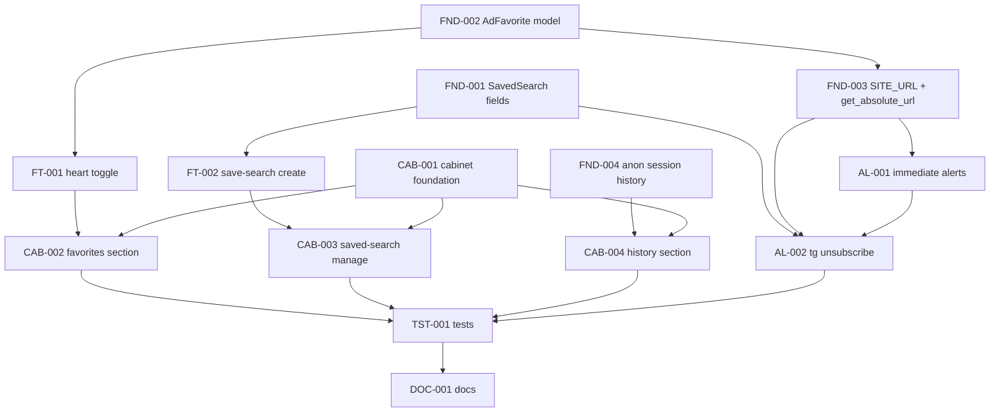

# Implementation Plan: Unified User Cabinet (Favorites, Saved-Search Alerts & Search History)

**Plan ID:** `16_user-cabinet_plan`
**Source Spec:** `.ai/problems/15_user-cabinet_spec.md`
**Date:** 2026-08-18
**Status:** Implementation-ready

---

## Executive Summary

This plan transforms spec `15_user-cabinet_spec.md` (Favorites, Saved-Search Alerts
& Search History) into a dependency-safe execution DAG. It delivers five net-new or
revived capabilities behind a lightweight **User Cabinet** hub:

1. **Favorites (❤️)** — `AdFavorite` model, instant HTMX toggle w/ guest login gate,
   and a cabinet Favorites section reusing the ad-card partial.
2. **Saved-search web flow** — working "Сохранить поиск" modal (revives the dead
   `save_search_modal.html`) + full cabinet management (enable/disable ≠ delete).
3. **Near-real-time alerts** — publish-time delivery with per-ad Telegram messages
   and inline callback unsubscribe (plus deep-link fallback).
4. **Anonymous session search history** — session-scoped, dedup, capped 50, surfaced
   in the autocomplete.
5. **Cabinet hub** — `/cabinet/` app with section nav, "Мои объявления" → existing
   `/dashboard/` (unrefactored), and a stub Settings section.

The spec is **decision-complete** (D1–D12 resolved; four researcher reports R1–R4
already recommend concrete approaches). No additional research gate is required; the
single open question (Q4 — deep-link unsubscribe scope) is resolved inline with a
minimal-scope recommendation.

The plan reorganizes the spec's conceptual T1–T13 into **four execution phases** that
maximize parallel safe work while keeping every shared-file edit serialized:

- **Phase 1 — Foundations** (parallel where files differ): model/schema migrations
  (`SavedSearch` extension, `AdFavorite`), the `SITE_URL`/`get_absolute_url` plumbing,
  and the anonymous-history service change.
- **Phase 2 — Independent feature slices** (parallel): favorite heart toggle, saved
  search create, immediate publish-time alerts, and the cabinet app skeleton.
- **Phase 3 — Cabinet integration + Telegram unsubscribe** (the four Phase-2 outputs
  plug into the cabinet; sections are serialized on the shared cabinet `urls.py`).
- **Phase 4 — Test authoring & documentation** for user-visible behavior, workflows,
  regressions, and integration boundaries.

**Risk profile:** One high-risk task (`AL-001` immediate publish-time alerts) modifies
a shared `Ad` `post_save` signal and adds a settings gate — its prerequisite research is
already satisfied by `docs/99-agent/alert-delivery-research.md` (Approach 1 → Go). Two
additive migrations (`FND-001`, `FND-002`) are new-column/new-model changes in separate
apps, verified inline. No public API is removed or renamed; `/dashboard/` is untouched.

### Key implementation decisions surfaced during planning

- **The cabinet entry must go in BOTH headers.** Public pages (`list.html`,
  `detail.html`) use `components/header_catalog.html`; seller/dashboard pages use
  `components/header.html`. CR14 ("shared header shows cabinet entry for
  authenticated users") must be satisfied in both, not just `header.html`.
- **Cabinet sections are serialized on the shared `apps/cabinet/urls.py` (and
  `components/cabinet_nav.html`).** The favorites, saved-searches, and search-history
  sections all register routes in one cabinet urlconf and add to one nav component;
  they are ordered to avoid concurrent-edit conflicts (plan-14 precedent).
- **`apps/ads/models.py` is shared by `FND-002` (new `AdFavorite`) and `FND-003`
  (`Ad.get_absolute_url`).** They are serialized; `SITE_URL` settings/value applies
  cleanly either way.
- **The daily `send_alerts` command is retained untouched** as the backfill/catch-all
  (A5, C8). Immediate alerts are additive and idempotent via `uq_saved_search_ad`.

---

## Execution DAG

```
Phase 1 — Foundations ─────────────────────────────────────────────────────
  FND-001: Extend SavedSearch (updated_at, last_notified_at, unsubscribe_token)   [parallel]
  FND-002: AdFavorite model + migration                                           [parallel]
  FND-003: SITE_URL + Ad.get_absolute_url            (serial after FND-002: ads/models.py)
  FND-004: Anonymous session search history          [parallel]

Phase 2 — Independent feature slices (parallel) ───────────────────────────
  FT-001: Favorites heart toggle + guest gate        (dep: FND-002)
  FT-002: Saved-search create + modal wiring         (dep: FND-001)
  AL-001: Immediate publish-time alerts              (dep: FND-003)  [HIGH RISK]
  CAB-001: Cabinet app foundation (hub/nav/settings/header)          [independent]

Phase 3 — Cabinet integration + Telegram unsubscribe ──────────────────────
  CAB-002: Favorites list section  (dep: FT-001, CAB-001)     \
  CAB-003: Saved-search manage sec (dep: FT-002, CAB-001)      >  serialized on
  CAB-004: Search-history section  (dep: FND-004, CAB-001)    /  cabinet urls + nav
  AL-002: Telegram unsubscribe     (dep: AL-001, FND-001, FND-003)

Phase 4 — Tests + docs ────────────────────────────────────────────────────
  TST-001: Test suites (all features)   (dep: all)
  DOC-001: Documentation                (dep: all)
```

### Dependency graph (mermaid)



### Sequencing rationale

1. **FND-001, FND-002, FND-004 are fully independent foundations** — separate apps (
   `search` vs `ads`) or distinct files, additive migrations, no shared state. They run
   in parallel and unlock every feature slice. FND-003 shares `apps/ads/models.py` with
   FND-002 so it is serialized immediately after it.

2. **FT-001, FT-002, AL-001, CAB-001 are independent feature slices** that each consume
   exactly one foundation output. They run in parallel in Phase 2. None of them depends
   on the cabinet to be built first (the toggle, save-search view, alert service, and
   cabinet skeleton are orthogonal), which keeps the critical path short.

3. **AL-001 (immediate publish-time alerts) is isolated as its own high-risk task.**
   It changes a shared `Ad` `post_save` signal and adds a settings gate. Its
   prerequisite research is already satisfied by `docs/99-agent/alert-delivery-research.md`
   (Approach 1 → Go), so it is **not** blocked — but its risk is contained within a
   single reviewable task (see Risk Assessment).

4. **CAB-001 (cabinet foundation) is deliberately a Phase-2 independent slice.** It
   creates the app package, urlconf, hub view, nav component, settings stub, header
   link, and `INSTALLED_APPS`/`config/urls.py` registration. It needs no feature code —
   the section views are added by CAB-002/003/004.

5. **CAB-002/003/004 are serialized solely on the shared `apps/cabinet/urls.py` and
   `components/cabinet_nav.html`.** The three sections are otherwise independent; only
   the append-to-one-urlconf and edit-to-one-nav force an order (favorites → saved
   searches → search history). This mirrors the plan-14 shared-file serialization
   precedent and avoids concurrent-edit conflicts.

6. **AL-002 (Telegram unsubscribe) is sequenced after AL-001** (it extends the
   immediate-alert message with an inline callback) and after FND-001 (uses
   `unsubscribe_token`) and FND-003 (uses `SITE_URL` for the absolute ad link). It is
   independent of the cabinet (D8: Telegram-only management is complementary to the
   cabinet's saved-searches control).

7. **TST-001 (tests) and DOC-001 (docs) are deferred to Phase 4** so they assert the
   final implemented behavior, per project rule #14 and the doc-maintenance rules.

---

## Task Specifications

---

### FND-001: Extend `SavedSearch` model with audit + unsubscribe fields

<details>
<summary>Task details</summary>

**Priority:** P0
**Type:** implementation (schema)
**Depends on:** none
**Source spec:** §4 (SavedSearch extension), D7/D8/D10, CR7
**Risk:** low — additive migration in `apps/search`; new nullable/auto fields; server-generated opaque token. Verified inline (apply on empty + populated DB).

**Affected files:**
- `src/backend/apps/search/models.py`
- `src/backend/apps/search/migrations/0004_savedsearch_alerts_fields.py` (NEW)

**Affected target:**
- Class `SavedSearch` (in `apps/search/models.py`, sibling of `PopularSearch`, `SearchHistory`, `SavedSearchNotification`).

**Changes — add three fields to `SavedSearch`:**

1. `updated_at = models.DateTimeField(auto_now=True)` — last-modified timestamp (D9/D10).
2. `last_notified_at = models.DateTimeField(null=True, blank=True)` — "last time this search produced a notification".
3. `unsubscribe_token = models.CharField(max_length=40, unique=True, null=True, blank=True, db_index=True)` — server-generated opaque value (D8/D10). Must be opaque (32–40 chars), NOT derived from the PK and NOT a Django `Signer` value (F8/C5: `Signer` separator is incompatible with both the deep-link charset and safe `callback_data`). Generate using `secrets.token_urlsafe` (or `secrets.token_hex`), stored plaintext on the row; the token is a capability handle, so no hashing is required. Backfill any existing rows in the migration (DataMigration or `""`→generated) so `unique=True` is satisfied on non-empty DBs.

**Semantic insertion point:** append the three field declarations inside the `SavedSearch` class body, after the existing `created_at` field (preserve `created_at = auto_now_add`).

**Acceptance criteria:**
- `makemigrations` produces a single migration adding the three columns; `unsubscribe_token` is unique; applying on empty + populated DBs succeeds.
- `SavedSearch.objects.create(...)` yields an `unsubscribe_token` (auto-generated at creation — wire in `save()` override or a `post_init`/factory; choose the same idiom used across the codebase).
- Existing `SavedSearch` rows on a populated DB remain valid (token backfilled, `updated_at` set).
- `uv run ruff check` and `uv run basedpyright` pass on the model.

</details>

---

### FND-002: Add `AdFavorite` model + migration

<details>
<summary>Task details</summary>

**Priority:** P0
**Type:** implementation (schema)
**Depends on:** none
**Source spec:** §4 (AdFavorite), CR1/CR2, R4
**Risk:** low — additive new model + migration in `apps/ads`; follows the `SavedSearch` model conventions (R4). Verified inline (apply on empty + populated DB).

**Affected files:**
- `src/backend/apps/ads/models.py`
- `src/backend/apps/ads/migrations/0009_adfavorite.py` (NEW)

**Affected target:**
- New class `AdFavorite(models.Model)` in `apps/ads/models.py` (sibling of `Ad`, `AdImage`, `AdFeature`).

**Model design (from spec §4, verified: no favorite model exists anywhere):**
```python
class AdFavorite(models.Model):
    user = models.ForeignKey("users.User", on_delete=models.CASCADE, related_name="favorites")
    ad = models.ForeignKey("ads.Ad", on_delete=models.CASCADE, related_name="favorites")
    created_at = models.DateTimeField(auto_now_add=True)

    class Meta:
        db_table = "ad_favorites"
        constraints = [
            models.UniqueConstraint(fields=["user", "ad"], name="uq_user_ad_favorite"),
        ]
        indexes = [
            models.Index(fields=["user_id", "-created_at"]),
        ]
```

**Semantic insertion point:** add the `AdFavorite` class after `AdFeature` at the end of `apps/ads/models.py`.

**Acceptance criteria:**
- `AdFavorite` created with the `uq_user_ad_favorite` unique constraint and `user_id,-created_at` index; `db_table="ad_favorites"`.
- Deduplication enforced: creating two favorites for the same `(user, ad)` under `ignore_conflicts=True` (for the toggle upsert) is safe.
- `makemigrations --check --dry-run` reports no drift after the migration is created.
- Reverse relation names `User.favorites` and `Ad.favorites` resolve.

</details>

---

### FND-003: Add `SITE_URL` setting + `Ad.get_absolute_url`

<details>
<summary>Task details</summary>

**Priority:** P0
**Type:** implementation (settings + model plumbing)
**Depends on:** FND-002 (shares `apps/ads/models.py` — serialized to avoid a concurrent-edit conflict)
**Source spec:** F9/F10, CR9, C10, R10
**Risk:** low — additive env setting with defaults + one model method. `SITE_URL` absent today (verified); adding it is required for absolute ad links in Telegram (C10).

**Affected files:**
- `src/backend/config/settings/base.py`
- `src/backend/config/settings/dev.py`
- `src/backend/config/settings/prod.py`
- `.env.example`, `.env.docker.example` (repo root), `.env.dev.example` (add `SITE_URL` var + comment)
- `src/backend/apps/ads/models.py` (add `get_absolute_url` to `Ad`)

**Affected targets:**
- `config/settings/base.py` — add `SITE_URL = os.getenv("SITE_URL", "http://localhost:8000")` (or similar; env-driven, sensible dev default so dev/test absolute links work per R10).
- `config/settings/prod.py` — read `SITE_URL` from env (required in prod; mirror the existing `ImproperlyConfigured` pattern if unavailable).
- `config/settings/dev.py` — dev default override if needed.
- `Ad` class (`apps/ads/models.py`) — add `get_absolute_url(self) -> str` returning the detail path resolved via the `ads:detail` URL name (`f"{settings.SITE_URL}{reverse('ads:detail', args=[self.id])}"` or build from `SITE_URL` + `reverse`).

**Semantic insertion point:**
- `Ad.get_absolute_url` — add as a method on the `Ad` class next to `get_title` / `get_description`.
- Settings: append `SITE_URL` near the other env-driven host settings (`BOT_USERNAME`, `PLAUSIBLE_HOST`) in `base.py`; mirror in `dev.py`/`prod.py`.

**Acceptance criteria:**
- `Ad.get_absolute_url()` returns a working absolute URL (`{SITE_URL}/ads/<id>/` form) for a PUBLISHED ad.
- `SITE_URL` is a valid absolute URL with no trailing slash (normalize in the setting).
- `.env` templates document the new var; dev default present so dev/test links never 500.
- `uv run ruff check` and `uv run basedpyright` pass.

</details>

---

### FND-004: Anonymous session-scoped search history

<details>
<summary>Task details</summary>

**Priority:** P0
**Type:** implementation (service + views + tests)
**Depends on:** none
**Source spec:** G4, US-B12 / CR11, D6, R3
**Risk:** low–medium — small pure-Python service change + two view call-site updates + 4 test updates. Uses the Django `db` session store as the privacy retention policy (R3); no migration/table.

**Affected files:**
- `src/backend/apps/search/services/search_history.py`
- `src/backend/apps/search/views/search.py`
- `src/backend/apps/search/views/autocomplete.py`
- `src/backend/apps/search/tests/test_autocomplete.py`

**Affected targets / semantic insertion points:**
- `search_history.py`:
  - `record_search_history(user_id, query)` — extend to accept an optional `session` (Django session object). When `user_id is None` AND `session` is provided, store the query (dedup + cap 50) in `session["search_history"]` instead of the DB; keep the DB path unchanged for authenticated users.
  - `get_user_search_history(user_id, limit)` — extend to accept an optional `session`; when `user_id is None` and `session` has session history, return those queries (most-recent-first, capped) instead of the current `[]`.
  - Keep `_MAX_HISTORY: int = 50` shared by both paths. Store as a list of `{query, query_normalized, ts}` or a simple ordered list — choose the simplest dedupe-compatible structure.
- `views/search.py::search` — pass `request.session` to `record_search_history` so anonymous searches record history (remove the `is_authenticated` gate; keep the anonymous DB path a no-op).
- `views/autocomplete.py::autocomplete` — pass `request.session` to `get_user_search_history` so anonymous users get session suggestions (`user_history` source).
- `tests/test_autocomplete.py` — update the 4 tests currently asserting the anonymous no-op:
  - `TestAutocompleteEndpoint.test_autocomplete_anonymous_user_returns_popular_and_entities`
  - `TestSearchHistoryService.test_record_search_history_anonymous_is_noop`
  - `TestSearchHistoryService.test_get_user_search_history_anonymous_returns_empty`
  - `TestSearchViewRecordsAutocompleteData.test_search_anonymous_does_not_record_history`
  Update them to assert the new session-backed behavior (anonymous history IS recorded, deduped, capped at 50, surfaced in autocomplete) per project rule #2 (production over tests).

**Acceptance criteria:**
- Anonymous search surfaces deduped, capped-50 session history in the autocomplete `user_history` group.
- Authenticated behavior is unchanged (DB-backed history).
- Session history is NOT merged into the account on login (A6/D6 — explicitly deferred).
- All 4 updated tests pass via the Docker `test` service; other existing autocomplete/history tests stay green.

</details>

---

### FT-001: Favorite heart toggle (`♡↔♥`) with guest login gate

<details>
<summary>Task details</summary>

**Priority:** P0
**Type:** implementation (HTMX frontend + toggle view)
**Depends on:** FND-002 (AdFavorite model)
**Source spec:** CR2/CR3, D2/D3, R4, C4 (no `@login_required`), R6 (hx-headers CSRF), R7 (manual auth)
**Risk:** medium — new HTMX POST precedent (no global CSRF header exists yet, R6/R7). Must NOT use `@login_required` on the toggle (302 vs htmx, F10/C4).

**Affected files:**
- `src/backend/templates/components/favorite_heart.html` (NEW)
- `src/backend/templates/components/login_prompt.html` (NEW)
- `src/backend/apps/ads/views/favorite.py` (NEW)
- `src/backend/apps/ads/urls.py`
- `src/backend/templates/ads/partials/ad_list.html` (add heart to each card)
- `src/backend/templates/ads/detail.html` (add heart; add `<body hx-headers>`)
- `src/backend/templates/ads/list.html` (add `<body hx-headers>`)

**Affected targets / semantic insertion points:**
- New component `components/favorite_heart.html` — a form/button that POSTs to the toggle endpoint via HTMX, carrying the ad id and current state; rendered for each ad card and on the detail page.
- New fragment `components/login_prompt.html` — guest-facing "Войдите, чтобы сохранить" prompt linking to ``, returned in place of the heart when an unauthenticated user taps ♡ (no 302).
- New view module `apps/ads/views/favorite.py`:
  - `toggle_favorite(request, ad_id)` — **manual auth check** (reject/return `login_prompt` fragment for anonymous; `Http404` for a non-PUBLISHED/non-existent ad). For authenticated users, upsert-or-delete the `AdFavorite` (via `get_or_create`/`delete` under try/except on the `uq_user_ad_favorite` constraint) and return the swapped `favorite_heart.html` fragment (or an HTTP 204 / replaced heart, matching the chosen HTMX swap idiom).
- `apps/ads/urls.py` — register `path("favorite/<int:ad_id>/", toggle_favorite, name="favorite_toggle")` (name it consistently; header/card references use it).
- Add a global CSRF-safe HTMX header on the pages that render hearts: `<body hx-headers='{"X-CSRFToken": "{{ csrf_token }}"}'>` on `list.html` and `detail.html` (R6). If a broader pattern exists, follow it; otherwise introduce it only on these templates.

**Changes / design notes:**
- The heart component must render the correct initial state (favorited vs not) — pass the favorite status from the view context (e.g. annotate `AdFavoriteExists` for the cards, or pass `is_favorited` to the detail template).
- Keep the toggle accessible (button/aria label) and do not block navigation (place the heart outside the card's wrapping `<a>` in `ad_list.html`).

**Acceptance criteria:**
- Anonymous tap on ♡ returns the `login_prompt.html` fragment (HTTP 200, NO 302) linking to `/login/issue/`; no favorite is persisted (CR2).
- Authenticated tap toggles `♡ ↔ ♥` instantly via HTMX with CSRF, no reload (CR3).
- The heart renders on both listing cards (`ad_list.html`) and the detail page (`detail.html`) with correct initial state.
- No `@login_required` on the toggle endpoint; all `apps/ads` tests stay green.
- `uv run ruff check` and `uv run basedpyright` pass.

</details>

---

### FT-002: Saved-search create view + modal wiring

<details>
<summary>Task details</summary>

**Priority:** P0
**Type:** implementation (view + URL + template wiring)
**Depends on:** FND-001 (SavedSearch fields/modal persistence)
**Source spec:** CR5, CR17, D4, R8 (dead modal)
**Risk:** medium — revives a dead modal whose URL names (`search:save-search`, `search:list`) do not exist (verified); must wire the create flow and remove/reconcile `search:list`.

**Affected files:**
- `src/backend/apps/search/views/save_search.py` (NEW)
- `src/backend/apps/search/urls.py`
- `src/backend/templates/search/partials/save_search_modal.html`
- `src/backend/apps/search/views/search.py` (add "Сохранить поиск" button + modal context)

**Affected targets / semantic insertion points:**
- New view `save_search(request)` in `apps/search/views/save_search.py`:
  - POST handler that captures `query` + optional `city_id`/`category_id`/`min_price`/`max_price` from the form, creates a `SavedSearch` for `request.user` with `language = request.LANGUAGE_CODE`, and sets `is_active=True` (default). Returns an HTMX fragment (or redirect/204) reflecting success.
  - Must be authenticated-only; use `@login_required` (this is a normal full-page/HTMX target, not the guest-gated toggle scenario), or a manual auth check if an HTMX fragment for guests is preferred — keep consistent with FT-001's manual-auth idiom for auth-gated HTMX.
- `apps/search/urls.py` — add `path("save-search/", save_search, name="save-search")` (so `search:save-search` resolves, CR17).
- `apps/search/views/search.py::search` — expose the current query/city/category/price + `cities`/`categories` context needed by the modal, and render the "🔔 Сохранить поиск" button on results when authenticated (CR5).
- `save_search_modal.html` — wire `hx-post=""`. Reconcile the modal's `hx-get=""` (a dangling `search:list`): either remove that hx-get or re-point it to a valid refresh target (e.g. `search:search`), since `search:list` does not exist and must not resolve to a 500.

**Acceptance criteria:**
- `search:save-search` resolves; submitting the modal creates a `SavedSearch` with the captured filters + the user's `LANGUAGE_CODE` (CR5, CR17).
- The "🔔 Сохранить поиск" button appears on authenticated search results and opens the pre-filled modal.
- No dangling `search:list` reference remains in `save_search_modal.html` (R8).
- Existing `apps/search` tests stay green; new create-path tests pass via the Docker `test` service.

</details>

---

### AL-001: Near-real-time publish-time alert delivery

<details>
<summary>Task details</summary>

**Priority:** P0
**Type:** implementation (signal + ad-centric matcher + background send)
**Depends on:** FND-003 (SITE_URL / get_absolute_url for absolute ad links)
**Source spec:** CR8, CR9 (partial), D5, R1, F5/F7, A2/A3/A4, C8, R1/R2/R3 risks
**Risk:** HIGH — touches the shared `moderation/signals.py::calculate_ad_priority` file, adds a publish-time side effect, adds a settings gate (`IMMEDIATE_ALERTS_ENABLED`), and introduces background-thread sending. **Prerequisite research is satisfied**: `docs/99-agent/alert-delivery-research.md` recommends Approach 1 (post_save PUBLISHED → `transaction.on_commit` → ad-centric matcher → background-thread `asyncio.run(Bot(...))` with `asyncio.Semaphore(10)`), which this task follows (→ Go). Not blocked.

**Affected files:**
- `src/backend/apps/search/services/alert_query.py` (add ad-centric matcher)
- `src/backend/apps/search/services/immediate_alerts.py` (NEW — send service)
- `src/backend/apps/moderation/signals.py` (add new `post_save(Ad)` receiver)
- `src/backend/config/settings/base.py` (add `IMMEDIATE_ALERTS_ENABLED` gate)

**Affected targets / semantic insertion points:**
- `alert_query.py` — add an **ad-centric matcher** `find_matching_saved_searches(ad) -> QuerySet[SavedSearch]` (or `list[SavedSearch]`): given a PUBLISHED `Ad`, return active (`is_active=True`) saved searches whose filters match it (per-language FTS via the ad's own vector, city, category subtree, price range), reusing the FTS patterns already in `find_matching_ads` (F3). Reuse `IX_saved_searches_user_active` index (R4).
- `immediate_alerts.py` (NEW) — `deliver_immediate_alerts(ad_id)`:
  - Run **inside `transaction.on_commit`** (F6/F8/R3) so delivery only fires after the PUBLISHED commit.
  - Find matching saved searches for the ad, `record_notifications` (idempotent via `uq_saved_search_ad` + `ignore_conflicts`, C8) so the daily command never double-sends.
  - For users with a `chat_id` (A4 — `telegram_id` is nullable, never used), send a **single per-ad Telegram message** (A3) in a background **daemon thread** wrapping `asyncio.run(Bot(...))`, capped by `asyncio.Semaphore(10)` (R1/R2). Users without `chat_id` are logged and skipped.
- `moderation/signals.py` — add a new `@receiver(post_save, sender=Ad)` receiver `deliver_immediate_alerts_on_publish` that, when `instance.status == AdStatus.PUBLISHED` (and the gate is enabled), schedules `transaction.on_commit(lambda: deliver_immediate_alerts(instance.id))`. Keep the existing `calculate_ad_priority` receiver intact. (F5: all publish paths converge on `Ad.transition_to(PUBLISHED)`.)
- `config/settings/base.py` — add `IMMEDIATE_ALERTS_ENABLED = env_bool(..., default=False)` (CR15 / R1 safe-rollout gate; default OFF so behavior is opt-in).

**Design notes:**
- The per-ad message builder (`[Посмотреть объявление]` absolute link + title/city/price) is **delivered by AL-002**, not here. AL-001 focuses on the delivery plumbing (match → record → background send of a minimal ad message). Keep the message transport isolated in `immediate_alerts.py`.
- The daily `send_alerts.py` command is **not modified** (A5/C8) — it remains the backfill/catch-all.

**Acceptance criteria:**
- Publishing an ad matching an active saved search produces a near-real-time Telegram message (gate ON).
- Re-running publish (or the daily backfill) does **not** double-send (`uq_saved_search_ad` + `ignore_conflicts`, CR8 idempotency).
- `IMMEDIATE_ALERTS_ENABLED=False` (default) disables publish-time delivery; the daily command still backfills.
- The ad-centric matcher returns the correct active saved searches (incl. category-subtree / city / price filters).
- `config/settings` and `moderation/signals.py` pass `ruff`/`basedpyright`; existing moderation/signal tests stay green.

</details>

---

### CAB-001: Cabinet app foundation (hub, nav, settings stub, header entry)

<details>
<summary>Task details</summary>

**Priority:** P0
**Type:** implementation (new app + navigation)
**Depends on:** none (independent; PARALLEL phase-2 slice)
**Source spec:** CR13, CR14, CR16, D1, D12, A7, R4, C9
**Risk:** medium — new app affecting startup (`INSTALLED_APPS`) and root URLConf; purely additive navigation, no `/dashboard/` change, no schema. Verified: `config/urls.py` and `INSTALLED_APPS` are the shared-config touch points.

**Affected files:**
- `src/backend/apps/cabinet/__init__.py` (NEW)
- `src/backend/apps/cabinet/apps.py` (NEW)
- `src/backend/apps/cabinet/views.py` (or `views/` package, NEW)
- `src/backend/apps/cabinet/urls.py` (NEW — this file is the shared append target for CAB-002/003/004)
- `src/backend/config/urls.py` (mount `apps.cabinet.urls`)
- `src/backend/config/settings/base.py` (add `apps.cabinet` to `INSTALLED_APPS`)
- `src/backend/templates/cabinet/hub.html` (NEW)
- `src/backend/templates/components/cabinet_nav.html` (NEW)
- `src/backend/templates/components/header.html` (add cabinet entry)
- `src/backend/templates/components/header_catalog.html` (add cabinet entry)

**Affected targets / semantic insertion points:**
- New app `apps/cabinet` with a hub FBV `cabinet_hub(request)` rendering `cabinet/hub.html` (the lightweight hub, CR13; reuse the `header.html`-include pattern, F11/C2).
- `components/cabinet_nav.html` (NEW) — shared section nav: ``, `favorites`, `saved-searches`, `search-history`, `settings`, and **"Мои объявления" → existing ``** (CR13/C9 — no dashboard refactor).
- `apps/cabinet/urls.py` (NEW) — register the **hub** route (`path("", cabinet_hub, name="home")`) and the **settings stub** route (`path("settings/", ... )`), plus mount a `cabinet` `app_name`. This is the file where CAB-002/003/004 append their section routes (serialized).
- Settings stub (CR16): a `settings` view rendering a placeholder; language preference stays on the profile (D11).
- Header entry (CR14): add a "Кабинет"/cabinet link for authenticated users in **both** `components/header.html` and `components/header_catalog.html` (verified these are the two headers; see Executive Summary decision). Keep the existing Dashboard link or rename per D12 (link to `/cabinet/`).

**Acceptance criteria:**
- `/cabinet/` resolves to the hub; all four section routes resolve (hub/favorites/saved-searches/search-history/settings), at least for the ones CAB-001 declares (sections land in CAB-002/003/004).
- Settings page is a stub (no full settings UI).
- "Мои объявления" links to the existing `/dashboard/` (unchanged, C9).
- Authenticated users see the cabinet entry in both shared headers; the app loads cleanly (`INSTALLED_APPS` + root URLConf), `check --deploy`/`makemigrations --check` clean.

</details>

---

### CAB-002: Favorites list section (`/cabinet/favorites/`)

<details>
<summary>Task details</summary>

**Priority:** P0
**Type:** implementation (cabinet section)
**Depends on:** FT-001 (heart + AdFavorite queries), CAB-001 (cabinet app + urlconf) — **serialized after CAB-001** (appends to `apps/cabinet/urls.py` + `cabinet_nav.html`)
**Source spec:** CR4, R4 (reuse ad-card partial)
**Risk:** low–medium — new view + template + one URL append; reuses the existing `ad_card` markup.

**Affected files:**
- `src/backend/apps/cabinet/views/favorites.py` (NEW)
- `src/backend/apps/cabinet/urls.py` (append `/favorites/`)
- `src/backend/templates/cabinet/favorites.html` (NEW)
- `src/backend/templates/components/cabinet_nav.html` (add "Избранное" section link)

**Affected target:**
- New FBV `favorites_list(request)` (authenticated) querying `Ad.objects.filter(favorites__user=request.user)` (or via the `AdFavorite` reverse), paginated, rendering `cabinet/favorites.html` with the shared ad-card partial + an **empty state** + a per-card **remove** action (reusing the FT-001 heart toggle or a dedicated remove redirect — prefer the same HTMX idiom).

**Semantic insertion point:**
- `apps/cabinet/urls.py` — append `path("favorites/", favorites_list, name="favorites")`.
- `cabinet_nav.html` — add a "Избранное" nav link to ``.

**Acceptance criteria:**
- `/cabinet/favorites/` lists the user's favorited ads via the ad-card partial with an empty-state message (CR4).
- A remove action removes the favorite (reverse of the heart toggle); list updates without a full reload (HTMX).
- Guests hitting `/cabinet/favorites/` are redirected to login (standard authenticated page — `@login_required` is fine here).
- `apps/cabinet` URL resolves; `ruff`/`basedpyright` pass.

</details>

---

### CAB-003: Saved-search management section (`/cabinet/saved-searches/`)

<details>
<summary>Task details</summary>

**Priority:** P0
**Type:** implementation (cabinet section — CRUD)
**Depends on:** FT-002 (save-search create/view patterns), CAB-001 (cabinet + urlconf) — **serialized after CAB-002** (shares `apps/cabinet/urls.py` + `cabinet_nav.html`)
**Source spec:** CR6, D8/D9, CR16
**Risk:** low–medium — CRUD FBVs + template; delete ≠ disable is the key behavioral requirement (D9).

**Affected files:**
- `src/backend/apps/cabinet/views/saved_searches.py` (NEW)
- `src/backend/apps/cabinet/urls.py` (append `/saved-searches/` + sub-routes)
- `src/backend/templates/cabinet/saved_searches.html` (NEW)
- `src/backend/templates/components/cabinet_nav.html` (add "Сохраненные поиски" link)

**Affected targets / semantic insertion points:**
- New FBVs in `apps/cabinet/views/saved_searches.py` (all authenticated, scoped to `request.user`):
  - `saved_searches_list(request)` — list the user's saved searches with per-search **enable/disable** (`is_active`) toggle, **edit**, and **delete** actions.
  - `saved_search_toggle(request, pk)` — flips `is_active` (disable ≠ delete; D9).
  - `saved_search_edit(request, pk)` — edit the search filters.
  - `saved_search_delete(request, pk)` — **delete** the search row (D9: removal, distinct from disable).
- `apps/cabinet/urls.py` — append `path("saved-searches/", saved_searches_list, name="saved-searches")` plus the toggle/edit/delete sub-routes.
- `cabinet_nav.html` — add "Сохраненные поиски" link.

**Acceptance criteria:**
- Per-search list with enable/disable, edit, and delete; **disable keeps the search saved** (only `is_active` flips), delete removes the row (CR6/D9).
- Deleting a search does not fire alerts (no active search row to match).
- Edit persists updates and respects the user's `LANGUAGE_CODE`.
- `apps/cabinet` URL resolves; `ruff`/`basedpyright` pass.

</details>

---

### CAB-004: Search-history section (`/cabinet/search-history/`)

<details>
<summary>Task details</summary>

**Priority:** P0
**Type:** implementation (cabinet section)
**Depends on:** FND-004 (history service), CAB-001 (cabinet + urlconf) — **serialized after CAB-003** (shares `apps/cabinet/urls.py` + `cabinet_nav.html`)
**Source spec:** CR12, D7
**Risk:** low — authenticated list + clear action reusing the history service.

**Affected files:**
- `src/backend/apps/cabinet/views/search_history.py` (NEW)
- `src/backend/apps/cabinet/urls.py` (append `/search-history/` + `/search-history/clear/`)
- `src/backend/templates/cabinet/search_history.html` (NEW)
- `src/backend/templates/components/cabinet_nav.html` (add "История поиска" link)

**Affected target:**
- New FBVs in `apps/cabinet/views/search_history.py` (authenticated):
  - `search_history_list(request)` — lists the authenticated user's recent queries (via the DB-backed `get_user_search_history`).
  - `search_history_clear(request)` — POST action that clears the user's history (`SearchHistory.objects.filter(user=...).delete()` or a dedicated service method).

**Semantic insertion point:**
- `apps/cabinet/urls.py` — append `path("search-history/", search_history_list, name="search-history")` and `path("search-history/clear/", search_history_clear, name="search-history-clear")`.
- `cabinet_nav.html` — add "История поиска" link.

**Acceptance criteria:**
- Authenticated `/cabinet/search-history/` lists recent queries (CR12).
- "Clear history" POST empties the list (CR12); nothing else changes.
- No guest history shown here (authenticated-only section; anonymous history stays in the session per D6/A6).
- `apps/cabinet` URL resolves; `ruff`/`basedpyright` pass.

</details>

---

### AL-002: Telegram per-ad alert message + inline-callback unsubscribe

<details>
<summary>Task details</summary>

**Priority:** P0
**Type:** implementation (bot handler + message)
**Depends on:** AL-001 (message transport / delivery plumbing), FND-001 (`unsubscribe_token`), FND-003 (`SITE_URL` for absolute link)
**Source spec:** CR9 (message layout), CR10 (unsubscribe), D8, R2, C5, Q4 (resolved: minimal deep-link scope)
**Risk:** medium — bot handler + deep-link branch touching the existing aiogram routers; requires registering a callback router in `main.py` AND the test conftest (currently only `login_router` + `ad_create_router` are registered in tests).

**Affected files:**
- `src/backend/apps/search/services/immediate_alerts.py` (add the per-ad message builder + inline `callback_data`)
- `src/telegram_bot/handlers/alerts.py` (add `@router.callback_query` handler for `unsub:<token>`)
- `src/telegram_bot/handlers/login.py` (add `/start unsub_<token>` deep-link branch) — or a new handler module registered in `handlers/__init__.py`
- `src/telegram_bot/main.py` (ensure the alerts/unsub router is `include_router`d)
- `src/telegram_bot/tests/conftest.py` (register the new router in the `dp` fixture)

**Affected targets / semantic insertion points:**
- Per-ad message builder in `immediate_alerts.py` (CR9): title, city, price + `[Посмотреть объявление]` (absolute URL via `settings.SITE_URL` + `Ad.get_absolute_url`) + `[🔕 Отключить этот поиск]` inline callback button with `callback_data="unsub:<saved_search.unsubscribe_token>"` (hex/opaque, ≤64 B, C5/R2).
- Callback handler `@router.callback_query(...)` in `alerts.py` (or new module):
  - Parse `unsub:<token>`, look up `SavedSearch` by `unsubscribe_token`.
  - **Verify the pressing user owns the search** — match the callback `from_user` to `saved_search.user` via the stable `chat_id` (F4/A4; `telegram_id` is nullable, never used for lookups), R5.
  - If owned: set `is_active=False`, save, and `edit_reply_markup` to swap the button text to "Включить уведомления" (CR10).
  - If not owned / unknown token: reject gracefully (do not leak state).
- Deep-link `/start` branch (secondary mechanism, CR10): add an `unsub_<token>` variant mirroring the existing `login`/`contact` delegation in `login.py`. Minimal scope per Q4: show the unsubscribe result + a "re-enable" hint; **no** "run search now"/list-others UI.
- `main.py` — ensure the handler router is included; `tests/conftest.py` — include the same router so callback/unsub behavior is testable.

**Acceptance criteria:**
- Each immediate alert shows title/city/price + absolute `[Посмотреть объявление]` link + `[🔕 Отключить этот поиск]` inline button (CR9).
- Callback validates ownership (stable `chat_id`), sets `is_active=False`, and swaps the reply markup button (CR10).
- Deep-link `/start unsub_<token>` branch works; unknown/foreign tokens are rejected (R5).
- Router is registered in production `main.py` and the test conftest.
- No double-send on re-enable/re-publish (idempotent via AL-001's dedup).
- Bot tests pass via the Docker `test` service.

</details>

---

## Test Authoring & Validation Tasks

> Test tasks validate **user-visible behavior**, **end-to-end workflows**, **regressions**, and **integration boundaries**. Suites are scoped to distinct test files so they run in parallel. Production code is king (if a test conflicts with architecture/business logic, fix the test, not the production code).

---

### TST-001: User-cabinet test suite

<details>
<summary>Task details</summary>

**Priority:** P0
**Type:** test authoring / verification
**Depends on:** FT-001, FT-002, CAB-001, CAB-002, CAB-003, CAB-004, FND-004, AL-002 (implementations complete)
**Verifies:** favorites toggle/gate, saved-search CRUD, immediate-alert dedup, Telegram unsubscribe, anonymous history, cabinet navigation

**Purpose:** Author tests validating the end-to-end cabinet behavior across the four dimensions. Runs via the Docker `test` service.

**Files to create/extend (distinct, parallel-safe):**
- `src/backend/apps/ads/tests/test_favorites.py` (NEW) — favorites toggle + guest gate + list.
- `src/backend/apps/search/tests/test_saved_search_create.py` (NEW) — save-search create + modal URL wiring.
- `src/backend/apps/cabinet/tests/test_cabinet_sections.py` (NEW) — hub nav, saved-searches CRUD, search-history + clear.
- `src/backend/apps/search/tests/test_alert_query.py` (extend) — ad-centric matcher.
- `src/telegram_bot/tests/test_unsubscribe.py` (NEW) — callback ownership + deep-link branch.
- `src/backend/apps/search/tests/test_autocomplete.py` (already updated in FND-004) — anon history.

**Test matrix (by validation dimension):**

1. **User-visible behavior**:
   - Favorites: authenticated heart renders with correct initial state on cards + detail; toggle flips `♡↔♥`; favorites list renders ads + empty state.
   - Favorites guest gate: anonymous tap returns the `login_prompt.html` fragment (HTTP 200, **no 302**), links to `/login/issue/`, no favorite persisted.
   - Saved-search: "Сохранить поиск" button on authenticated results; modal creates a `SavedSearch` with filters + `LANGUAGE_CODE`.
   - Cabinet: `/cabinet/` hub renders; section nav shows favorites/saved-searches/search-history/settings + "Мои объявления" → `/dashboard/`.
   - Settings page renders as a stub.

2. **Workflows**:
   - Favorites: login → favorite → verify in list → remove → list empties.
   - Saved-search: create → disable (search stays) → edit → delete (row gone).
   - Immediate alerts: publish an ad matching an active search (gate ON) → one per-ad Telegram message; re-publish/backfill does **not** double-send (`uq_saved_search_ad`).
   - Unsubscribe: callback flips `is_active=False` + swaps markup; `/start unsub_<token>` branch; foreign/unknown token rejected.
   - Anonymous history: search anonymously → autocomplete shows deduped, capped-50 session history; history section (auth) lists + clears.

3. **Regressions**:
   - Existing `apps/ads`, `apps/search` suites stay green after schema + view changes.
   - No schema drift (`makemigrations --check --dry-run` clean).
   - `send_alerts.py` daily command still backfills (no double-send with immediate path).
   - Anonymous history 4 updated tests pass (FND-004).

4. **Integration boundaries**:
   - `@login_required` guards on `/cabinet/*` pages redirect `next` correctly; the favorites toggle endpoint (manual auth) does NOT 302 for guests.
   - Immediate-alert publish is `on_commit`-ordered (no commit race); `IMMEDIATE_ALERTS_ENABLED` gate OFF = no publish-time send, daily backfill covers.
   - Bot callback ownership uses stable `chat_id`, never `telegram_id`.
   - Cabinet app registered in `INSTALLED_APPS` + root URLConf; header cabinet entry present in both `header.html` and `header_catalog.html`.

**Pass criteria:**
- All matrix cases pass via `docker compose --project-name mko-bazuna-test -f docker-compose.yml -f docker-compose.test.yml run --rm test`.
- `uv run ruff check` and `uv run basedpyright` clean across changed files.

</details>

---

## Execution Order Summary

| Order | Phase | Task ID | Source Spec | Title | Parallel | Priority | Risk | Depends On |
|-------|-------|---------|-------------|-------|----------|----------|------|------------|
| 1 | 1 | FND-001 | T1 | Extend `SavedSearch` fields + migration | yes | P0 | low | — |
| 1 | 1 | FND-002 | T2 | `AdFavorite` model + migration | yes | P0 | low | — |
| 1 | 1 | FND-004 | T10 | Anonymous session search history | yes | P0 | low–med | — |
| 2 | 1 | FND-003 | T3 | `SITE_URL` + `Ad.get_absolute_url` | no | P0 | low | FND-002 |
| 3 | 2 | FT-001 | T4 | Favorite heart toggle + guest gate | yes | P0 | medium | FND-002 |
| 3 | 2 | FT-002 | T6 | Saved-search create + modal wiring | yes | P0 | medium | FND-001 |
| 3 | 2 | AL-001 | T8 | Immediate publish-time alerts | yes | P0 | **high** | FND-003 |
| 3 | 2 | CAB-001 | T12 | Cabinet app foundation (hub/nav/settings/header) | yes | P0 | medium | — |
| 4 | 3 | CAB-002 | T5 | Favorites list section | no | P0 | low–med | FT-001, CAB-001 |
| 4 | 3 | CAB-003 | T7 | Saved-search management section | no | P0 | low–med | FT-002, CAB-001 |
| 4 | 3 | CAB-004 | T11 | Search-history section | no | P0 | low | FND-004, CAB-001 |
| 4 | 3 | AL-002 | T9 | Telegram per-ad message + unsubscribe | yes | P0 | medium | AL-001, FND-001, FND-003 |
| 5 | 4 | TST-001 | T13 | User-cabinet test suite | no | P0 | low | all above |
| 5 | 4 | DOC-001 | T13 | Documentation | no | P1 | low | all above |

> **Parallel groups:** Phase 1 (FND-001/002/004 + then FND-003) — distinct files/migrations, parallel except the `ads/models.py` serialization. Phase 2 (FT-001/FT-002/AL-001/CAB-001) — four distinct slices, fully parallel. Phase 3 — CAB-002/003/004 are **serialized** (shared `apps/cabinet/urls.py` + `cabinet_nav.html`); AL-002 runs in parallel with them (bot code, distinct files). Phase 4 — TST-001 then DOC-001.

---

## Risk Assessment

| Task | Risk | Reason | Mitigation |
|------|------|--------|------------|
| FND-001 | low | Additive `search` migration; nullable/auto fields + unique token backfill | Inline `makemigrations` apply on empty + populated DB; `ruff`/`basedpyright` |
| FND-002 | low | Additive `ads` migration; new model mirrors `SavedSearch` conventions (R4) | Inline apply + `makemigrations --check`; constraint/index assertions in TST-001 |
| FND-003 | low | Additive env setting + model method; no schema change | Defaults in dev/base (R10); `.env` templates updated; `get_absolute_url` unit check |
| FND-004 | low–med | Small service + 2 views + 4 test updates (R9) | Session store doubles as retention (R3); update tests per rule #2; TST-001 regression |
| FT-001 | medium | New HTMX POST precedent (CSRF R6) + guest-gate avoids 302 (R7/F10/C4) | Global `<body hx-headers>` on list/detail; manual auth returning `login_prompt` fragment; TST-001 |
| FT-002 | medium | Revives dead modal (R8); dangling `search:list` must be reconciled | Wire `search:save-search`, re-point/remove `search:list`; TST-001 create-path |
| AL-001 | **high** | Shared `Ad` signal + publish-time side effect + settings gate (R1) | `on_commit` ordering (F8/R3); `IMMEDIATE_ALERTS_ENABLED` gate (CR15); ad-centric matcher reuses FTS + `IX_saved_searches_user_active`; background thread + Semaphore(10) (R1/R2/R4); dedup via `uq_saved_search_ad` (C8). **Prerequisite research satisfied** (`alert-delivery-research.md` → Go) — converted to a Go-with-changes review gate. |
| CAB-001 | medium | `INSTALLED_APPS` + root URLConf (startup); header edits across two headers | Isolated new app; additive; two-header cabinet entry verified; `apps/ads/dashboard` untouched (C9) |
| CAB-002 | low–med | New view + template + URL append; reuses card partial | Serialized against CAB-003/004 on shared urlconf; TST-001 |
| CAB-003 | low–med | CRUD + delete≠disable semantics (D9) | Clear disable vs delete; TST-001 workflow |
| CAB-004 | low | List + clear reusing history service | TST-001 workflow |
| AL-002 | medium | Bot handler + deep-link branch (C5/R2/R5); test conftest gap | Opaque `unsubscribe_token` (not `Signer`); ownership via stable `chat_id` (A4); register router in `main.py` + conftest; TST-001 |
| TST-001 | low | Test-only; runs full suite | Docker `test` service |
| DOC-001 | low | Docs only | Follow `doc-maintenance-rules.md` |

**Risky tasks & research gates:** Only **AL-001** is classified high-risk (shared signal + new publish side effect + settings gate). Its prerequisite research is **already complete** (`docs/99-agent/alert-delivery-research.md`, Approach 1 recommended → Go); no new research gate is created to avoid redundant work. The two migrations (FND-001/FND-002) are additive in separate apps and verified inline, so they do not warrant research gates.

---

## Research Status

The source spec is **decision-complete** (D1–D12 resolved) with four completed researcher reports already selecting approaches:

- **R1 — Near-real-time delivery** (`docs/99-agent/alert-delivery-research.md`): `post_save(PUBLISHED)` → `on_commit` → ad-centric matcher → background-thread `asyncio.run(Bot(...))` + `Semaphore(10)`, idempotent via `uq_saved_search_ad`. → implements `AL-001`.
- **R2 — Telegram unsubscribe** (`docs/99-agent/alert-unsubscribe-research.md`): opaque `unsubscribe_token` (Django `Signer` verified incompatible with the 64-char `[A-Za-z0-9_-]` charset); inline callback + `/start` deep-link; ownership via stable `chat_id`; `SITE_URL` for absolute links. → implements `AL-002` / `FND-001` / `FND-003`.
- **R3 — Anonymous history** (`docs/99-agent/anonymous-history-research.md`): Django `db` session store as 2-week retention; extend the two service functions with an optional session path. → implements `FND-004`.
- **R4 — Favorites + cabinet** (`docs/99-agent/favorites-cabinet-research.md`): `AdFavorite` in `apps/ads/models.py` following `SavedSearch` conventions; shared heart component; manual-auth toggle; new `apps/cabinet` app reusing `header.html` + `ad_card`. → implements `FT-001`, `CAB-001`/`002`.

**No additional research is required.** The one remaining open question, **Q4** (deep-link `/start` unsubscribe UI scope), is a minor UX decision resolved inline in `AL-002` with the minimal-scope recommendation from §9 (unsubscribe result + re-enable hint; no "run search now"/list-others UI).

---

## Rollout Notes

1. **Shared-file serialization (three groups).**
   - `apps/ads/models.py`: apply **FND-002** (new `AdFavorite`) before **FND-003** (`Ad.get_absolute_url`) — never in parallel.
   - `apps/cabinet/urls.py` + `components/cabinet_nav.html`: apply **CAB-002 → CAB-003 → CAB-004** in order — never in parallel (all three append routes/nav to the same files).
   - `config/settings/base.py` is touched by **FND-003** (`SITE_URL`) and **AL-001** (`IMMEDIATE_ALERTS_ENABLED`) — distinct keys, safe in parallel, but both are additive env settings; keep them reviewable as separate diffs.
   - Everything else across the four phases is independent and parallel-safe.

2. **The daily `send_alerts` command is NOT modified.** It remains the catch-all/backfill (A5/C8). Immediate alerts (AL-001) are additive and idempotent, so the daily run never double-sends with the publish-time path.

3. **The cabinet entry goes in BOTH shared headers.** Public pages (`list.html`, `detail.html`) use `components/header_catalog.html`; seller/dashboard pages use `components/header.html`. CR14 must be satisfied in both. `/dashboard/` itself is untouched (C9) — it is reached via the cabinet nav's "Мои объявления" link.

4. **Auth-gated HTMX uses manual auth checks, not `@login_required`.** The favorite toggle (FT-001) and any guest-handling HTMX endpoint must return a fragment (e.g. `login_prompt.html`), never a 302 that htmx blindly follows (F10/C4/R7). Full-page cabinet section views (`/cabinet/*`) MAY use `@login_required` normally.

5. **The `IMMEDIATE_ALERTS_ENABLED` gate defaults OFF (CR15).** Immediate publish-time delivery is opt-in to ensure safe rollout; the daily command always backfills. `SITE_URL` (FND-003) ships with a dev default so absolute links never 500 (R10).

6. **Telegram ownership resolution uses stable `chat_id`.** `User.chat_id` is non-nullable/stable (F4/A4); `User.telegram_id` is nullable (GDPR). All bot lookups must use `chat_id`. The `unsubscribe_token` is an opaque capability handle (not a `Signer` payload, which is deep-link-incompatible, C5/R2).

7. **Test execution order:**
   - After Phase 1: `uv run pytest` on `apps/search/tests/test_autocomplete.py` (FND-004).
   - After Phase 2 (FT-001/FT-002): targeted `apps/ads` + `apps/search` tests.
   - After AL-001: `apps/search/tests/test_alert_query.py` + moderation signal regression.
   - After Phase 3: `apps/cabinet`, `apps/ads/tests/test_favorites.py`, `src/telegram_bot/tests`.
   - Phase 4 (TST-001): full `docker compose --project-name mko-bazuna-test -f docker-compose.yml -f docker-compose.test.yml run --rm test` + `ruff`/`basedpyright`.

8. **Rollback:** All changes are additive or backward-compatible. Every new file is independently removable; each migration has a `reverse` from Django. The `IMMEDIATE_ALERTS_ENABLED` gate and the retained daily command provide a low-risk off-switch for the one behavioral change (AL-001).

---

## Notes

- The spec's conceptual T13 (tests + docs) is split into **TST-001** (test authoring) and **DOC-001** (documentation) and deferred to Phase 4 so they assert final behavior.
- **`FND-004` updates 4 existing anonymous-history tests** (R9, project rule #2: production over tests) — these are part of the implementation slice, not the Phase-4 test task, because they encode the changed contract.
- **`AL-001` intentionally does NOT build the full per-ad message** (title/city/price + buttons); that is `AL-002`. Keeping the send plumbing (match → record → background thread) separate from the message/button builder isolates the highest-risk work into one reviewable task and lets the message format evolve (per the PO's per-ad message format, A3).
- **CAB-001 is a genuine dependency root** (like plan-14's shared-header task): it establishes the urlconf and nav that CAB-002/003/004 plug into, and it is independently buildable because it only hosts the hub + settings stub.
- **No new analytics event** (`AD_FAVORITED`) is introduced (A8/Out of scope #6) — deferred until a dashboard consumes it.
- **No in-web notifications inbox** (Out of scope #1) — Telegram-only; `SavedSearchNotification` stays an internal dedup ledger.
