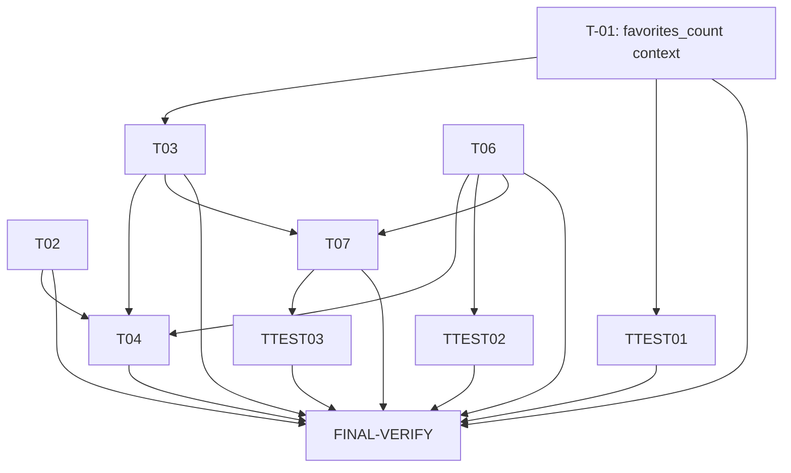

# Plan 24 — Catalog Header Auth Entry: Login/Cabinet Button + Favorites Badge

Transformation of **Spec_24** (`.ai/problems/24_catalog-header-auth-entry_spec.md`) into a
dependency-aware implementation DAG.

The catalog header (`components/header_catalog.html`) on the homepage and ad-detail pages
lacks a login entry for anonymous visitors and shows only a tiny "Cabinet" text link for
authenticated users. The PO has corrected the prior Spec-014 R-05c exclusion: a compact
icon-only auth entry (anonymous → outline user icon → `/login/issue/`; authenticated →
filled avatar/icon button with a dropdown menu) plus a heart icon with a favorites-count
badge must be added to the top-right corner, always visible (even mobile), using vanilla JS
for the dropdown (HTMX 1.9.12 has no `hx-on`).

Three conceptual tasks from the spec (T8 CSRF verify, T9 test update, T10 docs) are
**already satisfied** in the current codebase — verified during gap analysis (§2). The
remaining seven gaps (T1–T3, T4+T5 merged, T6, T7) are reorganized below into
implementation-sequenced, parallelizable tasks.

> Spec_24's conceptual tasks T1–T10 are reorganized below. Mapping:
> **T1→T-01, T2→T-02, T3→T-03, T4+T5→T-04, T6→T-06, T7→T-07, T8→verified no-op,
> T9→already-done, T10→already-done**. T-04 merges the spec's T4 (integrate includes)
> and T5 (dropdown JS) into one atomic unit: both edit `header_catalog.html` and the JS
> targets the DOM structure the includes render — splitting them would risk a broken
> intermediate state and conflicting edits to the same script block.

---

## 1. Statement of scope

Implement the auth/cabinet entry + favorites badge in the catalog header:

1. **`favorites_count` context** — extend `header_context` to expose the authenticated
   user's favorite count (for the badge); `None` for anonymous.
2. **Two new template components** — `components/header_auth_entry.html` (icon-only login
   button for anonymous; filled avatar/icon + dropdown for authenticated) and
   `components/header_favorites_badge.html` (outline heart for anonymous; filled heart +
   count badge for authenticated).
3. **Header integration** — replace the tiny text "Cabinet" link in
   `header_catalog.html`'s top-right group with the two new includes; add vanilla JS for
   the auth dropdown toggle (outside-click / Escape / selection close).
4. **`favorite_heart.html` bug fix** — replace the broken `hx-on::after-request`
   attribute (unsupported in HTMX 1.9.12) with a vanilla JS `htmx:afterRequest` listener
   that dispatches the `favorite:toggled` custom event.
5. **Optional badge auto-refresh** — a small HTMX endpoint that re-renders the badge
   fragment, triggered by the `favorite:toggled` event (Q1: PO wants "beautiful" UX;
   spec recommends implementing).

**In scope:** `apps/core/context_processors.py`, `templates/components/header_catalog.html`,
two new template includes, `templates/components/favorite_heart.html`, the optional
refresh view + URL, and tests for `favorites_count` and the `hx-on` removal.

**Out of scope:** unifying the two headers (PO V6=A), new models/migrations, dark mode,
bottom navigation, in-web notifications inbox, full settings page, guest favorites.

---

## 2. Current-state vs. gaps (verified)

| Concern | State | Evidence |
|---|---|---|
| `header_context` exposes `favorites_count` | **Gap (T-01)** | `context_processors.py:header_context` returns `bot_username`, `root_categories`, `preferred_city_display`, `cities` — no `favorites_count`. |
| `header_catalog.html` top-right group | **Gap (T-04)** | Lines 26-39: only `<a>Cabinet</a>` + place-ad + language switcher. No login button for anonymous; no heart badge. |
| `components/header_auth_entry.html` exists | **Gap (T-02)** | File not found in `templates/components/`. |
| `components/header_favorites_badge.html` exists | **Gap (T-03)** | File not found in `templates/components/`. |
| `favorite_heart.html` uses `hx-on` | **Gap (T-06)** | Line 9: `hx-on::after-request="document.dispatchEvent(new Event('favorite:toggled'))"` — unsupported in HTMX 1.9.12. |
| `User.avatar_url` exists | **Verified** | Grep for `avatar_url` in `apps/users/` → no matches. `User` extends `AbstractUser`; has `first_name`/`last_name` but no avatar field. The spec's `` guard always falls to the icon fallback. |
| `AdFavorite` related_name | **Verified** | `ads/models.py:615`: `related_name="favorites"` on `user` FK. `request.user.favorites.count()` works. |
| Badge-refresh endpoint | **Gap (T-07)** | No `favorites/count/` URL or view exists. |
| `consent:login_issue` URL | **Verified** | `users/urls.py:13`: `path("login/issue/", login_issue, name="login_issue")`, `app_name="consent"` → `/login/issue/`. |
| `consent:logout` URL | **Verified** | `users/urls.py:15`: `path("logout/", logout_view, name="logout")`; `@require_POST`, redirects to `/`. |
| Cabinet URLs | **Verified** | `cabinet/urls.py`: `cabinet:home` (``), `cabinet:favorites` (`favorites/`), `cabinet:settings` (`settings/`). |
| `ads:dashboard` URL | **Verified** | `ads/urls.py:29`: `path("dashboard/", dashboard, name="dashboard")`. |
| HTMX 1.9.12 on list/detail | **Verified — already done** | `list.html:15` and `detail.html:19`: `<script src="https://unpkg.com/htmx.org@1.9.12">`. |
| CSRF `hx-headers` on body | **Verified — already done** | `list.html:16-18`, `detail.html:21-22`: `hx-headers='{"X-CSRFToken": "{{ csrf_token }}"}'` on `<body>`. |
| `language_switcher.html` JS pattern | **Verified** | IIFE with `data-lang-switcher-toggle`/`data-lang-switcher-menu` + click/keydown listeners — the pattern to follow. |
| `header_catalog.html` script block | **Verified** | Lines 177-483: single IIFE handling autocomplete + categories + mobile + preferred-city dropdowns. Auth-dropdown JS is a new section in this block. |
| `test_auth_nav.py` assertions | **Already done** | `test_auth_nav.py:117-118, 128-129`: `assert "/login/issue/" in content` and `assert "auth-entry" in content` already present in `TestAnonymousHeader`. |
| `ui-patterns.md` documentation | **Already done** | `ui-patterns.md:215` mentions `favorites_count`; section 311-324 documents the auth entry; lines 244-245 show the `` for both new components. |
| `spec-index.md` reference | **Already done** | `spec-index.md:102`: "Shared Navigation Headers: ... now includes auth/cabinet entry + favorites badge". |
| `test_context_processors.py` | Existing tests do not set `request.user` | `header_context` is called with bare `HttpRequest()` in `SimpleTestCase`. The new `favorites_count` code must use `getattr(request, "user", None)` to avoid `AttributeError` in existing tests. |

---

## 3. Planning decisions (resolved here, not new requirements)

- **D-P1 — `favorites_count` access pattern.** The context processor must access
  `request.user` safely because existing `test_context_processors.py` tests call
  `header_context()` directly with bare `HttpRequest()` (no `user` attribute set). Use
  `getattr(request, "user", None)` and guard with `is_authenticated` — anonymous →
  `None`, authenticated → `request.user.favorites.count()` (single indexed query via
  `ad_favorites_user_created_idx`). No new context key for anonymous (the badge renders
  outline heart without a count when `favorites_count` is falsy).

- **D-P2 — `avatar_url` absence.** `User` has no `avatar_url` (verified). The spec's §6.2
  template already guards with `` and falls back to a
  filled `UserIcon` SVG. Django template attribute resolution returns `""` for unknown
  attributes, so the guard is always falsy and the icon fallback is always used. No code
  change needed — implement exactly as the spec templates.

- **D-P3 — T-04 + T-05 merged.** The spec's T4 (integrate includes) and T5 (dropdown JS)
  are merged into one task. Both edit `header_catalog.html`; the JS targets the `data-header-auth-toggle` /
  `data-header-auth-menu` attributes defined in the `header_auth_entry.html` component (T-02)
  that T-04 includes. Merging prevents a broken intermediate state where includes are present
  but the dropdown is inert (or vice-versa).

- **D-P4 — T-06 event dispatch location.** The `favorite:toggled` event dispatch moves from
  the broken `hx-on::after-request` attribute into a self-contained inline `<script>` inside
  `favorite_heart.html` itself (attached to the form element via `htmx:afterRequest`). This
  works on **all** pages that render the heart component (catalog, detail, cabinet) without
  depending on page-level scripts. The existing body-level `htmx:afterRequest` listener in
  `header_catalog.html` (for autocomplete) is untouched.

- **D-P5 — T-07 listener location.** The `favorite:toggled` → HTMX GET → badge swap listener
  (when T-07 is implemented) lives in the `header_catalog.html` script block (the badge is
  only rendered on catalog/detail pages). If T-07 is deferred, the event is dispatched but
  unlistened — harmless.

- **D-P6 — No research gate.** All architectural forks are resolved by PO decisions V1-V6
  and spec assumptions A1-A6. The implementation follows established codebase patterns
  (context processors, `` fragments, vanilla JS IIFE from `language_switcher.html`).
  No new libraries, no schema change, no shared-config/startup change. Researcher-agent
  invocation is not warranted (proportional to this low-scrutiny change set).

- **D-P7 — T-08 already done.** Both `list.html` and `detail.html` already include the HTMX
  script and `hx-headers` CSRF token on `<body>`. The `header_catalog.html` script block already
  fires `htmx:configRequest` via `document.body.addEventListener`, so any HTMX POST from the
  auth entry (e.g., logout form) has the CSRF token. No change needed.

- **D-P8 — T-09 already done.** `test_auth_nav.py` already asserts `/login/issue/` and
  `auth-entry` in the catalog header for anonymous users (lines 117-118, 128-129). No change
  needed — implementation must satisfy these existing assertions.

- **D-P9 — T-10 already done.** `ui-patterns.md` and `spec-index.md` already document the
  auth entry, favorites badge, and `favorites_count` context variable. No change needed.

---

## 4. Risk assessment & gates

| Task | Risk trigger | Severity | Gate |
|---|---|---|---|
| **T-01** | Shared context processor gains a DB query (`COUNT`) on every authenticated page render | Low-Med | None (additive key; existing keys unchanged; existing tests use `getattr` guard). Verification = T-TEST-01 + FINAL-VERIFY. |
| **T-02** | New component rendered on all catalog/detail pages; `User.avatar_url` doesn't exist (always falls back to icon) | Low | D-P2 confirms fallback. Verification = test_auth_nav assertions + FINAL-VERIFY. |
| **T-03** | New component depends on `favorites_count` from T-01 | Low | Ships after T-01. Verification = render test + FINAL-VERIFY. |
| **T-04** | Edits shared `header_catalog.html` (affects homepage + detail + search) | Low-Med | Replaces one element (text link) with two includes + JS; no structural layout change. Verification = test_auth_nav + FINAL-VERIFY. |
| **T-06** | Removes `hx-on::after-request` from a component used on catalog/detail/cabinet pages | Low | Adds inline JS listener replacing the broken attribute. Verification = T-TEST-02 + test_favorites.py still green. |
| **T-07** | New public endpoint + URL registration (optional) | Low | Purely additive; anonymous → fragment with outline heart (no count). Verification = T-TEST-03 + FINAL-VERIFY. |
| FINAL-VERIFY | Cross-cutting UI + context processor + template change | — | Dedicated multi-stage verification. |

**No task modifies shared configuration, database schema, migrations, startup, or build.**
T-01 extends an existing context processor function (purely additive dict key). No `blocked_by`
relationship is required — all tasks are low-risk follow established patterns.

---

## 5. Execution DAG

```
Level 1  (parallel — disjoint modules, no dependencies)
  ├─ T-01  Add favorites_count to header_context              [apps/core/context_processors.py]
  ├─ T-02  Create header_auth_entry.html component            [templates/components/header_auth_entry.html]
  └─ T-06  Fix favorite_heart.html hx-on bug → JS listener     [templates/components/favorite_heart.html]

Level 2  (parallel — depend on Level 1; touch disjoint files)
  ├─ T-03  Create header_favorites_badge.html component        depends_on: T-01  [templates/components/header_favorites_badge.html]
  ├─ T-TEST-01  Add favorites_count test to context_procs      depends_on: T-01  [apps/core/tests/test_context_processors.py]
  └─ T-TEST-02  Assert favorite_heart.html has no hx-on         depends_on: T-06  [apps/ads/tests/test_favorites.py]

Level 3  (parallel — depend on Level 2; disjoint files)
  ├─ T-04  Integrate includes + dropdown JS into header_catalog  depends_on: T-02, T-03  [templates/components/header_catalog.html]
  ├─ T-07  Badge refresh endpoint + favorite:toggled listener   depends_on: T-03, T-06  [cabinet, optional]
  └─ T-TEST-03  Test refresh endpoint (optional)                depends_on: T-07  [apps/cabinet/tests/]

Level 4  (verification — no production code)
  └─ FINAL-VERIFY  Regression + AC walkthrough  depends_on: T-01,T-02,T-03,T-04,T-06,T-07,T-TEST-01,T-TEST-02,T-TEST-03
```



- **T-01, T-02, T-06** share no modules → parallel at Level 1.
- **T-03** needs `favorites_count` from T-01 → Level 2.
- **T-TEST-01** exercises T-01's new key → Level 2.
- **T-TEST-02** verifies T-06's fix → Level 2.
- **T-04** includes T-02's component and T-03's badge, plus adds JS → Level 3 (depends on T-02 + T-03).
- **T-07** (optional) renders T-03's badge fragment and relies on T-06's event → Level 3.
- **T-TEST-03** (optional) exercises T-07 → Level 4.
- **FINAL-VERIFY** is gated on the entire critical path; T-07/T-TEST-03 are optional here.

---

## Task Specifications

---

### T-01 — Add `favorites_count` to `header_context` context processor

**Priority:** high
**Depends on:** — (Level 1)
**Risk:** Low-Med (additive context-processor key; adds one COUNT query for authenticated users)
**Files:**
- `src/backend/apps/core/context_processors.py` — target function `header_context`

**Semantic anchors:**
- `header_context(request) -> dict` — the function that returns the context dict
  (`bot_username`, `root_categories`, `preferred_city_display`, `cities`). Insert
  `favorites_count` computation **before** the `return` statement, alongside the existing
  `preferred_city_display` block.
- Use `getattr(request, "user", None)` to safely access the user — existing
  `test_context_processors.py` tests call `header_context()` with bare `HttpRequest()`
  (no `user` attribute).

**Changes:**
- Before the `return { ... }` block, add:
  ```python
  user = getattr(request, "user", None)
  favorites_count = None
  if user is not None and user.is_authenticated:
      favorites_count = user.favorites.count()
  ```
- Add `"favorites_count": favorites_count,` to the returned dict.
- No change to existing keys or DB queries (the `Category`/`City` imports remain inside
  the function).

**Acceptance criteria:**
- Authenticated user: `header_context(request)["favorites_count"]` == integer count of
  `AdFavorite` rows for that user.
- Anonymous user: `favorites_count` is `None`.
- Existing `test_context_processors.py` tests still pass (no `request.user` access error).
- No N+1 — single `COUNT` via the indexed `ad_favorites_user_created_idx`.
- `ruff check` + `basedpyright` pass on `apps/core/context_processors.py`.

---

### T-02 — Create `components/header_auth_entry.html`

**Priority:** high
**Depends on:** — (Level 1)
**Risk:** Low
**Files:**
- `src/backend/templates/components/header_auth_entry.html` (NEW)

**Semantic anchors:**
- New file at `templates/components/header_auth_entry.html`.
- Branching on `` (anonymous vs authenticated).
- Anonymous branch: `<a>` with `data-header-auth-entry` attribute, `aria-label="Login"`,
  linking to ``, containing an outline UserIcon SVG.
- Authenticated branch: `<button type="button" data-header-auth-toggle>` containing
  avatar/icon; a `<div data-header-auth-menu>` dropdown with menu items.

**Changes:**
- Create the component exactly per Spec_24 §6.2 (anonymous outline UserIcon →
  `/login/issue/`; authenticated button + dropdown with Cabinet → `cabinet:home`,
  My Ads → `ads:dashboard`, Favorites → `cabinet:favorites`, Settings →
  `cabinet:settings`, Logout POST+CSRF → `consent:logout`; Admin (staff only) →
  `/admin/`).
- 44×44 px touch targets (`w-11 h-11` = 44px).
- `aria-haspopup="true"`, `aria-expanded="false"` on the toggle button.
- `data-header-auth-entry` attribute on the anonymous link (satisfies the existing
  `test_auth_nav.py` assertion `assert "auth-entry" in content`).
- The dropdown `div` uses `absolute right-0 ... z-50 hidden` (below the `z-[90]` category
  dropdown, above page content — per Spec R4).

**Acceptance criteria:**
- Component exists and renders without template errors on both anonymous and
  authenticated requests.
- Anonymous renders an element with `data-header-auth-entry` and `/login/issue/`.
- Authenticated renders `data-header-auth-toggle` button + `data-header-auth-menu` div.
- Touch targets are ≥44px.

---

### T-03 — Create `components/header_favorites_badge.html`

**Priority:** high
**Depends on:** T-01 (Level 2)
**Risk:** Low
**Files:**
- `src/backend/templates/components/header_favorites_badge.html` (NEW)

**Semantic anchors:**
- New file at `templates/components/header_favorites_badge.html`.
- Branching on `` (anonymous → outline heart, no badge;
  authenticated → filled heart + `<span>` badge with `{{ favorites_count }}`).
- Authenticated heart links to ``.
- Anonymous heart links to ``.

**Changes:**
- Create the component exactly per Spec_24 §6.3.
- Authenticated: filled heart SVG + `<span class="absolute -top-1 -right-1 ...">{{ favorites_count }}</span>`
  badge (only renders when `` is truthy).
- Anonymous: outline heart SVG, no badge.
- 44×44 px touch targets (`w-11 h-11`).
- `aria-label="My favorites"` (authenticated) / `aria-label="Login to save favorites"` (anonymous).

**Acceptance criteria:**
- Component renders without errors for both anonymous and authenticated users.
- Authenticated: heart is filled; badge shows `favorites_count` when > 0; hidden when 0.
- Anonymous: heart is outline; no badge element.
- Links point to correct URLs (`cabinet:favorites` / `consent:login_issue`).

---

### T-04 — Integrate auth entry + badge includes + dropdown JS into `header_catalog.html`

**Priority:** high
**Depends on:** T-02, T-03 (Level 3)
**Risk:** Low-Med (edits the shared catalog header template on homepage + detail + search)
**Files:**
- `src/backend/templates/components/header_catalog.html`

**Semantic anchors:**
- The top-right `<div class="flex items-center gap-3">` block in `header_catalog.html`
  (lines 26-40) — currently contains only the `<a>Cabinet</a>`
  text link, the place-ad CTA, and ``.
  **Replace** the entire ``/`` block (lines 27-33) with the two new
  `` directives.
- The `<script>` IIFE in `header_catalog.html` (lines 178-483) — add a new section for the
  auth dropdown toggle, following the `language_switcher.html` pattern (data-* selectors
  + click / document-click / keydown listeners).

**Changes:**

1. **HTML** — In the top-right group `<div class="flex items-center gap-3">`, replace the
   tiny text "Cabinet" ``...`` block (lines 27-33) with:
   ```html
   <div class="flex items-center gap-2">
       
       
       <a href="https://t.me/{{ bot_username }}?start=create_ad" target="_blank" rel="noopener"
          class="px-4 py-2 bg-blue-600 text-white text-sm font-medium rounded-lg hover:bg-blue-700"
          data-place-ad>+ Подать объявление</a>
       
   </div>
   ```

2. **JS** — In the existing `<script>` IIFE, add a new section **between the preferred-city
   dropdown block (ends at line 475 `}`) and the `closeAll()` function (line 477)**. Follow
   the exact same pattern as the preferred-city dropdown (lines 435-475) and
   `language_switcher.html`:
   - `var authToggle = document.querySelector('[data-header-auth-toggle]');`
   - `var authMenu = document.querySelector('[data-header-auth-menu]');`
   - `function closeAuth() { ... }` — hides menu + resets `aria-expanded`.
   - `if (authToggle && authMenu) { ... }` — binds: toggle click (stopPropagation +
     toggle), document click outside → `closeAuth()`, `keydown` Escape → `closeAuth()` +
     focus toggle, menu click on `<a>` (selection) → `closeAuth()`.
   - Update `closeAll()` (line 477) to call `closeAuth()`:
     `function closeAll() { hide(); closeCategories(); closeCity(); closeMobile(); closeAuth(); }`
   This matches CR9 (close on outside-click, Escape, and selection) and the
   `language_switcher.html` vanilla-JS pattern.

**Acceptance criteria:**
- `header_catalog.html` top-right group renders the heart badge + auth entry includes.
- The old `<a>Cabinet</a>` text link is gone (CR11).
- Anonymous sees `/login/issue/` + `auth-entry` (satisfies `test_auth_nav.py`).
- Authenticated sees `data-header-auth-toggle` + `data-header-auth-menu`.
- Dropdown toggle opens/closes via vanilla JS (no `hx-on`); closes on outside-click,
  Escape, and selection.
- Existing place-ad CTA + language switcher remain unchanged.
- `test_auth_nav.py::TestAnonymousHeader` passes.

---

### T-06 — Fix `favorite_heart.html` `hx-on::after-request` bug

**Priority:** high
**Depends on:** — (Level 1)
**Risk:** Low (fixes a non-functional attribute that silently no-ops in HTMX 1.9.12)
**Files:**
- `src/backend/templates/components/favorite_heart.html`

**Semantic anchors:**
- The `<form>` element at line 5-9 — remove the `hx-on::after-request="..."` attribute.
- Add a self-contained `<script>` after the form that listens for `htmx:afterRequest`
  on the form and dispatches the `favorite:toggled` custom event on `document`.

**Changes:**
- Remove `hx-on::after-request="document.dispatchEvent(new Event('favorite:toggled'))"`
  from the `<form>` opening tag.
- Add a `<script>` block after `</form>` (inside the component) that:
  ```javascript
  (function () {
      'use strict';
      var form = document.currentScript.previousElementSibling;
      if (!form || form.tagName !== 'FORM') return;
      form.addEventListener('htmx:afterRequest', function () {
          document.dispatchEvent(new Event('favorite:toggled'));
      });
  })();
  ```
  This is self-contained — works on catalog, detail, and cabinet pages regardless of
  which page-level scripts are loaded.

**Acceptance criteria:**
- `hx-on` attribute is absent from the rendered `favorite_heart.html` output.
- `htmx:afterRequest` listener dispatches `favorite:toggled` event after a toggle.
- Existing `test_favorites.py` tests still pass (toggle add/remove, guest login prompt,
  404 cases).

---

### T-TEST-01 — Add `favorites_count` assertions to context processor tests

**Priority:** medium
**Depends on:** T-01 (Level 2)
**Risk:** Low
**Files:**
- `src/backend/apps/core/tests/test_context_processors.py`

**Semantic anchors:**
- Class `HeaderContextProcessorTests` — append test methods for `favorites_count`.
- The `_call_header_context` helper mocks `Category` and `City` — extend to mock the
  user relationship if needed, or pass a mock user on `HttpRequest`.

**Changes:**
- Add `test_favorites_count_none_for_anonymous`: `HttpRequest()` with no user →
  `header_context(request)["favorites_count"] is None`.
- Add `test_favorites_count_for_authenticated`: `HttpRequest()` with a mock user that
  has `favorites.count()` mocked → returns the count.

**Acceptance criteria:**
- Both new tests pass.
- Existing `HeaderContextProcessorTests` tests remain green.

---

### T-TEST-02 — Verify `favorite_heart.html` has no `hx-on` attribute

**Priority:** medium
**Depends on:** T-06 (Level 2)
**Risk:** Low
**Files:**
- `src/backend/apps/ads/tests/test_favorites.py`

**Semantic anchors:**
- Class `TestFavoriteToggle` — append a method `test_heart_template_no_hx_on`.
- Reuse the `buyer`/`seller`/`category`/`city` fixtures and `_published_ad` helper.

**Changes:**
- Add `test_heart_template_no_hx_on`: authenticated POST to
  `/favorite/{ad.id}/` → assert `"hx-on" not in resp.content.decode()`.

**Acceptance criteria:**
- Test passes (confirms the broken attribute is removed).
- `test_favorites.py` other tests still green.

---

### T-07 — Add HTMX badge-refresh endpoint + `favorite:toggled` listener (optional)

**Priority:** medium (optional — depends on Q1 resolution: spec recommends implementing)
**Depends on:** T-03, T-06 (Level 3)
**Risk:** Low (new additive endpoint; anonymous → outline heart fragment)
**Files:**
- `src/backend/apps/cabinet/views/favorites.py` (target function `favorites_list` is the sibling)
- `src/backend/apps/cabinet/urls.py` (append to `urlpatterns`)
- `src/backend/templates/components/header_catalog.html` (add `favorite:toggled` listener
  in the script IIFE)

**Semantic anchors:**
- New view function `favorites_count_badge(request)` in `cabinet/views/favorites.py`.
- Append `path("favorites/count/", favorites_count_badge, name="favorites_count")` to
  `cabinet/urls.py` `urlpatterns`.
- In `header_catalog.html` script block: add `document.addEventListener('favorite:toggled', ...)`
   that fires `htmx.get('', {target: '[data-favorites-badge]', swap: 'outerHTML'})`.

**Changes:**
1. **View** — `favorites_count_badge(request)` in `cabinet/views/favorites.py`: if user
   not authenticated, render `header_favorites_badge.html` with `favorites_count=None`
   (outline heart, no badge). If authenticated, compute
   `favorites_count = request.user.favorites.count()` and render the fragment. Return the
   rendered HTML (HTMX swaps it into the page via `outerHTML`).
2. **URL** — append `path("favorites/count/", favorites_count_badge, name="favorites_count")`
   to `cabinet/urls.py` `urlpatterns`.
3. **JS listener** — in `header_catalog.html` script block, add:
   ```javascript
   document.addEventListener('favorite:toggled', function () {
       htmx.get('', {target: '[data-favorites-badge]', swap: 'outerHTML'});
   });
   ```
   (`htmx.get()` is available in HTMX 1.9.12's utility API — no `hx-on` needed.)
4. **Badge wrapper** — wrap the badge output in `header_favorites_badge.html` with
   `<span data-favorites-badge>` so HTMX can swap the entire fragment.

**Acceptance criteria:**
- `GET /cabinet/favorites/count/` returns the `header_favorites_badge.html` fragment HTML.
- Authenticated: fragment contains the filled heart + count badge.
- Anonymous: fragment contains outline heart (no badge).
- After a favorite toggle on a catalog/detail page, the header badge updates
  automatically without a full page reload.

---

### T-TEST-03 — Test badge refresh endpoint (optional)

**Priority:** low (optional)
**Depends on:** T-07 (Level 4)
**Risk:** Low
**Files:**
- `src/backend/apps/cabinet/tests/` (new test file or append to existing)

**Semantic anchors:**
- Append a `TestFavoritesCountBadge` class to an existing cabinet test module
  (e.g., `apps/cabinet/tests/test_cabinet_sections.py`) or create
  `apps/cabinet/tests/test_favorites_badge.py`.

**Changes:**
- `test_anonymous_returns_outline_heart`: `GET /cabinet/favorites/count/` → 200,
  content contains outline heart SVG, no badge count.
- `test_authenticated_returns_filled_heart_with_count`: authenticated user with 2
  favorites → 200, content contains filled heart SVG + count "2".
- `test_refreshes_after_toggle`: create a favorite, GET badge → count 1; delete it,
  GET badge → count 0 (or outline if 0).

**Acceptance criteria:**
- All three tests pass.

---

### FINAL-VERIFY — Regression + acceptance-criteria walkthrough

**Priority:** high
**Depends on:** T-01, T-02, T-03, T-04, T-06, T-TEST-01, T-TEST-02 (optional: T-07, T-TEST-03)
**Risk:** — (verification only)

**Purpose:** Dedicated verification for the cross-cutting auth-entry + badge + template
changes across the homepage and ad-detail pages.

**Verification steps (test DB up per `.ai/context/commands.md`; run via the `test`
Compose service — never `uv run pytest` locally):**

1. **Context processor (T-01 + T-TEST-01):**
   `pytest src/backend/apps/core/tests/test_context_processors.py -v`
   — `header_context` returns `favorites_count` = integer for authenticated, `None` for
   anonymous; existing tests green.

2. **Header render (T-02 + T-03 + T-04):**
   `pytest src/backend/apps/ads/tests/test_auth_nav.py -v`
   — `TestAnonymousHeader` asserts `/login/issue/` + `auth-entry` on homepage and detail;
   `TestAuthenticatedHeader` sees Dashboard + POST Logout + no Admin (non-staff), Admin for
   staff.

3. **Favorite heart fix (T-06 + T-TEST-02):**
   `pytest src/backend/apps/ads/tests/test_favorites.py -v`
   — toggle add/remove works; `hx-on` absent from rendered heart output.

4. **Badge refresh (T-07 + T-TEST-03, optional):**
   `pytest src/backend/apps/cabinet/tests/ -v` — refresh endpoint returns correct
   fragment for anonymous (outline, no badge) and authenticated (filled + count).

5. **Static checks:**
   - `ruff check src/backend/apps/core/context_processors.py src/backend/apps/cabinet/`
   - `basedpyright src/backend/apps/core/context_processors.py src/backend/apps/cabinet/`

6. **AC walkthrough:**
   - CR1 — Anonymous sees icon-only Login button (44px, `aria-label="Login"`) → `/login/issue/`.
   - CR2 — Authenticated sees filled avatar/icon button (44px) → dropdown opens.
   - CR3 — Dropdown contains Cabinet, My Ads, Favorites, Settings, Logout (POST+CSRF);
     staff sees Admin.
   - CR4 — Heart icon with count badge alongside auth entry.
   - CR5 — Anonymous heart is outline, no badge; clicking → `/login/issue/`.
   - CR6 — Authenticated heart is filled + count badge from `request.user.favorites.count()`;
     clicking → `cabinet:favorites`.
   - CR7 — Auth entry + heart in top-right, left of language switcher; always visible on mobile.
   - CR8 — All interactive elements ≥44×44 px.
   - CR9 — Dropdown closes on outside-click, Escape, and selection (vanilla JS).
   - CR10 — Auth entry via `` component, not inline markup.
   - CR11 — Old tiny "Cabinet" text link removed.

**Exit criteria:** all targeted tests green, static checks clean, all CR1–CR11 satisfied,
no template test regressions (consent-banner guard, autocomplete template test).

---

## Notes for implementors

- **Semantic anchors only — never line numbers.** The spec's `file:line` references are for
  locating; edits use function/class/method/component names and `data-*` hook names.
- **T-08, T-09, T-10 are already done** (§2 current-state). Do not re-implement; verify during
  FINAL-VERIFY.
- **T-01 must use `getattr(request, "user", None)`** — existing `test_context_processors.py`
  calls `header_context()` with bare `HttpRequest()` (no `user` attribute set by middleware).
  Accessing `request.user` directly would raise `AttributeError` in those tests.
- **`User.avatar_url` does not exist** (verified) — the spec's §6.2 template
  `` always falls to the filled UserIcon SVG fallback. This
  is acceptable per A1 (MED confidence, fallback documented). No model change needed.
- **T-04's JS section** follows the exact `language_switcher.html` IIFE pattern: `data-*`
  selectors, `addEventListener('click')` with `stopPropagation`, document-level
  outside-click, `keydown` for Escape. Do not use `hx-on` (HTMX 1.9.12 limitation — C1).
- **HTMX on detail page** is already loaded (`detail.html:19`) — no script tag change needed.
- **CSRF** — `header_catalog.html` is rendered inside `<body hx-headers='{"X-CSRFToken": ...}'>`
  on both `list.html` and `detail.html`. The logout `<form method="post">` inside the auth
  dropdown gets `` — no additional CSRF setup required.
- **Touch targets:** components use `w-11 h-11` (44px) per CR8 / Spec R-07d — do not shrink.
- **z-index:** auth dropdown at `z-50` (below category panel `z-[90]`, above content) per R4.
- **T-07 is optional** (Q1 open, spec recommends implementing for "beautiful" UX). If deferred,
  the `favorite:toggled` event is still dispatched (T-06) but unlistened — badge updates on
  full page navigation instead.
