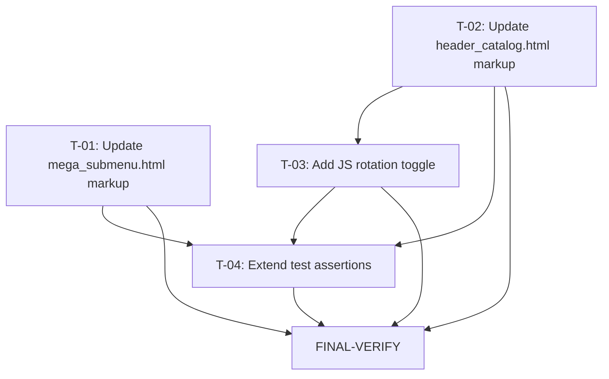

# Plan 25 — Main Menu Expand Button Redesign

Transformation of **Spec_025** (`.ai/problems/25_main-menu-navigation_spec.md`, APPROVED) into a
dependency-aware implementation DAG. Spec_022 (expand-button rendering restore) is already
applied (commit `a6b7e11`). This plan addresses the remaining UX gaps: wrong icon,
sub-44px touch target, no rotation state cue, missing `aria-controls`/`id` pairing, and
inconsistency between `mega_submenu.html` and `header_catalog.html`.

Spec_025's conceptual tasks T1–T8 are reorganized below into implementation-sequenced,
parallelizable tasks. The spec itself notes "T1–T5 can be done together as one template-edit
pass per file" — this plan honors that by grouping all per-file markup changes into single
atomic tasks, then separating the JS rotation toggle and test verification into their own
tasks for independent reviewability.

---

## 1. Statement of Scope

Four implementation tasks + one verification task. All files are Django templates and one
test module. No schema, no endpoints, no migrations, no config, no deployment changes.

**Changes:**
1. **Icon replacement** — right-chevron `▶` (`d="M9 5l7 7-7 7"`) → downward caret `▼` (`d="M5 9l7 7 7-7"`)
   in all three locations: `header_catalog.html` (desktop), `header_catalog.html` (mobile), and
   `mega_submenu.html`.
2. **180° rotation** — add `rotate-180` class toggle on the SVG in the inline JS functions
   (`loadSubmenu`, `closeBranch`, `collapsePanel`) when `aria-expanded` changes.
3. **44×44px hit area** — replace `px-2 py-2` with `p-3` + `min-w-[44px] min-h-[44px]` +
   `flex items-center justify-center` on all three expand buttons. Fix `mega_submenu.html`
   which is missing `min-h-[44px]`.
4. **`aria-controls` + container `id`** — add `aria-controls="menu-{{ cat.id }}"` (or
   `menu-{{ child.id }}`) on the button, and `id="menu-{{ cat.id }}"` (or `menu-{{ child.id }}`)
   on the submenu container `<div>` in all three locations.
5. **SVG rotation transition** — add `transition-transform duration-150` to the SVG class
   in all three locations (on the SVG, not the button — per §6.4 final revision).

**In scope:** `templates/components/header_catalog.html`, `templates/categories/partials/mega_submenu.html`,
`apps/search/tests/test_autocomplete_template.py`.

**Out of scope:** `+`/− icon (rejected per Decision_024), whole-header disclosure Approach B
(follow-up Spec_026-B), `role="tree"`/treeitem semantics (Approach C follow-up), keyboard
arrow navigation, DB schema changes, new endpoints, new models, migrations.

---

## 2. Current-State vs. Gaps (verified)

| Concern | State | Evidence |
|---|---|---|
| `header_catalog.html` desktop expand button | **Gap (T-02)** | Lines 96–102: `d="M9 5l7 7-7 7"`, `px-2 py-2 ... min-h-[44px]`, no `aria-controls`, container `<div>` at line 105 has no `id`, SVG has no `transition-transform` |
| `header_catalog.html` mobile expand button | **Gap (T-02)** | Lines 162–168: identical markup to desktop, same defects |
| `mega_submenu.html` expand button | **Gap (T-01)** | Lines 17–25: `d="M9 5l7 7-7 7"`, `px-2 py-2 ... (no min-h-[44px])`, no `aria-controls`, container `<div>` at line 28 has no `id`, SVG has no `transition-transform` |
| `loadSubmenu` JS | **Gap (T-03)** | Line 323–324: sets `aria-expanded="true"` but never adds `rotate-180` |
| `closeBranch` JS | **Gap (T-03)** | Lines 329–340: sets `aria-expanded="false"` but never removes `rotate-180` |
| `collapsePanel` JS | **Gap (T-03)** | Lines 379–382: sets `aria-expanded="false"` but never removes `rotate-180` |
| `TestExpandButtons` in `test_submenu.py` | **Verified — unaffected** | Asserts `data-category-expand` presence/absence only (attribute name unchanged by this spec) |
| `TestCatalogMenuAccordionTemplate` in `test_autocomplete_template.py` | **Verified — unaffected** | Asserts `hidden ml-4`, `closeBranch`, `collapseSiblings`, `collapseBranches` absent, `get_children.exists`, `firstof` absent — all preserved (Spec §3.5, §9.4) |
| Tailwind arbitrary-value support | **Verified** | `min-h-[44px]` already used in `header_catalog.html` (lines 44, 58, 65, 77, 163); `output.css` built via `tailwindcss -i input.css -o output.css --minify` in Dockerfile stage 1 |
| `Category` model has `id` PK | **Verified** | `apps/categories/models.py`: `Category(MPTTModel)` → `models.Model` auto-increment `id`; available in all querysets (`root_categories`, `children`) per spec §9.7 |
| `attachCategoryHandlers` on HTMX swap | **Verified** | `header_catalog.html` line 529–531: `htmx:afterSwap` listener calls `attachCategoryHandlers(e.target)` on newly injected `mega_submenu.html` content — rotation JS works on lazy-loaded nodes automatically |

---

## 3. Planning Decisions (resolved)

- **D-P1 — No research gate required.** Spec §3.6 contains HIGH-confidence NN/g/WCAG/Apple HIG
  research findings. Decision_024 resolves all PO choices (rotating caret ▼, 44×44px, aria-controls/id
  pairing, same pattern across all locations, no `+`/`−`). No architectural forks exist. No new
  libraries, no schema change, no shared-config/startup change. Researcher-agent invocation is
  not warranted (proportional to this low-scrutiny change set — mirrors D-P6 from Plan 24).

- **D-P2 — `transition-transform` placement on SVG, not button.** Spec §6.4 final revision:
  the `rotate-180` class is toggled on the SVG element, so `transition-transform duration-150`
  must be on the SVG for the animation to work. The button class omits `transition-transform`.
  This is a deviation from §6.2's earlier (revised) draft that put it on the button.

- **D-P3 — `child.id` / `cat.id` for unique IDs.** `mega_submenu.html` uses loop variable
  `child`; `header_catalog.html` uses `cat`. `aria-controls` and container `id` must use the
  same variable within each template: `menu-{{ child.id }}` in mega_submenu, `menu-{{ cat.id }}`
  in header_catalog. The spec confirms MPTT Category has an auto PK `id` in all querysets.

- **D-P4 — ID uniqueness across desktop/mobile.** Both the desktop and mobile sections of
  `header_catalog.html` iterate `root_categories` and will produce the same `id="menu-{{ cat.id }}"`
  values. This is a known pre-existing pattern (the `data-category-submenu="{{ cat.slug }}"`
  attribute is already duplicated across desktop/mobile). The JS never uses `getElementById` —
  it scopes all queries via `li.closest()` / `panel.querySelectorAll()` /
  `container.closest('li')`, so duplicate IDs are functionally harmless. ARIA `aria-controls`
  is a best-effort hint for assistive tech; the functional expand/collapse behavior is driven
  by data-attributes and DOM proximity, not ID references. This is acceptable for Spec_025's
  scope (documented for awareness; a future Approach B tree-semantics ticket can address ID
  hygiene).

- **D-P5 — CSS rebuild is deployment-time, not a task.** The `rotate-180` and
  `transition-transform` Tailwind utilities will be generated by the Dockerfile's
  `tailwindcss -i input.css -o output.css` build step (which scans `@source
  "src/backend/templates/**/*.html"`). This happens during image build — no task in this plan
  needs to trigger it. Tests are `SimpleTestCase` string assertions on template source and
  do not validate CSS.

---

## 4. Risk Assessment & Gates

| Task | Risk trigger | Severity | Gate |
|---|---|---|---|
| **T-01** | Edits `mega_submenu.html` (lazy-loaded via HTMX fetch) | Low | No schema/API/deployment. `test_submenu.py::TestExpandButtons` asserts `data-category-expand` (unchanged). Verification = T-04 + FINAL-VERIFY. |
| **T-02** | Edits `header_catalog.html` (shared on homepage + detail + search) | Low | Markup-only changes (attributes + classes + icon path). `data-category-expand`, `data-category-submenu`, `hidden ml-4` all preserved. Verification = T-04 + FINAL-VERIFY. |
| **T-03** | Adds JS `rotate-180` toggle (behavioral addition) | Low | No branching/logic changes — only `classList.add`/`classList.remove('rotate-180')` alongside existing `aria-expanded` toggles. Verification = T-04 assertion + FINAL-VERIFY. |
| **T-04** | Extends `test_autocomplete_template.py` | Low | `SimpleTestCase` (no DB). Adds methods to existing class; existing assertions unchanged. Verification = targeted test run + FINAL-VERIFY. |
| **FINAL-VERIFY** | Cross-cutting template + JS + test change | — | Full suite + lint + typecheck. |

**No task modifies shared configuration, database schema, migrations, startup behavior, build
pipeline, or public APIs.** All changes are confined to two template files and one test file.
No `blocked_by` relationship is warranted — all tasks are low-risk.

---

## 5. Execution DAG

```
Level 1  (parallel — disjoint files)
  ├─ T-01  — Update mega_submenu.html markup            [templates/categories/partials/mega_submenu.html]
  └─ T-02  — Update header_catalog.html markup (desktop + mobile)  [templates/components/header_catalog.html]

Level 2  (depends on Level 1; same file as T-02)
  └─ T-03  — Add rotation toggle in header_catalog.html inline JS   [templates/components/header_catalog.html]
            depends_on: T-02

Level 3  (depends on all implementation)
  └─ T-04  — Extend test assertions                      [apps/search/tests/test_autocomplete_template.py]
            depends_on: T-01, T-02, T-03

Level 4  (verification — no production code)
  └─ FINAL-VERIFY  — Regression + AC walkthrough
            depends_on: T-01, T-02, T-03, T-04
```



**Dependency rationale:**
- **T-01** (`mega_submenu.html`) and **T-02** (`header_catalog.html` markup) touch disjoint
  files → parallel execution.
- **T-03** edits the inline `<script>` in `header_catalog.html` — must be sequenced after T-02
  (same file). Additionally, T-03's `rotate-180` toggle animates via the `transition-transform`
  class that T-02 adds to the SVG — the two changes are functionally coupled within the same
  file.
- **T-04** asserts on the final state of all three template locations + the JS — gated on
  T-01, T-02, T-03.
- **FINAL-VERIFY** is gated on T-04 (tests written) and implicitly on all implementation
  tasks (T-01 through T-03).

---

## 6. Task Specifications

---

### T-01 — Update `mega_submenu.html` expand button markup

**Priority:** P0
**Type:** implementation
**Depends on:** — (Level 1, parallel with T-02)
**Risk:** low

**Affected file:**
- `src/backend/templates/categories/partials/mega_submenu.html`

**Semantic targets:**
- `button[type=button][data-category-expand="{{ child.slug }}"]` — the expand button inside the
  `` loop
- `svg` element (direct child of the button)
- `path` element (direct child of the svg)
- `div[data-category-submenu="{{ child.slug }}"]` — the submenu container

**Changes:**

1. **SVG path** — replace right-chevron with downward caret:
   - Old: `d="M9 5l7 7-7 7"`
   - New: `d="M5 9l7 7 7-7"`

2. **SVG class** — add rotation transition:
   - Old: `class="w-4 h-4"`
   - New: `class="w-4 h-4 transition-transform duration-150"`

3. **Button class** — enlarge hit area, add flex centering:
   - Old: `class="px-2 py-2 text-gray-400 hover:text-blue-600"`
   - New: `class="p-3 text-gray-400 hover:text-blue-600 min-w-[44px] min-h-[44px] flex items-center justify-center"`

4. **Button attribute** — add `aria-controls`:
   - Add: `aria-controls="menu-{{ child.id }}"` (after `data-category-expand="{{ child.slug }}"`)

5. **Container attribute** — add `id`:
   - Old: `<div class="hidden ml-4" data-category-submenu="{{ child.slug }}">`
   - New: `<div id="menu-{{ child.id }}" class="hidden ml-4" data-category-submenu="{{ child.slug }}">`

**Insertion points (semantic anchors):**
- `aria-controls` inserted into the `<button>` tag, after the `data-category-expand` attribute
- `id` inserted into the `<div>` tag, before the `class` attribute

**Acceptance criteria:**
- `d="M5 9l7 7 7-7"` present in `mega_submenu.html` exactly once
- `d="M9 5l7 7-7 7"` absent from `mega_submenu.html`
- `aria-controls="menu-{{ child.id }}"` present on the expand button
- `id="menu-{{ child.id }}"` present on the submenu container div
- `transition-transform duration-150` present on the SVG class
- `min-w-[44px] min-h-[44px]` present on the button class
- `px-2 py-2` absent from `mega_submenu.html`
- `class="hidden ml-4"` on the container div preserved (Spec §3.5, §9.4)

---

### T-02 — Update `header_catalog.html` expand button markup (desktop + mobile)

**Priority:** P0
**Type:** implementation
**Depends on:** — (Level 1, parallel with T-01)
**Risk:** low

**Affected file:**
- `src/backend/templates/components/header_catalog.html`

**Semantic targets — two locations (two `` blocks):**
1. **Desktop:** inside `[data-categories-panel]` > `li[data-category-slug]` — button at
   `~line 96` and container div at `~line 105`
2. **Mobile:** inside `[data-mobile-categories-panel]` > `li[data-category-slug]` — button at
   `~line 162` and container div at `~line 171`

Both use loop variable `cat` (from ``).

**Changes** (identical in both desktop and mobile sections):

1. **SVG path** — `d="M9 5l7 7-7 7"` → `d="M5 9l7 7 7-7"`
2. **SVG class** — `class="w-4 h-4"` → `class="w-4 h-4 transition-transform duration-150"`
3. **Button class** — `class="px-2 py-2 text-gray-400 hover:text-blue-600 min-h-[44px]"` →
   `class="p-3 text-gray-400 hover:text-blue-600 min-w-[44px] min-h-[44px] flex items-center justify-center"`
4. **Button attribute** — add `aria-controls="menu-{{ cat.id }}"` (after `data-category-expand="{{ cat.slug }}"`)
5. **Container attribute** — add `id="menu-{{ cat.id }}"` to `<div class="hidden ml-4" data-category-submenu="{{ cat.slug }}">`

**Insertion points (semantic anchors):**
- Desktop button: inside the `` block within
  `[data-categories-panel]`
- Mobile button: inside the `` block within
  `[data-mobile-categories-panel]`
- `aria-controls` inserted into each `<button>`, after `data-category-expand`
- `id` inserted into each `<div>`, before `class`

**Acceptance criteria:**
- `d="M5 9l7 7 7-7"` present in `header_catalog.html` exactly twice (desktop + mobile)
- `d="M9 5l7 7-7 7"` absent from `header_catalog.html`
- `aria-controls="menu-{{ cat.id }}"` present on both expand buttons
- `id="menu-{{ cat.id }}"` present on both submenu container divs
- `transition-transform duration-150` present on both SVGs
- `min-w-[44px] min-h-[44px]` present on both buttons
- `px-2 py-2` absent from `header_catalog.html` (all occurrences replaced)

---

### T-03 — Add rotation class toggle in `header_catalog.html` inline JS

**Priority:** P0
**Type:** implementation
**Depends on:** T-02 (same file — template markup must be applied first for the SVG
  that receives `transition-transform` to exist; also avoids conflicting edits to the
  same `<script>` block)
**Risk:** low

**Affected file:**
- `src/backend/templates/components/header_catalog.html`

**Semantic targets (three functions in the inline `<script>` IIFE):**
- `function loadSubmenu(container)` — add `rotate-180` when branch opens
- `function closeBranch(container)` — remove `rotate-180` when branch closes
- `function collapsePanel(panel)` — remove `rotate-180` when panel collapses

**Changes:**

1. **`loadSubmenu`** — after the existing line
   `var expand = li.querySelector('[data-category-expand]');`, and inside the `if (expand)`
   block, after `expand.setAttribute('aria-expanded', 'true')`, add:
   ```javascript
   var svg = expand.querySelector('svg');
   if (svg) svg.classList.add('rotate-180');
   ```

2. **`closeBranch`** — inside the `forEach` callback that iterates
   `li.querySelectorAll('[data-category-expand]')`, after
   `b.setAttribute('aria-expanded', 'false')`, add:
   ```javascript
   var svg = b.querySelector('svg');
   if (svg) svg.classList.remove('rotate-180');
   ```

3. **`collapsePanel`** — inside the `forEach` callback that iterates
   `panel.querySelectorAll('[data-category-expand]')`, after
   `b.setAttribute('aria-expanded', 'negative')`, add:
   ```javascript
   var svg = b.querySelector('svg');
   if (svg) svg.classList.remove('rotate-180');
   ```

**Insertion points (semantic anchors):**
- `loadSubmenu`: insert after `expand.setAttribute('aria-expanded', 'true')`
- `closeBranch`: insert after `b.setAttribute('aria-expanded', 'false')` (inside the
  `.forEach` body, within the `if (li) { ... }` block)
- `collapsePanel`: insert after `b.setAttribute('aria-expanded', 'false')` (inside the
  `.forEach` body)

**Acceptance criteria:**
- `classList.add('rotate-180')` present in `loadSubmenu` (exactly once)
- `classList.remove('rotate-180')` present in `closeBranch` (exactly once)
- `classList.remove('rotate-180')` present in `collapsePanel` (exactly once)
- `rotate-180` substring count in `header_catalog.html` inline script: 3 (1 add + 2 remove)
- No existing JS logic modified — `aria-expanded` toggling and `hidden` class toggling
  remain identical (Spec R-08)
- `attachCategoryHandlers(e.target)` on `htmx:afterSwap` (line ~529) remains unchanged —
  lazy-loaded `mega_submenu.html` content inherits rotation behavior automatically

**Notes:**
- `querySelector('svg')` targets the SVG element regardless of its `d` attribute value —
  the icon path change (T-01/T-02) is not a prerequisite for the JS to function. However,
  the `transition-transform duration-150` CSS class on the SVG (added in T-01/T-02) is
  required for the rotation to animate smoothly rather than snapping.
- The `rotate-180` class is a standard Tailwind utility (`transform: rotate(180deg)`).

---

### T-04 — Extend test assertions in `test_autocomplete_template.py`

**Priority:** P1
**Type:** test
**Depends on:** T-01, T-02, T-03
**Risk:** low

**Affected file:**
- `src/backend/apps/search/tests/test_autocomplete_template.py`

**Semantic target:**
- Class `TestCatalogMenuAccordionTemplate` — append new test methods. This class already
  loads `self.header_content` and `self.submenu_content` in `setUpClass` via
  `Path.read_text()`, so no new file reads are needed.

**New test methods** (all `SimpleTestCase` — no DB required, consistent with existing pattern):

1. `test_downward_caret_in_header` — assert `d="M5 9l7 7 7-7"` in `self.header_content`;
   assert `d="M9 5l7 7-7 7"` not in `self.header_content`
2. `test_downward_caret_in_submenu` — assert `d="M5 9l7 7 7-7"` in
   `self.submenu_content`; assert `d="M9 5l7 7-7 7"` not in `self.submenu_content`
3. `test_expand_button_has_aria_controls` — assert `aria-controls="menu-{{` in both
   `self.header_content` and `self.submenu_content`
4. `test_submenu_container_has_id` — assert `id="menu-{{` in both `self.header_content`
   and `self.submenu_content`
5. `test_expand_button_meets_44px_hit_area` — assert `min-w-[44px]` in both content
   strings; assert `px-2 py-2` not in either
6. `test_svg_has_rotation_transition` — assert `transition-transform` in both
   `self.header_content` and `self.submenu_content`
7. `test_js_rotation_toggle_present` — assert `classList.add('rotate-180')` in
   `self.header_content`; assert `classList.remove('rotate-180')` in
   `self.header_content`

**Insertion point:** After the existing `test_breadcrumb_uses_safe_last_element_access`
method (last method in `TestCatalogMenuAccordionTemplate`, ~line 153).

**Acceptance criteria:**
- All 7 new test methods pass
- All existing test methods in `TestCatalogMenuAccordionTemplate` and `TestAutocompleteTemplate`
  remain green (no assertions removed or modified)
- `test_submenu.py::TestExpandButtons` (6 endpoint tests) still pass

**Test command:**
```bash
docker compose --project-name mko-bazuna-test -f docker-compose.yml -f docker-compose.test.yml run --rm test \
  -e PYTEST_OPTS="--create-db src/backend/apps/search/tests/test_autocomplete_template.py -v"
```

---

### FINAL-VERIFY — Regression + acceptance-criteria walkthrough

**Priority:** P0
**Type:** verification
**Depends on:** T-01, T-02, T-03, T-04

**Pre-flight check:**
```bash
docker ps --filter "name=mko-bazuna-test-db-" --filter "status=running"
```
If not running:
```bash
docker compose --project-name mko-bazuna-test -f docker-compose.yml -f docker-compose.test.yml up -d db
```

**Verification steps:**

1. **Lint (Python — only the test file is Python):**
   ```bash
   uv run ruff check src/backend/apps/search/tests/test_autocomplete_template.py
   ```

2. **Type check (Python):**
   ```bash
   uv run basedpyright src/backend/apps/search/tests/test_autocomplete_template.py
   ```

3. **Targeted tests (template assertions + submenu endpoint):**
   ```bash
   docker compose --project-name mko-bazuna-test -f docker-compose.yml -f docker-compose.test.yml run --rm test \
     -e PYTEST_OPTS="--create-db src/backend/apps/search/tests/test_autocomplete_template.py src/backend/apps/categories/tests/test_submenu.py -v"
   ```

4. **Full test suite (regression):**
   ```bash
   docker compose --project-name mko-bazuna-test -f docker-compose.yml -f docker-compose.test.yml run --rm test
   ```

5. **AC walkthrough (template-source):**
   - AC-01: `d="M5 9l7 7 7-7"` present in both `header_catalog.html` and `mega_submenu.html`;
     `d="M9 5l7 7-7 7"` absent from both
   - AC-02: `classList.add('rotate-180')` and `classList.remove('rotate-180')` present in
     `header_catalog.html` inline script
   - AC-03: `min-w-[44px] min-h-[44px]` present on all expand buttons; `px-2 py-2` absent
   - AC-04: `aria-controls="menu-{{ ... }}"` on buttons; `id="menu-{{ ... }}"` on containers
   - AC-05: `transition-transform duration-150` on all three SVGs
   - AC-06: All tests in `test_submenu.py` (6) and `test_autocomplete_template.py` pass
   - AC-07: Full test run exits 0, no `ValueError`/template exceptions
   - AC-08: Same SVG path + classes in desktop, mobile, and mega_submenu
   - AC-09: No `+`/− icon; right-chevron path absent from all templates

**Pass criteria:**
- Lint: no errors
- Typecheck: no new issues
- Targeted tests: all green
- Full suite: exits 0
- All AC-01 through AC-09 satisfied

---

## 7. Acceptance Criteria Mapping

| AC | Requirement | Task(s) |
|---|---|---|
| AC-01 | Downward caret `▼` in all 3 locations | T-01, T-02 |
| AC-02 | 180° rotation on expand | T-03 |
| AC-03 | ≥44×44px hit area | T-01, T-02 |
| AC-04 | `aria-controls` + container `id` match | T-01, T-02 |
| AC-05 | SVG rotation transition | T-01, T-02 |
| AC-06 | Existing tests pass | FINAL-VERIFY |
| AC-07 | No template exceptions | FINAL-VERIFY |
| AC-08 | Consistent icons across desktop + mobile | T-01, T-02 |
| AC-09 | No `+`/`−` icon; right-chevron absent | T-01, T-02 |

---

## 8. Constraints Preserved (from Spec §9)

- `data-category-expand` and `data-category-submenu` attribute names unchanged (JS + tests depend on them)
- `hidden` class on submenu container unchanged (`class="hidden ml-4"`)
- `test_submenu.py` endpoint tests unchanged — `/categories/<slug>/submenu/` still returns 200/404
- `test_autocomplete_template.py` existing substring assertions preserved (`get_children.exists`,
  `closeBranch`, `collapseSiblings`, `collapseBranches` absent, `hidden ml-4`,
  `data-category-submenu`, `firstof` absent, ``)
- `cat.id` / `child.id` used for `id` attribute (MPTT PK, safe per §9.7)
- `aria-controls` references match `id` exactly (§9.8)
- `rotate-180` is a standard Tailwind utility class (no custom CSS)
- All styling via Tailwind utility classes (no custom CSS — Spec §9.2)

---

## 9. Rollback Plan

Each task is a template/JS/test-only change with no DB or config impact:

- **T-01:** Revert `mega_submenu.html` — restore `d="M9 5l7 7-7 7"`, remove `transition-transform`
  from SVG, revert button class to `px-2 py-2 text-gray-400 hover:text-blue-600`, remove
  `aria-controls`, remove `id` from container.
- **T-02:** Revert `header_catalog.html` desktop + mobile markup — same reverts.
- **T-03:** Revert JS — remove `classList.add('rotate-180')` from `loadSubmenu`, remove
  `classList.remove('rotate-180')` from `closeBranch` and `collapsePanel`.
- **T-04:** Delete the 7 new test methods from `TestCatalogMenuAccordionTemplate`.
- **FINAL-VERIFY:** N/A (verification only).

No migrations, no restarts, no data changes required for rollback. Revert in reverse order:
T-04 → T-03 → T-02 → T-01.

---

## 10. Spec-to-Plan Task Mapping

The spec's 8 conceptual tasks (T1–T8) are reorganized into 4 implementation tasks + 1
verification task. All spec requirements (R-01–R-08) and acceptance criteria (AC-01–AC-09)
are preserved.

| Spec Task | Mapped To | Rationale |
|---|---|---|
| T1 (mega_submenu icon) | T-01 | Merged with T4, T5, T6 (id+aria, sizing, aria-controls) — all in the same template block; one edit pass |
| T2 (header_catalog desktop icon) | T-02 | Merged with T3 (mobile), T4, T5, T6 — same file, same pattern |
| T3 (header_catalog mobile icon) | T-02 | Parallel section in same file; one edit pass per file per spec note |
| T4 (id + aria-controls) | T-01, T-02 | Same template blocks as icon/class changes — grouped per file |
| T5 (sizing) | T-01, T-02 | Same template blocks — grouped per file |
| T6 (JS rotation) | T-03 | Separate concern (behavior vs. markup); same file as T-02's template → sequenced after T-02 |
| T7 (tests) | T-04 | Extended to cover all ACs; SimpleTestCase string assertions |
| T8 (verification) | FINAL-VERIFY | Full suite + lint + typecheck + AC walkthrough |
