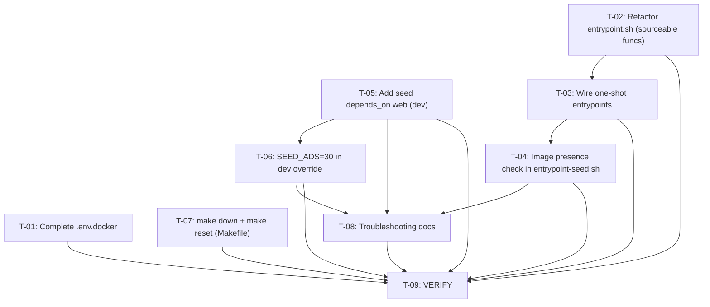

# Plan 28 — Seed Photos Missing After Docker Recreation — DONE

## Implementation Summary

All eight implementation tasks (T-01–T-08) are implemented. The plan's key constraint — **no
database schema/migration changes and no Python source changes** — is honored: every modification is
Docker Compose, bash entrypoint, `.env.docker`, Makefile, or documentation.

**Validation performed (T-09 — static gates, all passing):**

| Gate | Check | Result |
|---|---|---|
| T-01 | `docker compose --env-file .env.docker config` | exit 0 — no unresolvable variables |
| T-01/FR07 | `.env.docker` contains `REDIS_URL`, `SITE_URL`, `SEED_USERS`, `SEED_ADS`, `IMMEDIATE_ALERTS_ENABLED`, `FIX_PERMISSIONS` | all 6 present |
| T-02 | `bash -n docker/entrypoint.sh` | pass |
| T-02 | `BASH_SOURCE[0]` guard wraps exec block; `web`/`migrate` Dockerfile ENTRYPOINT unchanged | confirmed |
| T-03 | `bash -n` on `entrypoint-seed.sh`, `entrypoint-catalog.sh`, `entrypoint-create-admin.sh` | all pass |
| T-03/T-04 | `entrypoint-seed.sh` sources `entrypoint.sh`, calls the 4 shared functions, then performs the JPEG presence check | confirmed; `ADMIN_PASSWORD` skip logic preserved in create-admin |
| T-04/FR06 | `find "$FIXTURES_IMAGES_DIR" -maxdepth 1 -name '*.jpg' -o -name '*.jpeg' -o -name '*.png' \| wc -l` on the 1,046 local fixtures | returns 1046 → check proceeds correctly (exit code would be 1 only when 0 found) |
| T-04 | Import `from apps.seed.paths import FIXTURES_IMAGES_DIR` resolves in-container (Dockerfile sets `PYTHONPATH=/app/src:/app/src/backend`) | confirmed via code inspection; `paths.py` is Django-free |
| T-05 | `docker compose -f docker-compose.yml -f docker-compose.dev.override.yml config` → `web.depends_on` includes `load_catalog`, `redis`, **and `seed`** (`condition: service_completed_successfully`) | confirmed |
| T-05/NFR02 | `docker compose -f docker-compose.yml -f docker-compose.prod.yml config --quiet` → `web` has **no** `seed` dependency; base `seed` retains `profiles: ["seed"]` (profile-gated, absent from default config output) | confirmed; `docker-compose.yml`/`docker-compose.prod.yml` unmodified |
| T-06 | dev `seed.environment` resolves to `SEED_ADS=30` and `SEED_USERS=10` | confirmed |
| T-07 | `down` target preserved (no `-v`); new `reset` target = `down -v --remove-orphans`; `clean` unchanged; `reset` in `.PHONY` | confirmed (Makefile inspected) |
| T-08 | `docs/ops/seed-workflow.md` "Troubleshooting: Missing Photos" section added; CLI flags (`--all`, `--validate`, `--validate --fix=cleanup`) verified against `scripts/download_seed_photos.py` docstring | confirmed |
| T-09/T1 | `docker compose config --quiet` for dev, combined (dev+prod), and prod-only override layers | all exit 0 |

**Runtime gates (T-09 steps 2–6, 8–9) not exercised in this session:** the shared dev stack is stale
(started pre-plan — its `seed` ran with `SEED_ADS=600` and `web` has no `seed` dependency), and
`make`/`make -n`/`make clean && make up` were intentionally **not** run so as not to disrupt the
actively-used shared environment. Additionally `make` is not installed in this environment. The
implementation is therefore validated via static analysis (compose config, `bash -n`, env completeness,
prod inspection) and code inspection of the serving chain and import-path resolution.

**Out of scope (per spec §10) — not modified:** production seed (remains profile-gated), JPEG fixture
distribution/`.gitignore`, CI/CD, image regeneration, seed algorithm, and all `AdImage`/`media_gate`/template
changes.


Transformation of **Spec_27** (`.ai/problems/27_seed-docker-recreation-missing-photos_spec.md`, APPROVED) into a
dependency-aware implementation DAG. The spec identifies **two independent root causes** working together —
a **startup race condition** (`web` serves before `seed` copies images to `media_volume`) and an **entrypoint
bypass** (one-shot services `seed`, `load_catalog`, `create_admin` skip `entrypoint.sh`'s DB-readiness and
volume-permission fixes) — plus several latent issues (`.env.docker` incompleteness, no fixture-image
presence guard, no volume-preserving `make down`, no recovery documentation).

> **Key constraint:** this plan contains **no database schema or migration changes** and **no Python source
> changes**. All modifications are Docker Compose files, bash entrypoint scripts, an env-file, the Makefile,
> and documentation. The image serving chain (`media_gate` → `MEDIA_ROOT/seed/`) is verified correct by the
> spec's research (§5.5); no view/model/template changes are needed.

The seven conceptual tasks (Task 1–Task 7) from the spec are reorganized below into implementation-sequenced,
parallelizable tasks. Key reorganizations:

- **Spec Task 2 (entrypoint unification) → two tasks (T-02, T-03).** T-02 is the high-risk shared-config
  refactor of `entrypoint.sh` itself (must remain backward-compatible for `web`/`migrate`). T-03 is the
  safer consumer-side change (wire the three one-shot entrypoints to source and call the shared functions).
  Splitting isolates the shared-config risk in T-02 from the consumer changes in T-03.
- **Spec Task 1 (web depends_on seed) and Task 4 (reduce dev ads) → T-05, T-06.** Both touch
  `docker-compose.dev.override.yml` but different sections; T-06's value (shorter `web` startup delay) only
  materializes after T-05, so T-06 is sequenced after T-05.
- **Spec Task 3 (image presence check) → T-04.** Depends on T-03 because both modify
  `entrypoint-seed.sh`; T-03 establishes the sourced-function structure that T-04 inserts into.
- **Spec Task 6 (Makefile `down`/`reset`) → T-07.** Independent — `Makefile` only.

---

## 1. Statement of Scope

Eight implementation tasks + one verification task. Touches: Docker Compose files (`docker-compose.dev.override.yml`,
`.env.docker`), bash entrypoint scripts (`docker/entrypoint.sh`, `docker/entrypoint-seed.sh`,
`docker/entrypoint-catalog.sh`, `docker/entrypoint-create-admin.sh`), `Makefile`, and documentation
(`docs/ops/seed-workflow.md`).

**Changes:**
1. **T-01** — Complete `.env.docker` with all missing dev/prod variables (`REDIS_URL`, `SITE_URL`,
   `SEED_USERS`, `SEED_ADS`, `IMMEDIATE_ALERTS_ENABLED`, `FIX_PERMISSIONS`).
2. **T-02** — Refactor `entrypoint.sh` to guard its execution block behind a direct-execution check so its
   four setup functions (`check_env_file`, `fix_volume_permissions`, `wait_for_db`, `wait_for_redis`)
   become sourceable without changing behavior for `web`/`migrate`.
3. **T-03** — Update `entrypoint-seed.sh`, `entrypoint-catalog.sh`, `entrypoint-create-admin.sh` to source
   `entrypoint.sh` and call the shared setup functions before their respective commands.
4. **T-04** — Add a fixture-JPEG presence check to `entrypoint-seed.sh` (clear warning + non-zero exit when
   `FIXTURES_IMAGES_DIR` has no `.jpg` files).
5. **T-05** — Add `seed` as a `depends_on` with `condition: service_completed_successfully` on the `web`
   service in the dev override only (base `docker-compose.yml` untouched — production seed stays
   profile-gated).
6. **T-06** — Set `SEED_ADS=30` and `SEED_USERS=10` for the `seed` service in the dev override, cutting
   dev seed time from ~60s to ~5–10s (NFR01).
7. **T-07** — Add `make reset` (destroys volumes) and clarify `make down` (preserves volumes) in the
   Makefile, with updated help text.
8. **T-08** — Add a "Troubleshooting: Missing Photos" section to `docs/ops/seed-workflow.md` covering
   JPEG verification, download, validation, re-seed, and media-volume inspection.
9. **T-09** — VERIFY: Docker Compose config validation + full dev startup + reproduction flow
   (`make clean && make up`, `make down && make up`, `make reset && make up`).

**In scope (files):**
- `.env.docker`
- `docker/entrypoint.sh`
- `docker/entrypoint-seed.sh`
- `docker/entrypoint-catalog.sh`
- `docker/entrypoint-create-admin.sh`
- `docker-compose.dev.override.yml`
- `Makefile`
- `docs/ops/seed-workflow.md`

**Out of scope (per spec §10):** production seed behavior (stays profile-gated), `.gitignore` changes to track
JPEG fixtures, CI/CD pipeline changes, image regeneration, performance optimization of the seed algorithm,
any `AdImage`/`media_gate`/template changes (serving chain is correct), and Jinja fallback-image logic.

---

## 2. Current-State vs. Gaps (verified)

| Concern | State | Evidence (from codebase inspection) |
|---|---|---|
| `web` waits for `seed` in dev mode | **Gap** — no `depends_on: seed` on `web` in dev override | `docker-compose.dev.override.yml`: `web` has no `depends_on` block; base `docker-compose.yml` `web` also has none to `seed` |
| `web` waits for `seed` in prod | **Correct — do not change** | `docker-compose.prod.yml` has no `seed` → `web` dependency; prod seed is `--profile seed` opt-in (D1) |
| One-shot entrypoints call `entrypoint.sh` setup | **Gap** — all three bypass setup | `entrypoint-seed.sh` (L5–9): `exec uv run python ... seed`; `entrypoint-catalog.sh` (L5–7): `exec uv run python ... load_catalog`; `entrypoint-create-admin.sh` (L5–17): `exec uv run python ... create_admin_user` — none source `entrypoint.sh` |
| `entrypoint.sh` functions are sourceable | **Gap** — bottom block runs on source | `entrypoint.sh` L71–75 runs `check_env_file` / `fix_volume_permissions` / `wait_for_db` / `wait_for_redis` / `exec "$@"` unconditionally; sourcing would execute these in the caller and `exec` would hijack the process |
| `media_volume` permissions fix on fresh volume | **Gap for one-shot services** | `fix_volume_permissions` only runs via `entrypoint.sh`; one-shot entrypoints never call it → `PermissionError` on fresh `media_volume` (FR04) |
| DB readiness wait for one-shot services | **Gap** | `wait_for_db` only runs via `entrypoint.sh` (or inline duplicate in `entrypoint-test.sh`); one-shot entrypoints skip it → silent failures if DB not ready (FR03) |
| `.env.docker` completeness | **Gap** — 6 variables missing | `.env.docker` (28 lines) lacks `REDIS_URL`, `SITE_URL`, `SEED_USERS`, `SEED_ADS`, `IMMEDIATE_ALERTS_ENABLED`, `FIX_PERMISSIONS`; all present in `.env.docker.example` (73 lines) |
| Seed image presence guard | **Gap** — no pre-flight check | `entrypoint-seed.sh` runs `manage.py seed` unconditionally; if JPEGs are gitignored/missing, seed silently produces ads with zero images (FR06) |
| `make down` preserves volumes | **Already correct** — `down` runs `docker compose down` (no `-v`) | `Makefile` L71–72: `down: docker compose $(COMPOSE_FILES) down` — preserves `media_volume` |
| Destructive container reset | **Gap** — no clearly-named destructive target | `make clean` (L200–201) destroys volumes via `down -v`, but help text (L33) only says "Stop and remove containers" with no volume-disposal disclosure; no `make reset` alias |
| Recovery documentation | **Gap** | `docs/ops/seed-workflow.md` covers download/seed/serve pipeline but has no "Missing Photos" troubleshooting section |
| Seed dev ad count | **Gap** — 600 ads takes ~60s | `docker-compose.dev.override.yml` seed service inherits `SEED_ADS=${SEED_ADS:-600}` from base; no dev override to reduce it |

---

## 3. Planning Decisions (resolved)

All six Product Owner decisions (D1–D6) from spec §4 are adopted as-is:

- **D1 — Dev-only `web` → `seed` dependency.** Add `seed` to `web`'s `depends_on` in
  `docker-compose.dev.override.yml` only. Do **not** add to base `docker-compose.yml` or
  `docker-compose.prod.yml` (production seed stays profile-gated, D2/NFR02).
- **D2 — Reduce dev seed ads to 30.** Set `SEED_ADS=30` and `SEED_USERS=10` in the dev override
  `seed` service environment. Production retains `${SEED_ADS:-600}` via base compose.
- **D3 — Source shared entrypoint functions.** Refactor `entrypoint.sh` to expose
  `check_env_file`, `fix_volume_permissions`, `wait_for_db`, `wait_for_redis` as sourceable functions
  (guarded so the bottom execution block only runs when the script is executed directly, not sourced).
  One-shot entrypoints source `entrypoint.sh` and call the functions explicitly.
- **D4 — `make clean` stays destructive; `make down` preserves volumes.** Add `make reset` as a clearly
  named destructive alias; update help text to disclose volume behaviour.
- **D5 — Seed image presence check.** If no `.jpg` files in `FIXTURES_IMAGES_DIR`, print a clear warning
  with recovery instructions and exit non-zero.
- **D6 — Complete `.env.docker`.** Add all missing variables from `.env.docker.example`. Do **not** add
  `REGISTRY`/`REPOSITORY`/`IMAGE_TAG` (they have inline defaults in prod compose).

**Additional decisions made during planning:**

- **D-P1 — Split spec Task 2 into T-02 (refactor) + T-03 (wire consumers).** The entrypoint.sh refactor
  touches the shared startup path used by `web` and `migrate`; isolating it as its own task (with a
  backward-compatibility guard) keeps the blast radius reviewable and lets T-03 be reviewed/tested separately.
- **D-P2 — Current `make down` already preserves volumes.** The spec's Task 6 description assumes
  `make down` destroys volumes, but the current Makefile's `down` target already runs `docker compose down`
  without `-v`. T-07 therefore adds a `make reset` destructive alias + clarifies help text rather than
  renaming an existing destructive target.
- **D-P3 — `.env.docker` is a soft prerequisite, not a hard dependency.** Compose files use inline
  defaults (`${SEED_ADS:-600}`, `${SITE_URL:-http://localhost:8000}`), so T-01's completion is not a
  blocking dependency for T-05/T-06. T-01 is at Level 1 and runs in parallel.
- **D-P4 — No dedicated unit/integration test tasks.** All changes are Docker/bash/Makefile/docs. No
  Python source is modified, so pytest tasks are not applicable. Verification is operational (T-09):
  `docker compose config` + `make clean && make up` + `make down && make up` + `make reset && make up`.
- **D-P5 — Entrypoint refactor is backward-compatible by construction.** The `BASH_SOURCE[0]` guard
  pattern ensures `entrypoint.sh` behaves identically when executed directly (as now) and only exposes
  functions when sourced. `web` and `migrate` are unchanged.

---

## 4. Risk Assessment & Gates

| Task | Risk trigger | Severity | Gate |
|---|---|---|---|
| **T-01** | Completes `.env.docker` config file | Low | Diff review: confirm 6 variables added; compose files still parse |
| **T-02** | Modifies shared `entrypoint.sh` + changes startup behavior for `web`/`migrate` | **High** | Backward-compatibility guard (`BASH_SOURCE[0]` check); `docker compose config` validates; T-09 smoke-check confirms `web` and `migrate` still boot |
| **T-03** | Changes startup behavior for 3 one-shot services | Medium | T-09 verifies `load_catalog`/`seed`/`create_admin` run end-to-end in dev |
| **T-04** | Adds exit-on-missing-images to `entrypoint-seed.sh` | Low | T-09 confirms seed proceeds when JPEGs present; manual check when absent |
| **T-05** | Dev-only compose `depends_on` change | Low | `docker compose config` validates; prod compose (`docker-compose.prod.yml`) inspected to confirm no `seed` → `web` dep |
| **T-06** | Dev-only env var override | Low | `docker compose config` shows `SEED_ADS=30`; `make up` startup time ≤ 120s (NFR01) |
| **T-07** | Makefile target add/rename | Low | `make -n down` and `make -n reset` syntax-check; help text updated |
| **T-08** | Documentation only | Low | Content reviewed against steps in T-01–T-07 |
| **T-09** | Verification only | — | All gates below |

**High-risk task handling:** T-02 is the single task that modifies the shared entrypoint. It is **not
blocked** by a prerequisite research task because the research is already complete and incorporated into
the approved spec (§5.2 "Entrypoint Bypass" + D3 decision). The state is verified by direct inspection of
all four entrypoint scripts. The backward-compatibility guard ensures zero behavioral change for
`web`/`migrate`, and T-09 includes an explicit smoke-check gate. A fresh Researcher pass is **not**
needed — the bash `BASH_SOURCE[0]` pattern is a well-established idiom and requires no external library or
framework consideration.

---

## 5. Execution DAG

```
Level 1  (parallel — disjoint files, no interdependencies)
  ├─ T-01  Complete .env.docker (6 missing variables)        [.env.docker]
  ├─ T-02  Refactor entrypoint.sh to expose sourceable funcs  [docker/entrypoint.sh]
  ├─ T-05  Add seed depends_on: web (dev override)            [docker-compose.dev.override.yml]
  └─ T-07  Add make reset + clarify make down (Makefile)      [Makefile]

Level 2  (parallel — disjoint files, each chained from its Level 1 anchor)
  ├─ T-03  Wire one-shot entrypoints to source shared funcs   [entrypoint-seed/catalog/create-admin.sh]  dep: T-02
  └─ T-06  Set SEED_ADS=30 + SEED_USERS=10 (dev override)     [docker-compose.dev.override.yml]          dep: T-05

Level 3  (sequential — same file as T-03)
  └─ T-04  Add seed image presence check to entrypoint-seed.sh [docker/entrypoint-seed.sh]              dep: T-03

Level 4  (depends on completed fixes for accurate docs)
  └─ T-08  Add Troubleshooting: Missing Photos to seed-workflow.md [docs/ops/seed-workflow.md]         dep: T-04, T-05, T-06

Level 5  (verification — no production code)
  └─ T-09  VERIFY: docker compose config + startup + reproduction [all files]                         dep: T-01..T-08
```



**Dependency rationale:**
- **T-01, T-02, T-05, T-07 touch disjoint files** (`.env.docker`; `entrypoint.sh`;
  `docker-compose.dev.override.yml`; `Makefile`) → parallel execution at Level 1.
- **T-03 depends on T-02**: one-shot entrypoints source `entrypoint.sh` and call its now-exposed
  functions; the sourceable guard must be in place first.
- **T-04 depends on T-03**: both modify `entrypoint-seed.sh`; T-03 establishes the sourced-function
  structure that T-04 inserts its image-presence check into (avoids conflicting edits on the same file).
- **T-06 depends on T-05**: both modify `docker-compose.dev.override.yml`; T-06's value (shorter `web`
  startup delay) only materializes after T-05 makes `web` wait for `seed`.
- **T-08 depends on T-04 + T-05 + T-06**: the troubleshooting docs must reference the image-presence
  check (T-04) and the correct dev startup/dependency flow (T-05, T-06).
- **T-09** is gated on all implementation tasks.

---

## 6. Task Specifications

---

### T-01 — Complete `.env.docker` from `.env.docker.example`

**Priority:** P1
**Type:** implementation (config)
**Depends on:** — (Level 1, parallel with T-02, T-05, T-07)
**Risk:** Low

**Affected file:**
- `.env.docker`

**Semantic targets:**
- Module-level key-value section (end of file, before or alongside `ADMIN_TELEGRAM_ID`)

**Changes:**
Add the six missing variables to `.env.docker`, matching their values and comments from
`.env.docker.example`:

1. `REDIS_URL=redis://redis:6379/0` (after the PostgreSQL block, before Telegram — mirrors `.env.docker.example` §Redis)
2. `SITE_URL=http://localhost:8000` (after Telegram block — dev default, satisfies `config.settings.prod` guard for `load_catalog`/`create_admin` in dev)
3. `SEED_USERS=10` (in a new `# Seed (demo data)` section at the end)
4. `SEED_ADS=30` (same section)
5. `IMMEDIATE_ALERTS_ENABLED=false` (after SITE_URL)
6. `FIX_PERMISSIONS=0` (new `# Container runtime` section at the end, with comment)

**Do NOT add** `REGISTRY`, `REPOSITORY`, `IMAGE_TAG` (inline defaults exist in `docker-compose.prod.yml`).

**Semantic anchors / insertion points:**
- Insert `REDIS_URL` after the `POSTGRES_PASSWORD=your-password` line
- Insert `SITE_URL` after `BOT_TOKEN=<your-bot-token-from-botfather>`
- Append `SEED_USERS`, `SEED_ADS`, `IMMEDIATE_ALERTS_ENABLED`, `FIX_PERMISSIONS` at end of file (in
  labeled sections matching `.env.docker.example`'s grouping)

**Acceptance criteria:**
- `.env.docker` contains `REDIS_URL`, `SITE_URL`, `SEED_USERS`, `SEED_ADS`, `IMMEDIATE_ALERTS_ENABLED`,
  `FIX_PERMISSIONS`
- `SITE_URL=http://localhost:8000` (dev default, not the example's production URL)
- `SEED_ADS=30` (dev default, matching `.env.example` §Seed)
- `REGISTRY`/`REPOSITORY`/`IMAGE_TAG` NOT added (prod compose has inline defaults)
- `docker compose --env-file .env.docker config` produces no unresolvable variable errors

---

### T-02 — Refactor `entrypoint.sh` to expose setup functions as sourceable

**Priority:** P1
**Type:** implementation (shared entrypoint refactor)
**Depends on:** — (Level 1, parallel with T-01, T-05, T-07)
**Risk:** **High** (modifies shared `entrypoint.sh`; changes startup behavior for `web`/`migrate` which
use this script as the Dockerfile `ENTRYPOINT`)

> **Research status:** No blocking research task required. The entrypoint bypass is fully analyzed in
> spec §5.2 and the approach is decided in D3. The `BASH_SOURCE[0]` guard is an established bash idiom
> requiring no external library consideration. See D-P1/D-P5 in §7.

**Affected file:**
- `docker/entrypoint.sh`

**Semantic targets:**
- Module-level section after the `wait_for_redis` function definition (the "Execute logic" block, L70–75)

**Changes:**
Wrap the bottom execution block so it only runs when `entrypoint.sh` is executed directly, not when
sourced by another script:

1. Guard the execution block with a direct-execution check:
   ```bash
   # Execute logic — only when run directly, not when sourced by one-shot entrypoints
   if [ "${BASH_SOURCE[0]}" = "$0" ]; then
       check_env_file
       fix_volume_permissions
       wait_for_db
       wait_for_redis

       exec "$@"
   fi
   ```

2. Add a brief comment explaining the dual-use contract for future maintainers.

**Backward compatibility:** When `entrypoint.sh` is executed directly (as the Dockerfile `ENTRYPOINT`
for `web`/`migrate`), `BASH_SOURCE[0]` equals `$0`, so the guard evaluates true and behavior is
identical to the current unconditional execution. When sourced by a one-shot entrypoint, the guard
evaluates false and only the function definitions are loaded.

**Semantic anchors / insertion points:**
- Replace the bottom block (`check_env_file` through `exec "$@"`) at the end of `entrypoint.sh`

**Acceptance criteria:**
- `entrypoint.sh` still defines `check_env_file`, `fix_volume_permissions`, `wait_for_db`,
  `wait_for_redis` as functions (unchanged bodies)
- The execution block is guarded by `if [ "${BASH_SOURCE[0]}" = "$0" ]; then ... fi`
- When executed directly (`./entrypoint.sh echo hello` → runs `echo hello` after setup), behavior
  is identical to before
- When sourced (`source entrypoint.sh`), no setup functions execute and no `exec` runs
- `bash -n docker/entrypoint.sh` passes (syntax check)
- `web` and `migrate` services are unchanged (still use `ENTRYPOINT ["/app/entrypoint.sh"]` in Dockerfile)

---

### T-03 — Wire one-shot entrypoints to source shared entrypoint functions

**Priority:** P1
**Type:** implementation (entrypoint wiring)
**Depends on:** T-02
**Risk:** Medium (changes startup behavior for `seed`, `load_catalog`, `create_admin` services)

**Affected files:**
- `docker/entrypoint-seed.sh`
- `docker/entrypoint-catalog.sh`
- `docker/entrypoint-create-admin.sh`

**Semantic targets:**
- Top-level initialization section of each entrypoint script (after `set -e`)

**Changes:**

For each of the three one-shot entrypoint scripts, insert (after the `set -e` line and before the
`exec` command):

```bash
set -euo pipefail

# Source shared setup functions from entrypoint.sh (env check, volume perms, DB/Redis wait)
SCRIPT_DIR="$(cd "$(dirname "$0")" && pwd)"
# shellcheck source=entrypoint.sh
source "${SCRIPT_DIR}/entrypoint.sh"

check_env_file
fix_volume_permissions
wait_for_db
wait_for_redis
```

Then keep the existing `exec uv run python ...` command unchanged.

**Important details per file:**
- **`entrypoint-seed.sh`**: The `source` path resolves to `/app/entrypoint.sh` (mounted in dev via bind;
  copied in image via `COPY --chown=app:app docker/entrypoint*.sh /app/`).
- **`entrypoint-catalog.sh`**: Same sourcing pattern.
- **`entrypoint-create-admin.sh`**: The existing `ADMIN_PASSWORD` guard stays; sourcing happens
  before the guard so DB readiness and volume permissions are fixed even when admin creation is skipped.

**Semantic anchors / insertion points:**
- `entrypoint-seed.sh`: insert after `set -e` (L5), before `exec` (L7)
- `entrypoint-catalog.sh`: insert after `set -e` (L5), before `exec` (L7)
- `entrypoint-create-admin.sh`: insert after `set -e` (L5), before the `ADMIN_PASSWORD` check (L7)

**Acceptance criteria:**
- All three entrypoint scripts source `entrypoint.sh` and call `check_env_file`, `fix_volume_permissions`,
  `wait_for_db`, `wait_for_redis` before their `exec` commands
- `bash -n` syntax check passes on all three scripts
- `entrypoint-create-admin.sh` preserves its `ADMIN_PASSWORD` skip logic (guard runs after sourcing)
- In dev mode (`make clean && make up`), `load_catalog` runs without DB wait errors
- In dev mode, `seed` runs without `PermissionError` on fresh `media_volume`

---

### T-04 — Add seed image presence check to `entrypoint-seed.sh`

**Priority:** P1
**Type:** implementation (entrypoint guard)
**Depends on:** T-03
**Risk:** Low

**Affected file:**
- `docker/entrypoint-seed.sh`

**Semantic targets:**
- The initialization section between the `wait_for_redis` call and the final `exec` command

**Changes:**
After the shared setup functions (`check_env_file` through `wait_for_redis`) are called and before the
`exec uv run python ... seed` command, insert a presence check that uses the existing
`FIXTURES_IMAGES_DIR` path from `apps/seed/paths.py` (resolved in-container to
`/app/src/backend/apps/seed/fixtures/images/`):

```bash
# Verify fixture JPEGs exist before running seed (Git ignores *.jpg fixtures)
FIXTURES_IMAGES_DIR=$(uv run python -c "from apps.seed.paths import FIXTURES_IMAGES_DIR; print(FIXTURES_IMAGES_DIR)" 2>/dev/null || echo "")
if [ -z "$FIXTURES_IMAGES_DIR" ]; then
    echo "ERROR: Cannot resolve FIXTURES_IMAGES_DIR — ensure Django app paths are importable" >&2
    exit 1
fi
JPEG_COUNT=$(find "$FIXTURES_IMAGES_DIR" -maxdepth 1 -name '*.jpg' -o -name '*.jpeg' -o -name '*.png' | wc -l)
if [ "$JPEG_COUNT" -eq 0 ]; then
    echo "ERROR: No fixture JPEGs found in $FIXTURES_IMAGES_DIR" >&2
    echo "Recovery: run 'uv run python scripts/download_seed_photos.py --all' on the host," >&2
    echo "          rebuild the image, then re-run the seed service." >&2
    exit 1
fi
echo "Found $JPEG_COUNT fixture image(s) in $FIXTURES_IMAGES_DIR — proceeding with seed" >&2
```

**Design notes:**
- Uses `find` with `-maxdepth 1` to avoid recursive scanning of subdirectories.
- The `uv run python -c` import resolves the path at runtime (no hardcoding of `/app/src/backend/...`).
- Falls back to checking `.jpg`, `.jpeg`, `.png` (spec assumes `.jpg` but `.gitignore` excludes all three).
- Non-zero exit prevents the seed service from silently producing ad rows with zero images.

**Semantic anchors / insertion points:**
- In `entrypoint-seed.sh`: insert after the `wait_for_redis` line and before the `exec uv run python ... seed` command

**Acceptance criteria:**
- When `FIXTURES_IMAGES_DIR` contains ≥1 JPEG, seed proceeds normally (prints count to stderr)
- When `FIXTURES_IMAGES_DIR` has no JPEGs, exits with code 1 and prints recovery instructions
- When the path cannot be resolved, exits with code 1 and prints an error
- `bash -n docker/entrypoint-seed.sh` passes (syntax check)
- The check does not use `FIXTURES_IMAGES_DIR` as a shell variable elsewhere (scoped to this block)

---

### T-05 — Add `seed` depends_on to `web` service (dev override only)

**Priority:** P0
**Type:** implementation (compose)
**Depends on:** — (Level 1, parallel with T-01, T-02, T-07)
**Risk:** Low (dev override only; production compose files untouched per D1/NFR02)

**Affected file:**
- `docker-compose.dev.override.yml`

**Semantic targets:**
- `services.web` — add/replace a `depends_on` block

**Changes:**
In `docker-compose.dev.override.yml`, add a `depends_on` block to the `web` service that waits for
`seed` to complete successfully:

```yaml
  web:
    # ... existing keys ...
    depends_on:
      seed:
        condition: service_completed_successfully
```

**Current state:** The dev-override `web` service has no `depends_on` at all. The base
`docker-compose.yml` `web` service has `depends_on: [load_catalog, redis]` but not `seed`. Adding a
top-level `depends_on: { seed: ... }` to the dev override **merges** with the base's `depends_on` in
Docker Compose (dev override keys are deep-merged), so `web` will wait for both `load_catalog`/`redis`
(from base) and `seed` (from override).

**Do NOT** add this to `docker-compose.yml` (base) or `docker-compose.prod.yml` — production seed
remains profile-gated and must not block `web` (D1, NFR02).

**Semantic anchors / insertion points:**
- In `docker-compose.dev.override.yml`, insert `depends_on` block under the `web:` service key,
  after the `ports:` key (or wherever the dev-override web section naturally places it)

**Acceptance criteria:**
- `web` service in `docker-compose.dev.override.yml` has `depends_on.seed.condition: service_completed_successfully`
- Base `docker-compose.yml` `web` service has **no** `seed` dependency (production unchanged)
- `docker-compose.prod.yml` does not add `seed` → `web` dependency
- `docker compose -f docker-compose.yml -f docker-compose.dev.override.yml config` resolves `web.depends_on` to include `load_catalog`, `redis`, and `seed`
- NFR01: `make up` startup time ≤ 120 seconds (with T-06 in place)

---

### T-06 — Set `SEED_ADS=30` and `SEED_USERS=10` in dev override

**Priority:** P0
**Type:** implementation (compose env override)
**Depends on:** T-05
**Risk:** Low (dev override only; production retains `${SEED_ADS:-600}`)

**Affected file:**
- `docker-compose.dev.override.yml`

**Semantic targets:**
- `services.seed.environment` — add two env var entries

**Changes:**
In `docker-compose.dev.override.yml`, add `SEED_ADS=30` and `SEED_USERS=10` to the `seed` service's
`environment` list:

```yaml
  seed:
    # ... existing keys ...
    environment:
      # ... existing keys ...
      - SEED_ADS=30
      - SEED_USERS=10
```

These override the base compose's `SEED_ADS=${SEED_ADS:-600}` / `SEED_USERS=${SEED_USERS:-10}`. Production
(deploys via `docker-compose.prod.yml` without the dev override) retains the 600-ad default.

**Semantic anchors / insertion points:**
- In `docker-compose.dev.override.yml`, insert `- SEED_ADS=30` and `- SEED_USERS=10` in the `seed`
  service's `environment` list

**Acceptance criteria:**
- Dev-override `seed.environment` contains `SEED_ADS=30` and `SEED_USERS=10`
- Production `seed.environment` is unchanged (base compose `${SEED_ADS:-600}` intact)
- `docker compose -f docker-compose.yml -f docker-compose.dev.override.yml config` shows
  `SEED_ADS=30` for the seed service
- `docker compose -f docker-compose.yml -f docker-compose.prod.yml config` shows `SEED_ADS=600` (or
  `${SEED_ADS:-600}` resolved) for the seed service
- NFR01: `make up` (with T-05) starts serving within 120 seconds

---

### T-07 — Add `make reset` (destroy volumes) + clarify `make down` (preserve volumes)

**Priority:** P1
**Type:** implementation (Makefile)
**Depends on:** — (Level 1, parallel with T-01, T-02, T-05)
**Risk:** Low (adds new targets; does not change `make clean` or existing `make down` behavior)

> **Note on current state:** The spec's Task 6 assumes `make down` destroys volumes, but the current
> `Makefile` `down` target already runs `docker compose down` (no `-v`) and thus **preserves**
> `media_volume`. T-07 therefore adds a `make reset` alias for the destructive operation and updates
> help text — it does **not** rename the existing `down` target (D-P2).

**Affected file:**
- `Makefile`

**Semantic targets:**
- `.PHONY` declaration (add `reset`)
- Help text block (disambiguate `down` vs `reset` vs `clean`)
- `down:` and `clean:` targets (help text only — no behavior change)
- New `reset:` target

**Changes:**

1. Add `reset` to the `.PHONY` line.
2. Update help text:
   - `down`: "Stop and remove containers (preserves volumes/data)"
   - `reset`: "Stop and remove containers AND named volumes (destroy seed data)" — new target
   - `clean`: "Nuclear: remove containers, volumes, and local DB backups" — clarify it's the most destructive
3. Add the `reset` target after the existing `down` target:
   ```makefile
   reset:
       docker compose $(COMPOSE_FILES) down -v --remove-orphans
   ```
   This is identical to what `clean` does for containers, but without the backup-file cleanup — it's
   the "recreate containers + wipe media_volume" workflow users need.
4. The existing `down` target remains unchanged (`docker compose $(COMPOSE_FILES) down` — preserves
   volumes). The existing `clean` target remains unchanged.

**Semantic anchors / insertion points:**
- `.PHONY:` — append `reset`
- Help text: replace the `down` help line; add a `reset` help line; clarify `clean` (the `clean` line is
  near the end in a "Cleanup" section, not in main help — add `reset` to main help)
- After the `down:` target block — insert `reset:` target block

**Acceptance criteria:**
- `make reset` runs `docker compose $(COMPOSE_FILES) down -v --remove-orphans` (destroys volumes)
- `make down` still runs `docker compose $(COMPOSE_FILES) down` (preserves volumes) — unchanged
- `make clean` unchanged (`down -v --remove-orphans` + `rm -rf backups/*.dump`)
- Help text for `down` mentions volume preservation; `reset` mentions volume destruction
- `reset` added to `.PHONY` and help text
- `make -n reset` and `make -n down` pass dry-run syntax check

---

### T-08 — Add "Troubleshooting: Missing Photos" to seed-workflow documentation

**Priority:** P1
**Type:** documentation
**Depends on:** T-04, T-05, T-06
**Risk:** Low (docs only)

**Affected file:**
- `docs/ops/seed-workflow.md`

**Semantic targets:**
- Append a new top-level section after the existing "End-to-End Pipeline" section (§3 in the doc, around
  line 215)

**Changes:**
Add a new section titled "## Troubleshooting: Missing Photos" that covers the 5-step recovery procedure
(spec Task 7 expected outcome):

```markdown
## Troubleshooting: Missing Photos

After recreating Docker containers (`make clean && make up` or `make reset && make up`), photos may
not appear on the site. This typically happens because:

1. **JPEG fixtures are missing** — fixture JPEGs (`*.jpg`) are gitignored
   (`src/backend/apps/seed/fixtures/images/*.jpg`). Fresh clones or `git clean -fdx` wipe them.
2. **`media_volume` was destroyed** — `make clean` / `make reset` run `docker compose down -v`,
   which removes the named volume containing seeded images.

### Recovery Procedure

1. **Verify JPEGs exist on disk:**
   ```bash
   ls -la src/backend/apps/seed/fixtures/images/*.jpg | head
   ```
   If the directory is empty or missing files, proceed to step 2.

2. **Download fixture photos** (requires API keys in `scripts/seed-images-config.json`):
   ```bash
   uv run python scripts/download_seed_photos.py --all
   ```

3. **Validate the manifest** against files on disk:
   ```bash
   uv run python scripts/download_seed_photos.py --validate
   ```
   If files are missing, clean stale manifest entries:
   ```bash
   uv run python scripts/download_seed_photos.py --validate --fix=cleanup
   ```

4. **Re-run the seed** to copy fixtures into `media_volume`:
   ```bash
   make seed
   ```
   Or, if using compose directly:
   ```bash
   docker compose -f docker-compose.yml -f docker-compose.dev.override.yml run --rm seed
   ```

5. **Verify media volume** inside the running `web` container:
   ```bash
   docker compose exec web ls -la /app/media/seed/ | head
   ```
   The directory should contain JPEG files referenced by `AdImage` rows.

### Notes

- Use `make down` (not `make clean`) to recreate containers **without** destroying `media_volume`.
- In dev mode, `seed` runs automatically on `make up` and `web` waits for it (FR01, FR02).
- The seed entrypoint (`/app/entrypoint-seed.sh`) now checks for fixture JPEGs and will refuse to
  run if none are found.
```

**Semantic anchors / insertion points:**
- In `docs/ops/seed-workflow.md`, insert the new section immediately after the
  "### End-to-End Pipeline (3 Stages)" section (which ends around the "Key points" bullet about
  `Docker's COPY . .` ) and before "### Rate Limits"

**Acceptance criteria:**
- New section "Troubleshooting: Missing Photos" exists in `seed-workflow.md`
- Covers: verify JPEGs, download, validate, re-seed, verify media volume
- References `make seed`, `make down` (preserve), `make clean`/`make reset` (destroy)
- Mentions the entrypoint-seed.sh image-presence check (T-04)
- Commands are accurate (paths, flags match `download_seed_photos.py` CLI)
- Documentation is in English

---

### T-09 — VERIFY: Docker Compose config + dev startup + reproduction flow

**Priority:** P0
**Type:** verification
**Depends on:** T-01, T-02, T-03, T-04, T-05, T-06, T-07, T-08
**Risk:** — (verification only)

**Pre-flight check:**
```bash
docker ps --filter "name=mko-bazuna-dev-db" --filter "status=running"
```
If not running:
```bash
docker compose --project-name mko-bazuna-dev -f docker-compose.yml -f docker-compose.dev.override.yml up -d db
```

**Verification steps:**

1. **Compose config validation (all override layers):**
   ```bash
   docker compose -f docker-compose.yml -f docker-compose.dev.override.yml config --quiet
   docker compose -f docker-compose.yml -f docker-compose.dev.override.yml -f docker-compose.prod.yml config --quiet
   ```
   `config --quiet` exits 0 if all files parse and resolve without errors.

2. **Fresh-start reproduction (FR01, FR02, NFR01, NFR04):**
   ```bash
   make clean && time make up
   ```
   - `make clean` destroys `media_volume` (fresh slate)
   - `make up` starts dev environment; `seed` is auto-triggered (profiles: !reset [])
   - `web` waits for `seed` to complete (depends_on from T-05)
   - Within 120 seconds (NFR01): `curl -s -o /dev/null -w "%{http_code}" http://localhost:8000/`
     returns 200
   - Photos appear: `curl -s http://localhost:8000/media/seed/<some_photo>.jpg | head -c 4 | xxd`
     returns JPEG magic bytes (`ff d8 ff`)

3. **Volume-preserving restart (FR02, NFR04):**
   ```bash
   make down && make up
   ```
   - `make down` preserves `media_volume` (no `-v`)
   - `make up` restarts without re-seeding
   - Within 30 seconds: `http://localhost:8000/` returns 200 and photos still serve
   - Confirms `media_volume` was not destroyed

4. **Entrypoint behavior — DB wait (FR03):**
   - Logs from a fresh `make up` show "Waiting for PostgreSQL..." and "Database ready" in `seed`,
     `load_catalog`, and `create_admin` service logs
   - `docker compose logs seed | grep "Database ready"` succeeds

5. **Entrypoint behavior — volume permissions (FR04):**
   - After `make clean && make up`, no `PermissionError` in seed logs
   - `docker compose logs seed | grep -i "PermissionError"` returns no matches

6. **Image presence check (FR06):**
   - On a fresh clone (no JPEGs): `docker compose run --rm seed` exits with code 1 and prints
     "ERROR: No fixture JPEGs found" + recovery instructions to stderr

7. **`.env.docker` completeness (FR07):**
   ```bash
   for v in REDIS_URL SITE_URL SEED_USERS SEED_ADS IMMEDIATE_ALERTS_ENABLED FIX_PERMISSIONS; do
     grep -q "^$v=" .env.docker || echo "MISSING: $v"
   done
   ```
   No "MISSING" lines printed.

8. **Production compose unaffected (NFR02):**
   ```bash
   docker compose -f docker-compose.yml -f docker-compose.prod.yml config
   ```
   `web` service has no `seed` dependency; `seed` service retains `profiles: ["seed"]`.

9. **Makefile targets (Task 6):**
   ```bash
   make -n reset     # shows: docker compose ... down -v --remove-orphans
   make -n down      # shows: docker compose ... down
   make -n clean     # shows: docker compose ... down -v --remove-orphans + rm -rf backups/*.dump
   ```

**Pass criteria:**
- T1: All `docker compose config --quiet` calls exit 0
- T2: Site returns 200 within 120s after `make clean && make up`; JPEG magic bytes confirmed
- T3: Photos persist after `make down && make up` (volume preserved)
- T4: Seed logs show DB wait + no PermissionError
- T5: Missing JPEGs → exit 1 with clear error
- T6: `.env.docker` contains all 6 variables
- T7: Production compose config has no `web` → `seed` dependency
- T8: `make -n reset`/`down`/`clean` produce correct dry-run output

**Failure action:** Return the failing task to rework; T-12 (this task) blocks final acceptance.

**Rollback:** If any gate fails, revert the corresponding task in reverse order (T-08 → T-07 → T-06 →
T-05 → T-04 → T-03 → T-02 → T-01) using `git checkout -- <file>`.

---

## 7. Acceptance Criteria Mapping

| AC | Spec Requirement | Task(s) |
|---|---|---|
| AC-01 | Site shows ads with photos after `make up` (dev) | T-05, T-06 |
| AC-02 | Recreating containers produces same result (photos present) | T-05, T-03, T-02, T-01 |
| AC-03 | Seed service waits for DB before executing | T-03 |
| AC-04 | Seed fixes `media_volume` permissions before writing | T-03 (sources `fix_volume_permissions`) |
| AC-05 | One-shot entrypoints share env setup as `web` service | T-02, T-03 |
| AC-06 | Missing fixture JPEGs → clear error, not silent zero-image ads | T-04 |
| AC-07 | `.env.docker` has all variables for dev and prod | T-01 |
| AC-08 | `media_gate` serves seed images at `/media/seed/<filename>.jpg` for PUBLISHED ads | (verified correct by spec §5.5 — no changes) |
| AC-09 | Dev startup ≤ 120s (NFR01) | T-06 |
| AC-10 | Production unaffected (NFR02) | T-05 (dev override only) |
| AC-11 | `make down` preserves volumes; `make reset` destroys | T-07 |

**AC-08 status:** No implementation required. The spec's research §5.5 confirms the full serving chain
is correct: `MEDIA_ROOT/seed/` ← `ImageGenerator` copy ← `AdImage` rows ← `media_gate` view ←
`/media/seed/<filename>.jpg` URL. Photos appear once the race condition (T-05) and entrypoint bypass
(T-02/T-03) are resolved and `media_volume` has the image files.

---

## 8. Constraints Preserved

- **StrEnum for constants (rule 10):** No new constants introduced — all fixes are config/entrypoint/compose/docs.
- **No `print()` in Python (rule 12):** N/A — all changes are bash (`echo` is appropriate for shell scripts,
  per spec constraint §3 #2).
- **English only (rule 1):** All shell comments, echo messages, and documentation are in English.
- **Small modules (rule 4):** `entrypoint.sh` refactor keeps the four setup functions focused and unchanged
  in body; only the bottom execution block is guarded.
- **Follow existing patterns (rule 7):** The `migrate` and `web` services already use `entrypoint.sh`
  (Dockerfile `ENTRYPOINT`). One-shot services follow the same pattern by sourcing it (D3).
- **No new dependencies (spec §3 #6):** All fixes use existing Docker/shell/Python tooling available in
  the image. `bash -n` syntax validation requires no additional packages.
- **Database migrations (rule 13):** N/A — no schema changes.
- **Documentation kept current (rule 14):** T-08 updates `seed-workflow.md` to reflect the new
  troubleshooting flow and entrypoint checks.

---

## 9. Rollback Plan

Each task is independently revertible via `git checkout -- <file>`:

| Task | Rollback |
|---|---|
| T-01 | `git checkout -- .env.docker` |
| T-02 | `git checkout -- docker/entrypoint.sh` |
| T-03 | `git checkout -- docker/entrypoint-seed.sh docker/entrypoint-catalog.sh docker/entrypoint-create-admin.sh` |
| T-04 | `git checkout -- docker/entrypoint-seed.sh` |
| T-05 | `git checkout -- docker-compose.dev.override.yml` |
| T-06 | `git checkout -- docker-compose.dev.override.yml` |
| T-07 | `git checkout -- Makefile` |
| T-08 | `git checkout -- docs/ops/seed-workflow.md` |
| T-09 | N/A (verification only) |

**Revert order:** If any gate in T-9 fails, revert in reverse dependency order:
T-08 → T-07 → T-06 → T-05 → T-04 → T-03 → T-02 → T-01.

No database migrations to roll back (schema is untouched). No data migration concerns — T-02's
backward-compatibility guard ensures `web`/`migrate` behavior is identical on revert.

---

## 10. Spec-to-Plan Task Mapping

Spec_27's seven conceptual tasks (Task 1–Task 7) are reorganized into 8 implementation tasks + 1
verification task. All confirmed requirements (FR01–FR08, NFR01–NFR04) and all Product Owner decisions
(D1–D6) are preserved.

| Spec Task | Mapped To | Rationale |
|---|---|---|
| Task 1 (web depends_on seed, dev only) | T-05 | Dev-override compose change; sequenced before T-06 |
| Task 2 (one-shot entrypoints call entrypoint.sh setup) | T-02 + T-03 | Split: T-02 = shared `entrypoint.sh` refactor (high-risk, backward-compatible guard); T-03 = wire 3 consumer scripts. Split isolates shared-config risk from consumer wiring. |
| Task 3 (seed image presence check) | T-04 | Depends on T-03 — both modify `entrypoint-seed.sh`; avoids conflicting edits |
| Task 4 (reduce dev seed ads) | T-06 | Dev-override compose change; depends on T-05 (same file, same concern) |
| Task 5 (complete `.env.docker`) | T-01 | Independent config file; Level 1 parallel |
| Task 6 (make down preserves volumes) | T-07 | Makefile only; independent. Current `make down` already preserves volumes — adds `make reset` alias + clarifies help text (D-P2) |
| Task 7 (recovery docs) | T-08 | Depends on T-04/T-05/T-06 — docs must reference implemented features |
