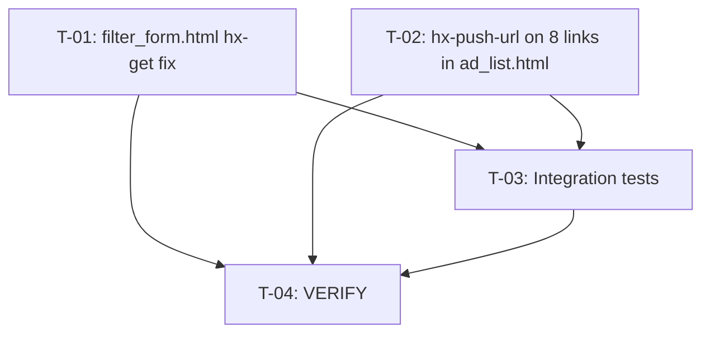

# Plan 29 — Catalog Filter Reset & Parameter Accumulation

Transformation of **Spec_28** (`.ai/problems/28_filter-reset-accumulation_spec.md`, DRAFT, HIGH confidence) into a
dependency-aware implementation DAG. The spec identifies **two root causes** in the HTMX filter templates —
an inherited query-string bug in `filter_form.html` (`hx-get=""`) and a missing `hx-push-url="true"` on all
HTMX-enhanced `<a>` links in `ad_list.html` — producing parameter accumulation and stale filter state across
the listings (`/`, `/category/<slug>/`, `/city/<slug>/`) and search (`/search/`) pages.

> **Key constraint:** this plan contains **no database schema or migration changes**, **no Python source
> changes**, and **no configuration changes**. All modifications are to two HTML template partials and one
> test file. The view layer (`listings()` and `search()`) is already correct (spec §3.4) — it parses whatever
> query params the browser sends. The bug is purely in HTMX URL management at the template layer.

The seven conceptual tasks (T1–T7) from the spec are reorganized below into implementation-sequenced,
parallelizable tasks. Key reorganizations:

- **Spec Task 2–5 (four separate ad_list.html link groups) → one task (T-02).** All 8 link instances share
  the identical pattern (`hx-target="#ad-list" hx-swap="innerHTML"` → prepend `hx-push-url="true"`) and live
  in the same file. Splitting them into four tasks would create sequential same-file dependencies with no
  benefit to isolation, risk containment, parallel execution, or reviewability — violating the "never split
  work unless it improves dependency isolation" constraint. Consolidating into T-02 keeps the change atomic
  and reviewable as a single cohesive "add hx-push-url to all HTMX links" edit.
- **Spec Task 6 (manual verification) → folded into T-04 (VERIFY).** The manual checklist (spec §7.3) is
  combined with automated test execution into a single verification gate, since the changes are low-risk
  and template-only.
- **Spec Task 7 (integration tests) → T-03.** Tests are sequenced after both template fixes because they
  validate the fixed behavior; they also include template-source assertions that statically verify the
  attribute presence without requiring a database.

---

## 1. Statement of Scope

Four implementation tasks + one verification task. Touches:
- `src/backend/templates/ads/partials/filter_form.html`
- `src/backend/templates/ads/partials/ad_list.html`
- `src/backend/apps/ads/tests/test_catalog_filters.py`

**Changes:**
1. **T-01** — Change `hx-get=""` → `hx-get="{{ request.path }}"` in `filter_form.html` (Fix #1, primary root cause)
2. **T-02** — Add `hx-push-url="true"` to all 8 HTMX `<a>` links in `ad_list.html` (Fix #2)
3. **T-03** — Add integration tests for filter URL-reset behavior to `test_catalog_filters.py`
4. **T-04** — VERIFY: run test suite + lint

**Fix #3 (optional, suppress empty `listing_purpose`)** is explicitly **out of scope** — the spec defers it
as a non-blocking cosmetic follow-up (spec §4.3). No speculative work.

**Out of scope (per spec §9):** view-layer filter logic, filter form visible controls, sort component
extraction, dropdown-with-checkboxes conversion, i18n of labels, faceted counts, URL structure or param name
changes.

---

## 2. Current-State vs. Gaps (verified)

| Concern | State | Evidence |
|---|---|---|
| `filter_form.html` form `hx-get` | **Bug** — empty string `""` | `filter_form.html` line 6: `hx-get=""` |
| `ad_list.html` HTMX links have `hx-push-url` | **Bug** — 8 links missing it | Lines 41–42, 52–53, 59–60, 117–118, 121–122, 131–132, 139–140, 143–144 all have `hx-target="#ad-list" hx-swap="innerHTML"` but no `hx-push-url` |
| `request.path` available in templates | **Confirmed** | `base.py` line 135: `django.template.context_processors.request` is in `context_processors` |
| View layer parsing query params | **Correct** — no changes needed | `listings.py` lines 222–229, `search.py` lines 97–107; both use `request.GET.get`/`getlist` correctly |
| HTMX version | 1.9.12 (CDN) | `ads/list.html` line 16, `cabinet/hub.html` line 14 |
| Form has hidden inputs for cross-nav params | **Confirmed** | `filter_form.html` lines 11–15: `q`, `category`, `city`, `min_price`, `max_price` preserved via hidden inputs |
| `listing_purpose` select always submits empty | **Known cosmetic issue** | `filter_form.html` lines 23–30: `<option value="">` always present; spec §2.3 says defeatured, not blocking |

---

## 3. Planning Decisions (resolved)

No Product Officer decisions were issued by Spec_28. All decisions are implementation-sequencing:

- **D-P1 — Consolidate 4 spec link-group tasks into 1.** T-02 covers all 8 HTMX `<a>` links in `ad_list.html`
  as a single atomic edit. Same file, identical change pattern (`prepend hx-push-url="true"`), cannot be
  parallelized. Splits would add sequential same-file dependencies with zero isolation benefit.
- **D-P2 — Parallelize T-01 and T-02.** The two template fixes touch disjoint files (`filter_form.html` vs
  `ad_list.html`), so they execute in parallel at Level 1.
- **D-P3 — No research prerequisite.** The fixes are deterministic template attribute edits with zero
  architectural ambiguity. HTMX 1.9.12 behavior is documented in the spec (§3.1). No framework best-practice
  question, no external library, no scalability concern. A Researcher pass is not warranted.
- **D-P4 — Tests use both static and integration patterns.** Template-source assertions (file-read + string
  checks, no DB) verify attribute presence directly; Django test-client integration tests with
  `HTTP_HX_REQUEST: "true"` verify the rendered form and links reflect the fix end-to-end. This mirrors the
  existing `test_autocomplete_template.py` (static) + `test_catalog_filters.py` (integration) conventions.
- **D-P5 — Fix #3 not in this plan.** The spec defers empty `listing_purpose` suppression as non-blocking.
  Per planning constraints ("avoid speculative implementation work"), it is excluded.

---

## 4. Risk Assessment & Gates

| Task | Risk trigger | Severity | Gate |
|---|---|---|---|
| **T-01** | Modifies shared template used by both `listings` and `search` views | Low | Template-source assertion (T-03) confirms `hx-get="{{ request.path }}"` renders, not `hx-get=""`; existing test suite passes |
| **T-02** | Modifies shared template; adds behavior (URL push) to 8 links | Low | Template-source assertion (T-03) confirms all 8 `hx-get` links also have `hx-push-url="true"`; existing test suite passes |
| **T-03** | New tests in existing test file | Low | `make test` passes (fast gate, excludes nightly `seed` suite); `ruff check` clean |
| **T-04** | Verification only | — | All acceptance criteria validated; see gates below |

**No high-risk tasks.** No shared configuration, no schema/migration changes, no startup behavior changes,
no public API renames, no unknown downstream consumers. The templates are only rendered server-side in
responses to the two views (`listings`, `search`), both under direct test coverage.

---

## 5. Execution DAG

```
Level 1  (parallel — disjoint files, no interdependencies)
  ├─ T-01  Fix filter_form.html hx-get → request.path   [filter_form.html]
  └─ T-02  Add hx-push-url="true" to all 8 HTMX links   [ad_list.html]

Level 2  (depends on T-01 + T-02 both complete)
  └─ T-03  Add integration tests for filter URL reset   [test_catalog_filters.py]  dep: T-01, T-02

Level 3  (verification gate — no production code changes)
  └─ T-04  VERIFY: test suite + lint                     [run commands]          dep: T-01, T-02, T-03
```



**Dependency rationale:**
- **T-01 and T-02 touch disjoint files** → parallel at Level 1. Neither edits a shared Python module or
  schema; they are independent template attribute edits.
- **T-03 depends on T-01 + T-02**: the tests assert that the rendered form uses `hx-get="{{ request.path }}"`
  and that all links have `hx-push-url="true"`. These assertions only pass after both fixes are applied.
  The tests also include template-source (static) assertions that validate the template files directly —
  these are written to match the post-fix state.
- **T-04 depends on all three**: verification runs the full fast test gate to confirm no regressions across
  both the `listings` and `search` views that share these partials.

---

## 6. Task Specifications

### T-01 — Fix `filter_form.html` form `hx-get` to use path only

**Priority:** P0
**Type:** implementation (template)
**Depends on:** — (Level 1, parallel with T-02)
**Risk:** Low

**Affected file:**
- `src/backend/templates/ads/partials/filter_form.html`

**Semantic targets:**
- `<form method="get">` element — the `hx-get` attribute

**Changes:**
Change the form's `hx-get` attribute from an empty string to `{{ request.path }}`:

```diff
 <form method="get"
-      hx-get=""
+      hx-get="{{ request.path }}"
       hx-target="#ad-list"
       hx-swap="innerHTML"
       hx-push-url="true"
       class="mb-6 p-4 bg-white rounded-lg shadow space-y-4">
```

**Rationale:** `hx-get=""` causes HTMX to resolve the target URL to `window.location.href` (full browser
URL including query string), then appends the form's serialized GET data on top. This inherits stale/checked-off
parameters and causes accumulation. `hx-get="{{ request.path }}"` resolves to the path component only
(e.g. `/`, `/category/electronics/`, `/search/`), so the form's serialized data becomes the sole query string.

**Semantic anchors / insertion point:**
- `<form` element's `hx-get=""` attribute (line 6) — replace `""` with `{{ request.path }}`

**Prerequisite validation:**
- `django.template.context_processors.request` is in `context_processors` (spec §3.2, `base.py` line 135) →
  `{{ request.path }}` is available in all templates that extend the base configuration, including
  `filter_form.html` (included by `ad_list.html`, rendered by both `listings()` and `search()`).

**Acceptance criteria:**
- The `<form>` element in `filter_form.html` has `hx-get="{{ request.path }}"` (not `hx-get=""`)
- `hx-push-url="true"` remains on the form (unchanged)
- Hidden inputs for `q`, `category`, `city`, `min_price`, `max_price` are unchanged
- Submitting the filter form produces a URL with only active filter params (no accumulation) — verified by T-03
- Existing `test_catalog_filters.py` tests pass unaffected

---

### T-02 — Add `hx-push-url="true"` to all HTMX links in `ad_list.html`

**Priority:** P0
**Type:** implementation (template)
**Depends on:** — (Level 1, parallel with T-01)
**Risk:** Low

**Affected file:**
- `src/backend/templates/ads/partials/ad_list.html`

**Semantic targets:**
All 8 `<a>` elements that have an `hx-get` attribute but lack `hx-push-url="true"`:

| # | Link context | Current attributes | Target attributes |
|---|---|---|---|
| 1 | Purpose chip "×" removal | `hx-target="#ad-list" hx-swap="innerHTML"` | `hx-push-url="true" hx-target="#ad-list" hx-swap="innerHTML"` |
| 2 | Feature chip "×" removal | `hx-target="#ad-list" hx-swap="innerHTML"` | `hx-push-url="true" hx-target="#ad-list" hx-swap="innerHTML"` |
| 3 | "Clear all filters" | `hx-target="#ad-list" hx-swap="innerHTML"` | `hx-push-url="true" hx-target="#ad-list" hx-swap="innerHTML"` |
| 4 | First page `««` | `hx-target="#ad-list" hx-swap="innerHTML"` | `hx-push-url="true" hx-target="#ad-list" hx-swap="innerHTML"` |
| 5 | Previous page `«` | `hx-target="#ad-list" hx-swap="innerHTML"` | `hx-push-url="true" hx-target="#ad-list" hx-swap="innerHTML"` |
| 6 | Page number (in `` loop) | `hx-target="#ad-list" hx-swap="innerHTML"` | `hx-push-url="true" hx-target="#ad-list" hx-swap="innerHTML"` |
| 7 | Next page `»` | `hx-target="#ad-list" hx-swap="innerHTML"` | `hx-push-url="true" hx-target="#ad-list" hx-swap="innerHTML"` |
| 8 | Last page `»»` | `hx-target="#ad-list" hx-swap="innerHTML"` | `hx-push-url="true" hx-target="#ad-list" hx-swap="innerHTML"` |

**Changes:**
For each of the 8 `<a>` elements, prepend `hx-push-url="true" ` before `hx-target`:

```diff
- hx-target="#ad-list" hx-swap="innerHTML"
+ hx-push-url="true" hx-target="#ad-list" hx-swap="innerHTML"
```

All 8 instances share the identical text fragment `hx-target="#ad-list" hx-swap="innerHTML"` on a separate
line, making this a uniform `replace_all` edit. The `href` attributes (non-JS fallback) are untouched.

**Rationale:** Without `hx-push-url="true"`, HTMX updates `#ad-list` content but does not update the browser
URL bar. The stale URL then becomes the base for the next form submission's `hx-get="{{ request.path }}"`
resolution (after T-01), re-introducing removed parameters. Adding `hx-push-url="true"` ensures every chip
removal, clear-all, and pagination click writes the correct URL to the address bar and browser history.

**Semantic anchors / insertion point:**
- The repeated line `hx-target="#ad-list" hx-swap="innerHTML"` — prepend `hx-push-url="true" ` to all 8
  occurrences. This is a global replace within `ad_list.html` only.

**Acceptance criteria:**
- All 8 `<a>` elements with `hx-get` in `ad_list.html` also have `hx-push-url="true"`
- No `<a>` with `hx-get` lacks `hx-push-url="true"` (verified by T-03 template-source assertion)
- `href` attributes (non-JS fallback URLs) are unchanged
- Existing `test_catalog_filters.py` tests pass unaffected
- No other templates are modified

---

### T-03 — Add integration tests for filter URL-reset behavior

**Priority:** P1
**Type:** test
**Depends on:** T-01, T-02
**Risk:** Low

**Affected file:**
- `src/backend/apps/ads/tests/test_catalog_filters.py`

**Semantic targets:**
- New test class appended to the end of the file (after `TestRelevanceTiebreaker`)

**Changes:**
Add a new test class `TestFilterUrlReset` with the following tests, following the patterns established by
the existing test file (uses `seller`/`category`/`city`/`feature_lookup` fixtures, `create_test_ad` helper,
`pytest.mark.integration`, `pytest.mark.django_db`) and the static-template pattern from
`test_autocomplete_template.py`:

1. **`test_form_uses_request_path_not_empty`** (static, no DB — `SimpleTestCase`-style or file-read):
   Assert `filter_form.html` source contains `hx-get="{{ request.path }}"` and does NOT contain `hx-get=""`.

2. **`test_all_htmx_links_have_push_url`** (static, no DB):
   Read `ad_list.html` source and assert that every `hx-get` occurrence is accompanied by `hx-push-url="true"`
   on the same or adjacent line. Specifically: count of `hx-get` == count of `hx-push-url="true"`, and
   there are exactly 8 `hx-get` links.

3. **`test_form_renders_path_only_hx_get`** (integration, HTMX request):
   Make a Django test client GET to `/?features=delivery&features=pickup` with `HTTP_HX_REQUEST: "true"`.
   Assert the rendered HTML contains `hx-get="/"` (path only, no query string) on the `<form>` element.

4. **`test_chip_link_has_push_url_in_rendered_output`** (integration, HTMX request):
   Make a GET to `/?features=delivery&features=pickup` with `HTTP_HX_REQUEST: "true"`. Assert the rendered
   feature chip removal `<a>` has `hx-push-url="true"` in the response content.

5. **`test_pagination_links_have_push_url_in_rendered_output`** (integration, HTMX request):
   Make a GET to `/?features=delivery` with `HTTP_HX_REQUEST: "true"` (with enough ads to paginate).
   Assert rendered pagination `<a>` elements have `hx-push-url="true"`.

6. **`test_form_submission_does_not_accumulate_params`** (integration, behavioral):
   Create ads with features (using `feature_lookup` and `create_test_ad`). Submit the filter form via
   HTMX-style GET with only one feature checked (e.g., `features=delivery`). Assert the response context
   `page_obj` contains only ads with `delivery` feature — confirming unchecked `pickup` params from a
   prior URL are not re-introduced.

7. **`test_clear_all_filters_has_push_url`** (static + integration):
   Assert the "Clear all filters" `<a>` in `ad_list.html` has `hx-push-url="true"` and its `hx-get` is
   `?page=1` (with optional `&q={{ query }}`).

**Dependencies on T-01/T-02:** Tests 1–5 and 7 would fail if the template fixes are not applied (they assert
the fixed attribute values). Test 6 validates the user-visible behavior (AC-1) that depends on both fixes
working together.

**Acceptance criteria:**
- All new tests pass with `make test` (fast gate, excludes nightly `seed` suite)
- `ruff check` passes on the test file
- Tests cover spec §5 acceptance criteria: AC-1 (param reset), AC-2 (chip removal URL sync),
  AC-3 (clear all filters URL), AC-4 (pagination URL), AC-6 (no view-layer regression)
- New tests follow existing file conventions (pytest fixtures, markers, `create_test_ad`)
- No production code is modified by this task

---

### T-04 — VERIFY: test suite + lint

**Priority:** P0
**Type:** verification
**Depends on:** T-01, T-02, T-03
**Risk:** — (verification only)

**Affected files:**
- (none — runs commands only)

**Changes:**
1. **Fast test gate:** Run `make test` (starts test DB in Docker, runs pytest excluding nightly `seed` suite):
   ```
   make test
   ```
   Confirms: existing `test_catalog_filters.py` tests + new `TestFilterUrlReset` tests pass.

2. **Lint:** Run ruff on touched files:
   ```
   uv run ruff check src/backend/apps/ads/tests/test_catalog_filters.py
   ```

3. **Manual verification checklist** (spec §7.3 — verify on running dev server or via test client):
   - [ ] Form submission with unchecked features → no `features=` accumulation (AC-1)
   - [ ] Form `hx-get` renders as path-only `{{ request.path }}` (AC-1)
   - [ ] Chip removal links have `hx-push-url="true"` (AC-2)
   - [ ] "Clear all filters" link has `hx-push-url="true"` (AC-3)
   - [ ] Pagination links have `hx-push-url="true"` (AC-4)
   - [ ] Back button navigates through filter history (AC-5) — manual browser test
   - [ ] View-layer filtering unchanged (AC-6) — existing tests pass

4. **Template-source sanity check:**
   ```
   uv run ruff check src/  # confirms no lint regressions from test changes
   ```

**Acceptance criteria:**
- `make test` exits 0 (all tests pass, no regressions)
- `ruff check src/` exits 0
- All AC-1 through AC-5 behaviors are verified (AC-6 covered by passing existing tests)
- No production source files were modified (only templates + test file)

---

## 7. Acceptance Criteria Mapping

| AC | Spec Requirement | Task(s) |
|---|---|---|
| AC-1 | Form submission produces URL with only active filters — no accumulation | T-01 (root cause), T-03 (test), T-04 (verify) |
| AC-2 | Chip removal updates browser URL to remove that feature | T-02 (root cause), T-03 (test), T-04 (verify) |
| AC-3 | "Clear all filters" updates URL to `?page=1` | T-02 (root cause), T-03 (test), T-04 (verify) |
| AC-4 | Pagination links update URL to reflect page number | T-02 (root cause), T-03 (test), T-04 (verify) |
| AC-5 | Back button navigates through filter history correctly | T-01 + T-02 (root cause), T-04 (manual verify) |
| AC-6 | No regression in view-layer filtering | T-04 (existing tests pass) |

---

## 8. Spec-to-Plan Task Mapping

Spec_28's seven conceptual tasks (Task 1–Task 7) are reorganized into 4 implementation tasks + 1
verification task.

| Spec Task | Mapped To | Rationale |
|---|---|---|
| Task 1 (filter_form hx-get fix) | T-01 | Standalone template fix; Fix #1 (primary root cause) |
| Task 2 (purpose chip hx-push-url) | T-02 | Consolidated with Tasks 3–5 into one ad_list.html task — all identical edits on the same file, no isolation benefit from splitting |
| Task 3 (feature chip hx-push-url) | T-02 | Same as above — identical pattern, same file |
| Task 4 (clear all hx-push-url) | T-02 | Same as above — identical pattern, same file |
| Task 5 (pagination hx-push-url) | T-02 | Same as above — identical pattern, same file |
| Task 6 (manual verification) | T-04 | Folded into the unified verification gate alongside automated tests |
| Task 7 (integration tests) | T-03 | Standalone test task; depends on T-01 + T-02 |

---

## 9. Constraints Preserved

- **StrEnum for constants (rule 10):** N/A — no new constants introduced; template attribute changes only.
- **No `print()` in Python (rule 12):** N/A — no Python production code modified; only HTML templates and test code.
- **English only (rule 1):** All test docstrings and comments will be in English.
- **Small modules (rule 4):** Tests are added as focused methods within the existing test file; no new modules.
- **Follow existing patterns (rule 7):** Tests follow `test_catalog_filters.py` conventions (fixtures, markers,
  `create_test_ad`) and `test_autocomplete_template.py` static-assertion pattern.
- **No new dependencies (spec §3 #6):** Only HTMX attributes and Django template context (`request.path`) —
  both already in use in the project.
- **Database migrations (rule 13):** N/A — no schema changes.
- **Documentation kept current (rule 14):** This plan documents all changes; no user-facing docs require
  updates (these are template-only bug fixes with no API or URL structure changes).

---

## 10. Rollback Plan

Each task is independently revertible. Since only template and test files are touched, rollback is trivial:

| Task | Rollback |
|---|---|
| T-01 | `git checkout -- src/backend/templates/ads/partials/filter_form.html` |
| T-02 | `git checkout -- src/backend/templates/ads/partials/ad_list.html` |
| T-03 | `git checkout -- src/backend/apps/ads/tests/test_catalog_filters.py` |
| T-04 | N/A (verification only) |

**Revert order:** If T-04 fails, revert in reverse dependency order: T-03 → T-02 → T-01.
No database migrations to roll back. No data migration concerns. Template changes are stateless — they
affect only how the browser URL is managed, not server-side data.

---

## 11. Verification Commands Reference

All commands are run from the project root (`C:\py_dev\mko_bazuna`) per AGENTS.md:

```bash
# Fast test gate (excludes nightly seed suite):
make test

# Lint (project-wide or per-file):
uv run ruff check src/
uv run ruff check src/backend/apps/ads/tests/test_catalog_filters.py

# Typecheck (if needed — no Python source changes in this plan, but test code should be type-clean):
uv run basedpyright src/backend/apps/ads/tests/test_catalog_filters.py
```

The test DB runs in Docker (`mko-bazuna-test-db-*`). `make test` starts it automatically. Running `pytest`
directly without the Docker test DB will fail (AGENTS.md §Test Environment).
