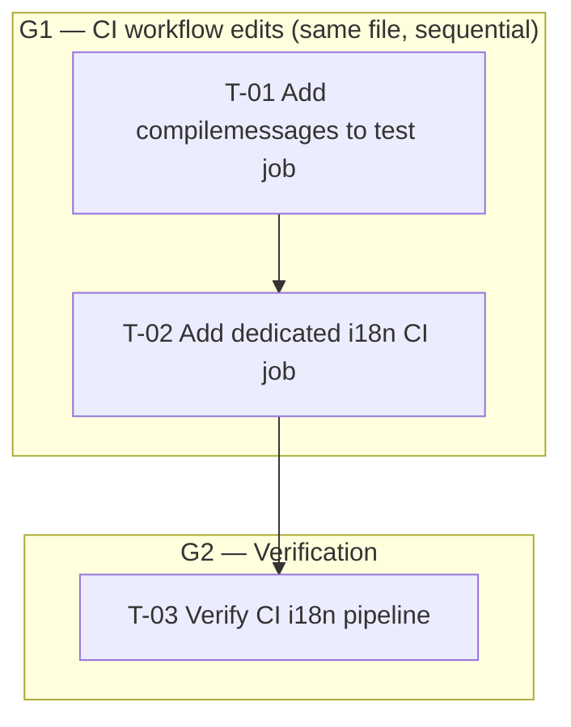

# Plan 35 — CI i18n Pipeline Gap Fill

Transformation of the validated gap analysis
(`docs/99-agent/i18n-translation-pipeline-gap-analysis.md`) into a
dependency-aware implementation DAG.

The gap analysis describes the i18n translation pipeline as **fully operational**
(runtime middleware, Python `gettext`, `.po`/`.mo` catalogs, automated completeness
tests).  Verification against the live codebase confirms that **all runtime, catalog,
test, and Makefile/Docker pieces are already in place**.  One specification claim
does **not** match reality, and one consequence follows from it:

1. **Section 1.5** claims a dedicated `i18n` job was added to
   `.github/workflows/ci.yml` — it does **not** exist.  The CI workflow currently
   contains only `build`, `test`, `lint`, `typecheck`, and `lint-templates`.
2. Because `.mo` files are gitignored (Spec §3 key facts) and the CI `test` job
   runs `uv run pytest -m "not seed"` **directly** (no Docker entrypoint), the
   i18n unit tests — `test_mo_compiled` and `test_mo_files_exist` — would **fail**
   in CI: compiled `.mo` artifacts are absent from the checkout.

---

## 1. Statement of Scope

**In scope (files):**

- `.github/workflows/ci.yml` — add `compilemessages` step to the `test` job;
  add a new dedicated `i18n` job.

**Already in place (verified, no work needed):**

- `apps/core/middleware/language.py` — `LanguagePreMiddleware`,
  `translation.activate(lang)`.
- `config/settings/base.py` — `USE_I18N`, `LANGUAGES`, `LANGUAGE_CODE`,
  `LOCALE_PATHS`, `django.template.context_processors.i18n`, custom
  context processor, `LocaleMiddleware` **absent** from `MIDDLEWARE`.
- `apps/core/context_processors.py` — `gettext` on `"Entire country"` + 5 JS
  labels via `catalog_js_labels`.
- `apps/core/enums.py` — `TimeRange` labels via `gettext_lazy`.
- `apps/ads/views/{dashboard,edit,delete,listings}.py` —
  `gettext`/`gettext_lazy` on `status_labels`, `HttpResponseForbidden` bodies,
  inline moderation error.
- `apps/ads/tests/test_i18n_completeness.py` — 4 guard tests,
  `@pytest.mark.unit`, custom `_parse_po_entries` (no `polib`).
- `apps/ads/tests/test_i18n_pipeline.py` — `.po`/`.mo` existence + `component_tag`
  filter tests, `@pytest.mark.unit`.
- `src/backend/locale/{ru,en,bs}/LC_MESSAGES/django.{po,mo}` — `ru`/`bs` have
  0 empty `msgstr` (non-header); `en` follows Django convention (empty `msgstr`).
- `.gitignore:55` — `*.mo` excluded from VCS.
- `Makefile:167-171` — `makemessages` / `compilemessages` targets.
- `docker/Dockerfile:78`, `docker/entrypoint.sh:73-87`,
  `docker/entrypoint-test.sh:37` — `compilemessages` in build/runtime/test
  entrypoints.

**Explicitly out of scope:**

- No production Python or template changes (all already wrapped per the gap
  analysis §2).
- No `.po`/`.mo` regeneration (catalogs already populated and compiled).
- No new test modules (completeness tests already exist).
- No Docker entrypoint changes (already call `compilemessages`).
- No settings changes (pipeline already configured).

---

## 2. Current State (verified facts)

| Concern | Current state | Evidence file |
|---------|---------------|---------------|
| Languages | `ru` (primary), `bs`, `en` | `config/settings/base.py:55-61`; `apps/core/enums.py:187` |
| Runtime middleware | `LanguagePreMiddleware` active; `translation.activate()` called | `apps/core/middleware/language.py:128`; `config/settings/base.py:120` |
| `LocaleMiddleware` | **Absent** from `MIDDLEWARE` (intentionally replaced) | `config/settings/base.py:113-124` |
| Python `gettext` | Used in 6 files (15 user-facing strings) | `apps/core/context_processors.py:10`, `apps/core/enums.py:11`, `apps/ads/views/dashboard.py:14`, `apps/ads/views/edit.py:19`, `apps/ads/views/delete.py:18`, `apps/ads/views/listings.py:33` |
| `.po` completeness | `ru`/`bs` 0 empty `msgstr` (non-header); `en` empty (convention) | `.po` headers + grep `^msgstr ""$` → 1 match (header only) per `ru`/`bs` |
| `.mo` compiled | Present on disk; gitignored | `.gitignore:55`; `ls locale/*/LC_MESSAGES/*.mo` |
| Completeness tests | 4 tests in `test_i18n_completeness.py`; 3 in `test_i18n_pipeline.py`; all `@pytest.mark.unit` | `apps/ads/tests/test_i18n_completeness.py:30`; `apps/ads/tests/test_i18n_pipeline.py:24` |
| CI workflow | 5 jobs: `build`, `test`, `lint`, `typecheck`, `lint-templates` — **no `i18n` job** | `.github/workflows/ci.yml` |
| Makefile | `makemessages` / `compilemessages` targets present | `Makefile:167-171` |
| `catalog_js_labels` | Pre-translated context vars consumed by inline JS | `apps/core/context_processors.py:78-86`; `templates/components/header_catalog.html:184` |
| `Http404` messages | Left untranslated (not user-facing) | `apps/ads/views/listings.py:71,119,160,174` |
| `feature_tag.html` | DB-based i18n (`get_lookup_name`) — separate path | `templates/analytics/...` / `apps/lookups/models.py` |

**Gap identified (specification §1.5 does not match reality):**

| Gap | Spec claim | Actual state |
|-----|-----------|--------------|
| CI `i18n` job | "A dedicated `i18n` job was added to `.github/workflows/ci.yml`" (§1.5) | Job does **not** exist; CI has only 5 jobs |
| CI `test` job `compilemessages` | Implicitly assumed (`.mo` available for unit tests) | `compilemessages` not run; `.mo` gitignored → `test_mo_compiled` / `test_mo_files_exist` fail in CI |

---

## 3. Execution DAG

**Parallel groups:**

- **G1:** `T-01` then `T-02` — both edit `.github/workflows/ci.yml`; sequenced to avoid
  merge conflicts.  `T-01` is a prerequisite for `T-02` only because they touch the
  same file; logically the i18n job is independent.
- **G2:** `T-03` — verification, depends on both.

**Critical path:** `T-01 → T-02 → T-03`

---

## 4. Task Index

| ID | Title | Type | Priority | Risk | Blocked by |
|----|-------|------|----------|------|------------|
| T-01 | Add `compilemessages` step to CI `test` job | implementation | High | Low | — |
| T-02 | Add dedicated `i18n` CI job to `ci.yml` | implementation | High | Medium | T-01 (same-file sequencing) |
| T-03 | Verify CI i18n pipeline (YAML valid + compilemessages + tests) | verification | High | — | T-01, T-02 |

---

## 5. Task Specifications

> Format follows `.ai/tasks/templates/task_template.yaml` and
> `.ai/tasks/templates/task_template_verification.yaml`.

---

### T-01 — Add `compilemessages` step to CI `test` job

| Field | Value |
|-------|-------|
| ID | T-01 |
| Title | Add `compilemessages` step to the CI `test` job before pytest |
| Type | implementation |
| Priority | High |
| Risk | Low (additive step; no existing step modified or removed) |
| Blocked by | — |
| Source | Spec §1.5 (key facts: `.mo` gitignored; CI must compile before tests) |

**description**

The CI `test` job (`uv run pytest -m "not seed"`) collects and executes all non-seed
tests — including the i18n unit tests marked `@pytest.mark.unit`
(`test_mo_compiled` in `test_i18n_completeness.py`; `test_mo_files_exist` in
`test_i18n_pipeline.py`).  Because `.mo` files are gitignored and the CI `test` job
does **not** use the Docker entrypoint (`entrypoint-test.sh`), the `.mo` artifacts
are absent from the CI checkout, causing these two tests to fail.  Adding a
`compilemessages` step (mirroring `entrypoint-test.sh:37`) before the pytest step
closes this gap.

**goals**

- `compilemessages` runs before pytest in the CI `test` job.
- `.mo` files are present for the i18n unit tests to pass.
- No existing step in the `test` job is modified, removed, or reordered.

**files**

- `.github/workflows/ci.yml`
  - targets:
    - type: job_step
      name: Run pytest with coverage
  - semantic_anchors:
    - insert_before: the `Run pytest with coverage` step (the step whose `run:` is
      `uv run pytest -m "not seed" -n auto ...`)
    - the new step is inserted between `Install dependencies` and `Run pytest`

**changes**

- action: add_step
  description: >
    Insert a `Compile translations` step before the `Run pytest with coverage`
    step. The step mirrors `entrypoint-test.sh:36-37` and sets
    `DJANGO_SETTINGS_MODULE` so Django can locate `LOCALE_PATHS`.
  code_hint: |
    # Compile .po -> .mo (gitignored artifacts) so unit tests checking
    # .mo existence (test_mo_compiled, test_mo_files_exist) pass in CI.
    - name: Compile translations
      env:
        DJANGO_SETTINGS_MODULE: config.settings.test
      run: uv run python manage.py compilemessages
      working-directory: src/backend

**acceptance_criteria**

- The `test` job in `ci.yml` has a `Compile translations` step between
  `Install dependencies` and `Run pytest with coverage`.
- The step sets `DJANGO_SETTINGS_MODULE` so Django settings load correctly.
- The step runs `uv run python manage.py compilemessages` from
  `working-directory: src/backend` (matching the Makefile / entrypoint pattern).
- No existing step in the `test` job is altered.

---

### T-02 — Add dedicated `i18n` CI job

| Field | Value |
|-------|-------|
| ID | T-02 |
| Title | Add `i18n` job to `.github/workflows/ci.yml` running compilemessages + completeness tests |
| Type | implementation |
| Priority | High |
| Risk | Medium (edits shared CI config; runs on every PR) |
| Blocked by | T-01 (same-file sequencing — both edit `ci.yml`) |
| Source | Spec §1.5 (dedicated `i18n` job, parallel to existing jobs, `compilemessages` before completeness tests) |

**description**

The gap analysis §1.5 states: "A dedicated `i18n` job was added to
`.github/workflows/ci.yml`, running parallel to the existing `build`, `test`,
`lint`, `typecheck`, and `lint-templates` jobs. It runs `compilemessages`
before invoking the completeness test suite, ensuring `.mo` files (gitignored)
are present in CI."

This job does not exist.  This task adds it as a new top-level YAML key after
the `lint-templates` job, using the same `ubuntu-latest` runner, uv setup, and
dependency install pattern as the existing `test` job.  The job:

1. Checks out the code.
2. Sets up uv and installs dependencies (`--group dev`).
3. Runs `compilemessages` (`DJANGO_SETTINGS_MODULE=config.settings.test`).
4. Runs the i18n completeness test suite:
   `test_i18n_completeness.py` and `test_i18n_pipeline.py`.

The job does **not** need a PostgreSQL service container — the i18n tests are
marked `@pytest.mark.unit` (`SimpleTestCase`, no database access).  However,
`DJANGO_SETTINGS_MODULE` and `DJANGO_SECRET_KEY` must be set so Django can
load settings and locate `LOCALE_PATHS` (from `BASE_DIR / "backend" / "locale"`).

**goals**

- A new `i18n` job is added to `ci.yml`, parallel to the 5 existing jobs.
- The job runs `compilemessages` before invoking the completeness tests.
- The job does not modify any existing job (`build`, `test`, `lint`,
  `typecheck`, `lint-templates`).
- The job has no `seed`/nightly gating — runs on every push/PR (fast gate).

**files**

- `.github/workflows/ci.yml`
  - targets:
    - type: top_level_key
      name: i18n
  - semantic_anchors:
    - insert_after: the `lint-templates` job block (the last existing job)
    - the job body mirrors the existing `test` job skeleton but omits the
      database service container and limits pytest to the i18n test modules

**changes**

- action: add_job
  description: >
    Add an `i18n:` job keyed off the existing `test` job structure
    (ubuntu-latest, uv setup, `--group dev`).  Include a `Compile translations`
    step (sets `DJANGO_SETTINGS_MODULE`) before a `Run i18n completeness tests`
    step that targets `test_i18n_completeness.py` and `test_i18n_pipeline.py`.
    Set `DJANGO_SECRET_KEY` env so settings load without error.
  code_hint: |
    i18n:
      runs-on: ubuntu-latest
      env:
        PYTHONPATH: ${{ github.workspace }}/src:${{ github.workspace }}/src/backend
      steps:
        - uses: actions/checkout@v4

        - name: Set up uv
          uses: astral-sh/setup-uv@v5
          with:
            enable-cache: true

        - name: Install dependencies
          run: uv sync --frozen --no-install-project --group dev
          working-directory: src/backend

        - name: Compile translations
          env:
            DJANGO_SETTINGS_MODULE: config.settings.test
          run: uv run python manage.py compilemessages
          working-directory: src/backend

        - name: Run i18n completeness tests
          env:
            DJANGO_SETTINGS_MODULE: config.settings.test
            DJANGO_SECRET_KEY: test-secret-key-for-testing-only
          run: uv run pytest src/backend/apps/ads/tests/test_i18n_completeness.py src/backend/apps/ads/tests/test_i18n_pipeline.py -v
          working-directory: src/backend

**acceptance_criteria**

- `ci.yml` gains an `i18n:` job with no modifications to the existing 5 jobs.
- The job runs on every push/PR to `main`/`develop` (no schedule gate).
- `compilemessages` runs before pytest.
- The pytest command targets the i18n completeness + pipeline test modules.
- Job does not require a database service container (unit tests only).

---

### T-03 — Verify CI i18n pipeline

| Field | Value |
|-------|-------|
| ID | T-03 |
| Title | Verify: CI YAML valid, compilemessages succeeds, i18n tests pass |
| Type | verification |
| Priority | High |
| Risk | — |
| Blocked by | T-01, T-02 |
| Source | Spec §9 (Verification Criteria) |

**description**

Validate that the CI workflow edits produce a passing i18n pipeline.  Verify both
the structural integrity of the modified `ci.yml` and the runtime behaviour of
the i18n tests with compiled `.mo` files.

**verification_steps**

- yaml_lint: confirm `.github/workflows/ci.yml` is valid YAML (no syntax errors,
  correct indentation, job names unique).
- compile_smoke: run `make compilemessages` (Docker) to confirm `.mo` files
  compile cleanly from the committed `.po` files for all three locales.
- test_run: run `make test` (Docker fast gate) — confirms
  `test_i18n_completeness.py` and `test_i18n_pipeline.py` pass with compiled
  `.mo` artifacts.
- test_isolated: run the two i18n test modules directly:
  `pytest src/backend/apps/ads/tests/test_i18n_completeness.py src/backend/apps/ads/tests/test_i18n_pipeline.py -v`.

**pass_criteria**

- `ci.yml` parses as valid YAML; `i18n` job present; `test` job has
  `Compile translations` step.
- `compilemessages` succeeds (no errors) for `ru`, `en`, `bs`.
- All 7 i18n tests pass (4 in `test_i18n_completeness.py` + 3 in
  `test_i18n_pipeline.py`).
- No regression in the existing fast-gate suite (`make test` stays green
  for the i18n modules).

**failure_action:** return the failing task among {T-01, T-02} to rework.

---

## 6. Risk Assessment

| Task | Risk | Why it is risky | Mitigation |
|------|------|-----------------|------------|
| T-01 (test job) | Low | Adds a step to a shared CI file; `compilemessages` could fail if `gettext`/`msgfmt` missing | `ubuntu-latest` ships `gettext` pre-installed; step is additive; T-03 verifies |
| T-02 (i18n job) | Medium | Edits shared CI config; runs on every PR | Additive only — no existing job altered; T-03 verifies YAML + tests |
| T-03 (verify) | — | No code change | — |

**Shared-config / startup / schema risk:** none.  No migrations, no schema changes,
no settings changes, no startup path changes.  The i18n runtime pipeline (middleware,
context processor, catalogs, tests) is already operational and unchanged.

---

## 7. Overall Acceptance Criteria

The CI i18n pipeline gap is closed when **all** hold:

1. **AC-1** — `.github/workflows/ci.yml` has a dedicated `i18n` job running
   `compilemessages` then the completeness tests, parallel to `build`/`test`/
   `lint`/`typecheck`/`lint-templates`.
2. **AC-2** — The CI `test` job runs `compilemessages` before pytest, so the
   i18n unit tests pass (`.mo` artifacts are present).
3. **AC-3** — `make test` (fast gate) passes, including
   `test_i18n_completeness.py` and `test_i18n_pipeline.py`.
4. **AC-4** — `compilemessages` succeeds for all three locales (`ru`, `en`, `bs`).
5. **AC-5** — `ru`/`bs` `.po` files have 0 empty `msgstr` (non-header); `en`
   follows Django convention (empty `msgstr`).
6. **AC-6** — No existing CI job is modified, removed, or reordered.

**DoD mapping:** AC-1↔Spec §1.5, AC-2↔Spec §1.4 (unit tests need `.mo`),
AC-3↔Spec §3.5 (step 6), AC-4↔Spec §1.1 (compilemessages in entrypoints),
AC-5↔Spec §1.3 (catalog completeness), AC-6↔Spec §1.5 (additive job).
