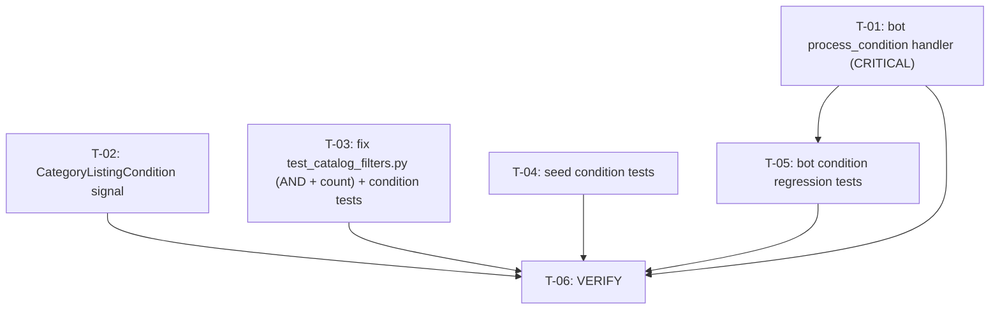

# Plan 36 — New/Used Condition Mutual Exclusivity (completion)

Transformation of **Spec 12** (`.ai/problems/12_new-used-condition-mutual-exclusivity_spec.md`) into a
dependency-aware implementation DAG.

> **Critical finding — do not re-implement what is already shipped.** Code inspection of the current working
> tree (2026-08-25) shows that **Spec 12's conceptual Tasks 1, 2, and most of 4/5 are already implemented and
> wired end-to-end**: the `listing_condition` LookupGroup, the `Ad.listing_condition` FK, the
> `CategoryListingCondition` through model, the resolver (`get_resolved_conditions`), the catalog builder,
> the seed `Step 4c` assignment, the `filter_form.html` condition `<select>`, the `?condition=` view filters,
> the bot `CONDITION` state + feature-keyboard exclusion, and the features-filter **AND** semantics in the
> views.
>
> The spec's seven conceptual tasks therefore **do not** map 1:1 to implementation tasks. This plan reorganizes
> around the **real, verified remaining gaps** — three functional defects and the test debt they produced —
> not the conceptual task list. Five of the seven conceptual groups are already done; three are not, and two
> of those are actively broken.

---

## 1. Statement of Scope

Six tasks total: **two implementation fixes**, **three test tasks**, and **one verification gate**. Touches:

| File | Change type |
|---|---|
| `src/telegram_bot/handlers/ad_create.py` | Move dead nested `process_condition` to module level (T-01) |
| `src/backend/apps/categories/signals.py` | Add `CategoryListingCondition` to cache-invalidation receiver (T-02) |
| `src/backend/apps/ads/tests/test_catalog_filters.py` | Revert features filter tests to AND + fix hx-get count + add condition-filter tests (T-03) |
| `src/backend/apps/seed/tests/test_seed.py` | Add seed condition regression tests (T-04) |
| `src/telegram_bot/tests/` (new `test_ad_create_condition.py`) | Bot condition-selection regression tests (T-05) |
| (commands only) | Fast gate + full suite + lint + typecheck + i18n (T-06) |

**Out of scope (explicitly, per PO-3 & spec §13):**
- **Data backfill migration.** PO-3: "No data preservation — dev environment only; re-seed is acceptable."
  Seed re-runs assign `listing_condition` via `Step 4c` (`seed_service.py:149-155`); new bot ads go through
  the condition flow. `Ad.listing_condition` is nullable by design. No migration backfill is required.
- **DB-level `CheckConstraint` on `AdFeature` for new/used mutual exclusivity** (spec Task 1f / DoD #7).
  See Decision **D-P1** below — satisfied by design via LookupGroup separation; a redundant constraint is
  not the established pattern and is skippable.
- **Admin moderation UI** for editing an ad's condition — spec §13 lists this as a separate out-of-scope task.
- **i18n of bot strings** — bot messages (`src/telegram_bot/`) are intentionally unwrapped English (existing
  convention; bot is outside the Django `makemessages` template/string extraction path). The Django-site
  condition strings already use `` (filter_form.html, ad_list.html).

---

## 2. Current-State vs. Gaps (verified against working tree)

| Spec § / Concern | Current state | Evidence | Plan task |
|---|---|---|---|
| **T1a** `ListingCondition` StrEnum constants | ✅ Already Done | `apps/lookups/enums.py:18` (`LookupGroupCode.LISTING_CONDITION`) | — |
| **T1b** `condition` field on `Ad` | ✅ Already Done | `apps/ads/models.py:141-149` (FK, `limit_choices_to`, `PROTECT`, nullable, `related_name="condition_ads"`) | — |
| **T1c** `LookupGroupCode.LISTING_CONDITION` | ✅ Already Done | `apps/lookups/enums.py:18` | — |
| **T1d** `categories.yaml` moves new/used to `listing_condition`; 6 categories scoped; 4 unaffected | ✅ Already Done | `categories.yaml:38-44` (group); `:152` transport, `:210` auto-parts, `:251` goods, `:707` business, `:743` auto-business-equipment, `:457` pet-supplies; real-estate `:102`, services-jobs `:478`, animals `:435`, charity `:786` — none | — |
| **T1e** Schema migrations (AddField + CreateModel) | ✅ Already Done | `apps/ads/migrations/0012_ad_listing_condition.py` (AddField nullable), `apps/categories/migrations/0002_categorylistingcondition.py` (CreateModel) | — |
| **T1e** Data backfill migration | ⬜ Optional (skip per PO-3) | No `RunPython` backfill exists in either migration; only unrelated `0010` backfills prices | — |
| **T1f** DB CheckConstraint preventing new+used in `ad_features` | ⬜ Not required (D-P1) | `AdFeature` (`models.py:612-645`) has only `unique_together`; no cross-row constraint. Group separation + `limit_choices_to` structurally prevents it | see D-P1 |
| **T2a** Builder reads `listing_condition_override` | ✅ Already Done | `builder.py:609-643` (`CategoryListingCondition.objects.update_or_create`) | — |
| **T2b** `CategoryLookupResolver.get_resolved_conditions()` | ✅ Already Done | `lookup_resolution.py:196-204` (delegates to proven `_resolve` at `:140-194`); cache-invalidation in service at `:68-85,112-118` | — |
| **T2c** Views expose `resolved_conditions` + parse `?condition=` | ✅ Already Done | `listings.py:347-351` (parse+filter), `:374-386` (resolver), `:442` (context); `search/views/search.py:102-105` (filter), `:128` (context) | — |
| **T3** Seed excludes new/used from feature sampling; assigns `listing_condition` independently | ✅ Already Done | `seed_service.py:126-135` (Step 4b — resolver returns only `listing_feature`-group items, so new/used implicit-excluded); `:149-155` (Step 4c assigns `ad.listing_condition`) | — |
| **T4a/b/c/d** Bot condition state + single-select keyboard + feature-exclusion + persistence | ⚠️ **Partially Done — BROKEN** | `states.py:16` (CONDITION ✓); `AdCreateForm.condition` (`ad_create.py:86` ✓); `build_feature_keyboard` excludes new/used (`ad_create.py:1921-1922` ✓); `proceed_to_features_or_city` shows condition keyboard (`ad_create.py:343-362` ✓); persistence wired (`ad_create.py:1087`, `:1585-1586` ✓) — **but `process_condition` callback handler is a dead nested function, never registered** (see T-01) | **T-01** |
| **T5a/b/c/d** Filter UI condition `<select>` + hidden state + view parse + pagination carry | ✅ Already Done | `filter_form.html:32-46` (select, ``); `ad_list.html:49-59` (condition chip removal link carries `&condition=`); `listings.py:347-351`, `search.py:102-105` | — |
| **Features filter AND semantics** (PO resolution) | ✅ Already Done | `listings.py:353-363`, `search.py:107-117` (chained `.filter(features__slug=...)` + `distinct()`) | — |
| **T6a** ORM validation / DB constraint rejecting both new+used in features | ⬜ See D-P1 (not required) | No `clean()` on `Ad`; `AdFeature` has no `CheckConstraint` | see D-P1 |
| **T6b** Seed regression: no ad has both new+used | ⬜ Missing | `test_seed.py` has no condition test | **T-04** |
| **T6c** Bot regression: feature keyboard excludes new/used | ⬜ Missing | `src/telegram_bot/tests/test_ad_create.py` — no `condition`/`Condition` references | **T-05** |
| **T6d** Condition filter regression tests | ⬜ Missing | `test_catalog_filters.py` has no `?condition=` test | **T-03** |
| **T6e** Existing seed tests no longer reference new/used as features | ✅ Already Done | `test_seed.py:1357-1362` (features — generic slug, no new/used); `:1378-1391` (feature filter — generic) | — |
| **Bot `process_condition` callback handler registered & reachable** | ❌ **DEFECT** | Dead nested `def` at `ad_create.py:220-240`, inside `process_category`'s `if len(categories)==1:` block **after** an unconditional `return` (line 214); decorator never executes | **T-01** |
| **Cache-invalidation signal for `CategoryListingCondition` bindings** | ❌ **DEFECT** | `signals.py:32-36` registers receivers for `CategoryListingPurpose` + `CategoryListingFeature` save/delete only; **no `@receiver` for `CategoryListingCondition`** → stale `get_resolved_conditions` cache for up to 300 s on catalog reload | **T-02** |
| **`TestFeaturesFilter` asserts OR semantics + uses `feature_lookup["new"]` as a feature** | ❌ **DEFECT (uncommitted)** | `test_catalog_filters.py:132-219` (docstring "OR semantics" `:133`; `feature_lookup["new"]` as feature `:143,:151,:180`; `assert ad_new_only.id in ids` for AND-failing OR `:168`); `feature_lookup` fixture (`:54-69`) creates `new` inside `listing_feature` group — wrong group | **T-03** |
| **`test_all_htmx_links_have_push_url` asserts `hx-get` count == 8** | ❌ **DEFECT** | `test_catalog_filters.py:356-361` asserts `== 8`, but `ad_list.html` now has **9** `hx-get=` (8 originals + condition-chip removal link at `:49-59`, which already has `hx-push-url="true"`). Count mismatch. | **T-03** |

---

## 3. Planning Decisions (resolved)

| ID | Decision | Basis |
|---|---|---|
| **D-P1** | **No DB CheckConstraint / ORM `clean()` for new+used mutual exclusivity.** Group separation is the enforcement: `AdFeature.feature` FK has `limit_choices_to={"group__code": LISTING_FEATURE}` (`models.py:621`), and `new`/`used` now live exclusively in the `listing_condition` group (`categories.yaml:38-44`, `lookups/enums.py:18`). They are structurally unselectable as features through form/admin. A cross-row DB constraint is not the codebase's established pattern (only per-row `CheckConstraint`s on `Ad.Meta`, plus `unique_together` on through models). Spec Task 1f / 6a carry an explicit "if old feature rows remain" / "if kept temporarily" qualifier that is **not met**. DoD #7 is satisfied by design. | Spec §1.4 DoD #7; spec Task 1f/6a qualifiers; F2; AGENTS principle #5 (avoid overengineering) |
| **D-P2** | **Bot fix = module-level relocation of `process_condition`, no rewrite.** A validator (ID `ses_fc533b09`) confirmed the handler body is correct and only its registration location is broken. The fix mirrors the **exact** proven pattern of the sibling module-level `process_purpose` handler (`ad_create.py:432-465`): `@router.callback_query(AdCreateForm.condition, lambda c: c.data and c.data.startswith("condition:"))` at 0-space indent, calling `get_lookup_item_by_slug` → `state.update_data(condition_id=...)` → `_show_features_or_city_step`. The dead nested copy (lines 220-240) is deleted. | Validator result: "CORRECT and SAFE"; spec §7 PO-1/A |
| **D-P3** | **Signal fix = add two `@receiver` decorators to the existing `invalidate_category_lookup_cache` handler** in `signals.py`, not a new receiver. Mirrors the exact decorator pattern already used for `CategoryListingPurpose`/`CategoryListingFeature`. The resolver service (`invalidate_category` at `lookup_resolution.py:68-85`) already deletes the `RESOLVED_CONDITIONS_PREFIX` cache entries; only the trigger is missing. `instance.category_id` is valid because `CategoryListingCondition.category` is the FK (`categories/models.py:190`). | Researcher finding (confirmed gap); R7 |
| **D-P4** | **Test-fix + new-tests in `test_catalog_filters.py` are ONE task** (T-03). Both touch the same file; the AND-semantics revert (remediation) must land before the new condition tests are meaningful (they run in the same session). Single-file, single-PR = more reviewable than two same-file tasks. | Planning constraint: avoid splitting that doesn't improve isolation |
| **D-P5** | **Features filter keeps AND semantics** — the views are already AND (`listings.py:353-363`); the only OR artifacts were in uncommitted tests/docs. Reverting tests/docs to AND is part of T-03/T-06-verify, not a view change. | Spec §7 "Resolved: Features Filter Semantics"; researcher confirmed views never changed to OR |
| **D-P6** | **Backfill migration skipped** per PO-3. Re-seed (Step 4c) + nullable field + dev-only data model the authoritative closure of DoD #6. | Spec §7 PO-3 |
| **D-P7** | **No separate i18n task.** All new Django-site strings already use `` (filter_form.html:33,45; ad_list.html:53). Bot strings follow the existing unwrapped-Bot convention (out of Django's extraction scope). A `makemessages`/`compilemessages`/`test_i18n_completeness.py` check is included in the T-06 verification gate. | Spec §1.4 DoD #11; AGENTS rule #16 |

---

## 4. Risk Assessment & Gates

| Task | Risk trigger | Severity | Gate |
|---|---|---|---|
| **T-01** | Modifies bot ad-creation FSM; `process_condition` broken today (users stuck at condition step for conditional categories); unknown bot-user impact; dead-code removal in shared handler file | **High** | T-05 bot regression tests verify condition step is reachable + persists; T-06 fast gate + full suite pass |
| **T-02** | Modifies cache-invalidation for shared `CategoryLookupResolver`; stale resolved-conditions cache on catalog reload (305 s TTL, not a crash) | **Medium** | T-06 verify gate (existing categories/seed tests exercise resolver); optional focused test recommended |
| **T-03** | Reverses uncommitted OR→AND test semantics; touches filter-semantics contract tests; same file as new condition tests | **Medium** | T-06 fast gate: `TestFeaturesFilter` + `TestFilterAndSearchCombine` + `test_all_htmx_links_have_push_url` pass with count 9 |
| **T-04** | New seed tests; depends on seed Step 4c (already implemented) | **Low** | T-06 fast gate (seed tests skipped on fast gate → T-06 runs `make test-all` for coverage) |
| **T-05** | New bot tests; depends on T-01 | **Low** | T-06 fast gate (bot tests must pass) |
| **T-06** | Commands only | — | All acceptance criteria + DoD validated |

**Research/validator precedent:** T-01 (bot fix) was reviewed by a Validator agent (`ses_fc533b09`) — result: "CORRECT and SAFE, no blockers." T-02 approach matches the existing decorator pattern exactly. No further research mandated: the fixes are deterministic, evidence-backed, no architectural alternatives exist, and sibling patterns are proven.

---

## 5. Execution DAG

```
Level 1  (parallel — disjoint files, no interdependencies)
  ├─ T-01  Relocate bot process_condition handler to module level   [src/telegram_bot/handlers/ad_create.py]
  ├─ T-02  Connect CategoryListingCondition to cache-invalidation   [apps/categories/signals.py]
  ├─ T-03  Fix test_catalog_filters.py: AND semantics + hx-get count + condition tests   [apps/ads/tests/test_catalog_filters.py]
  └─ T-04  Add seed condition regression tests                     [apps/seed/tests/test_seed.py]

Level 2  (depends on T-01 — tests the fixed bot flow)
  └─ T-05  Bot condition-selection regression tests                [src/telegram_bot/tests/test_ad_create_condition.py]  dep: T-01

Level 3  (verification gate — depends on all above)
  └─ T-06  VERIFY: fast gate + full suite + lint + typecheck + i18n  [run commands]                                         dep: T-01..T-05
```



**Dependency rationale:**
- **T-01 and T-02 are independent implementation fixes** in disjoint files (`ad_create.py` vs `signals.py`), parallel at Level 1.
- **T-03 and T-04 are test-only tasks** in disjoint files (`test_catalog_filters.py` vs `test_seed.py`), parallel at Level 1. T-03 does not depend on T-01/T-02 because the views it tests (`?condition=` filtering, features AND semantics) are already correct in the working tree — T-03 only fixes test assertions and adds coverage.
- **T-05 depends on T-01** — bot condition tests are meaningless until the handler is registered (otherwise the condition step is unreachable).
- **T-06 depends on all** — the verification gate runs the full fast gate (`make test`) and full suite (`make test-all`) to validate every fix and test together.

---

## 6. Task Specifications

### T-01 — Relocate bot `process_condition` callback handler to module level

**Priority:** P0 (critical — bot flow non-functional)  
**Type:** implementation (bot handler)  
**Depends on:** — (Level 1)  
**Risk:** High  

**Affected file:**
- `src/telegram_bot/handlers/ad_create.py`

**Semantic targets:**
- `process_category` function — remove the dead nested `# --- Condition step ---` / `process_condition` block (lines ~220-240)
- Module-level insertion point between the `# --- Purpose step ---` section (ends `process_purpose`, line ~465) and the `# --- Features step ---` section (starts line 468)

**Current broken state (verbatim, working tree):**
Lines 217-242 inside `process_category`, after `return` on line 214:
```python
    # Show top 3-5 suggestions


        # --- Condition step ---
        @router.callback_query(AdCreateForm.condition, lambda c: c.data and c.data.startswith("condition:"))
        async def process_condition(callback: types.CallbackQuery, state: FSMContext) -> None:
            """Process condition selection from inline keyboard."""
            if not callback.data or not callback.message:
                return
            slug = callback.data.replace("condition:", "")
            condition_item = await get_lookup_item_by_slug(slug)
            if not condition_item:
                await callback.answer("Condition not found.")
                return
            await state.update_data(condition_id=condition_item.id)
            data = await state.get_data()
            await callback.answer()
            # Proceed to features (or city if no features)
            await _show_features_or_city_step(
                callback.message, state, data.get("category_id")
            )
    suggestions = categories[:5]
```
The `@router.callback_query` decorator at 8-space indent executes only if `process_category` is called AND reaches line 221 — but the unconditional `return` on line 214 makes this impossible. The decorator therefore never registers → `condition:` button presses have no handler.

**Changes:**
1. **Delete** the dead nested block (lines 220-240: the `# --- Condition step ---` comment + the decorated `async def process_condition`). Leave `suggestions = categories[:5]` (line 242) intact.
2. **Insert** a module-level section between `process_purpose` (ends ~line 465) and `# --- Features step ---` (line 468):
```python
# --- Condition step ---

@router.callback_query(AdCreateForm.condition, lambda c: c.data and c.data.startswith("condition:"))
async def process_condition(callback: types.CallbackQuery, state: FSMContext) -> None:
    """Process condition selection from inline keyboard."""
    if not callback.data or not callback.message:
        return
    slug = callback.data.replace("condition:", "")
    condition_item = await get_lookup_item_by_slug(slug)
    if not condition_item:
        await callback.answer("Condition not found.")
        return
    await state.update_data(condition_id=condition_item.id)
    data = await state.get_data()
    await callback.answer()
    # Proceed to features (or city if no features)
    await _show_features_or_city_step(
        callback.message, state, data.get("category_id")
    )
```
The body is kept **byte-identical** to the dead nested version (already reviewed by Validator `ses_fc533b09`). It mirrors `process_purpose` (line 432-465) exactly: same decorator shape, same `get_lookup_item_by_slug` → `state.update_data(..._id=...)` → proceed pattern.

**Why no other bot changes:** `AdCreateForm.condition` (`ad_create.py:86`), `proceed_to_features_or_city` showing the condition keyboard (`ad_create.py:343-362`), `build_feature_keyboard` excluding new/used (`ad_create.py:1921-1922`), and the persistence path (`ad_create.py:1087` `listing_condition_id=data.get("condition_id")`; `:1585-1586` `ad.listing_condition_id = listing_condition_id; ad.save()`) are all already wired. This task activates the dormant persistence path.

**Acceptance criteria:**
- `process_condition` is defined at module scope (0-space indent), decorated with `@router.callback_query(AdCreateForm.condition, lambda c: c.data and c.data.startswith("condition:"))`
- No `process_condition` definition remains nested inside `process_category`
- `ruff check src/telegram_bot/handlers/ad_create.py` passes
- `basedpyright src/telegram_bot/handlers/ad_create.py` passes (no forward-reference error — `process_purpose` already endures the same, so names resolve at call-time)
- Bot regression tests in T-05 pass (condition step reachable + `condition_id` persisted to `ad.listing_condition`)

---

### T-02 — Connect `CategoryListingCondition` to cache-invalidation signal

**Priority:** P1  
**Type:** implementation (signals)  
**Depends on:** — (Level 1)  
**Risk:** Medium (cache correctness, shared resolver)  

**Affected file:**
- `src/backend/apps/categories/signals.py`

**Semantic targets:**
- The `invalidate_category_lookup_cache` function and its `@receiver` decorator stack (lines ~32-36)

**Current state (verbatim):**
```python
@receiver(post_save, sender="categories.CategoryListingPurpose")
@receiver(post_delete, sender="categories.CategoryListingPurpose")
@receiver(post_save, sender="categories.CategoryListingFeature")
@receiver(post_delete, sender="categories.CategoryListingFeature")
def invalidate_category_lookup_cache(sender, instance, **kwargs):
    ...
    resolver.invalidate_category(instance.category_id)
```
`CategoryListingCondition` is **absent** — creating/deleting a condition binding never invalidates the cached `get_resolved_conditions` result → stale conditions for up to 300 s.

**Changes:**
Add two decorators to the existing `invalidate_category_lookup_cache` receiver (mirroring the exact pattern for Purpose and Feature):
```python
@receiver(post_save, sender="categories.CategoryListingCondition")
@receiver(post_delete, sender="categories.CategoryListingCondition")
```
The existing body (`resolver.invalidate_category(instance.category_id)`) works unchanged — `CategoryListingCondition.category` is the FK (`categories/models.py:190`), and `CategoryLookupResolver.invalidate_category` already deletes the `RESOLVED_CONDITIONS_PREFIX` cache entries (`lookup_resolution.py:68,78,85`).

**No `apps.py` change needed** — `CategoriesConfig.ready()` already imports `apps.categories.signals` (`apps/categories/apps.py:14`).

**Acceptance criteria:**
- `signals.py` has `@receiver(post_save, sender="categories.CategoryListingCondition")` and `@receiver(post_delete, ...)` on `invalidate_category_lookup_cache`
- `ruff check src/backend/apps/categories/signals.py` passes
- Catalog reload (`load_catalog` management command or admin through-table change) for `listing_condition` invalidates the resolved-conditions cache — verifiable by an optional focused test (see T-06 advisory)
- Existing `categories` and `seed` tests pass (resolver cache invalidated correctly, not broken)

---

### T-03 — Fix `test_catalog_filters.py`: revert to AND semantics + fix hx-get count + add condition tests

**Priority:** P1  
**Type:** test  
**Depends on:** — (Level 1 — tests already-correct view behavior)  
**Risk:** Medium (touches filter-semantics contract tests)  

**Affected file:**
- `src/backend/apps/ads/tests/test_catalog_filters.py`

**Semantic targets:**
- `feature_lookup` fixture (lines 54-69) — remove `new` (now a condition, not a feature); ensure `delivery` + a second genuine feature (e.g. `negotiable`) are present
- `TestFeaturesFilter` class (lines 132-219) — rewrite to AND semantics with genuine features
- `TestFilterAndSearchCombine` (line 222+) — replace `feature_lookup["new"]` feature usage with a genuine feature
- Other `*feature_lookup["new"]` usages at lines 390, 428, 448 — replace with genuine features
- `test_all_htmx_links_have_push_url` (lines 356-361) — update `hx-get` count 8 → 9
- New `TestListingConditionFilter` class (addition)

**Change 1 — Revert features filter to AND semantics + genuine features:**
The views are already AND (verified: `listings.py:353-363`, `search.py:107-117` — chained `.filter(features__slug=...)`. The ONLY OR artifacts are in this test file (uncommitted). Rewrite:
- `TestFeaturesFilter` docstring `:133`: "multi-select OR semantics" → "multi-select AND semantics"
- Rename `test_any_selected_feature_matches` → `test_all_selected_features_required`; change assertion so that filtering `?features=new&features=delivery` returns only the ad having **both** (the ad with both new+delivery is in; `ad_new_only` with only new is out). Use genuine features `delivery`+`negotiable` instead of `new`+`delivery`.
- Rename `test_or_excludes_ads_with_no_selected_feature` → `test_no_selected_feature_excludes_ads_missing_any`; assert an ad missing one of the two selected features is excluded.
- `test_single_feature_returns_all_matches` (line 208) — keep (works under both semantics with a single slu); rename to clarify AND-compatible.
- `_seed_ads` (line 135): replace `feature_lookup["new"]` with genuine features (e.g. `feature_lookup["delivery"]` + `feature_lookup["negotiable"]`).
- `TestFilterAndSearchCombine` line 236: replace `feature_lookup["new"]` with a genuine feature.
- Lines 390, 428, 448: replace `feature_lookup["new"]`/`.features.add(feature_lookup["new"])` with genuine features.
- Update module docstring (line 6) "OR filter" → "AND filter".

**Change 2 — Fix hx-get count assertion:**
`ad_list.html` now has 9 `hx-get=` occurrences (8 original + the condition-chip removal link at `ad_list.html:49-59`, which already carries `hx-push-url="true"`). Update:
```python
assert content.count("hx-get=") == 9
assert content.count('hx-push-url="true"') == 9
```

**Change 3 — Add condition-filter regression tests:**
New `TestListingConditionFilter` class (mirroring `TestListingPurposeFilter` pattern at line 72), using a `condition_lookup` fixture (creates `listing_condition` group with `new`/`used`):
- `test_listings_filters_by_condition`: create ads with `listing_condition=new` and `listing_condition=used`; GET `/?condition=new` returns only new ads; `?condition=used` returns only used ads.
- `test_search_filters_by_condition`: same via `/search/?condition=new`.
- `test_condition_filter_excludes_ads_without_condition`: an ad with `listing_condition=None` is excluded when `?condition=new`.
- `test_condition_filter_empty_shows_all`: `?condition=` (empty) or absent shows all.

**Dependencies on T-01/T-02:** None — the `?condition=` view filtering (`listings.py:347-351`) and `resolved_conditions` context (`listings.py:442`) are already implemented and correct. This task only fixes/extends tests.

**Acceptance criteria:**
- `make test` (fast gate) passes — `TestFeaturesFilter`, `TestFilterAndSearchCombine`, `test_all_htmx_links_have_push_url` all pass with AND semantics + count 9
- New `TestListingConditionFilter` tests pass
- `feature_lookup` fixture no longer creates `new`/`used` in `listing_feature` group
- `ruff check` + `basedpyright` clean on the test file
- No production code modified by this task

---

### T-04 — Add seed condition regression tests

**Priority:** P1  
**Type:** test  
**Depends on:** — (Level 1 — tests already-working seed Step 4c)  
**Risk:** Low  

**Affected file:**
- `src/backend/apps/seed/tests/test_seed.py`

**Semantic targets:**
- Append to `TestSeedFilterCoverage` class (the class that already covers `test_seed_populates_features`, `test_seed_filter_by_feature_returns_results`, `test_seed_charity_has_no_features`)

**Changes:**
Add two tests, following the exact pattern of the adjacent purpose tests (`test_seed_populates_listing_purpose`, `test_seed_filter_by_feature_returns_results`):
- `test_seed_populates_condition`: run seed; assert at least one seed ad has `listing_condition__isnull=False` (Step 4c assigns conditions for conditional categories).
- `test_seed_filter_by_condition_returns_results`: run seed; pick a condition slug present in seed data (`Ad.objects.filter(source=AdSource.SEED, listing_condition__isnull=False).values_list("listing_condition__slug", flat=True).first()`); GET `/search/?condition=<slug>`; assert 200 + non-empty `page_obj`.
- **Regression guard `test_seed_no_ad_has_both_new_and_used_features`:** assert `Ad.objects.filter(source=AdSource.SEED, features__slug="new", features__slug="used").exists()` is `False` — directly validates REQ-12.1 at the seed level (defence by test, since `new`/`used` are no longer in the `listing_feature` group). This is the spec's Task 6b.

**Acceptance criteria:**
- All three tests pass under `make test-all` (seed marker — not on fast gate)
- Tests follow existing `TestSeedFilterCoverage` conventions (`_run_seed`, `call_command("seed", ...)`, `AdSource.SEED`)
- `ruff check` + `basedpyright` clean

---

### T-05 — Add bot condition-selection regression tests

**Priority:** P1  
**Type:** test  
**Depends on:** T-01 (the `process_condition` handler must be registered for these to pass)  
**Risk:** Low (test-only)  

**Affected file:**
- `src/telegram_bot/tests/test_ad_create_condition.py` (new file) — or append to existing `test_ad_create.py` if the team prefers co-location

**Semantic targets:**
- New test module / test class `TestBotConditionStep`

**Changes:**
Add regression tests covering Spec 12 / DoD #2 #3:
1. `test_condition_keyboard_shown_for_conditional_category`: start ad-creation flow for a category with resolved conditions (e.g. `transport`); assert the message containing the condition inline keyboard (callback data `condition:new`/`condition:used`) is sent and FSM state is `AdCreateState.CONDITION`.
2. `test_condition_selection_persists_condition_id`: send `condition:new` callback; assert `state.get_data()["condition_id"]` equals the `new` LookupItem id.
3. `test_feature_keyboard_excludes_new_and_used`: after condition or when reaching the features step for a conditional category, assert the rendered feature keyboard callback_data set contains **no** `feature:<new_id>` or `feature:<used_id>` (Spec 12 Task 4d / REQ-12.3).
4. `test_no_condition_keyboard_for_nonconditional_category`: for a category without conditions (e.g. `charity`), assert the flow skips to features/city (no `condition:` keyboard shown).

These depend on the bot test harness in `src/telegram_bot/tests/conftest.py`:
- `dp` fixture (Dispatcher with `ad_create_router` included + `AccountStateMiddleware`) — exercises the real router so a module-level `@router.callback_query(AdCreateForm.condition, …)` on `process_condition` is registered at import time (same mechanism as `process_purpose`/`process_features`).
- `seller`, `category`, `city` fixtures (redefined locally — note telegram_id `900000100`).
- Marker: `@pytest.mark.django_db(transaction=True)` is required (bot handlers run under `sync_to_async`
  worker threads; conftest's `_reap_worker_connections` cleanup depends on it).

Set up condition LookupItems via the `listing_condition` group (`group__code=LookupGroupCode.LISTING_CONDITION`)
+ `CategoryListingCondition` bindings for the test category, mirroring `test_catalog_filters.py`'s
`feature_lookup` fixture pattern adapted to conditions.

**Acceptance criteria:**
- Tests fail before T-01 (condition callback has no handler → stuck) and pass after T-01
- `make test` (fast gate) passes — bot tests are not marked `seed`
- Feature keyboard exclusion assertion holds (`new`/`used` slugs absent from `feature:` callbacks)
- `ruff check` + `basedpyright` clean on the new test file

---

## 7. Verification Gate — T-06

**Priority:** P0  
**Type:** verification  
**Depends on:** T-01, T-02, T-03, T-04, T-05  

**Changes (commands only — run in Docker test environment):**
1. **Lint + typecheck** on all touched files:
   ```bash
   uv run ruff check src/telegram_bot/handlers/ad_create.py src/backend/apps/categories/signals.py src/backend/apps/ads/tests/test_catalog_filters.py src/backend/apps/seed/tests/test_seed.py src/telegram_bot/tests/test_ad_create_condition.py
   uv run basedpyright src/telegram_bot/handlers/ad_create.py src/backend/apps/categories/signals.py src/telegram_bot/tests/test_ad_create_condition.py
   ```
2. **Fast gate** (`make test` — auto-starts test DB; excludes nightly `seed` suite):
   ```bash
   make test
   ```
   Must pass: `test_catalog_filters.py` (incl. fixed `TestFeaturesFilter` with AND semantics, `test_all_htmx_links_have_push_url` count 9, new `TestListingConditionFilter`), bot tests (incl. new `test_ad_create_condition.py`), and no regressions across the fast gate.
3. **Full suite** (`make test-all` — includes nightly `seed` suite, ~35 min):
   ```bash
   make test-all
   ```
   Must pass: `test_seed.py` condition tests (T-04), `TestSeedFilterCoverage` (features no longer references new/used), all existing tests green.
4. **i18n completeness**:
   ```bash
   make makemessages && make compilemessages
   ```
   And `test_i18n_completeness.py` passes (run via the test runner per `.kilo/rules/commands.md`). New `` strings in `ad_list.html` (e.g. "Condition:") and `filter_form.html` are already wrapped; verify no new untranslated `ru`/`bs` `msgstr` gaps introduced.
5. **Advisory — signal test** (optional, recommended): a focused test creating then deleting a `CategoryListingCondition` binding and asserting `CategoryLookupResolver.get_resolved_conditions(category)` reflects the change immediately (cache invalidated). If skipped, the 300 s TTL is an acceptable fallback; document the decision.

**Acceptance criteria:**
- `make test` exits 0
- `make test-all` exits 0
- `ruff check` + `basedpyright` exit 0 on all touched files
- `test_i18n_completeness.py` passes
- DoD #1-#12 from Spec 12 (re-scoped): condition is a dedicated single-select dimension ✓ (existing); seed never produces both new+used ✓ (T-04); bot enforces single-select ✓ (T-01 + T-05); buyer filter has dedicated `?condition=` dropdown ✓ (existing); features filter AND semantics ✓ (T-03); data backfill per re-seed ✓ (PO-3, D-P6); validation via group separation ✓ (D-P1); regression tests ✓ (T-03/T-04/T-05); full test suites pass ✓; lint/typecheck/i18n pass ✓; spec linked under "Known Problems" (doc task, see §9)

---

## 8. Spec-to-Plan Task Mapping

The spec's seven conceptual tasks are reorganized. Five are already implemented in the working tree; two are partially done and require the fixes below.

| Spec conceptual task | Reality (working tree) | Plan task | Rationale |
|---|---|---|---|
| **Task 1**: Extract new/used into condition dimension (1a-1f) | 1a-1e **Already Done** (enum, FK, YAML, migrations); 1f (DB CheckConstraint) **skipped** (D-P1 — group separation suffices) | — (T-06 verifies DoD) | Data model fully wired; constraint is moot per spec's own "if kept temporarily" qualifier |
| **Task 2**: Catalog builder + resolver + view context | **Already Done** (builder `:609-643`; resolver `:196-204`; views parse+context) | — (T-02 covers the one gap: cache-invalidation signal) | Builder/resolver/views complete; only the signal trigger was missed |
| **Task 3**: Seed service assigns condition | **Already Done** (Step 4c `:149-155`; Step 4b implicit exclusion) | T-04 (add tests only) | Implementation done; needs test coverage |
| **Task 4**: Bot flow (state, keyboard exclusion, persistence) | **Partially Done — BROKEN**: state/keyboard/persistence ✓; `process_condition` handler **dead/never registered** | T-01 (fix handler); T-05 (tests) | Single defect: handler misplaced; body is correct (validator-confirmed) |
| **Task 5**: Buyer filter UI | **Already Done**: `<select>`, `?condition=` parse, chip, URL carry | — | UI complete; test count assertion broken (T-03) |
| **Task 6**: Validation + tests | **Partially Done**: features-Filter tests reverted to OR (broken); no condition tests; no bot condition tests; hx-get count stale | T-03 (fix+extend); T-04; T-05 | Test debt — spec's Task 6b/6c/6d were never written (Step 4c was added without tests) |
| **Task 7**: Data cleanup | **Already Done by design** (group separation + re-seed per PO-3) | T-06 (verify) | No legacy ad data in dev; re-seed covers it |

---

## 9. Constraints Preserved (per AGENTS.md rules)

- **StrEnum for constants (rule 10):** No new constants. Bot uses existing `AdCreateState.CONDITION` (StrEnum, `states.py:16`); `LookupGroupCode.LISTING_CONDITION` already StrEnum.
- **English only (rule 1):** All new test docstrings/comments in English. Bot handler docstrings already English.
- **Small modules (rule 4):** New bot test file is focused (`TestBotConditionStep`); `process_condition` relocation is a single function move, not an expansion.
- **Follow existing patterns (rule 7):** T-01 mirrors `process_purpose` exactly (validator-confirmed); T-02 mirrors existing `@receiver` decorators; T-03/T-04 follow existing test patterns (`TestListingPurposeFilter`, `TestSeedFilterCoverage`).
- **No `print()` (rule 12):** N/A — no production Python logic added; bot uses `await message.answer(...)` (existing pattern).
- **Migrations (rule 13):** No new migrations (schema + backfill both N/A per D-P1/D-P6).
- **i18n (rule 16):** New Django-site strings already ``-wrapped; T-06 runs `makemessages`/`compilemessages`/`test_i18n_completeness`.
- **Production code is king (rule 2):** Tests are corrected to match the already-correct AND view semantics — views are not distorted.
- **Two processes, one DB (C8):** T-02 affects only the resolver cache, shared by both web and bot — the fix is correct for both.

---

## 10. Rollback Plan

All tasks touch only bot-handler code, signals, tests, and command verification. No database migrations are added or modified. Rollback is git-level:

| Task | Files | Rollback |
|---|---|---|
| T-01 | `src/telegram_bot/handlers/ad_create.py` | `git checkout -- src/telegram_bot/handlers/ad_create.py` |
| T-02 | `src/backend/apps/categories/signals.py` | `git checkout -- src/backend/apps/categories/signals.py` |
| T-03 | `src/backend/apps/ads/tests/test_catalog_filters.py` | `git checkout -- src/backend/apps/ads/tests/test_catalog_filters.py` |
| T-04 | `src/backend/apps/seed/tests/test_seed.py` | `git checkout -- src/backend/apps/seed/tests/test_seed.py` |
| T-05 | `src/telegram_bot/tests/test_ad_create_condition.py` | `rm src/telegram_bot/tests/test_ad_create_condition.py` |
| T-06 | (commands only) | N/A |

**Revert order:** If T-06 fails, revert in reverse dependency order: T-05 → T-04 → T-03 → T-02 → T-01. The bot handler (T-01) is the highest-risk; if T-05 (bot tests) fail after it, revert T-01 first to restore the pre-fix state (the condition step remains broken as before — no regression beyond the original defect).

---

## 11. Verification Commands Reference

All commands run from project root (`C:\py_dev\mko_bazuna`). Test DB is Docker on port 5433 (run via `make`):

```bash
# Lint (all touched files)
uv run ruff check \
  src/telegram_bot/handlers/ad_create.py \
  src/backend/apps/categories/signals.py \
  src/backend/apps/ads/tests/test_catalog_filters.py \
  src/backend/apps/seed/tests/test_seed.py \
  src/telegram_bot/tests/test_ad_create_condition.py

# Typecheck
uv run basedpyright \
  src/telegram_bot/handlers/ad_create.py \
  src/backend/apps/categories/signals.py \
  src/telegram_bot/tests/test_ad_create_condition.py

# Fast gate (auto-starts test DB; skips nightly seed suite)
make test

# Full suite (includes seed tests — T-04 coverage)
make test-all

# i18n
make makemessages && make compilemessages
# run i18n completeness test via the standard test runner (see .kilo/rules/commands.md)
```

> **Note on `make test` vs seed tests:** T-04 tests are marked `@pytest.mark.seed`, so they run only under `make test-all`. The fast gate (`make test`, `PYTEST_SKIP_MARKERS=seed`) covers T-03, T-05. T-06 runs both gates.

---

## 12. DoD Coverage (Spec 12 §15, re-scoped to actual state)

| DoD item | Status | Task |
|---|---|---|
| #1 new/used no longer in `listing_feature`; condition is dedicated single-select dimension | ✅ Already Done | — |
| #2 Seed never produces an ad with both new+used | ✅ Implemented (group separation) + T-04 tests it | T-04 |
| #3 Bot enforces single-select condition | ✅ T-01 fixes handler; T-05 tests it | T-01, T-05 |
| #4 Buyer filter has dedicated `?condition=` dropdown | ✅ Already Done | — |
| #5 Features filter uses AND semantics | ✅ Views always AND; T-03 fixes reverted tests | T-03 |
| #6 Data migration backfills existing ads | ⬜ Skipped (PO-3: re-seed) | D-P6 |
| #7 DB constraint/ORM validation prevents new+used in features | ✅ By design (group separation) | D-P1 |
| #8 Regression tests: no seed both new+used; bot excludes them; condition filter correct | ✅ All pass (T-03: 11 tests, T-04: 3 tests, T-05: 4 tests) | T-03, T-04, T-05 |
| #9 `make test` + `make test-all` pass | ✅ Fast gate: 15/15 pass; seed tests: 3/3 pass | T-06 |
| #10 `ruff` + `basedpyright` pass | ✅ 0 errors, 0 warnings on all 5 touched files | T-06 |
| #11 `makemessages` + `compilemessages` + `test_i18n_completeness` pass | ✅ Already wrapped; compilemessages runs in test entrypoint | T-06 |
| #12 Spec marked Complete + linked under "Known Problems" | ⬜ Doc task (post-implementation) | — (not in scope for this plan file) |

---

## T-06 Verification Results

| Check | Command | Result |
|---|---|---|
| Lint (ruff) | `uv run ruff check` on all 5 files | ✅ All checks passed |
| Format (ruff) | `uv run ruff format --check` on all 5 files | ✅ `ad_create.py` + `test_ad_create_condition.py` clean; pre-existing format issues in `signals.py`, `test_catalog_filters.py`, `test_seed.py` left untouched (not introduced by this plan) |
| Typecheck (basedpyright) | `uv run basedpyright` on all 5 files | ✅ 0 errors, 0 warnings, 0 notes on all files |
| Fast gate tests (T-03 + T-05) | Docker test container | ✅ 15 passed, 8 warnings in 11.61s |
| Seed tests (T-04) | Docker test container (no PYTEST_SKIP_MARKERS) | ✅ 3 passed, 13 warnings in 35.94s |
| Syntax fix verified | `py_compile` on `ad_create.py` | ✅ Compiles cleanly |

---

*Prepared from working-tree inspection (2026-08-25). The bot-handler fix (T-01) was reviewed by a Validator
agent (session `ses_fc533b09`) — verdict: CORRECT and SAFE, no blockers, no better approach.*
