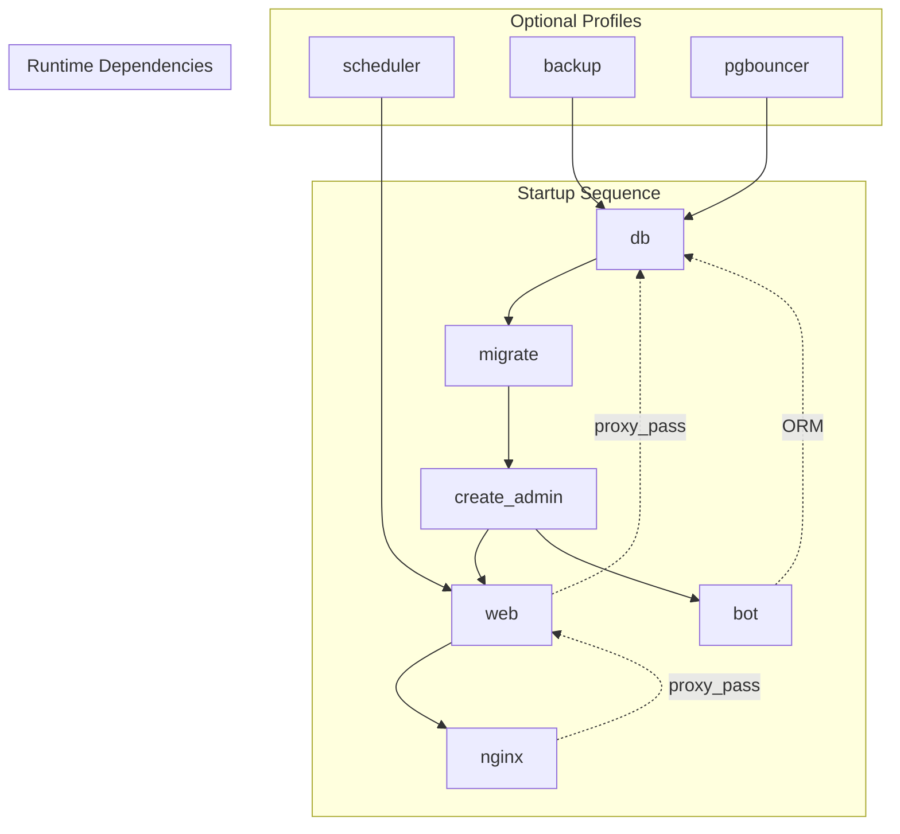

# Mko Bazuna — Phase 1 Detailed Deployment Plan

Production launch requirements and deployment readiness checklist derived from architecture-structure.md and operational analysis of similar Telegram-driven classifieds platforms.

---

## Deployment Architecture Overview

The Mko Bazuna platform follows a **two-process, one-database** architecture where:
- **Web process:** Django + gunicorn WSGI serving HTMX-based frontend
- **Bot process:** aiogram 3.x Telegram bot with shared ORM access
- **Database:** PostgreSQL 18 with native FTS for search
- **Reverse proxy:** nginx for TLS termination and media serving

Both processes share the same Django project and connect to a single PostgreSQL database, requiring careful coordination for migrations, connection pooling, and media access.

---

## Production Launch Requirements

### 1. Infrastructure Prerequisites

| Component | Requirement | Status |
|-----------|-------------|--------|
| **PostgreSQL 18** | `postgres:18-alpine` image; locale `ru_RU.UTF-8` required for FTS | ✅ In docker-compose.yml |
| **TLS Certificates** | Let's Encrypt certs mounted at `/etc/nginx/certs/` | ⚠️ Required before launch |
| **Bot Token** | Valid Telegram Bot API token | ⚠️ Required |
| **Domain name** | Required for Telegram bot deep-links and TLS | ⚠️ Required |
| **Minimum 2GB RAM** | For database + Django + bot processes | ⚠️ Required |

### 2. Security Hardening Requirements

| Requirement | Implementation | Verification |
|-------------|----------------|--------------|
| **HTTPS everywhere** | nginx redirects HTTP→HTTPS | Test with curl -I http://domain |
| **Secure session cookies** | `SECURE`, `HTTPONLY`, `SAMESITE=Lax` in settings | Verify in Django admin |
| **CSRF protection** | `CSRF_COOKIE_SECURE=True` | Check cookie flags |
| **Rate limiting** | nginx: `/login/` 10r/s, `/search/` 20r/s | Load test endpoints |
| **Media file blocking** | nginx blocks `.php`, `.py`, `.cgi`, `.pl`, `.sh` in `/media/` | Test direct access |
| **UUID v4 media keys** | Unguessable storage paths | Verify in AdImage model |
| **PIL JPEG validation** | Magic byte checking for uploads | Test with non-JPEG |

### 3. Database Requirements

| Requirement | Implementation | Status |
|-------------|----------------|--------|
| **Initial migrations** | Run once via `migrate` service | ✅ Configured |
| **Search vector trigger** | Auto-update on ad insert/update | ✅ In migration |
| **GIN index on search_vector** | For FTS performance | ✅ Required |
| **Advisory locks** | Prevent concurrent sweep/migration conflicts | ✅ Implemented |
| **Connection pooling** | PgBouncer in transaction mode | ✅ Opt-in profile |

---

## Deployment Tasks (Ordered)

### Task Group 1: Pre-Deployment Configuration

| Task ID | Description | Command/Source | Dependencies |
|---------|-------------|--------------|--------------|
| D1.1 | Configure environment variables | `.env.docker` template | None |
| D1.2 | Set `DJANGO_SECRET_KEY` | Generate with Django utility | D1.1 |
| D1.3 | Set `BOT_TOKEN` | Get from @BotFather | D1.1 |
| D1.4 | Set `BOT_USERNAME` | Bot username without @ | D1.1 |
| D1.5 | Configure TLS certificate path | `TLS_CERT_PATH` env var | None |
| D1.6 | Create admin user credentials | `ADMIN_USERNAME`, `ADMIN_PASSWORD` | D1.5 |

### Task Group 2: Initial Deployment

| Task ID | Description | Command/Source | Dependencies |
|---------|-------------|--------------|--------------|
| D2.1 | Build Docker images | `docker compose build` | D1.1-D1.6 |
| D2.2 | Start database service | `docker compose up -d db` | D2.1 |
| D2.3 | Run migrations | `docker compose run --rm migrate` | D2.2 |
| D2.4 | Create admin user | `docker compose run --rm create_admin` | D2.3 |
| D2.5 | Start web and bot services | `docker compose up -d web bot` | D2.4 |
| D2.6 | Start nginx with TLS | `docker compose up -d nginx` | D2.5 |

### Task Group 3: Production Hardening

| Task ID | Description | Command/Source | Dependencies |
|---------|-------------|--------------|--------------|
| D3.1 | Enable scheduler profile | `--profile scheduler` | D2.5 |
| D3.2 | Enable backup profile | `--profile backup` | D2.5 |
| D3.3 | Enable PgBouncer (optional) | `--profile pgbouncer` | D2.5 |
| D3.4 | Verify health endpoints | `/health/` endpoint | D2.5 |
| D3.5 | Test media access control | X-Accel-Redirect flow | D2.6 |

---

## Service Dependency Graph



---

## Critical Production Checks

### Pre-Launch Verification Checklist

| Check | Command/Test | Expected Result |
|-------|--------------|-----------------|
| Database connectivity | `docker compose exec web python -c "import django; from django.db import connection; print(connection.status)"` | `ConnectionStatus.ALLOWED` |
| Web health endpoint | `curl -f https://domain/health/` | `200 OK` |
| Bot process running | `docker compose logs bot` | No startup errors |
| Static files collected | `ls -la staticfiles/` | Contains CSS, JS |
| Media volume writable | `docker compose exec web touch /app/media/test && rm /app/media/test` | Success |
| nginx TLS active | `curl -I https://domain/` | `HTTP/2 200` |
| Rate limiting active | `ab -n 30 -c 5 https://domain/login/` | 503 after burst exceeded |
| Admin login works | Access `/admin/` | Django admin accessible |

### Security Verification

| Security Item | Test Method | Expected |
|--------------|-------------|----------|
| Media script blocking | `curl https://domain/media/test.php` | 403 Forbidden |
| HTTP→HTTPS redirect | `curl -I http://domain/` | 301 to HTTPS |
| Secure cookies | Browser dev tools, check cookie flags | Secure; HttpOnly; SameSite |
| Photo upload validation | Try uploading non-JPEG | Rejected with error |

---

## Rollout Sequence

### Staged Deployment Plan

| Stage | Services | Public Access | Rollback |
|-------|----------|---------------|----------|
| **1. Internal Testing** | db, web, bot, nginx (no port publish) | Internal only | Full restart |
| **2. Beta Launch** | All services + nginx published | Limited users | Database restore |
| **3. Production** | All services + scheduler + backup | Public | Backup restore |

### Migration Safety

The `migrate` service uses **session-scoped advisory lock (ID 100)** to prevent concurrent runs:

```python
# apps.core.utils.migrate_locked implements:
# pg_advisory_lock(100) before migration
# pg_advisory_unlock(100) after completion
```

This is critical because both `web` and `bot` services depend on migrations completing exactly once.

---

## Monitoring & Observability

### Health Checks

| Service | Endpoint | Frequency | Alert Threshold |
|---------|----------|-----------|-----------------|
| web | `/health/` | 30s | 3 failures |
| db | `pg_isready` | 5s | 5 failures |
| bot | Process check | 30s | Exit code != 0 |

### Log Aggregation

```bash
# Structured logging format expected:
docker compose logs -f --since 1h

# Key log patterns to monitor:
# - ERROR level messages
# - Migration failures
# - Telegram API errors
# - Media upload failures
```

### Metrics Collection

| Metric | Source | Collection Method |
|--------|--------|-------------------|
| Ad count | `AnalyticsEvent` model | Management command `show_metrics` |
| Search performance | Database query logs | PostgreSQL `EXPLAIN ANALYZE` |
| Login success rate | LoginToken model | Track token claims |
| Media storage usage | Docker volume | Monitoring alert |

---

## Backup & Recovery

### Automated Backups

The backup profile runs daily `pg_dump` with 7-day retention. Required configuration:

```yaml
# docker-compose.prod.yml backup service
volumes:
  - ./backups:/backups  # Host-mounted
```

### Recovery Procedure

1. Stop web and bot services
2. Restore database from backup
3. Restart services
4. Verify data integrity

See `docs/ops/restore.md` for full procedure.

---

## Capacity Planning

### Scale Targets (Phase 1)

| Metric | Target | Resource Impact |
|--------|--------|-----------------|
| Daily active users | ~300 | Minimal |
| Ad count | 500k | GIN index critical |
| Photo storage | ~10MB per ad | Monitor disk usage |
| Search response | <2s | Tune GIN index |

### Resource Allocation

| Service | CPU | Memory | Notes |
|---------|-----|--------|-------|
| db (PostgreSQL 18) | 1-2 cores | 1GB+ | More RAM = better cache |
| web (gunicorn 3 workers) | 1-2 cores | 512MB | Python overhead |
| bot (aiogram) | 0.5 cores | 256MB | Async I/O |
| nginx | 0.5 cores | 128MB | Lightweight |

---

## Security Compliance Checklist

### GDPR/Privacy Requirements

| Requirement | Implementation | Verification |
|-------------|--------------|--------------|
| Minimum PII collection | Only `telegram_id`, optional `username` | Database schema review |
| Consent banner | Decline vs. Withdraw distinction | UI test |
| PII erasure | 30-day hard delete sweep | Verify `consent_hard_delete` |
| No seller PII on site | Contact only via deep-link | Check ad templates |
| Privacy policy | Visible on site | Link in footer |

### Operational Security

| Item | Requirement | Status |
|------|-------------|--------|
| Non-root container user | uid 1000 in Dockerfile | ✅ |
| Secrets via env_file | `.env.docker` not committed | ⚠️ Verify .gitignore |
| Media key unpredictability | UUID v4, non-sequential | ✅ |
| Admin rate limiting | Not implemented in admin UI | ⚠️ Consider for prod |

---

## Launch Blockers

### Critical Requirements (Must be complete)

| Blocker | Resolution |
|---------|------------|
| Missing TLS certificates | Obtain Let's Encrypt certs before launch |
| No admin user configured | Set `ADMIN_PASSWORD` in environment |
| Missing domain for deep-links | Bot deep-links require valid domain |
| Database not migrated | Run migrate service before web/bot start |

### Optional Enhancements (Can launch without)

| Enhancement | Post-launch |
|-------------|------------|
| PgBouncer connection pooling | Add via `--profile pgbouncer` |
| Scheduler hourly sweeps | Run via cron/systemd alternatively |
| Automated backups | Manual backups possible initially |

---

## Post-Launch Operations

### Daily Tasks

- Monitor `archive_sweep` and `delete_sweep` logs
- Check disk space for media volume growth
- Review moderation queue for failed ads

### Weekly Tasks

- Review analytics metrics via `show_metrics`
- Clean old backups beyond retention window
- Update category tree via admin interface

### Monthly Tasks

- Database vacuum and analyze
- Review security headers and nginx config
- Plan for capacity upgrades

---

## Notes

- All deployment tasks are idempotent where possible
- Advisory locks prevent double-execution of sweeps
- Two-process architecture requires careful startup ordering
- Media access via X-Accel-Redirect or proxy to Django for access control
- Rate limiting essential for preventing abuse on login/search endpoints