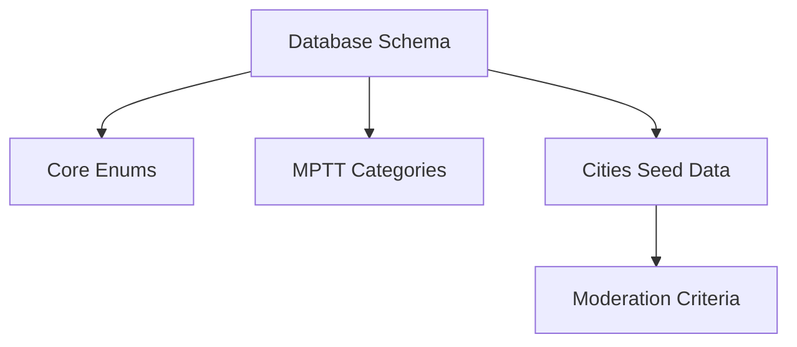
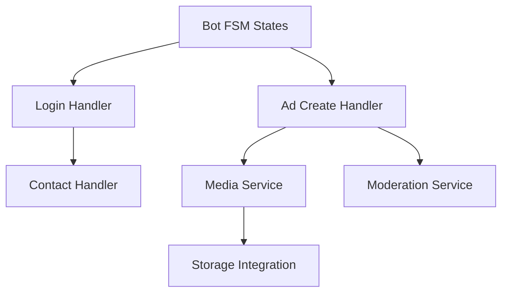
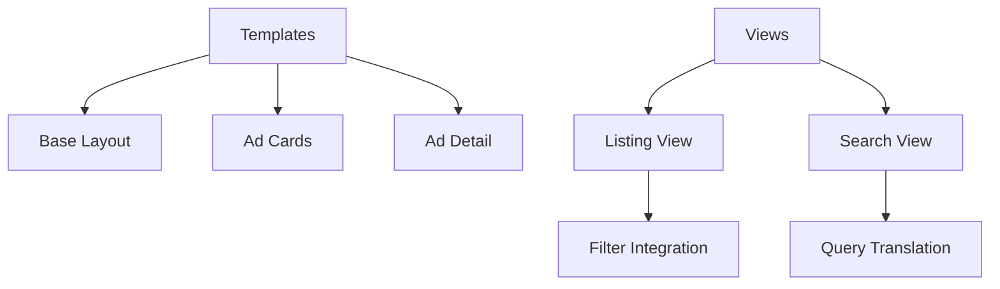

# Mko Bazuna — Phase 1 Detailed Development Plan

Execution-ready plan for MVP launch. Combines bot and web frontend development with security requirements. References: [ui-patterns.md](./../docs/01-spec/ui-patterns.md), [search-patterns.md](./../docs/01-spec/search-patterns.md), [filter-ui.md](./../docs/01-spec/filter-ui.md), [technical-specification.md](./../docs/01-spec/technical-specification.md).

---

## Overview

Phase 1 delivers a Telegram-driven classifieds board (Avito-like) for Montenegro market. Sellers create ads via Telegram bot; buyers browse/search/filter without registration.

**Target:** 300 daily users, 500k ads, response time < 2s
**Stack:** Python 3.14 + Django 5.2 + PostgreSQL 18 + aiogram 3.x + Tailwind + HTMX

---

## Security Requirements (Integrated Throughout)

### Authentication & Authorization

| Requirement | Implementation | Reference |
|-------------|----------------|-----------|
| Telegram login deep-link | QR encodes `login_<token>` (32-char URL-safe token) | technical-specification.md (H) |
| Token storage | SHA-256 hash only (`token_hash`), raw token NEVER stored | db-schema.md (login_tokens) |
| Constant-time comparison | `hmac.compare_digest` for token validation | architecture-structure.md |
| Session cookies | `SECURE`, `HTTPONLY`, `SAMESITE=Lax` | architecture-structure.md |
| Admin access | Separate admin/moderator role via `is_staff`/`is_superuser` | technical-specification.md (A) |

### Data Protection & Privacy

| Requirement | Implementation | Reference |
|-------------|----------------|-----------|
| PII collection | Minimum: `telegram_id`, optional `username` | technical-specification.md (F) |
| Consent banner | DECLINE (browse-only) ≠ WITHDRAW (soft-delete + 30-day erasure) | technical-specification.md (K) |
| Media security | UUID v4 keys (unguessable), JPEG validated via PIL magic bytes | db-schema.md (R6/R8) |
| nginx hardening | Script execution blocked, MIME whitelist, nosniff header | architecture-structure.md (R8) |
| No seller PII on site | Only "Contact seller" button with deep-link | technical-specification.md (C) |

### Input Validation

| Requirement | Implementation | Reference |
|-------------|----------------|-----------|
| Photo format | Telegram-compressed JPEG only, document upload rejected | technical-specification.md (E) |
| Photo count | 1-5 photos enforced at bot level | moderation_criteria |
| Title/description | Length and banned words checked via ModerationCriteria | technical-specification.md (A) |
| Category | Closed admin tree (django-mptt), no user-defined | technical-specification.md (D) |
| City | Closed preset list, unrecognized → "general / no city" | db-schema.md (cities) |

---

## Module Implementation Order

### Foundation Layer (Days 1-3)



#### Day 1: Database Foundation
- **Tasks:**
  - Finalize `users` table model with `telegram_id` as `USERNAME_FIELD`
  - Implement `login_tokens` table (atomic claim pattern)
  - Implement `ads` table with `search_vector` TSVECTOR column
  - Implement `ad_images` table with UUID v4 storage key generation
  - Implement `analytics_events` table with `EventType` enum
  - Implement `moderation_criteria` singleton table
  - Implement `ModeratorActionLog` table with `ModeratorActionType` enum

- **Reference:** db-schema.md, db-enums.md

#### Day 2: Core Enums & Configuration
- **Tasks:**
  - Create `AdStatus` StrEnum (DRAFT, ON_MODERATION, PUBLISHED, REJECTED, ON_MODERATION_FAILED, ARCHIVED, DELETED)
  - Create `AdSource` StrEnum (TELEGRAM)
  - Create `EventType` StrEnum for analytics
  - Create `ModeratorActionType` StrEnum
  - Create `AdSort` StrEnum (DATE_NEWEST, PRICE_LOW, PRICE_HIGH)
  - Create `AdvisoryLockId` IntEnum for sweep command locks

- **Reference:** db-enums.md

#### Day 3: Categories & Locations
- **Tasks:**
  - Configure django-mptt for closed category tree
  - Seed categories: Goods/Electronics/Clothing/Children/Furniture/Tools/Sport/Books/Other
  - Seed categories: Services/Repair/Translation/Tutors/Courses/Beauty/Transport/Freelance/Other
  - Seed categories: Real Estate/Apartments/Houses/Rooms/Commercial/Parking/Other
  - Seed Montenegro cities with Russian/Bosnian (Montenegrin) names
  - Implement `get_name(locale)` method on Category/City models

---

### Bot Layer (Days 4-12)



#### Day 4: Bot FSM & Login Flow
- **Tasks:**
  - Implement `AdCreateState` enum in `states.py`
  - Create `LoginToken` generation endpoint (32-char URL-safe token)
  - Implement `/login_<token>` deep-link handler
  - Two-phase atomic claim: Bot writes `telegram_id`, Web sets `consumed_at`
  - Create session authentication flow
  - Handle expired/invalid tokens with clear user messages

- **Reference:** technical-specification.md (H), db-schema.md (login_tokens)

#### Day 5: Login QR Deep-link
- **Tasks:**
  - Create QR code generation view for `/login/` URL
  - Implement polling endpoint for token readiness
  - Redirect to authenticated session on success
  - Display "retry" message on failure
  - Add "Login via Telegram" button to site header

- **Reference:** ui-patterns.md (Sticky Navigation Header)

#### Day 6: Ad Creation Dialog - Category Step
- **Tasks:**
  - Implement `/start` → `create_ad` entry point
  - Create category selection step with suggestions
  - Bot suggests top 3-5 categories by keyword match
  - Reject free-text category input
  - Require explicit seller confirmation before proceeding

- **Reference:** technical-specification.md (I), seller-stories.md (US-S2)

#### Day 7: Ad Creation Dialog - Location & Basic Fields
- **Tasks:**
  - City selection step (closed list of Montenegro cities)
  - Title input step with length validation (min 5, max 100)
  - Description input step with length validation (min 10, max 2000)
  - Price input step (optional, integer BAM)

- **Reference:** technical-specification.md (I), moderation_criteria

#### Day 8: Photo Handling & Validation
- **Tasks:**
  - Implement photo upload step (1-5 photos required)
  - Reject `message.document` with image MIME type
  - Accept only `message.photo` (Telegram-compressed)
  - Download and store photos in `MEDIA_ROOT` via `FileSystemStorage`
  - Generate UUID v4 storage keys, validate JPEG via PIL
  - Store `telegram_file_id` as metadata for dedup

- **Reference:** technical-specification.md (E), db-schema.md (R6)

#### Day 9: Ad Preview & Draft Persistence
- **Tasks:**
  - Create preview display showing all ad data
  - Allow seller to fix mismatches before send
  - Persist draft as `Ad` row with `DRAFT` status
  - Store FSM state in Ad row (aiogram no PG storage)
  - Implement draft timeout auto-deletion (~30 min idle)

- **Reference:** technical-specification.md (I), architecture-structure.md

#### Day 10: Moderation Integration
- **Tasks:**
  - Implement `ModerationCriteria` check on submit
  - Check title/description length constraints
  - Check banned words list
  - Check max ads per user limit
  - On pass → `PUBLISHED`, on fail → `ON_MODERATION_FAILED`
  - Send bot message for failed moderation (no reason disclosed)

- **Reference:** technical-specification.md (A), admin-stories.md (US-A10)

#### Day 11: Content Translation
- **Tasks:**
  - Integrate `deep-translator` for Montenegrin→Russian translation
  - Translate title+description on ad creation
  - Cache translation requests to prevent duplicate calls
  - Update `search_vector` with translated Russian content

- **Reference:** technical-specification.md (G, D5)

#### Day 12: Contact Handler & Seller Relay
- **Tasks:**
  - Implement `/contact_<ad_id>` deep-link handler
  - Map `ad_id` → seller `telegram_id` via shared ORM
  - Relay buyer message to seller (no PII revealed)
  - Record `CONTACT_INITIATED` analytics event

- **Reference:** technical-specification.md (C), ui-patterns.md (Contact Seller Button)

---

### Web Frontend Layer (Days 13-20)



#### Day 13: Base Template & Layout
- **Tasks:**
  - Create `base.html` with sticky navigation header
  - Implement responsive meta tags for mobile-first
  - Add Tailwind CSS via CDN (static setup)
  - Include HTMX scripts for partial updates
  - Add language switcher (ru/bs-latin)

- **Reference:** ui-patterns.md (Sticky Navigation Header, Responsive Grid Layout)

#### Day 14: Ad Card Component
- **Tasks:**
  - Implement card-based ad display component
  - Image (top): Full-width photo with fallback placeholder
  - Title (below image): Truncated with `line-clamp-2`
  - Price: Prominent `text-blue-600` display
  - Location: City name badge
  - Category: Category name on same line as location

- **Reference:** ui-patterns.md (Card-Based Ad Display), buyer-stories.md (US-B4)

#### Day 15: Ad List Page
- **Tasks:**
  - Create ad list view with responsive grid
  - Grid: `grid-cols-1 md:grid-cols-2 lg:grid-cols-3`
  - Gap: 16px mobile / 24px tablet+
  - Handle empty state with friendly message
  - Add pagination with HTMX (`hx-get`, `hx-target`, `hx-swap`)

- **Reference:** ui-patterns.md (Progressive Disclosure Patterns), buyer-stories.md (US-B1)

#### Day 16: Ad Detail Page
- **Tasks:**
  - Create ad detail view
  - Display full-size photos in responsive grid (1-5)
  - Single photo: Full width, max-height 384px
  - Multiple photos: 2-column grid on tablet+
  - Implement "Contact seller" button conditions (PUBLISHED + seller valid + consent)
  - Add description full display (not truncated)

- **Reference:** ui-patterns.md (Image Gallery, Contact Seller Button), buyer-stories.md (US-B4/B5)

#### Day 17: Hero Search & Query Translation
- **Tasks:**
  - Implement hero search form on homepage
  - Combined keyword + city selector
  - Integrate `deep-translator` for query translation
  - Query cache to prevent duplicate translation calls
  - Friendly empty state on no results

- **Reference:** search-patterns.md (Hero Search with Location, Query Translation)

#### Day 18: Filter Implementation
- **Tasks:**
  - Implement sticky sidebar filters (desktop)
  - Category filter: checkboxes with mptt tree
  - City filter: dropdown with closed city list
  - Price range filter: min/max number inputs
  - HTMX integration for partial updates
  - Active filter chips display

- **Reference:** filter-ui.md (Sticky Sidebar Filters, Mobile Filter Drawer, Filter Chips)

#### Day 19: Mobile Filter Drawer
- **Tasks:**
  - Create mobile filter trigger button
  - Slide-up drawer panel implementation
  - Reuse same filter form as desktop sidebar
  - Sticky action bar with "Apply Filters" button
  - JavaScript for open/close drawer

- **Reference:** filter-ui.md (Mobile Filter Drawer)

#### Day 20: Sort & Did-You-Mean
- **Tasks:**
  - Implement sort selector (date newest/price low-high)
  - Add `difflib.get_close_matches` for city typos
  - Display "did you mean" suggestion inline
  - Add category-name search via denormalized field
  - Implement app-level fuzzy detect for single-word queries

- **Reference:** search-patterns.md (Did-You-Mean, Sort Options), filter-ui.md (Location-Based Filtering)

---

### Integration Layer (Days 21-24)

#### Day 21: Search Integration
- **Tasks:**
  - Wire up PostgreSQL FTS in `search_vector`
  - Implement `Ad.objects.search()` manager method
  - Add GIN index on `search_vector`
  - Test search performance with EXPLAIN ANALYZE

- **Reference:** db-schema.md (Search), db-indexes.md

#### Day 22: Consent Banner
- **Tasks:**
  - Implement consent banner component
  - DECLINE state: browse-only, blocks seller actions
  - WITHDRAW state: `consent_revoked_at`, soft-delete cascade
  - Banner persists acceptance in session/cookie
  - Privacy policy link in banner

- **Reference:** technical-specification.md (K), buyer-stories.md (US-B9)

#### Day 23: Analytics Integration
- **Tasks:**
  - Add Plausible JS snippet for web analytics
  - Implement `AnalyticsEvent` model creation
  - Log `SEARCH_PERFORMED` on search
  - Log `CONTACT_INITIATED` on contact
  - Create `show_metrics` admin CLI command

- **Reference:** technical-specification.md (L), db-schema.md (analytics_events)

#### Day 24: Admin Interface
- **Tasks:**
  - Configure Django admin for all models
  - Create pre-configured admin user with env variables
  - Implement moderation action logging
  - Add category management (mptt tree)
  - Add city management (closed list)

- **Reference:** admin-stories.md, architecture-structure.md (Admin Setup)

---

### Security & Testing (Days 25-27)

#### Day 25: Input Validation & Security Tests
- **Tasks:**
  - Test photo format validation (reject non-JPEG)
  - Test photo count enforcement (1-5)
  - Test category closed-tree enforcement
  - Test city exact match + typo handling
  - Test token constant-time comparison

- **Reference:** technical-specification.md (A, C, E, F, H)

#### Day 26: Privacy Compliance Tests
- **Tasks:**
  - Test consent banner DECLINE vs WITHDRAW flows
  - Test PII erasure after 30 days
  - Test `consent_hard_delete` sweep command
  - Test soft-delete cascade for user deletion
  - Verify no seller PII on ad pages

- **Reference:** technical-specification.md (F, K), db-schema.md (R1/R3/R5)

#### Day 27: Performance & Load Tests
- **Tasks:**
  - Test search response time ≤ 2s target
  - Test pagination with 24 ads per page
  - Test HTMX partial update performance
  - Test concurrent login token claims
  - Verify GIN index usage on search_vector

- **Reference:** technical-specification.md (J), db-indexes.md

---

### Deployment & Verification (Days 28-30)

#### Day 28: Docker Configuration
- **Tasks:**
  - Finalize `docker-compose.yml` services
  - Configure `web` service (gunicorn WSGI)
  - Configure `bot` service (aiogram entrypoint)
  - Configure `nginx` with TLS termination
  - Add rate limiting for `/login/` and `/search/`

- **Reference:** architecture-structure.md (Deployment)

#### Day 29: Migration & Sweep Commands
- **Tasks:**
  - Create `entrypoint-scheduler.sh` script
  - Implement `archive_sweep` command (lock ID 1)
  - Implement `delete_sweep` command (lock ID 2)
  - Implement `consent_hard_delete` (lock ID 3)
  - Implement `sweep_drafts` (lock ID 4)
  - Implement `cleanup_login_tokens` (lock ID 5)
  - Implement `purge_failed_ads` (lock ID 6)
  - Implement `purge_rejected_ads` (lock ID 7)

- **Reference:** architecture-structure.md (Advisory Lock Ids)

#### Day 30: Final Integration & Smoke Tests
- **Tasks:**
  - End-to-end bot ad creation flow test
  - End-to-end web search/filter test
  - Test contact seller deep-link flow
  - Verify admin moderation interface
  - Production smoke test with docker-compose

- **Reference:** All user stories

---

## Task Dependencies (DAG)

```
Day 1-3: Foundation (no dependencies)
    ↓
Day 4-5: Bot Login (depends on Foundation)
Day 6-10: Bot Ad Create (depends on Foundation)
Day 11: Content Translation (depends on Bot Ad Create)
    ↓
Day 13-15: Web Templates (depends on Foundation)
Day 16-20: Web Views (depends on Web Templates + Bot)
    ↓
Day 21-24: Integration (depends on all above)
    ↓
Day 25-30: Security/Tests/Deploy (depends on Integration)
```

---

## Daily Milestones

| Day | Deliverable | Primary Owner |
|-----|-------------|---------------|
| 1 | Database schema complete | Backend developer |
| 2 | Core enums configured | Backend developer |
| 3 | Categories/cities seeded | Backend developer |
| 4 | Bot FSM states defined | Bot developer |
| 5 | Login flow working end-to-end | Bot + Backend |
| 6 | Category step implemented | Bot developer |
| 7 | Location + basic fields implemented | Bot developer |
| 8 | Photo validation complete | Bot developer |
| 9 | Draft persistence working | Bot developer |
| 10 | Auto-moderation integrated | Backend developer |
| 11 | Query translation working | Backend developer |
| 12 | Contact handler complete | Bot developer |
| 13 | Base template with header | Frontend developer |
| 14 | Ad card component styled | Frontend developer |
| 15 | Ad list page with pagination | Frontend developer |
| 16 | Ad detail page + contact button | Frontend developer |
| 17 | Hero search implemented | Frontend developer |
| 18 | Filter sidebar + chips | Frontend developer |
| 19 | Mobile filter drawer | Frontend developer |
| 20 | Sort + did-you-mean | Frontend developer |
| 21 | Search integration tested | Backend developer |
| 22 | Consent banner working | Frontend + Backend |
| 23 | Analytics events logging | Backend developer |
| 24 | Admin interface ready | Backend developer |
| 25 | Security tests pass | QA/Security |
| 26 | Privacy tests pass | QA/Security |
| 27 | Performance tests pass | QA/Backend |
| 28 | Docker deployment ready | DevOps |
| 29 | Sweep commands implemented | Backend developer |
| 30 | End-to-end smoke tests pass | All roles |

---

## Risk Assessment

### High-Risk Items (Research Gates Required)

1. **Two-process database locking** - PgBouncer compatibility with advisory locks
   - Research: Test `pg_advisory_xact_lock` behavior under transaction pooling
   
2. **Photo storage security** - UUID v4 key generation + nginx MIME restrictions
   - Research: Verify PIL JPEG validation + magic byte checking
   
3. **Query translation caching** - Prevent duplicate API calls under load
   - Research: Implement request-level cache with `difflib` similarity

### Medium-Risk Items

1. **HTMX partial updates** - Ensure smooth UX without full page reloads
2. **Mobile touch targets** - Verify 44px minimum on all interactive elements
3. **Category-name search** - Fuzzy match accuracy for Montenegrin→Russian

### Low-Risk Items

1. **Filter chips styling** - Follow documented Tailwind patterns
2. **Empty state messages** - Use documented friendly text
3. **Sort selector options** - Use documented AdSort enum values

---

## Verification Checklist

### Bot Verification
- [ ] `/start` initiates ad creation dialog
- [ ] Category suggestions appear correctly
- [ ] City selection restricts to preset list
- [ ] Photo upload rejects non-Telegram-compressed
- [ ] Draft saved with DRAFT status
- [ ] Moderation passes valid ads to PUBLISHED
- [ ] Contact relay works without PII exposure
- [ ] Login token expires after 5 minutes
- [ ] Failed moderation shows no reason to seller

### Web Verification
- [ ] Ad cards display image/title/price/location
- [ ] Responsive grid switches 1→2→3 columns
- [ ] Search translates Montenegrin→Russian
- [ ] Filters update via HTMX without reload
- [ ] "Did you mean" appears for typos
- [ ] Contact button renders only when valid
- [ ] Consent banner blocks seller actions when declined
- [ ] Admin can moderate ads via Django admin
- [ ] nginx blocks script execution in /media/

### Security Verification
- [ ] Raw login tokens never stored in database
- [ ] Session cookies set with Secure/HttpOnly/SameSite
- [ ] Photo keys use UUID v4 (unguessable)
- [ ] No seller telegram_id/username on frontend
- [ ] PII erasure triggers after 30 days
- [ ] Rate limiting on /login/ and /search/

---

## Notes

- All tasks follow atomic, independently executable principle
- Semantic targeting using module/function names, not line numbers
- Tasks preserve architectural boundaries between bot and web
- StrEnum required for all constants (rule 10)
- Type hints required on all public functions (rule 1)
- English only in code/comments/docs (rule 1)