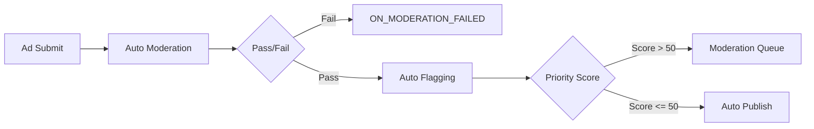

# Phase 2 Detailed Plan — Trust Signals, Moderation Tooling, and Analytics

> Post-MVP platform integrity features for Mko Bazuna. This plan addresses seller trust indicators, enhanced moderation capabilities, and comprehensive analytics for platform health.

---

## Overview

Phase 2 Trust & Integrity features build upon the MVP foundation with:

1. **Trust Signals** — Seller verification badges, reputation metrics, and buyer confidence indicators
2. **Moderation Tooling** — Enhanced admin interface, bulk operations, and automated flagging
3. **Analytics Improvements** — Engagement metrics, trust scores, and compliance reporting

---

## 1. Trust Signals System

### 1.1 Current State Analysis

Seller profiles currently display:
- Telegram name (from bot)
- No verification status
- No activity metrics
- No trust indicators

Buyer contact decisions rely on content quality only, with no seller history visibility.

### 1.2 Trust Signal Architecture

**Decision:** Calculate trust scores server-side, expose via:
- Seller badge levels (Verified, Trusted, Pro)
- Ad-level trust indicators
- Admin-verified metrics

#### 1.2.1 SellerTrustScore Model

Create `SellerTrustScore` model (`apps/analytics/models/seller_trust.py`):

| Field | Type | Purpose |
|-------|------|---------|
| user | ONE_TO_ONE(users.User) | The seller being scored |
| trust_level | VARCHAR(20) choices=`TrustLevel` | UNVERIFIED / VERIFIED / TRUSTED / PRO |
| score | POSITIVE SMALL INT (default 0) | Overall trust score (0-100) |
| ad_count_lifetime | POSITIVE INT (default 0) | Total published ads |
| ad_count_active | POSITIVE INT (default 0) | Currently published ads |
| rejection_rate | DECIMAL(5,2) (default 0.0) | Moderation rejection ratio |
| contact_response_rate | DECIMAL(5,2) (default 0.0) | Estimated from response time proxy |
| last_calculated | TIMESTAMP (auto_now) | Trust recalc timestamp |

> **Status: Implemented.** Matches [db-schema.md §SellerTrustScore](../02-database/db-schema.md),
> the single source of truth. The earlier plan listed `avg_ad_quality_score` and
> `calculation_version`, replaced in code by `score` + `rejection_rate`; `last_calculated_at`
> became `last_calculated`. Computed by
> `apps.trust.services.trust_calculator.TrustCalculator` on ad publish, with a `VERIFIED`
> floor for Telegram-Premium/admin-verified sellers.

#### 1.2.2 TrustLevel Enum

Add to `apps/core/enums.py`:

```python
class TrustLevel(StrEnum):
    """Seller trust level based on platform activity and moderation outcomes."""

    UNVERIFIED = "unverified"  # Default for all new users
    VERIFIED = "verified"      # Phone or email verified
    TRUSTED = "trusted"       # 10+ published ads, no rejections
    PRO = "pro"               # 50+ published ads, <5% rejection rate
```

### 1.3 Verification Tracking

#### 1.3.1 SellerVerification Model

Create `SellerVerification` model (`apps/users/models/verification.py`):

| Field | Type | Purpose |
|-------|------|---------|
| user | ONE_TO_ONE(users.User) | The verified user |
| phone_number | VARCHAR(20), nullable | Normalized phone (E.164 format) |
| verified_by_admin | BOOL (default False) | Admin-verified flag |
| verified_at | TIMESTAMP, nullable | Admin verification timestamp |

> **Note:** `telegram_premium` is **not** a `SellerVerification` column. It is a field on
> `User` (see [db-schema.md > users](../02-database/db-schema.md),
> `telegram_premium (BOOL, default False)`) and is consumed by the trust system as an
> auto-verification signal (the `VERIFIED` trust-level floor in `TrustCalculator`).
> `SellerVerification` tracks admin + phone verification only.

#### 1.3.2 Verification Integration Points

1. **Telegram Bot Handler** (`telegram_bot/handlers/profile.py`)
   - On `/start`, check `user.is_premium` (Phase 2 feature)
   - Record `telegram_premium` on `User` (populated from `user.is_premium` on bot `/start`)
   - Offer phone verification prompt for non-premium users

2. **Admin Verification Flow** (`moderation/views/verification.py`)
   - List unverified sellers with activity metrics
   - Single-click verify with reason
   - Bulk verify by criteria (min_ads > N, rejection_rate < M%)

### 1.4 Trust Signal Display

#### 1.4.1 Badge Components

1. **verified_badge.html** — Green checkmark (admin verified)
2. **trusted_badge.html** — Blue shield (auto-trusted status)
3. **pro_badge.html** — Premium badge (high-volume seller)
4. **premium_badge.html** — Telegram Premium indicator

#### 1.4.2 Template Integration

- **Ad Cards** (`templates/ads/partials/ad_card.html`) — Display seller trust badge
- **Ad Detail** (`templates/ads/detail.html`) — Show trust level + verification date
- **Seller Dashboard** (`templates/ads/dashboard.html`) — Current trust level + progress toward next tier

---

## 2. Enhanced Moderation Tooling

### 2.1 Current State Analysis

Moderation currently provides:
- Basic admin interface in Django admin
- Manual reject/publish actions
- Auto-moderation on ad submit
- `ModeratorActionLog` audit trail

Missing features:
- Bulk operations
- Automated flagging
- Moderation queue prioritization
- Trust-based automation

### 2.2 Moderation Priority Queue

#### 2.2.1 AdModerationPriority Model

Create `AdModerationPriority` model (`apps/moderation/models/priority.py`):

| Field | Type | Purpose |
|-------|------|---------|
| ad | ONE_TO_ONE(ads.Ad), `related_name="moderation_priority"` | The ad needing review |
| base_score | POSITIVE SMALL INT (default 0) | Computed risk score (0-100) |
| priority_level | VARCHAR(10) choices=`AdPriorityLevel` | HIGH / MEDIUM / LOW |
| flags | JSONB (default []) | Auto-flagging reason codes |
| confidence_score | FLOAT (default 0.0) | Confidence in the computed score |
| escalation_required | BOOL (default False) | Escalate to senior moderator |

> **Status: Implemented.** Field set reflects the production schema in
> [db-schema.md §AdModerationPriority](../02-database/db-schema.md) (the single source of
> truth). The earlier plan listed `priority_score`, `priority_reason`, `flagged_by_system`,
> `flagged_at`, and `reviewed_at`, which were consolidated into `base_score` + `flags` +
> `confidence_score` + `escalation_required`. Computed by
> `apps.moderation.services.priority_calculator.PriorityCalculator` (content risk + user
> history) and persisted by `PriorityService`.

#### 2.2.2 Priority Calculation Factors

Priority score computed from:
- New seller (ad_count < 3) — +20 points
- Banned words detected — +40 points
- Duplicate title similarity — +15 points
- Image quality issues — +10 points
- Seller trust level (unverified/trusted/pro) — -10 to +10 points
- Category risk level (configurable) — +5 to +30 points

### 2.3 Moderation Review Interface

#### 2.3.1 ReviewQueue View (`apps/moderation/views/review_queue.py`)

Features:
- Paginated list of pending ads
- Priority sorting (high to low)
- Quick approve/reject buttons
- Inline preview (image + text)
- Keyboard shortcuts (space=approve, r=reject, j/k=navigation)

#### 2.3.2 Bulk Actions

1. **BulkVerifyService** (`apps/moderation/services/bulk_verify.py`)
   - Accept list of ad IDs
   - Transaction-safe batch approval
   - Progress callback for large batches

2. **BulkRejectService** (`apps/moderation/services/bulk_reject.py`)
   - Accept list of ad IDs + reason
   - Create ModeratorActionLog entries
   - Notify sellers via bot (deferred to Phase 3)

### 2.4 Automated Flagging

#### 2.4.1 Flagging Triggers

1. **SuspiciousKeywordTrigger**
   - Real-time banned word detection
   - Custom word lists per category
   - Regex pattern support for obfuscation

2. **DuplicateDetectionTrigger**
   - Cross-user duplicate title detection
   - Image similarity detection (placeholder for ML Phase 4)
   - Location clustering for spam detection

3. **AnomalyDetectionTrigger**
   - Unusual posting frequency (N+ ads in M minutes)
   - Price anomalies vs category norms
   - New seller high-risk pattern detection

#### 2.4.2 Flagging Pipeline



> **Status: partial / aspirational.** The three trigger objects (`SuspiciousKeywordTrigger`,
> `DuplicateDetectionTrigger`, `AnomalyDetectionTrigger`) and the auto-publish-by-priority branch
> are **not** implemented as described. The implemented flow is a single synchronous
> auto-moderation gate: the `ModerationCriteria` singleton is checked at submit (title/description
> length, price-required, image count, banned words, `max_ads_per_user`, duplicate-title via
> `difflib`); fail → `ON_MODERATION_FAILED`, pass → `PUBLISHED` directly.
> `PriorityCalculator` runs in a `post_save` signal (`status==ON_MODERATION`) for **queue
> triage ordering only** — it does not gate publishing. See
> [db-schema.md §moderation_criteria](../02-database/db-schema.md) and
> [technical-specification.md §A](../01-spec/technical-specification.md).

### 2.5 Moderation Analytics

#### 2.5.1 ModeratorPerformance View

Stats tracked per moderator:
- Actions per hour
- Approval/rejection ratio
- Average time to decision
- Accuracy score (admin review of decisions)

---

## 3. Analytics Improvements

### 3.1 Current State Analysis

AnalyticsEvent model captures:
- `REGISTRATION_CREATED`
- `AD_PUBLISHED`
- `SEARCH_PERFORMED`
- `CONTACT_INITIATED`

Missing:
- Trust signal metrics
- Moderation outcomes
- User engagement funnels
- Seller performance analytics

### 3.2 Extended Event Types

Add to `AnalyticsEventType` in `apps/core/enums.py`:

```python
class AnalyticsEventType(StrEnum):
    # ... existing ...

    # Trust & Verification
    SELLER_VERIFIED = "seller_verified"
    TRUST_LEVEL_UPDATED = "trust_level_updated"

    # Moderation
    MODERATION_APPROVED = "moderation_approved"
    MODERATION_REJECTED = "moderation_rejected"
    MODERATION_FLAGGED = "moderation_flagged"

    # Seller Engagement
    DASHBOARD_VIEWED = "dashboard_viewed"
    AD_EDITED = "ad_edited"
    AD_REACTIVATED = "ad_reactivated"

    # Buyer Behavior
    CONTACT_COMPLETED = "contact_completed"  # Buyer confirmed contact
    AD_REPORTED = "ad_reported"
```

### 3.3 Trust Analytics Dashboard

#### 3.3.1 SellerTrustDashboard View

Metrics displayed:
- Trust level distribution (pie chart)
- Verification conversion rate
- Rejection rate by trust level
- Time to first verification
- Pro seller acquisition rate

#### 3.3.2 ModerationAnalytics View

Metrics displayed:
- Queue size over time
- Average review time
- Auto-moderation pass rate
- Manual vs auto decisions
- Flagging accuracy

### 3.4 Daily Rollup Tables

#### 3.4.1 DailyAdMetrics Model

Create `DailyAdMetrics` (`apps/analytics/models/daily_metrics.py`):

| Field | Type | Purpose |
|-------|------|---------|
| date | DATE | Aggregation date |
| total_published | INT | Ads published that day |
| total_archived | INT | Ads auto-archived |
| total_rejected | INT | Ads rejected |
| avg_trust_score | FLOAT | Avg trust score of published ads |
| new_sellers | INT | First-time publishers |
| returning_sellers | INT | Sellers with prev published ads |

---

## 4. Implementation Tasks

### 4.1 Trust Signals

| Task ID | Component | Description | Dependencies |
|---------|-----------|-------------|------------|
| TS-001 | `TrustLevel` enum | Add to core/enums.py | None |
| TS-002 | `SellerTrustScore` model | Create with periodic calculation | TS-001 |
| TS-003 | `SellerVerification` model | User verification tracking | None |
| TS-004 | Badge components | HTML templates for trust badges | TS-001 |
| TS-005 | Trust calculation service | Periodic trust score updates | TS-002 |
| TS-006 | Ad card integration | Display trust badges on thumbnails | TS-004, Thumbnail Generation (Plan 1) |
| TS-007 | Dashboard trust UI | Show trust level + progress | TS-002, TS-005 |

### 4.2 Moderation Tooling

| Task ID | Component | Description | Dependencies |
|---------|-----------|-------------|------------|
| MT-001 | `AdModerationPriority` model | Priority scoring for moderation | None |
| MT-002 | Priority calculation service | Compute risk scores | MT-001 |
| MT-003 | Review queue view | Prioritized moderation interface | MT-001 |
| MT-004 | Bulk verify service | Batch approval logic | None |
| MT-005 | Bulk reject service | Batch rejection logic | None |
| MT-006 | Flagging triggers | Automated detection rules | MT-002 |
| MT-007 | Moderator analytics | Dashboard for moderation stats | MT-001 |

### 4.3 Analytics Improvements

| Task ID | Component | Description | Dependencies |
|---------|-----------|-------------|------------|
| AN-001 | Extended event types | Add trust/moderation events | None |
| AN-002 | `DailyAdMetrics` model | Daily rollup table | AN-001 |
| AN-003 | Trust analytics view | Trust metrics dashboard | AN-001, TS-005 |
| AN-004 | Moderation analytics | Moderation metrics dashboard | AN-001, MT-001 |
| AN-005 | Scheduled metrics job | Daily rollup via `show_metrics` command | AN-002 |

---

## 5. Cross-Plan Dependencies

**Note:** Tasks in Phase 2 Plan 2 (UI/UX) depend on Phase 2 Plan 1 (thumbnails).

| Plan 2 Task | Depends On | Reason |
|-------------|------------|--------|
| Ad Card Redesign (TN-001) | Thumbnail Generation (Plan 1) | Card images require thumbnails for proper sizing and performance |
| Image Gallery (TN-002) | Thumbnail Generation (Plan 1) | Gallery needs multiple image variants |

---

## 6. Task Dependencies Graph

```
graph TD
    TS001[TrustLevel Enum] --> TS002[SellerTrustScore Model]
    TS002 --> TS005[Trust Calculation Service]
    TS002 --> TS007[Dashboard Trust UI]
    TS004[Badge Components] --> TS006[Ad Card Integration]
    
    MT001[AdModerationPriority Model] --> MT002[Priority Calculation]
    MT001 --> MT003[Review Queue View]
    MT001 --> MT007[Moderator Analytics]
    MT002 --> MT006[Flagging Triggers]
    
    AN001[Extended Events] --> AN002[Daily Metrics]
    AN001 --> AN003[Trust Analytics]
    AN001 --> AN004[Moderation Analytics]
    TS005 --> AN003
    MT001 --> AN004
    
    style TS001 fill:#e1f5fe
    style TS002 fill:#e1f5fe
    style MT001 fill:#f3e5f5
    style MT003 fill:#f3e5f5
    style AN001 fill:#fff3e0
    style AN003 fill:#fff3e0
```

---

## 7. Implementation Order

### Priority 1: Trust Foundation (Week 1-2)

1. **TrustLevel enum** — Foundation for trust system
2. **SellerTrustScore model** — Data structure for trust
3. **Trust calculation service** — Background trust scoring
4. **Badge components** — UI foundation

### Priority 2: Moderation Enhancement (Week 2-3)

1. **AdModerationPriority model** — Priority system
2. **Priority calculation service** — Risk scoring logic
3. **Review queue view** — Moderator interface
4. **Flagging triggers** — Automation rules

### Priority 3: Analytics & Integration (Week 3-4)

1. **Extended event types** — Data collection
2. **Daily metrics model** — Aggregation table
3. **Trust analytics dashboard** — Internal metrics
4. **Template integration** — End-user visibility

---

## 8. Success Metrics

| Feature | Metric | Target |
|---------|--------|--------|
| Trust Signals | Seller verification rate | +25% within 30 days |
| Trust Signals | Contact initiation rate on verified ads | +15% vs unverified |
| Moderation Queue | Average review time | <5 minutes |
| Auto-flagging | Flagging accuracy | >85% precision |
| Analytics | Daily active sellers tracked | 100% coverage |
| Overall | Moderator workload reduction | -20% via automation |

---

## 9. Risk Assessment

| Risk | Mitigation |
|------|------------|
| False-positive flagging | Manual review queue, reversible actions |
| Trust score gaming | Multi-factor scoring, admin override |
| Performance impact | Asynchronous trust calculation, indexed queries |
| Badge visibility issues | A/B testing, gradual rollout |

---

## 10. Rollback Considerations

- **Trust Scores** — Computed values, no state modification on users
- **Priority Scores** — Denormalized, can be recalculated
- **Moderation Actions** — All logged in `ModeratorActionLog`, reversible
- **Analytics Events** — Append-only, no rollback needed

---

## References

- [Phase 2 Plan 1](.ai/plans/phase-02-detailed-plan-1.md)
- [Phase 2 Plan 2](.ai/plans/phase-02-detailed-plan-2.md)
- [Analytics Models](src/backend/apps/analytics/models.py)
- [Moderation Models](src/backend/apps/moderation/models.py)
- [User Models](src/backend/apps/users/models.py)
- [Core Enums](src/backend/apps/core/enums.py)